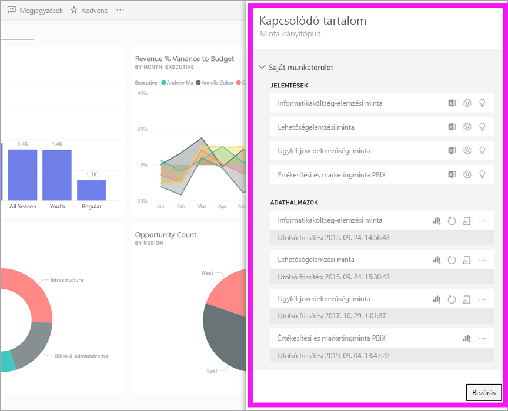
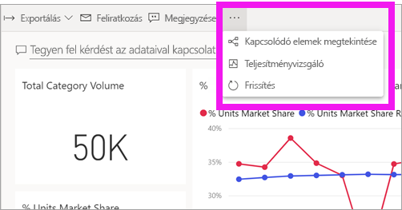
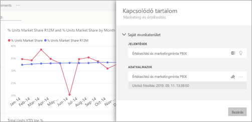
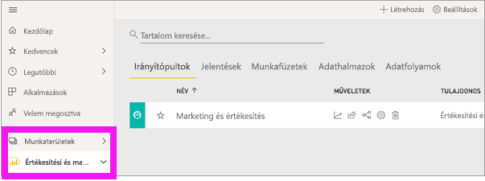
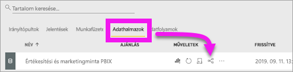
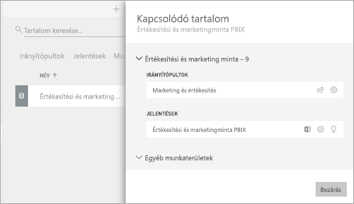

# Kapcsolódó tartalom megtekintése a Power BI szolgáltatásban

[!INCLUDE[consumer-appliesto-ynny](../includes/consumer-appliesto-ynny.md)]

[!INCLUDE [power-bi-service-new-look-include](../includes/power-bi-service-new-look-include.md)]

A **Kapcsolódó tartalom** ablaktáblában megtekintheti, hogyan vannak összekapcsolva a különböző Power BI-tartalmak – irányítópultok, jelentések és adatkészletek. A **Kapcsolódó tartalom** panel indítási területként is funkcionál műveletek elvégzéséhez. Innen például megnyithat irányítópultokat és jelentéseket, elemzéseket készíthet, elemezheti az adatokat az Excelben, és további műveleteket végezhet.  

A Power BI-ban a jelentések adatkészletekre épülnek, a jelentések vizualizációit irányítópultokra lehet tűzni, és az irányítópultok vizualizációi hivatkoznak a jelentésekre. De hogyan tudhatja meg, hogy a Marketing jelentésének a vizualizációit melyik irányítópultokra tűzték ki? És hogyan találhatja meg ezeket az irányítópultokat? A Beszerzés irányítópult vajon olyan vizualizációkat használ, amelyek több adatkészletre is épülnek? És ha igen, akkor mi azok neve, és hogyan tudja megnyitni és szerkeszteni őket? A HR-adatkészlet fel van egyáltalán használva jelentésekben vagy irányítópultokon? Vagy áthelyezhetők anélkül, hogy hibás hivatkozások maradnának utána? Minden ilyen kérdésre választ találhat a **Kapcsolódó tartalom** adattáblán.  Az adattábla nem csak a kapcsolódó tartalmakat jeleníti meg, hanem műveletek elvégzését is lehetővé teszi rajtuk, és megkönnyíti a navigációt is közöttük.

> [!NOTE]
> A Kapcsolódó tartalom funkció nem működik streamelt adatkészletek esetén.
> 
> 

## Egy irányítópult vagy jelentés kapcsolódó tartalmainak megtekintése
A videóban Will fogja bemutatni, hogyan lehet egy irányítópult kapcsolódó tartalmait megtekinteni. Ezután a tanultakat Ön is kipróbálhatja a Beszerzéselemzés mintaadatkészleten, a videó alatt látható részletes utasítások szerint.

<iframe width="560" height="315" src="https://www.youtube.com/embed/B2vd4MQrz4M#t=3m05s" frameborder="0" allowfullscreen></iframe>

Megnyitott irányítópult vagy jelentés esetén válassza a **További lehetőségek** (...) elemet a menüsávban, majd a legördülő menü **Kapcsolódó elemek megtekintése** elemét.

Megnyílik a **Kapcsolódó tartalom** ablaktábla. Irányítópult esetén itt megtekintheti az összes olyan jelentést, amelyeknek a vizualizációi az irányítópultra vannak tűzve, és azokat az adatkészleteket, amelyekre épülnek. Ehhez az irányítópulthoz csak egy jelentésből származó vizualizációk vannak rögzítve, amely egy adatkészleten alapul. 

Innen közvetlen műveleteket is végezhet a kapcsolódó tartalmakon.  Például, az egyik irányítópult vagy jelentés nevének kiválasztásával megnyithatja az adott irányítópultot.  A felsorolt jelentések esetében a megfelelő ikon kiválasztásával az [Elemzés az Excelben](../service-analyze-in-excel.md), vagy az [Elemzések lekérése](end-user-insights.md) műveleteket hajthatja végre. Adatkészletek esetében megtekintheti a legutóbbi frissítés dátumát és idejét, valamint az [Elemzés az Excelben](../service-analyze-in-excel.md) és az [Elemzések lekérése](end-user-insights.md) műveleteket hajthatja végre.  

## Egy adatkészlet kapcsolódó tartalmainak megtekintése
A **Kapcsolódó tartalom** adattábla megnyitásához legalább *megtekintési engedéllyel* kell rendelkeznie az adott adatkészlethez. A példában a [Beszerzéselemzési mintát](../sample-procurement.md) fogjuk használni.

A navigációs panelen keresse meg a **Munkaterületek** fejlécet, és válasszon ki egy munkaterületet a listából. Ha rendelkezik tartalommal a munkaterületen, az megjelenik a jobb oldali vásznon. 

A munkaterületen válassza az **Adatkészletek** lapot, majd keresse meg a **Kapcsolódó megtekintése** ikont .

Válassza ki az ikont a **Kapcsolódó tartalom** ablaktábla megnyitásához.

Innen közvetlen műveleteket is végezhet a kapcsolódó tartalmakon. Például, az egyik irányítópult vagy jelentés nevének kiválasztásával megnyithatja az adott irányítópultot vagy jelentést.  A felsorolt irányítópultok esetében a megfelelő ikon kiválasztásával [megoszthatja az irányítópultot másokkal](../service-share-dashboards.md), vagy megnyithatja az adott irányítópult **Beállítások** ablakát. Jelentések esetében a megfelelő ikon kiválasztásával az [Elemzés az Excelben](../service-analyze-in-excel.md), az [Átnevezés](../service-rename.md) és az [Elemzések lekérése](end-user-insights.md) műveleteket hajthatja végre.  

## Korlátozások és hibaelhárítás
* Ha nem jelenik meg a „Kapcsolódó megtekintése” szöveg, akkor keresse az ikont . Válassza ki az ikont a **Kapcsolódó tartalom** ablaktábla megnyitásához.
* Egy jelentés kapcsolódó tartalmainak megnyitásához [Olvasó nézetben](end-user-reading-view.md) kell lennie.
* A Kapcsolódó tartalom funkció nem működik streamelt adatkészletek esetében.

## Következő lépések
* [A Power BI szolgáltatás használatának első lépései](../service-get-started.md)
* További kérdései vannak? [Kérdezze meg a Power BI közösségét](https://community.powerbi.com/)

