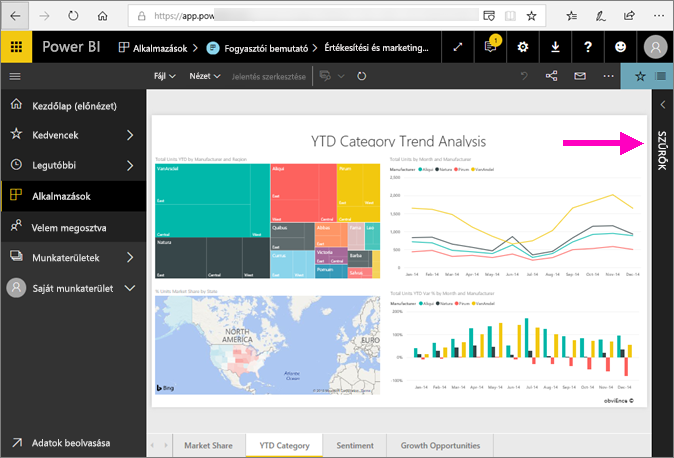
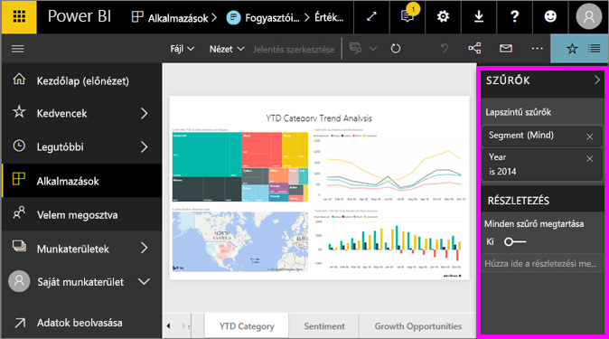
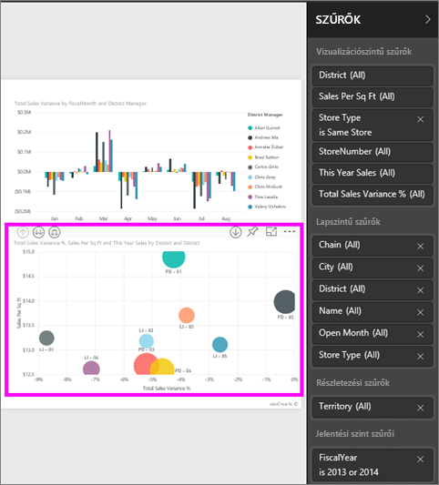
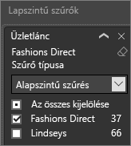
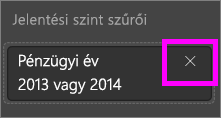
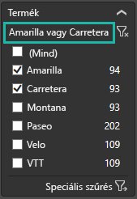
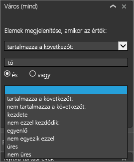
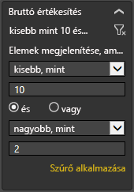

# Ismerkedés a jelentések Szűrők panelével
Ez a cikk a jelentések Szűrők paneljét mutatja be a Power BI szolgáltatásban.

Az adatok szűrésének számos módja áll rendelkezésre a Power BI-ban, ezért javasoljuk, hogy először olvassa el a [szűrőkkel és a kiemeléssel](../power-bi-reports-filters-and-highlighting.md) foglalkozó szakaszt.

## A jelentések Szűrők panelének használata
Amikor a munkatársa megoszt Önnel egy jelentést, mindenképp keresse meg a **Szűrők** panelt. Előfordulhat, hogy össze van csukva a jelentés jobb szélén. Kattintson rá a kibontáshoz.   

A Szűrők panel olyan szűrőket tartalmaz, amelyekkel a jelentés *tervezője* látta el a jelentést. A *felhasználók* kezelhetik a szűrőket és menthetik a módosításokat, azonban nem adhatnak hozzá új szűrőket a jelentéshez.

A Power BI szolgáltatásban a jelentések megtartják a Szűrők panelen végzett módosításokat, és a jelentés mobilos verziójára is alkalmazzák őket. A Szűrő panelnek a tervező alapértelmezett értékeire való visszaállításához válassza ki a felső menüsáv **Visszaállítás alapértelmezettre** lehetőségét.     

## A Szűrők panel megnyitása
Amikor megnyit egy jelentést, a Szűrők panel megjelenik a jelentésvászon jobb oldalán. Ha a panel nem látható, a jobb felső sarokban található nyíllal nyitható meg.  

Ehhez a példához egy 6 szűrővel rendelkező vizualizációt választottunk. A jelentésoldalon szintén találhatóak szűrők – ezek a **Lapszintű szűrők** cím alatt vannak felsorolva. Egy [Részletezési szűrő](../power-bi-report-add-filter.md) is rendelkezésre áll, továbbá a teljes jelentésre is vonatkozik egy szűrő: a **FiscalYear** (Pénzügyi év) lehet 2013 vagy 2014.

Némelyik szűrő mellett a **Mind** szó szerepel, ami azt jelzi, hogy a szűrő az összes értékre kiterjed.  A fenti képernyőfelvételen például a **Chain (All)** (Lánc (Mind)) beállítás azt jelzi, hogy a jelentésoldal az összes áruházlánc adatait tartalmazza.  Másfelől, a **FiscalYear is 2013 or 2014** (A pénzügyi év 2013 vagy 2014) jelentésszintű szűrő azt jelzi, hogy a jelentés csak a 2013-as és 2014-es pénzügyi évek adatait tartalmazza.

Bárki, aki megtekinti a jelentést, kezelheti ezeket a szűrőket.

* Megtekintheti egy szűrő részleteit, ha a kurzort a mellette lévő nyílra viszi, majd kijelöli a nyilat.
  
   
* Módosíthatja a szűrő értékeit, például a **Lindseys** értékét **Fashions Direct** értékre válthatja.
  
     

* A felső menüsáv **Visszaállítás alapértelmezettre** lehetőségével visszaállíthatja az eredeti állapotra a szűrőket.    
    
    
* Törölheti a szűrőt, ha a neve melletti **x** gombra kattint.
  
  A szűrő törlése eltávolítja a szűrőt a listából, de az adatokat nem törli a jelentésből.  Például ha törli a **FiscalYear is 2013 or 2014** szűrőt, a pénzügyi évek adatai továbbra is elérhetők a jelentésben, azonban a jelentés nem lesz a 2013-as és 2014-es pénzügyi évre korlátozva, hanem az összes olyan üzleti évet mutatja majd, amelyre vonatkozóan vannak adatok.  Miután törölt egy szűrőt, többé már nem tudja módosítani, mert lekerül a listáról. Jobb megoldás, ha csak a szűrő értékét törli a radír ikonra  kattintva.
  
  

## Szűrők törlése
 A szűrőket az alapszintű és a speciális szűrési módban is a radír ikonnal   lehet törölni. 

## Szűrők típusai: szövegmezők szűrői
### Lista mód
A jelölőnégyzetekkel jelölhetők be az értékek vagy vonható vissza a bejelölésük. A **Mind** jelölőnégyzettel az összes jelölőnégyzet egyszerre jelölhető be, illetve egyszerre vonható vissza a kijelölésük. A jelölőnégyzetek az adott mező összes lehetséges értékét felsorolják.  A szűrők módosításával a szűrőutasítás frissül, és tükrözi a változtatásokat. 

Mint látható, az utasítás most a következő: „is Amarilla or Carretera” („Amarilla vagy Carretera”).

### Speciális mód
Kattintson a **Speciális szűrés** gombra, ha speciális módra szeretne váltani. A legördülő vezérlőkkel és szövegmezőkkel választhatja ki a szerepeltetendő mezőket. Az **És** és a **Vagy** operátorok használatával összetett szűrőkifejezéseket hozhat létre. Miután beállította a kívánt értékeket, kattintson a **Szűrő alkalmazása** gombra.  

## Szűrők típusai: numerikus mezők szűrői
### Lista mód
Ha az értékek száma véges, a mező nevének kijelölésekor egy lista jelenik meg.  A jelölőnégyzetek használatával kapcsolatban lásd a fenti **Szövegmezők szűrői** &gt; **Lista mód** szakaszt.   

### Speciális mód
Ha az értékek száma véges vagy egy tartományt jelölnek, a mező nevének kijelölésekor megnyílik a speciális szűrési mód. A legördülő listák és a szövegmezők használatával adhatja meg a megjeleníteni kívánt értékek tartományát. 

Az **És** és a **Vagy** operátorok használatával összetett szűrőkifejezéseket hozhat létre. Miután beállította a kívánt értékeket, kattintson a **Szűrő alkalmazása** gombra.

## Szűrők típusai: dátum és időpont
### Lista mód
Ha az értékek száma véges, a mező nevének kijelölésekor egy lista jelenik meg.  A jelölőnégyzetek használatával kapcsolatban lásd a fenti **Szövegmezők szűrői** &gt; **Lista mód** szakaszt.   

### Speciális mód
Ha egy mező dátum- vagy időértékeket tartalmaz, a Dátum/idő szűrőknél megadhat kezdő és befejező időpontokat.  

## Következő lépések
[Ismerje meg, hogyan és miért történik keresztszűrés és keresztkiemelés a vizualizációknál a jelentésoldalakon.](end-user-interactions.md)