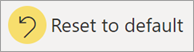
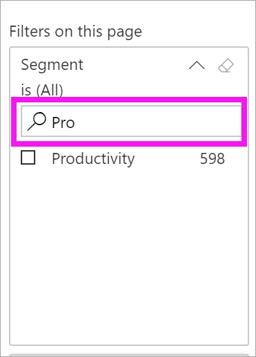

# Ismerkedés a jelentések Szűrők panelével

[!INCLUDE[consumer-appliesto-yyny](../includes/consumer-appliesto-yyny.md)]

[!INCLUDE [power-bi-service-new-look-include](../includes/power-bi-service-new-look-include.md)]

Ez a cikk a jelentések **Szűrők** paneljét mutatja be a Power BI szolgáltatásban. A szűrőkkel új megállapításokat nyerhet ki az adatokból.

Az adatok szűrésének számos módja érhető el a Power BI-ban. A szűrőkkel kapcsolatos további információkért tekintse meg a [Power BI- jelentések szűrőivel és kiemeléseivel](../power-bi-reports-filters-and-highlighting.md) foglalkozó részt.

## A jelentések Szűrők panelének használata

Amikor a munkatársa megoszt Önnel egy jelentést, mindenképp keresse meg a **Szűrők** panelt. Előfordulhat, hogy össze van csukva a jelentés jobb szélén. Kattintson rá a kibontáshoz.

A **Szűrők** panel olyan szűrőket tartalmaz, amelyekkel a jelentés *tervezője* látta el a jelentést. A *felhasználók* kezelhetik a meglévő szűrőket és menthetik a módosításokat, azonban nem adhatnak hozzá új szűrőket a jelentéshez. A fenti képernyőképen a tervező például három oldalszintű szűrőt vett fel: **Szegmens = mind**, **Év = 2014** és **Régió = Középső**. Kezelheti és módosíthatja ezeket a szűrőket, de nem adhat hozzá egy negyedik oldalszintű szűrőt.

A Power BI szolgáltatásban a jelentések megőrzik a **Szűrők** panelen végzett módosításokat. A szolgáltatás emellett a jelentés mobilos verziójára is alkalmazza őket. 

A **Szűrők** panelnek a tervező alapértelmezett értékeire való visszaállításához válassza ki a felső menüsáv **Visszaállítás alapértelmezettre** lehetőségét.

 

> [!NOTE]
> Ha nem jelenik meg **Visszaállítás alapértelmezettre** lehetőség, akkor lehetséges, hogy a jelentés *készítője* letiltotta azt. A *jelentéskészítő* egyes szűrőket is zárolhat, hogy Ön ne módosíthassa azokat.

## Jelentésoldal összes szűrőjének megtekintése

A **Szűrők** panel a tervező által a jelentéshez adott összes szűrőt megjeleníti. A **Szűrők** panel egyben az a terület is, ahol a szűrőkkel kapcsolatos információk megtekinthetőek és kezelhetőek. Mentse az elvégzett módosításokat vagy a **Visszaállítás alapértelmezettre** beállítással állítsa vissza az eredeti szűrőbeállításokat.

Ha menteni szeretné a módosításokat, létrehozhat egy személyes könyvjelzőt is. További információért tekintse meg [a könyvjelzőket](end-user-bookmarks.md) bemutató cikket.

A **Szűrők** panel különböző típusú jelentésszűrőket kezel és jelenít meg: jelentés, jelentésoldal és vizualizáció.

Ebben a példában egy olyan vizualizációt választottunk, amelyhez három szűrő tartozik. A jelentésoldalon szintén találhatók szűrők, ezek **Az ezen a lapon megtalálható szűrők** fejléc alatt vannak felsorolva. Emellett a teljes jelentés rendelkezik a **Date** szűrővel.

Némelyik szűrő mellett az **(Összes)** szó szerepel. Az **(Összes)** azt jelenti, hogy a szűrő az összes értékre kiterjed. A fenti képernyőképen a **Segment (Összes)** azt jelzi, hogy a jelentésoldal az összes termékszegmens adatait tartalmazza. 

Bárki, aki megtekinti a jelentést, kezelheti ezeket a szűrőket.

### Csak a vizualizációra alkalmazott szűrők megtekintése

Egy adott vizualizációra alkalmazott szűrők alaposabb vizsgálatához vigye az egérmutatót a vizualizáció fölé a  szűrőikon megjelenítéséhez. Válassza ki ezt a szűrőikont a vizualizációra ható összes szűrőt, szeletelőt stb. tartalmazó előugró ablak megjelenítéséhez. A felugró ablakban látható szűrők között szerepelnek azok, amelyek a **Szűrők** panelen jelentek meg, valamint a kijelölt vizualizációt érintő további szűrők.

Ebben a nézetben a következő szűrőtípusok jelenhetnek meg:

- Alapszintű szűrők
- Szeletelők
- Keresztkijelölés
- Keresztszűrés
- Speciális szűrők
- Felső N szűrők
- Relatív dátum szerinti szűrők
- Szinkronszűrők
- Belefoglalási/kizárási szűrők
- URL-címen keresztül átadott szűrők

Ebben a példában:
1. A **Belefoglalva** szakaszból tudjuk, hogy a vizualizáción keresztszűrés van érvényben. Ez azt jelenti, hogy Utah, Colorado és Texas állam ki van jelölve ennek a jelentésoldalnak egy másik vizualizációján. Ebben az esetben ez a térkép. A három állam kijelölése megakadályozza, hogy bármely más állam adatai megjelenjenek a kiválasztott sávdiagramon.  

1. A **Dátum** a jelentés összes oldalára alkalmazott szűrő.

1. A **Régió = Középső** és az **Év = 2014** szűrők erre a jelentésoldalra vannak alkalmazva.

4. A **Gyártó = VanArsdel, Natura, Aliqui vagy Pirum** szűrő erre a vizualizációra érvényes.

### Keresés szűrőben

Egy szűrő olykor hosszú értéklistával rendelkezhet. A keresőmezővel keresse meg, és válassza ki a kívánt értéket.

### Szűrő részleteinek megjelenítése

A szűrők megértéséhez vessen egy pillantást az elérhető értékekre és számokra.  Ha az egérmutatót a szűrő neve melletti nyílra viszi, majd kiválasztja a nyilat, megtekintheti a szűrő részleteit.
  

### Szűrők beállításának módosítása

Az adatokkal kapcsolatos megállapítások kinyerésének egyik módja a szűrők használata. A szűrők kiválasztott beállításait a mező neve melletti legördülő nyílra kattintva lehet módosítani.  A szűrőtől és a Power BI által szűrt adattípusoktól függően számos lehetőség érhető el az egyszerű listából való kiválasztástól a dátum- vagy számtartományok megadásáig. Az alábbi speciális szűrő esetében módosítottuk a **Total Units YTD** szűrőt a fatérképen, hogy az érték 2000 és 3000 között legyen. Látható, hogy ennek hatására eltűnik a Pirum a fatérképről.
  

> [!TIP]
> Egyszerre több szűrőérték kiválasztásához tartsa lenyomva a CTRL billentyűt. A legtöbb szűrő támogatja a több elem kiválasztását.

### Szűrő alaphelyzetbe állítása

Ha szeretné visszaállítani a szűrőkön végzett összes módosítást, válassza a felső menüsávon a **Visszaállítás alapértelmezettre** lehetőséget.  Ez visszaállítja a szűrők eredeti állapotát, amelyet a jelentés tervezője állított be.

### Szűrők törlése

A szűrő alaphelyzetbe (Mind) állításához törölje az a szűrő neve melletti radír ikon kiválasztásával.

  
<!--  too much detail for consumers

## Types of filters: text field filters
### List mode
Ticking a checkbox either selects or deselects the value. The **All** checkbox can be used to toggle the state of all checkboxes on or off. The checkboxes represent all the available values for that field.  As you adjust the filter, the restatement updates to reflect your choices. 

Note how the restatement now says "is Mar, Apr or May".

### Advanced mode
Select **Advanced Filtering** to switch to advanced mode. Use the dropdown controls and text boxes to identify which fields to include. By choosing between **And** and **Or**, you can build complex filter expressions. Select the **Apply Filter** button when you've set the values you want.  

## Types of filters: numeric field filters
### List mode
If the values are finite, selecting the field name displays a list.  See **Text field filters** &gt; **List mode** above for help using checkboxes.   

### Advanced mode
If the values are infinite or represent a range, selecting the field name opens the advanced filter mode. Use the dropdown and text boxes to specify a range of values that you want to see. 

By choosing between **And** and **Or**, you can build complex filter expressions. Select the **Apply Filter** button when you've set the values you want.

## Types of filters: date and time
### List mode
If the values are finite, selecting the field name displays a list.  See **Text field filters** &gt; **List mode** above for help using checkboxes.   

### Advanced mode
If the field values represent date or time, you can specify a start/end time when using Date/Time filters.  

-->

## Következő lépések

Tudnivalók arról, hogyan és miért történik [keresztszűrés és keresztkiemelés a vizualizációknál a jelentésoldalakon](end-user-interactions.md)