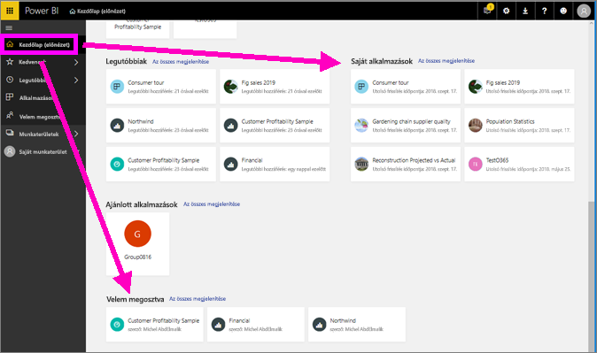
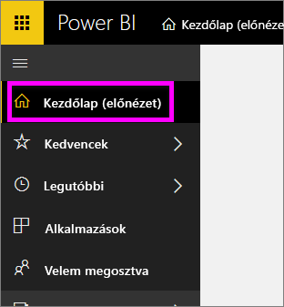
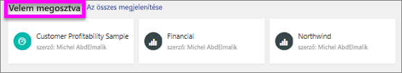
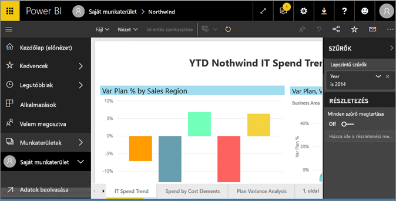
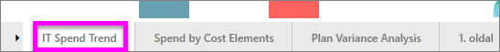
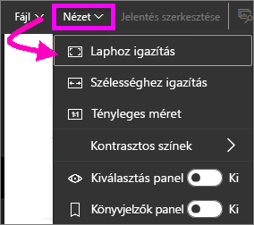
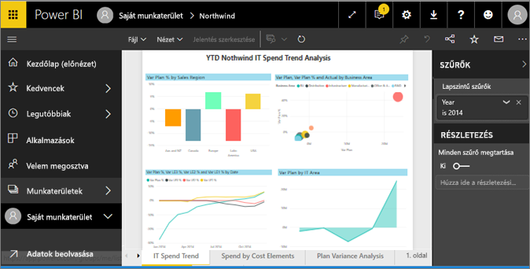
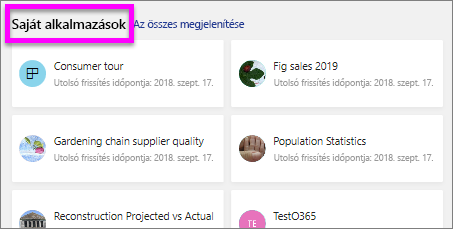
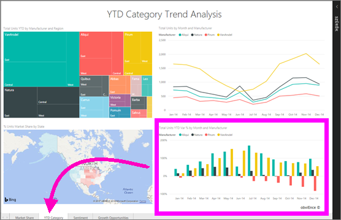

# Jelentés megtekintése az *ügyfeleknek* készült Power BI szolgáltatásban
A jelentések egy vagy több oldalnyi vizualizációból állnak. A jelentéseket a Power BI *jelentéstervezői* hozzák létre, és [megosztják őket a *felhasználókkal* közvetlenül](end-user-shared-with-me.md) vagy egy [alkalmazás](end-user-apps.md) részeként. 

A jelentések megnyitásának számos különböző módja van, amelyek közül most kettőt mutatunk be: a kezdőlapról, és az irányítópultról történő megnyitást. 

<!-- add art-->

## Jelentés megnyitása a kezdőlapról
Nyissunk meg egy Önnel közvetlenül megosztott jelentést, majd egy olyat, amely egy alkalmazás részeként lett megosztva Önnel.

   

### Önnel megosztott jelentés megnyitása
A Power BI *tervezői* a fenti menüsávon lévő **Megosztás** gombra kattintva közvetlenül oszthatnak meg Önnel jelentéseket. Az ezúton megosztott tartalmak a bal oldali navigációs sávon található **Velem megosztva** tárolóban, valamint a kezdőlap **Velem megosztva** szakaszában jelennek meg.

1. Nyissa meg a Power BI szolgáltatást (app.powerbi.com).

2. A kezdőlap megnyitásához a bal oldali navigációs sávon kattintson a **Kezdőlap (előnézet)** gombra.  

   
   
3. Görgessen le a **Velem megosztva** szakaszig. Keresse meg a jelentés ikont . Ezen a képernyőképen két jelentés szerepel: a *Financial* és a *Northwind*. 
   
   

4. A jelentés megnyitásához egyszerűen kattintson az egyik *jelentéskártyára*.

   

5. Figyelje meg az alul található lapokat. Minden fül egy *jelentésoldalt* jelöl. Jelenleg az *IT Spend Trend* (Informatikai kiadások trendje) oldal van megnyitva. Kattintson egy másik fülre a jelentés adott oldalának megnyitásához. 

   

6. Jelenleg csak a jelentésoldal egy részét látjuk. Az oldal megjelenítésének (nagyításának) módosításához válassza a **Nézet** > **Laphoz igazítás** lehetőséget.

   

   

### Alkalmazás részét képező jelentés megnyitása
A munkatársaitól kapott vagy az AppSource-ból szerzett alkalmazásokat a kezdőlapon és a bal oldali navigációs sáv **Alkalmazások** tárolóján érheti el. Az irányítópultok és jelentések együttesét [alkalmazásnak](end-user-apps.md) nevezzük.

1. Lépjen vissza a kezdőlapra: kattintson a **Kezdőlap (előnézet)** elemre a bal oldali navigációs sávon.

7. Görgessen le a **Saját alkalmazások** szakaszig.

   

8. A megnyitáshoz kattintson az egyik alkalmazásra. Az alkalmazás *tervezője* által megadott beállításoktól függően az alkalmazás egy irányítópultot, egy jelentést vagy egy alkalmazás tartalomjegyzékét nyitja meg. Ha az alkalmazásra kattintva:
    - megnyílik a jelentés, készen is van.
    - egy irányítópult nyílik meg, tekintse meg a következő szakaszt: [Jelentés megnyitása irányítópultról](#Open-a-report-from-a-dashboard).
    - az alkalmazás tartalomjegyzéke nyílik meg, a **Jelentések** területen válassza ki a kívánt jelentést a megnyitásához.

## Jelentés megnyitása irányítópultról
A jelentések irányítópultokról is megnyithatók. A legtöbb estben az irányítópultok csempéi jelentésekből vannak *rögzítve*. Egy adott csempére kattintva megnyílik a csempe létrehozásához használt jelentés. 

1. Az irányítópulton kattintson egy csempére. Ebben a példában a „Total Units YTD...” (Összes egység az év elejétől...) oszlopdiagram címét választottuk.

    

2.  Ekkor megnyílik a hozzá tartozó jelentés. Figyelje meg, hogy most a „YTD Category” oldalon vagyunk. Ez a jelentésoldal tartalmazza azt az oszlopdiagramot, amelyet az irányítópulton választottunk ki.

    

> [!NOTE]
> Nem minden csempe mutat jelentésekre. Ha olyan csempét nyit meg, amelyet a [Q&A használatával hoztak létre](end-user-q-and-a.md), akkor a Q&A képernyő is megnyílik. Ha olyan csempét nyit meg, amelyet az [irányítópult **Csempe felvétele** vezérlője használatával hoztak létre](../service-dashboard-add-widget.md), számos különböző dolog történhet.  

##  További lehetőségek a jelentés megnyitására
Ha már otthonosabban mozog a Power BI szolgáltatásban, minden bizonnyal tudni fogja, mely munkafolyamatok a legkényelmesebbek az Ön számára. Íme még néhány további lehetőség a jelentések megnyitásához:
- A bal oldali navigációs panelen a **Kedvencek**, majd a **Legutóbbi** lehetőséget választva;    
- A [Kapcsolódó megtekintése](end-user-related.md) használata    
- E-mailben, ha valaki [megosztja Önnel](../service-share-reports.md) vagy Ön [riasztást állít be](end-user-alerts.md);    
- Az [Értesítési központból](end-user-notification-center.md)    
- és még néhány további lehetőség

## Következő lépések
[A jelentéseket számos különböző módon kezelheti](end-user-reading-view.md).  Kezdésként kattintson a jelentésvászon alsó részén található fülekre.

