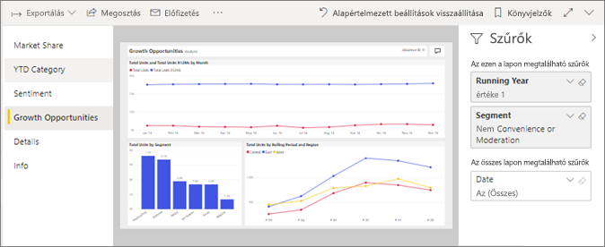
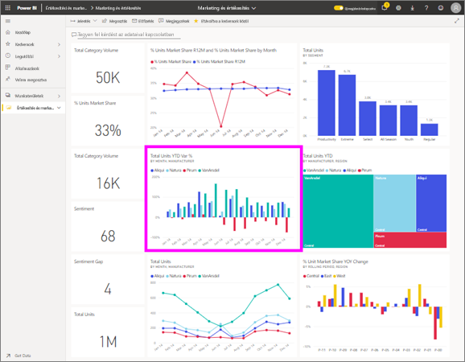

# Jelentés megtekintése az *ügyfeleknek* készült Power BI szolgáltatásban
A jelentések egy vagy több oldalnyi vizualizációból állnak. A Power BI által létrehozott jelentések *tervezők* és [megosztott *fogyasztók* közvetlenül](end-user-shared-with-me.md) vagy részeként egy [alkalmazás](end-user-apps.md). 

Nyisson meg egy jelentést számos különböző módja van, és megtudhatja, két: Nyissa meg a otthonról és a egy irányítópult megnyitásához. 

<!-- add art-->

## Nyisson meg egy jelentést a Power BI kezdőlap
Nyissunk meg egy Önnel közvetlenül megosztott jelentést, majd egy olyat, amely egy alkalmazás részeként lett megosztva Önnel.

   

### Önnel megosztott jelentés megnyitása
Power bi-ban *tervezők* oszthat meg jelentéseket közvetlenül Önnel. Ezzel a módszerrel megosztott tartalmak megjelenik-e a **velem megosztott** a navigációs sáv és a tároló a **velem megosztott** a kezdőlap vászonalapú szakaszában.

1. Nyissa meg a Power BI szolgáltatásban (app.powerbi.com).

2. A navigációs sávban válassza **kezdőlap** a kezdőlap vászonalapú megjelenítéséhez.  

   
   
3. Görgessen le a **Velem megosztva** szakaszig. Keresse meg a jelentés ikont . Ezen a képernyőképen látható van egy irányítópult és a egy jelentés nevű *értékesítési és marketing minta*. 
   
   

4. Egyszerűen válassza ki a jelentést *kártya* nyissa meg a jelentést.

   

5. Figyelje meg, hogy a lapok jelentésvászon bal oldalán.  Minden fül egy *jelentésoldalt* jelöl. Jelenleg a *növekedési lehetőségek* lapot. Válassza ki a *év elejétől számított kategória* elemére kattintva nyissa meg az adott jelentésoldal helyette. 

   

6. Most hogy jelent meg a teljes jelentésoldalra. Az oldal megjelenítése (nagyítás), jelölje ki a nézet legördülő listában a jobb felső sarokban ( **>** ), majd **tényleges méret**.

   

   

### Alkalmazás részét képező jelentés megnyitása
Ha alkalmazások már érkezett, a munkatársak vagy az appsource-ból, ezeknek az alkalmazásoknak érhetők el, és a kezdőlap a **alkalmazások** a navigációs sávban a tárolót. Az irányítópultok és jelentések együttesét [alkalmazásnak](end-user-apps.md) nevezzük.

1. Lépjen vissza a kezdőlapra kiválasztásával **kezdőlap** a navigációs sávban.

7. Görgessen le a **Saját alkalmazások** szakaszig.

   

8. A megnyitáshoz kattintson az egyik alkalmazásra. Az alkalmazás *tervezője* által megadott beállításoktól függően az alkalmazás egy irányítópultot, egy jelentést vagy egy alkalmazás tartalomjegyzékét nyitja meg. Ha az alkalmazásra kattintva:
    - megnyílik a jelentés, készen is van.
    - egy irányítópult nyílik meg, tekintse meg a következő szakaszt: ***Jelentés megnyitása irányítópultról***.
    - az alkalmazás tartalomjegyzéke nyílik meg, a **Jelentések** területen válassza ki a kívánt jelentést a megnyitásához.

## Jelentés megnyitása irányítópultról
A jelentések irányítópultokról is megnyithatók. A legtöbb estben az irányítópultok csempéi jelentésekből vannak *rögzítve*. Egy adott csempére kattintva megnyílik a csempe létrehozásához használt jelentés. 

1. Az irányítópulton kattintson egy csempére. Ebben a példában a „Total Units YTD...” (Összes egység az év elejétől...) oszlopdiagram címét választottuk.

    

2.  Ekkor megnyílik a hozzá tartozó jelentés. Figyelje meg, hogy most a „YTD Category” oldalon vagyunk. Ez a jelentésoldal tartalmazza azt az oszlopdiagramot, amelyet az irányítópulton választottunk ki.

    

> [!NOTE]
> Nem minden csempe mutat jelentésekre. Ha olyan csempét nyit meg, amelyet a [Q&A használatával hoztak létre](end-user-q-and-a.md), akkor a Q&A képernyő is megnyílik. Ha olyan csempét nyit meg, amelyet az [irányítópult **Csempe felvétele** vezérlője használatával hoztak létre](../service-dashboard-add-widget.md), számos különböző dolog történhet.  

##  További lehetőségek a jelentés megnyitására
Növekedésével otthonosabban Navigálás a Power BI szolgáltatásban, munkafolyamatok, amelyek a leginkább Önnek kell felméréséhez. Íme még néhány további lehetőség a jelentések megnyitásához:
- A navigációs sáv segítségével a **Kedvencek** és **legutóbbi**    
- A [Kapcsolódó megtekintése](end-user-related.md) használata    
- E-mailben, ha valaki [megosztja Önnel](../service-share-reports.md) vagy Ön [riasztást állít be](end-user-alerts.md);    
- Az [Értesítési központból](end-user-notification-center.md)    
- és még néhány további lehetőség

## Következő lépések
[A jelentéseket számos különböző módon kezelheti](end-user-reading-view.md).  Indítsa el, válassza ki az egyes részére, a jelentésvászon vizsgálatát.

