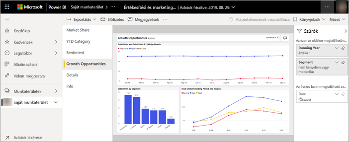

# A *felhasználóknak* készült Power BI szolgáltatásban jelentéseket tekinthet meg

[!INCLUDE[consumer-appliesto-yyny](../includes/consumer-appliesto-yyny.md)]

[!INCLUDE [power-bi-service-new-look-include](../includes/power-bi-service-new-look-include.md)]

A jelentések egy vagy több oldalnyi vizualizációból állnak. A jelentéseket a Power BI *tervezői* hozzák létre, és [megosztják őket a *felhasználókkal* közvetlenül](end-user-shared-with-me.md) vagy egy [alkalmazás](end-user-apps.md) részeként. 

A jelentések megnyitásának számos különböző módja van, amelyek közül most kettőt mutatunk be: a kezdőlapról, és az irányítópultról történő megnyitást. 

<!-- add art-->

## Jelentés megnyitása a Power BI kezdőlapjáról
Nyissunk meg egy Önnel közvetlenül megosztott jelentést, majd egy olyat, amely egy alkalmazás részeként lett megosztva Önnel.

   

### Önnel megosztott jelentés megnyitása
A Power BI-*tervezők* közvetlenül megoszthatnak Önnel egy adott jelentést e-mailes hivatkozással vagy annak a Power BI-tartalmakhoz való automatikus hozzáadásával. Az ezúton megosztott jelentések a navigációs panelen található **Velem megosztva** tárolóban, valamint a kezdővászon **Velem megosztva** szakaszában jelennek meg.

1. Nyissa meg a Power BI szolgáltatást (app.powerbi.com).

2. A Kezdőlap vászon megjelenítéséhez a navigációs panelen válassza a **Kezdőlap** lehetőséget.  

   
   
3. Görgessen le a **Velem megosztva** szakaszig. Keresse meg a jelentés ikont . Ezen a képernyőfelvételen egy irányítópult és egy jelentés látható. A jelentés neve *Értékesítési és marketing minta*. 
   
   

4. A jelentés megnyitásához egyszerűen válassza ki az egyik *jelentéskártyát*.

   

5. Figyelje meg a bal oldalon található lapokat.  Minden fül egy *jelentésoldalt* jelöl. Jelenleg a *Growth Opportunity* (Növekedési lehetőség) lap van megnyitva. A jelentésoldal megnyitásához válassza ki az *Idei bevétel kategóriát*. 

   

6. Figyelje meg a jobb oldali **Szűrők** panelt. Itt jelennek meg az erre a jelentésoldalra vagy a teljes jelentésre alkalmazott szűrők.

7. Ha a kurzort egy jelentésbeli vizualizáció fölé viszi, több ikont és a **További beállítások** (...) lehetőséget is megjeleníti. Az adott vizualizációra vonatkozó szűrők megtekintéséhez válassza a szűrő ikont. Itt az *Összes egység görgetési időszak és régió szerint* vonaldiagramhoz tartozó szűrőikon van kiválasztva.

   

6. Most a jelentés teljes oldalát látjuk. Az oldal megjelenítésének módosításához (kinagyításához) válassza a Nézet legördülő elemet a jobb felső sarokban, majd válassza a **Tényleges méret** lehetőséget.

   

   

Számos módon tárhat fel elemzéseket és hozhat üzleti döntéseket jelentések használatával.  A bal oldalon található tartalomjegyzékben találhat egyéb cikkeket a Power BI-jelentésekkel kapcsolatban. 

### Alkalmazás részét képező jelentés megnyitása
A munkatársaitól kapott vagy az AppSource-ból szerzett alkalmazásokat a kezdőlapon és a navigációs panel **Alkalmazások** tárolójában érheti el. Az [alkalmazások](end-user-apps.md) olyan irányítópultok és jelentések gyűjteményei, amelyeket egy Power BI-*tervező* összekapcsolt az Ön számára.

### Előfeltételek
A műveletek követéséhez töltse le az Értékesítés és marketing alkalmazást.
1. A böngészőben nyissa meg az appsource.microsoft.com webhelyet.
1. Keressen rá az „Értékesítés és marketing” kifejezésre, majd válassza a **Microsoft-minta – Értékesítés és marketing** elemet.
1. Válassza az **Azonnali letöltés** > **Tovább** > **Telepítés** lehetőséget az alkalmazás saját Apps-tárolóban történő telepítéséhez. 

Az alkalmazást a saját Apps-tárolóból vagy a Kezdőlapról nyithatja meg.
1. Lépjen vissza a kezdőlapra a navigációs panel **Kezdőlap** elemének kiválasztásával.

7. Görgessen le a **Saját alkalmazások** szakaszig.

   

8. Válassza az új *Értékesítés és marketing* alkalmazást annak megnyitásához. Az alkalmazás *tervezője* által megadott beállításoktól függően az alkalmazás egy irányítópultot vagy egy jelentést nyit meg. Ez az alkalmazás egy irányítópultot nyit meg.  

## Jelentés megnyitása irányítópultról
A jelentések irányítópultokról is megnyithatók. Az irányítópult legtöbb [csempéje](end-user-tiles.md) jelentésekből van *rögzítve*. Egy adott csempére kattintva megnyílik a csempe létrehozásához használt jelentés. 

1. Válasszon ki egy csempét az irányítópultról. Ebben a példában a *Total Units YTD...* (Összes egység az év elejétől...) oszlopdiagram címét választottuk.

    

2.  Ekkor megnyílik a hozzá tartozó jelentés. Figyelje meg, hogy most a *YTD Category* (Év elejétől számított kategória) lapon vagyunk. Ez a jelentésoldal tartalmazza azt az oszlopdiagramot, amelyet az irányítópulton választottunk ki.

    

> [!NOTE]
> Nem minden csempe mutat jelentésekre. Ha olyan csempét nyit meg, amelyet a [Q&A használatával hoztak létre](end-user-q-and-a.md), akkor a Q&A képernyő is megnyílik. Ha olyan csempét nyit meg, amelyet az [irányítópult **Csempe felvétele** vezérlője használatával hoztak létre](../create-reports/service-dashboard-add-widget.md), számos különböző dolog történhet: lejátszódhat egy videó, megnyílhat egy webhely és így tovább.  

##  További lehetőségek a jelentés megnyitására
Ha már otthonosabban mozog a Power BI szolgáltatásban, minden bizonnyal tudni fogja, mely munkafolyamatok a legkényelmesebbek az Ön számára. Íme még néhány további lehetőség a jelentések megnyitásához:
- A navigációs panelen a [Kedvencek](end-user-favorite.md), [Legutóbbi](end-user-recent.md) elemnél    
- A [Kapcsolódó megtekintése](end-user-related.md) használata    
- E-mailben, ha valaki [megosztja Önnel](../collaborate-share/service-share-reports.md) vagy Ön [riasztást állít be](end-user-alerts.md);    
- Az [Értesítési központból](end-user-notification-center.md)    
- Egy munkaterületről
- és még néhány további lehetőség

## Következő lépések
[Irányítópult megnyitása és megtekintése](end-user-dashboard-open.md)    
[Jelentésszűrők](end-user-report-filter.md)

