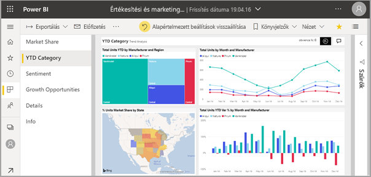
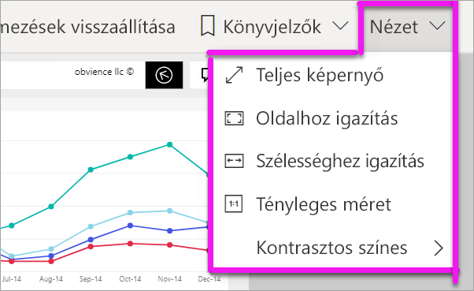
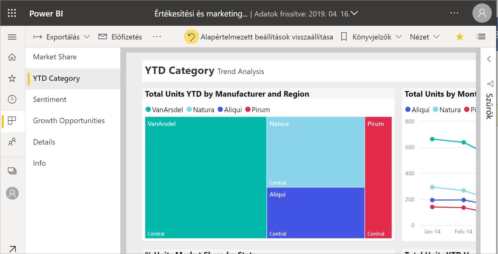
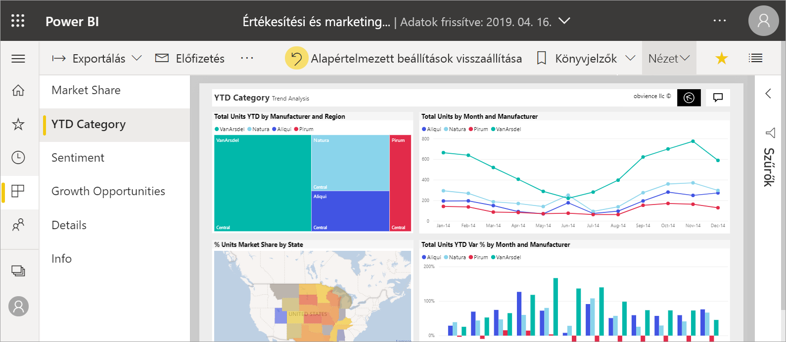
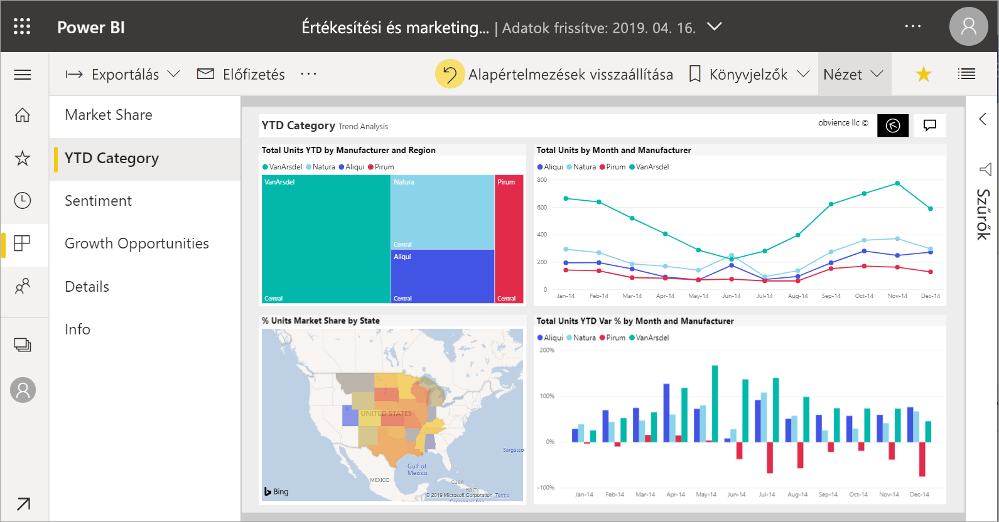
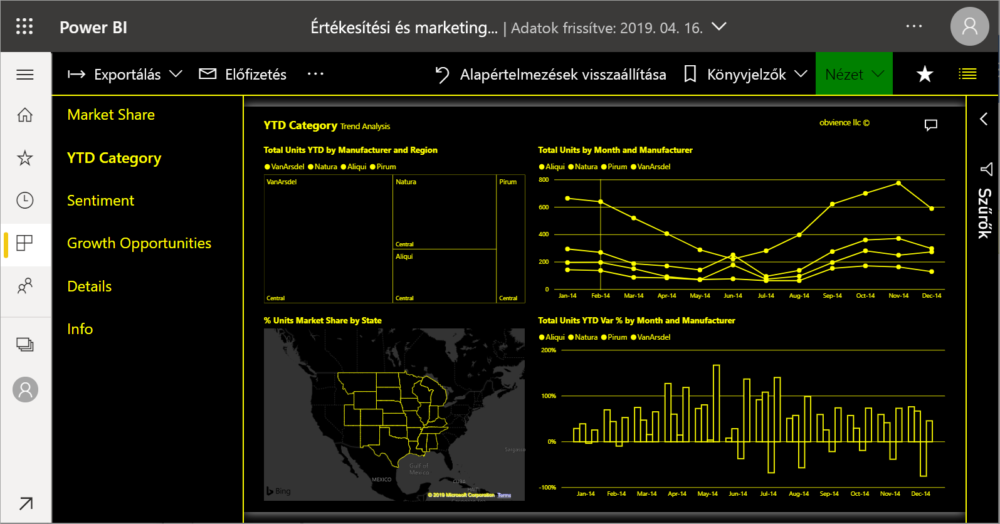
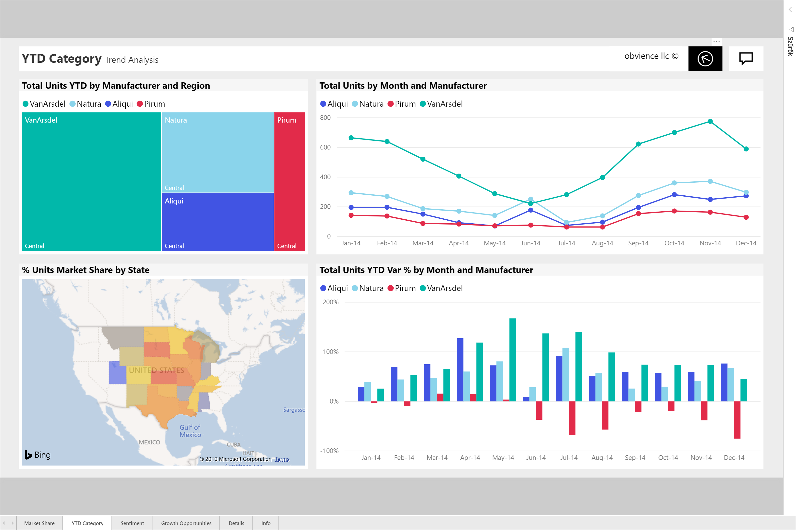

# Jelentésoldal megjelenésének módosítása

[!INCLUDE[consumer-appliesto-yyny](../includes/consumer-appliesto-yyny.md)]

[!INCLUDE [power-bi-service-new-look-include](../includes/power-bi-service-new-look-include.md)]

A jelentések számos különféle eszközön is megtekinthetőek, amelyek képernyője mind-mind eltérő méretű vagy méretarányú. A jelentésoldal megjelenési jellemzői az igényeinek megfelelően módosíthatók.

## Ismerkedés a Nézet menüvel

A **Nézet** menü beállításai kellő rugalmasságot biztosítanak a jelentésoldalak igény szerinti méretben és szélességben történő megjelenítéséhez:

- Tegyük fel, hogy egy kis méretű eszközön tekinti meg a jelentést, így a címek és jelmagyarázatok nehezen olvashatók.  A **Nézet** > **Tényleges méret** kiválasztásával növelheti a jelentésoldal méretét. A jelentésen belül a görgetősávokkal mozoghat.

    

- Egy másik lehetőség a jelentés képernyőhöz igazítására a **Szélességhez igazítás**. Mivel ez csak a szélességre vonatkozik, a magasságra nem, előfordulhat, hogy a függőleges görgetősávot is használni kell.

  

- Ha a görgetősávok használata nélkül szeretné a lehető legjobban kihasználni a képernyő méretét, válassza a **Laphoz igazítás** lehetőséget.

   

- Emellett négy **Kontrasztos színes** beállítás közül lehet választani: Kontrasztos – 1, kontrasztos – 2, kontrasztos fekete és kontrasztos fehér. Ez egy kisegítő lehetőség, amellyel a jelentések a gyengénlátók számára is jobban olvashatóak. Az alábbi példa a kontrasztos – 1 beállítást mutatja be. 

    

- Az utolsó lehetőség, a **Teljes képernyős** beállítás a menüsávok és fejlécek nélkül jeleníti meg a jelentésoldalt. A teljes képernyős beállítás lehet a megfelelő választás a kis képernyők esetében, ahol a részletek nehezen olvashatók.  A teljes képernyős megjelenítést érdemes választani akkor is, ha nagy képernyőre kell kivetíteni a jelentésoldalakat olyanok számára, akik csak megtekintik, de nem használják azokat.  

    

Amikor kilép a jelentésből, a **Nézet** beállítások nem lesznek mentve, hanem az alapértelmezett beállításokra állnak vissza. Ha mindenképp menteni szeretné ezeket a beállításokat, használja a [könyvjelzőket](end-user-bookmarks.md).

## Az oldal megjelenítésének módosítása a böngészővel

A böngésző nagyítási vezérlőelemeivel növelhető és csökkenthető a rendelkezésre álló vászonterület. A nagyítás csökkentésekor nő a rendelkezésre álló vászonterület, és fordítva. 

A teljes böngésző átméretezése egy másik módszer a jelentés megjelenítési méretének módosítására. 

## Vizualizáció nagyítása
Néha a vizualizációk részletei nehezen láthatók. Azt is megteheti, hogy a vizualizációt nagyobb méretben, illetve önmagában jeleníti meg. További információért lásd: [Fókusz mód és teljes képernyős mód](end-user-focus.md)

### Egy vizualizáció *F* módban

### Egy vizualizáció *Teljes képernyős* módban

## Következő lépések

* [Ismerkedés a jelentések Szűrők panelével](end-user-report-filter.md)