# Jelentésoldal méretének módosítása
Az [előző cikk és videó](../power-bi-report-display-settings.md) segítségével megismerhette azt a két lehetőséget, amelyekkel módosíthatja a Power BI-jelentések oldalainak megjelenítését: a **Nézet** és az **Oldalméret** beállításokat. Az oldalnézet és az oldalméret mind a Power BI szolgáltatásban, mind a Power BI Desktopban elérhető, és csaknem ugyanolyan a megjelenésük és a használatuk is, de ebben az oktatóanyagban a Power BI szolgáltatásban elérhetőt használjuk.

### Előfeltételek
- Power BI szolgáltatásban   
- [Kiskereskedelmi elemzési mintajelentés](../sample-retail-analysis.md)

## Elsőként módosítsuk az oldal Nézet beállításait

1. Nyissa meg a jelentést Olvasó vagy Szerkesztési nézetben, és válassza a **New Stores** (Új üzletek) jelentéspanelt. Alapértelmezés szerint ennek az oldalnak a megjelenítése **Laphoz igazítás** nézetre van állítva.  A Laphoz igazítás nézetben, ahogy esetünkben is, a jelentésoldal görgetősávok nélkül jelenik meg, azonban egyes részletek és címek olvashatatlanul kicsik.

   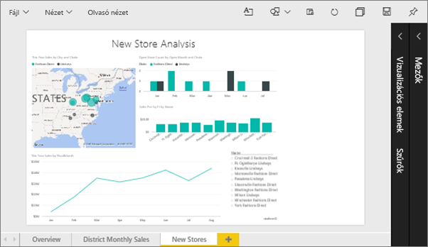
2. Győződjön meg róla, hogy a vászon egyetlen vizualizációja sincs kiválasztva. Válassza a **Nézet** lehetőséget a megjelenítési lehetőségek áttekintéséhez.

   * Olvasó nézetben ezt fogja látni.

     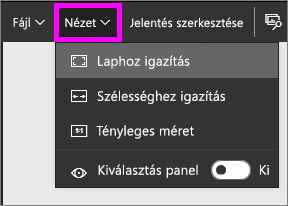
   * Szerkesztő nézetben pedig ezt fogja látni.

     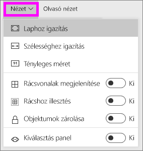

3. Nézzük meg, hogyan néz ki az oldal a **Tényleges méret** nézettel.

   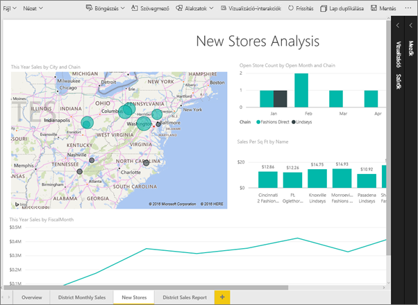

   Nem a legjobb, az irányítópultnak két görgetősávja is lett.
4. Váltson a **Szélességhez igazítás** nézetre.

   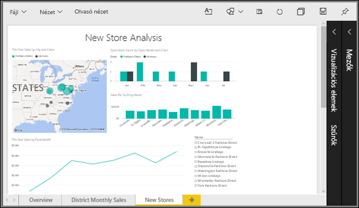

   Jobban néz ki, így is van egy görgetősávunk, de könnyebben kivehetők a részletek.

## Jelentésoldal alapértelmezett nézetének módosítása
Ha Ön a jelentés *létrehozója*, akkor megváltoztathatja a jelentésoldalak alapértelmezett nézetét. Ha a jelentést megosztja másokkal, a jelentésoldalak megnyitáskor a beállított nézetben jelennek meg. A jelentés *felhasználói* is meg tudják változtatni a nézetet, de ezt a beállítást nem tudják menteni a jelentés bezárásakor.

1. A **New stores** (Új üzletek) jelentésoldalon váltson vissza **Tényleges méret** nézetre.

   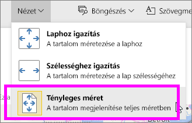

2. A **District Monthly Sales** (területenkénti havi értékesítések) jelentésoldalon, állítsa a nézetet **Szélességhez igazításra**.

3. Az **Áttekintés** jelentésoldalon hagyja meg az alapértelmezett nézetbeállítást.

4. Mentse a jelentést a **Fájl > Mentés** lehetőséget választva. Ha legközelebb megnyitja ezt a jelentést, az oldalak az új nézetbeállítás szerint nyílnak meg. Nézzük is ezt meg.

   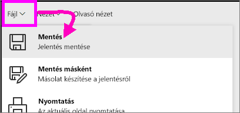
3. A felső navigációs sávon válassza az aktuális munkaterülete nevét, hogy visszatérjen a munkaterületre.  

   
4. Válassza a **Jelentések** lapot, és válassza ki ugyanazt a jelentést (Kiskereskedelmi elemzési minta).

    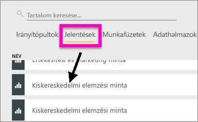
5. Az új beállítások megtekintéséhez nyissa meg a jelentés minden oldalát.

   

## Nézzük meg most az *Oldalméret*-beállításokat
Az oldalméret beállítások csak [Szerkesztési nézetben](../service-interact-with-a-report-in-editing-view.md) érhetők el, ezért szerkesztési (azaz *létrehozói*) engedéllyel kell rendelkeznie a jelentéshez, ha módosítani szeretné az oldalméret beállításait. Ha valamelyik [mintánkhoz](../sample-datasets.md) kapcsolódott, akkor a jelentésekhez *létrehozói* engedélyei vannak.

1. Nyissa meg a [Retail Analysis sample](../sample-retail-analysis.md) (Kiskereskedelmi elemzési minta) „District monthly sales” (Körzetek havi értékesítései) nevű oldalát Szerkesztő nézetben.
2. Győződjön meg róla, hogy a vászon egyetlen vizualizációja sincs kiválasztva.  A **Megjelenítések ablaktáblán** válassza a festőhenger  ikont.
3. Válassza az **Oldalméret** &gt; **Típus** lehetőséget az oldal méretezési lehetőségeinek megjelenítéséhez.

   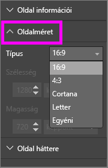
4. Válassza a **Letter** lehetőséget.  Így csak azok a tartalmak maradtak a vászon fehér részén, amelyek elférnek a 816x1056 képpont méretű (Letter méretű) helyen.

   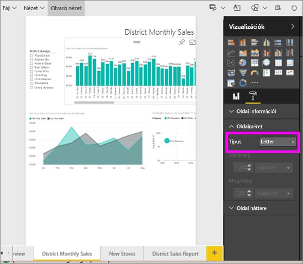
5. Válassza a **Oldalméret** típusánál a **16:9**-es arányt.

   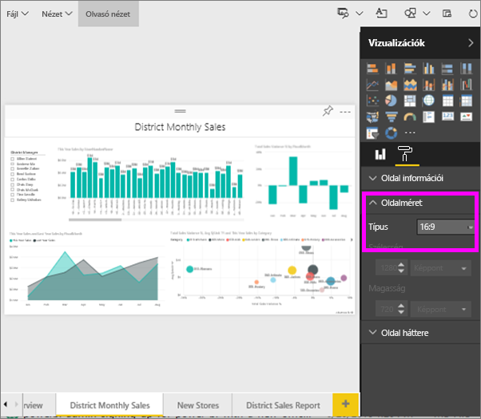

   A jelentésoldal ekkor 16:9-es szélesség-magasság arányban jelenik meg. A ténylegesen használt, képpontokban kifejezett méretet a kiszürkített Szélesség és Magasság mezőkben tekintheti meg (1280x720). A jelentésvászon körül sok az üres hely, ugyanis a **Nézet** beállítást korábban „Szélességhez igazításra” állítottuk.
7. Folytassa az ismerkedést az **Oldalméret**-beállításokkal.

## A Nézet és az Oldalméret beállításainak együttes használata
A Nézet és az Oldalméret beállításainak együttes használatával olyan jelentéseket hozhat létre, amelyek a legjobb megjelenéssel rendelkeznek, ha megosztja őket vagy más alkalmazásokba beágyazza őket.

Ebben a példában egy olyan jelentésoldalt fog létrehozni, amely egy alkalmazás 500 képpont szélességű és 750 képpont magasságú helyén fog megjelenni.

Ne felejtse el, hogy az előző lépésben azt láttuk, hogy a jelentésoldal jelenleg 1280 képpont szélességű és 720 képpont magasságú. Így sok tennivalónk lesz az átméretezésekkel és az elrendezésekkel, ha azt szeretnénk, hogy az egész vizualizációnk elférjen egy ekkora helyen.

1. Méretezze át és helyezze át a vizualizációkat úgy, hogy a jelenlegi vászon területének kevesebb mint felét foglalják el.

    
2. Válassza az **Oldalméret** &gt; **Egyéni** lehetőséget.
3. Állítsa a Szélességet 500-ra, a magasságot pedig 750-re.

    
4. Módosítsa a jelentésoldalt, hogy a lehető legjobban nézzen ki. Váltson a **Nézet > Tényleges méret** és a **Nézet > Laphoz igazítás** lehetőségek között a nézet módosításához.

    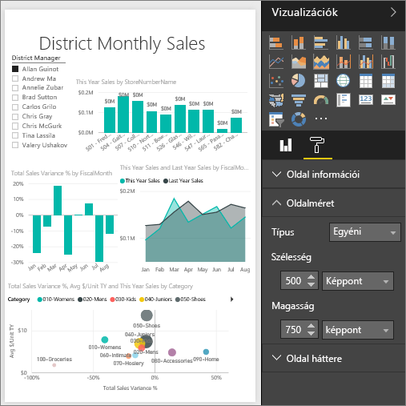

## Következő lépések
[Jelentés létrehozása Cortanához](../service-cortana-answer-cards.md)

Vissza az [Oldal megjelenítési beállításai Power BI-jelentésben](../power-bi-report-display-settings.md) című cikkhez

További kérdései vannak? [Kérdezze meg a Power BI közösségét](http://community.powerbi.com/)
