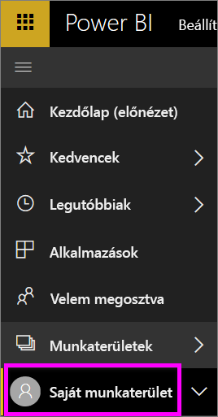
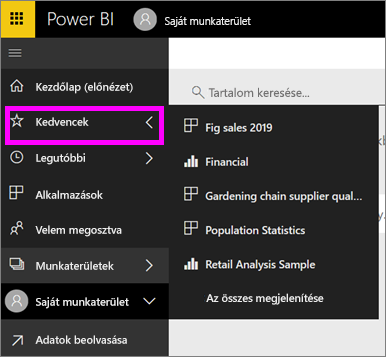

# Navigáció: tartalom keresése és rendezése a Power BI szolgáltatásban
A Power BI szolgáltatásban számos módon navigálhat a tartalmak között. A tartalmak típus szerint vannak rendezve a munkaterületeken: irányítópultok, jelentések, munkafüzetek és adathalmazok.  A tartalom emellett használat szerint is rendezve van: kedvencek, legutóbbi, alkalmazások, velem megosztott és kiemelt. A kezdőlap az egylépéses navigáció érdekében egy oldalon rendez el minden tartalmat. Ezek a különböző tartalmakhoz vezető utak lehetővé teszik, hogy gyorsan megtalálja, amire szüksége van a Power BI szolgáltatásban.  

## Navigálás a munkaterületeken

A Power BI *felhasználói* általában csak egy munkaterülettel rendelkeznek: a **Saját munkaterülettel**. A **Saját munkaterületen** csak akkor látható tartalom, ha töltött le Microsoft-mintákat, vagy saját tartalmat hozott létre vagy töltött le.  

A **Saját munkaterületen** belül a Power BI szolgáltatás a következő típusokba választja szét a tartalmakat: irányítópultok, jelentések, munkafüzetek és adathalmazok. Ez az elrendezés fog megjelenni, amikor kiválaszt egy munkaterületet. Ebben a példában a **Saját munkaterület** egy irányítópultot, két jelentést és két adathalmazt tartalmaz, munkafüzetet nem.

________________________________________

## Navigálás a bal oldali navigációs sávval
A bal oldali navigációs sáv osztályozza a tartalmakat, hogy még könnyebben és gyorsan találja meg a szükséges elemeket.  

- Az Önnel megosztott tartalmak a **Velem megosztva** tárolóban érhetők el.
- A legutóbb megtekintett tartalmak a **Legutóbbi** területen érhetők el. 
- Az alkalmazásokat az **Alkalmazások** elemre kattintva találhatja meg.
- A **Kezdőlap** a legfontosabb tartalmak, a javasolt tartalmak és a tanulási források egyetlen oldala.

Emellett [kedvencként](end-user-favorite.md) és [kiemeltként](end-user-featured.md) is megjelölhet tartalmakat. Válassza ki a várhatóan leggyakrabban megtekintett irányítópultot, és állítsa be *kiemelt* irányítópultként. A Power BI szolgáltatás megnyitásakor először mindig a kiemelt irányítópult jelenik meg. Vannak gyakran használt irányítópultjai és alkalmazásai? Ha kedvencként állítja be őket, mindig elérhetőek lesznek a bal oldali navigációs sávban.

.

## Megfontolandó szempontok és hibaelhárítás
* Az adathalmazok esetén a **Rendezés szempontja** nem használható tulajdonos alapján.

## Következő lépések
[Power BI – Alapfogalmak](end-user-basic-concepts.md)

További kérdései vannak? [Kérdezze meg a Power BI közösségét](http://community.powerbi.com/)