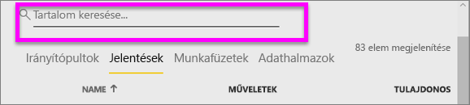

# Navigáció: tartalom keresése és rendezése a Power BI szolgáltatásban

[!INCLUDE [power-bi-service-new-look-include](../includes/power-bi-service-new-look-include.md)]

A Power BI szolgáltatásban számos módon navigálhat a tartalmak között. A tartalmak típus szerint vannak rendezve a munkaterületén: irányítópultok és jelentések.  A tartalom emellett használat szerint is rendezve van: kedvencek, legutóbbi, alkalmazások, velem megosztott és kiemelt. A Power BI *kezdőlapja* az egylépéses navigáció érdekében egy oldalon rendez el minden tartalmat. Ezek a különböző tartalmakhoz vezető utak lehetővé teszik, hogy gyorsan megtalálja, amire szüksége van a Power BI szolgáltatásban.  

## Navigálás a munkaterületeken

A Power BI *felhasználói* általában csak egy munkaterülettel rendelkeznek: a **Saját munkaterülettel**. A **Saját munkaterületen** csak akkor látható tartalom, ha töltött le Microsoft-mintákat, vagy saját irányítópultot, jelentést vagy alkalmazást hozott létre vagy töltött le.  

A **Saját munkaterületen** belül a Power BI szolgáltatás a következő típusokba választja szét a tartalmakat: irányítópultok, jelentések, munkafüzetek és adathalmazok. Ez az elrendezés fog megjelenni, amikor kiválaszt egy munkaterületet. Ebben a példában a **Saját munkaterület** egy irányítópultot, egy jelentést és egy adathalmazt tartalmaz, munkafüzetet nem.

________________________________________
## Navigálás a Keresőmezővel
A **Saját munkaterület** tartalomnézete megkönnyíti a különböző tartalmak keresését, szűrését és rendezését. A keresőmezőbe írja be az irányítópult, jelentés, munkafüzet vagy tulajdonos nevének egy részét vagy egészét.  

Ha csak kevés tartalommal rendelkezik van, a keresés és rendezés nem szükséges.  De ha irányítópultok és jelentések hosszú listájával dolgozik, akkor a keresést és a rendezést rendkívül hasznosnak fogja találni. Az alábbi jelentéslista például 83 elemet tartalmaz. 

A tartalmakat a nevük vagy a tulajdonosuk alapján is rendezheti. Vegye figyelembe a **Név** elem jobb oldalán a felfelé mutató nyilat. Jelenleg 83 elemet rendezünk név szerinti betűrendes növekvő sorrendben. Ha a rendezési sorrendet csökkenőre kívánja állítani, válassza a **Név** elemet. A felfelé mutató nyíl lefelé mutatóra vált.

Nem minden oszlop rendezhető. Vigye az egeret az oszlopok fejlécére, hogy lássa, melyeknél érhető el a rendezés.

___________________________________________________________________
## Navigálás a navigációs sávval
A navigációs ablaktábla osztályozza a tartalmakat, hogy könnyebben és gyorsan megtalálja a szükséges elemeket.  

- Az Önnel megosztott tartalmak a **Velem megosztva** tárolóban érhetők el.
- A legutóbb megtekintett tartalmak a **Legutóbbi** területen érhetők el. 
- Az alkalmazásokat az **Alkalmazások** elemre kattintva találhatja meg.
- A **Kezdőlap** a legfontosabb tartalmak, a javasolt tartalmak és a tanulási források egyetlen oldala.

Emellett [kedvencként](end-user-favorite.md) és [kiemeltként](end-user-featured.md) is megjelölhet tartalmakat. Válassza ki a várhatóan leggyakrabban megtekintett irányítópultot vagy jelentést, és állítsa be *kiemelt* tartalomként. A Power BI szolgáltatás megnyitásakor először mindig a kiemelt irányítópult jelenik meg. Vannak gyakran használt irányítópultjai és alkalmazásai? Ha kedvencként állítja be őket, mindig elérhetőek lesznek a bal oldali navigációs sávban.

.

## Megfontolandó szempontok és hibaelhárítás
* Az adathalmazok esetén a **Rendezés szempontja** nem használható tulajdonos alapján.

## Következő lépések
[Vizualizációk rendezése jelentésekben](end-user-change-sort.md)

További kérdései vannak? [Kérdezze meg a Power BI közösségét](http://community.powerbi.com/)
