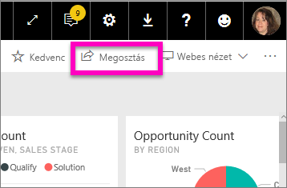
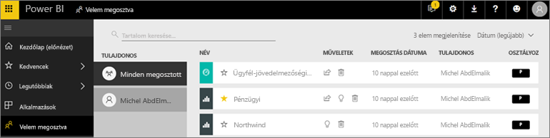

# A velem megosztott irányítópultok és jelentések megjelenítése
## Velem megosztva

Ha egy munkatárs tartalmakat oszt meg Önnel a **Megosztás** gomb használatával, azok a **Velem megosztva** tárolóban jelennek meg. Az irányítópult vagy a jelentés csak a **Velem megosztva** tárolóból érhető el, az **Alkalmazások** tárolóból nem.

Nézze meg, ahogy Amanda elmagyarázza a **Velem megosztva** tartalomlistát, és bemutatja, hogyan lehet a listában navigálni és szűrőket használni. Ezután kövesse a videó alatt található részletes útmutatást, hogy Ön is kipróbálja. Az Önnel megosztott irányítópultok megtekintéséhez Power BI Pro-licencre van szükség. Részletek: [Mi a Power BI Premium?](../service-premium.md).

<iframe width="560" height="315" src="https://www.youtube.com/embed/G26dr2PsEpk" frameborder="0" allowfullscreen></iframe>

Az irányítópultok és jelentések használatához különféle lehetőségek állhatnak rendelkezésre a tervező által megadott engedélyektől függően. Lehetősége lehet többek között másolatokat készíteni az irányítópultról, megnyitni a jelentés [Olvasó nézetét](end-user-reading-view.md), és újból megosztani tartalmakat más munkatársakkal.

## A **Velem megosztva** tárolóban elérhető műveletek
* [Irányítópult vagy jelentés kedvencként való megjelöléséhez](end-user-favorite.md) kattintson a csillag ikonra.
* Irányítópult vagy jelentés eltávolítása  
* Egyes irányítópultok és jelentések újból megoszthatók  
* Emellett, hosszú listák esetén [a keresőmező és a szűrési lehetőségek használatával kereshet](end-user-search-sort.md).
  
  > [!NOTE]
  > Az EGRC-besorolásokról további információért válassza a besorolások gombot, majd [tekintse meg az Irányítópult adatainak besorolása cikket](../service-data-classification.md).
  > 
  > 
* Az irányítópult megnyitásához és megismeréséhez válassza ki a nevét. Ha megnyitott egy megosztott irányítópultot, akkor a Q&A-val kérdéseket tehet fel az alapjául szolgáló adatokról, vagy kiválaszthatja egy jelentés címét, hogy megnyithassa és használhassa Olvasó nézetben.

## Megosztott irányítópultok szűrése tulajdonos szerint
A **Velem megosztva** képernyőn található tartalmak tovább szűrhetők a tartalom tulajdonosa szerint. Ha például kiválasztom **Amandát**, akkor csak azokat az irányítópultokat fogom látni, amelyeket Amanda osztott meg velem.

