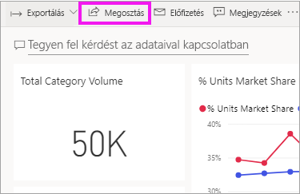
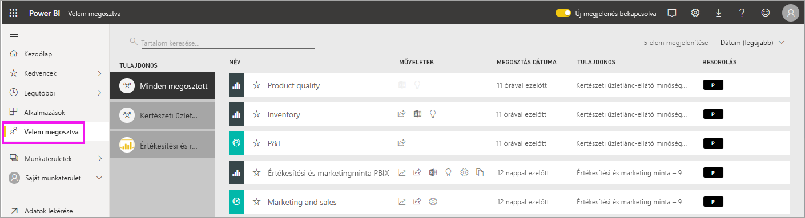
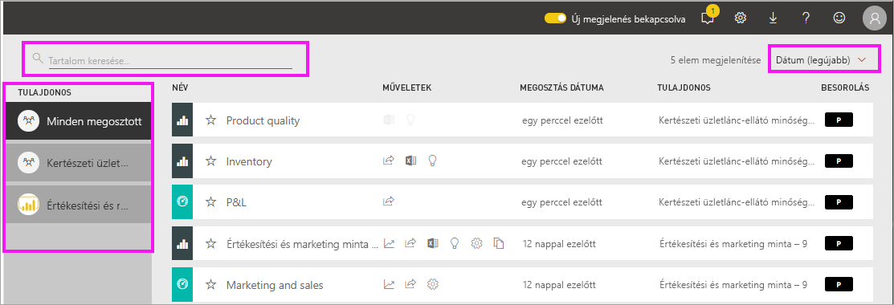

# A velem megosztott irányítópultok és jelentések megjelenítése

[!INCLUDE [power-bi-service-new-look-include](../includes/power-bi-service-new-look-include.md)]

Ha egy munkatárs tartalmakat oszt meg Önnel a **Megosztás** gomb használatával, azok a **Velem megosztva** tárolóban jelennek meg. Az irányítópult vagy a jelentés csak a **Velem megosztva** tárolóból érhető el, az **Alkalmazások** tárolóból nem.

Nézze meg, ahogy Amanda elmagyarázza a **Velem megosztva** tartalomlistát, és bemutatja, hogyan lehet a listában navigálni és szűrőket használni. Ezután kövesse a videó alatt található részletes útmutatást, hogy Ön is kipróbálja. Az Önnel megosztott irányítópultok megtekintéséhez Power BI Pro-licencre van szükség. Részletek: [Mi a Power BI Premium?](../service-premium-what-is.md).
    

> [!NOTE]
> Ez a videó a Power BI szolgáltatás egy régebbi verzióját használja.
    

<iframe width="560" height="315" src="https://www.youtube.com/embed/G26dr2PsEpk" frameborder="0" allowfullscreen></iframe>

## Megosztott tartalom használata

A megosztott irányítópultok és jelentések használatához különféle lehetőségek állhatnak rendelkezésre a *tervező* által megadott engedélyektől függően. Lehetősége lehet többek között másolatokat készíteni az irányítópultról, megnyitni a jelentés [Olvasó nézetét](end-user-reading-view.md), és újból megosztani tartalmakat más munkatársakkal.

### A **Velem megosztva** tárolóban elérhető műveletek
Az elérhető műveletek a tartalom *tervezője* által hozzárendelt beállításoktól függenek. Íme néhány lehetőség:
* [Irányítópult vagy jelentés beállítása kedvencként](end-user-favorite.md) a csillag ikon választásával .
* Irányítópult vagy jelentés eltávolítása  .
* Egyes irányítópultok és jelentések újból megoszthatók  .
* [Jelentés megnyitása az Excelben](end-user-export.md)  
* Az  megtekintheti a Power BI által az adatokon végzett [elemzéseket](end-user-insights.md).
  
  > [!NOTE]
  > Az EGRC-besorolásokról további információért válassza a **Besorolás** gombot, majd [tekintse meg az Irányítópult adatainak besorolása cikket](../service-data-classification.md).
  > 

## Megosztott irányítópultok keresése és rendezése
Ha a tartalmak listája túl hosszú, többféleképpen is megtalálhatja a keresett elemeket. Használhatja a keresőmezőt, dátum szerint rendezhet, vagy a **Tulajdonos** oszlopból válogathat.    

