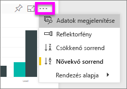
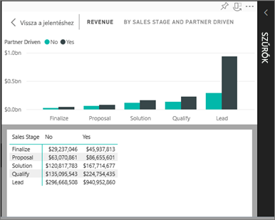
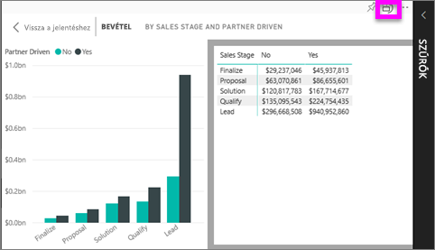

# A vizualizáció létrehozásához használt adatok megjelenítése
## Adatok megjelenítése
A Power BI-vizualizációk az alapul szolgáló adatkészletekből származó adatokból jönnek létre. Ha látni szeretné a háttérfolyamatokat, a Power BI-jal *megjelenítheti* a vizualizáció létrehozásához használt adatokat. Amikor az **Adatok megjelenítése** elemet választja, a Power BI megjeleníti a vizualizáció alatt (vagy mellett) lévő adatokat.

## Az *Adatok megjelenítésének* használata a Power BI szolgáltatásban
1. A Power BI szolgáltatásban nyisson meg egy jelentést, és válasszon ki egy vizualizációt.  
2. A vizualizáció mögötti adatok megjelenítéséhez kattintson a három pontra (…), és válassza az **Adatok megjelenítése** elemet.
   
   
3. Alapértelmezés szerint az adatok a vizualizáció alatt jelennek meg.
   
   

4. A tájolás módosításához válassza a függőleges elrendezést  a vizualizáció jobb felső sarkában.
   
   

### Következő lépések
[Vizualizációk Power BI-jelentésekben](../visuals/power-bi-report-visualizations.md)    
[A Power BI-jelentések](end-user-reports.md)    
