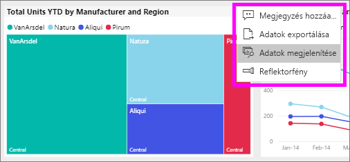
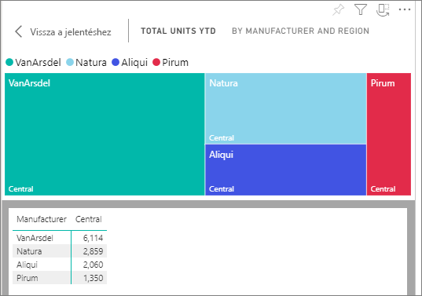
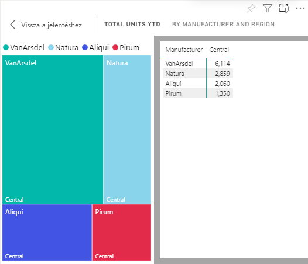

# Adatok megjelenítése Power BI-jelentésekkel

[!INCLUDE [power-bi-service-new-look-include](../includes/power-bi-service-new-look-include.md)]

A Power BI-vizualizációk az alapul szolgáló adathalmazokból származó adatokból jönnek létre. Ha látni szeretné a háttérfolyamatokat, a Power BI szolgáltatással *megjelenítheti* a vizualizáció létrehozásához használt adatokat egy jelentésben. Amikor az **Adatok megjelenítése** elemet választja, a Power BI megjeleníti a vizualizáció alatt (vagy mellett) lévő adatokat.

A háttéradatokat az irányítópulton tekintheti meg az [Exportálás az Excelbe](end-user-export.md) paranccsal

## A jelentés vizualizációjának létrehozásához használt adatok megjelenítése
1. [Nyisson meg egy jelentést](end-user-report-open.md), és válasszon ki egy vizualizációt a Power BI szolgáltatásban.  
2. A vizualizáció alapjául szolgáló adatok megjelenítéséhez kattintson a **További lehetőségek** (...) elemre, majd válassza az **Adatok megjelenítése** elemet.
   
   
3. Alapértelmezés szerint az adatok a vizualizáció alatt jelennek meg.
   
   

4. A tájolás módosításához válassza a függőleges elrendezést  a vizualizáció jobb felső sarkában.
   
   

## Következő lépések
[Vizualizációk a Power BI-jelentésekben](../visuals/power-bi-report-visualizations.md)    
[A Power BI-jelentések](end-user-reports.md)    
