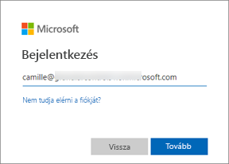
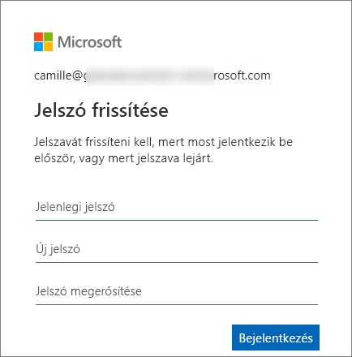
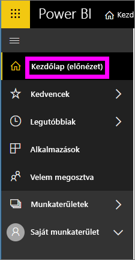
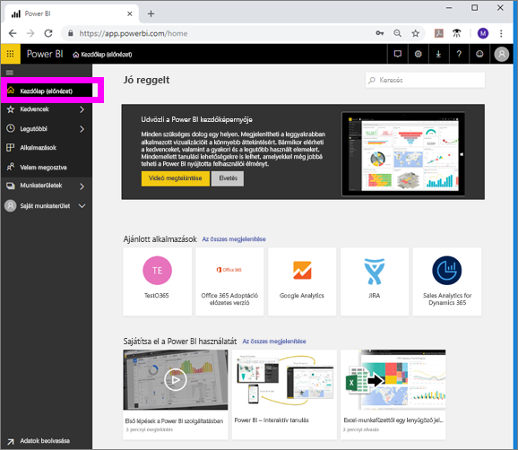

# Bejelentkezés a Power BI szolgáltatásba

## Power BI-fiókok
A Power BI-ba való bejelentkezéshez fiókkal kell rendelkeznie. Power BI-fiókot kétféle módon szerezhet be. Ez első, hogy a vállalata vásárol Power BI-licenceket az alkalmazottai számára. A második, hogy a felhasználók regisztrálnak ingyenes próbaverziót vagy személyes licencet. Ez a cikk az első változatot ismerteti.

## Bejelentkezés első alkalommal

### Első lépés: egy böngésző megnyitása
A Power BI szolgáltatás egy böngészőben fut.  Az első teendő tehát a kedvenc böngészője megnyitása, és az **app.powerbi.com** cím begépelése.

### Második lépés: e-mail-címe beírása
Amikor először jelentkezik be, a rendszer az e-mail-címét fogja kérni.  Ez az a munkahelyi vagy iskolai cím, amelyet a Power BI regisztrálása során használt.  

Keresse meg a Power BI-rendszergazdájától kapott e-mailt a beérkezett üzenetei között. A rendszergazdák általában üdvözlő e-mailt küldenek, amely az Ön ideiglenes jelszavát is tartalmazza. Jelentkezzen be ezzel az e-mail-fiókkal. 

 
### Harmadik lépés: új jelszó létrehozása
Ha Power BI-rendszergazdája küldött ideiglenes jelszót, azt írja be a **Jelenlegi jelszó** mezőbe. Ha nem kapta meg e-mailben ezt a jelszót, forduljon Power BI-rendszergazdájához.

A Power BI megjegyzi hitelesítő adatait, így a következő bejelentkezéskor felhasználónevét (e-mail-címét) már nem kell beírnia. 

### Negyedik lépés: a Kezdőlap áttekintése
Első látogatása alkalmával a Power BI az Ön **kezdőlapját** nyitja meg. Ha nem a **Kezdőlap** oldal nyílik meg, akkor válassza ki azt a bal oldali navigációs panelen. 

A Kezdőlapon minden olyan tartalmat megtalál, amelynek használatára jogosult. A Kezdőlap először még nem tartalmaz sok mindent, de ez bizonyára megváltozik, ha munkatársaival használatba veszi a Power BI-t. 

Ha nem szeretné, hogy a Power BI a Kezdőlapját nyissa meg, [beállíthatja, hogy egy **Kiemelt** irányítópult vagy jelentés](end-user-featured.md) legyen megnyitva helyette. 

## A tartalom biztonságos kezelése
Mások Önnel mint ***fogyasztóval*** fognak tartalmakat megosztani, Ön pedig ennek a tartalomnak a kezelésével vizsgálhatja az adatokat, és hozhat üzleti döntéseket.  Bátran szűrhet, szeletelhet, feliratkozhat, exportálhat és méretezhet – a tevékenysége nem befolyásolja az eredeti megosztott tartalmat (irányítópultokat és jelentéseket) és az azok alapjául szolgáló adatokat. A Power BI-ban biztonságosan tallózhat és kísérletezhet. Ez nem azt jelenti, hogy a módosításait nem mentheti – ezt megteheti. A módosítások azonban egyedül azt befolyásolják, ahogyan **Ön** látja a tartalmat. Az eredeti, alapértelmezett nézet egyetlen kattintással helyreállítható.

## Kijelentkezés a Power BI szolgáltatásból
Amikor bezárja a Power BI-t, vagy kijelentkezik, a módosításai mentve lesznek, így ott folytathatja a munkát, ahol abbahagyta.

A Power BI bezárásához elég bezárnia a böngészőlapot, amelyen dolgozott. 

 

Ha másokkal közösen használ egy számítógépet, ajánlott mindig kijelentkezni a Power BI bezárásakor.  A kijelentkezéshez válassza a profilképét a jobb felső sarokban, majd a **Kijelentkezés** lehetőséget. Más esetben elég bezárnia a böngészőlapot, amikor végzett.

 

## Hibaelhárítás és megfontolandó szempontok
- Ha egyénileg regisztrált a Power BI-ba, akkor a regisztráláshoz használt e-mail-címmel jelentkezzen be.

- A több fiókkal is használja a Power BI-t, akkor a rendszer a bejelentkezéskor kéri, hogy válaszon a felsorolt fiókok közül, majd adja meg a jelszavát. 

## Következő lépések
[Power BI-alkalmazás megtekintése](end-user-app-view.md)
