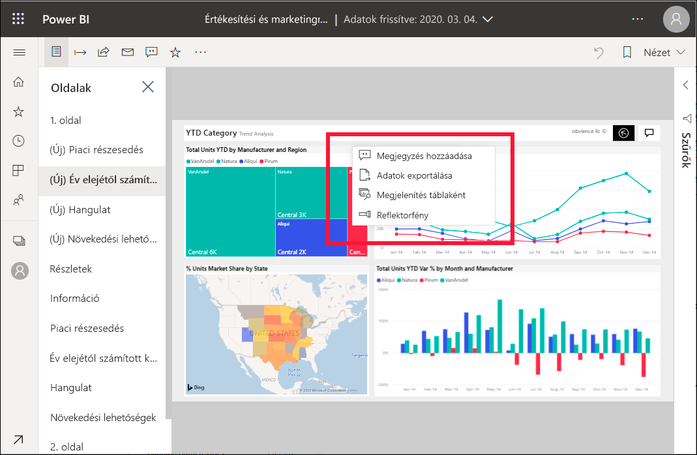
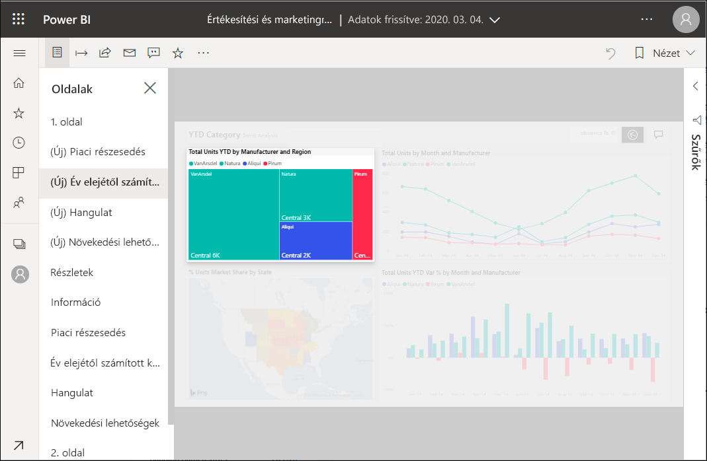

# Reflektorfények hozzáadása Power BI-jelentésekhez

[!INCLUDE[consumer-appliesto-yyny](../includes/consumer-appliesto-yyny.md)]

A reflektorfénnyel felhívhatja például a figyelmet egy adott vizualizációra vagy jelentésoldalra.  Ha egy könyvjelző hozzáadásakor a reflektorfény mód be van kapcsolva, a könyvjelző megőrzi a beállítást.

## Reflektorfény hozzáadása

1. [Nyisson meg egy jelentést](end-user-report-open.md) a Power BI szolgáltatásban.

2. Döntse el, hogy melyik vizualizációt szeretné kiemelni a jelentésoldalon. Válassza a **További műveletek (...)** legördülő menüt.  

    

3. Válassza ki a megfelelő lehetőséget a **Reflektorfény** esetében. Kiemelve jelenik meg a kiválasztott vizualizáció, amelynek a hatására az oldalon lévő összes többi vizualizáció majdnem teljesen elhalványul. 

    

## További lépések

* [Irányítópult-csempe vagy jelentésvizualizáció megjelenítése fókusz módban](end-user-focus.md)

