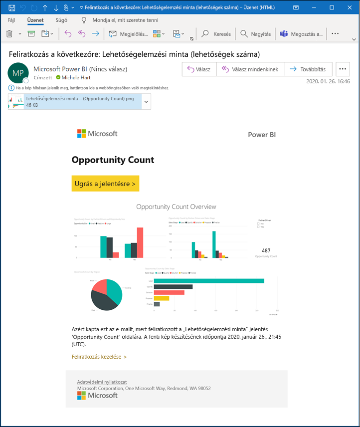
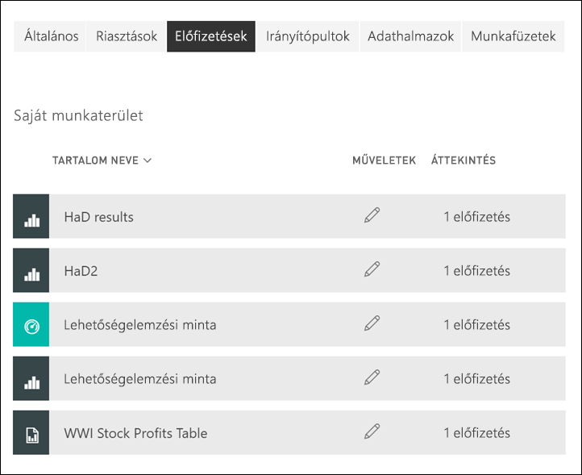

# Feliratkozás jelentésre vagy irányítópultra a Power BI szolgáltatásban 

[!INCLUDE[consumer-appliesto-ynny](../includes/consumer-appliesto-ynny.md)]

[!INCLUDE [power-bi-service-new-look-include](../includes/power-bi-service-new-look-include.md)]

Minden eddiginél egyszerűbb naprakésznek lenni a legfontosabb irányítópultokkal és jelentésekkel kapcsolatban. Feliratkozhat az Önnek leginkább fontos jelentésoldalakra és irányítópultokra, a Power BI pedig pillanatképeket küld e-mailben a postafiókjába. Megadhatja a Power BI-nak, hogy milyen gyakran szeretne ilyen e-mailt kapni: naponta, hetente vagy az adatok frissítésekor. Akár az e-mailek küldésének pontos időpontját is megadhatja a Power BI-nak, vagy futtathatja most.  Jelentésenként vagy irányítópultonként összesen akár 24 különböző feliratkozást is beállíthat.

Az e-mail és a pillanatkép a Power BI beállításaiban szereplő nyelvet fogja használni (lásd [A Power BI által támogatott nyelvek és országok/régiók](../supported-languages-countries-regions.md) témakört). Ha nincs megadva nyelv, a Power BI a böngésző területi beállításait használja. A nyelvi beállításokat megtekintheti vagy módosíthatja a fogaskerék ikon  > **Beállítások > Általános > Nyelv** lehetőség választásával. 

Amikor e-mail érkezik, abban szerepel egy „ugrás a jelentésre vagy irányítópultra” hivatkozás. Olyan mobileszközökön, melyeken telepítve van a Power BI alkalmazás, a hivatkozás választásakor az alkalmazás indul el (szemben az alapértelmezett művelettel, a jelentés vagy az irányítópult a Power BI webhelyén való megnyitásával).

## Követelmények
Ha előfizetést szeretne **létrehozni** saját maga számára, ahhoz egy bizonyos típusú [licencre](end-user-license.md) van szükség. Ha nem tud előfizetést létrehozni, forduljon a Power BI rendszergazdájához. **Mások feliratkoztatása** csak az irányítópult vagy a jelentés tulajdonosa számára érhető el. A lapszámozott jelentésekre való feliratkozás egy kissé eltér ettől. A részletekről a [Feliratkozás és mások feliratkoztatása egy lapszámozott jelentésre a Power BI szolgáltatásban](paginated-reports-subscriptions.md) című cikkből tájékozódhat. 

## Feliratkozás irányítópultra vagy jelentésoldalra
Függetlenül attól, hogy irányítópultra vagy jelentésre iratkozik fel, a folyamat hasonló. Ugyanazzal a gombbal iratkozhat fel a Power BI szolgáltatás irányítópultjaira és jelentéseire.
 
.

1. Nyissa meg az irányítópultot vagy a jelentést.
2. A felső menüsávon válassza a **Feliratkozás** lehetőséget vagy a boríték ikont .
   

   
    
    A bal oldali képernyő akkor jelenik meg, ha egy irányítópulton választja a **Feliratkozás** lehetőséget. A jobb oldali képernyő akkor jelenik meg, ha egy jelentésoldalon választja a **Feliratkozás** lehetőséget. 
    
    a. Ha egy jelentésben több oldalra is fel szeretne iratkozni, válassza a **Másik előfizetés hozzáadása** lehetőséget, és válasszon ki egy másik oldalt az oldal tetején a legördülő menüből.

    b. A feliratkozást a sárga csúszkával kapcsolhatja be és ki.  A csúszkával történő kikapcsolás nem törli a feliratkozást. A feliratkozás törléséhez válassza a kuka ikont.

    c. Ha szeretné, az e-mail-üzenet tárgyát és részleteit is megadhatja. 

    d. Válasszon **Gyakoriságot** feliratkozásához.  Napi, Heti, vagy Adatfrissítések utáni (Napi) gyakoriságot választhat.  Ha az e-mailt, amelyre feliratkozott, csak bizonyos napokon szeretné megkapni, válassza a **Heti** értéket, majd jelölje ki a napokat.  Ha például az e-mailt csak munkanapokon szeretné megkapni, válassza a **Heti** gyakoriságot, majd távolítsa el a jelölést a szombat és a vasárnap jelölőnégyzetéből. Ha a **Havi** lehetőséget választja, adja meg a hónap azon napját/napjait, amikor e-mailt szeretne kapni a feliratkozásokról.   

    e. Ha a napi, óránkénti, havi vagy heti gyakoriságot választja, akkor ütemezett időpontot is megadhat a feliratkozáshoz. Futtathatja egész órakor, vagy 15, 30, 45 perccel az után. Választhat délelőtti (AM) vagy délutáni (PM) időpontot. Az időzónát is megadhatja. Ha az Óránkénti beállítást választotta, válassza ki az Ütemezett időpontot, amikorra a feliratkozás indítását szeretné beállítani, és azt követően óránként érkezik majd.  

    f. A kezdő és záró dátum a dátummezőkbe bevitt értékekkel ütemezhető. A feliratkozás kezdő dátuma alapértelmezés szerint a létrehozás napja, a záró dátum pedig egy évvel későbbi. Ezt a feliratkozás lejárta előtt bármikor módosíthatja bármely jövőbeli dátumra (a 9999-es évig). Amikor egy feliratkozás záró dátuma elérkezik, a küldés leáll, amíg újra nem engedélyezi.  Az ütemezett záró dátum előtt értesítés(eke)t kap, amelyek rákérdeznek a kiterjesztésére.     

    : Az előfizetés megtekintéséhez és kipróbálásához válassza a **Futtatás most** lehetőséget.  Ezzel azonnal elküldi az e-mailt magának. 

3. Ha minden jónak látszik, az előfizetés mentéséhez válassza a **Mentés és bezárás** lehetőséget. Az beállított ütemezés szerint e-mailt fog kapni az irányítópult vagy jelentés pillanatképével. Minden olyan feliratkozás, amelynek gyakorisága **Adatfrissítések utáni**, csak az adott napi első ütemezett frissítés után küld e-mailt.
   
   
   
    A jelentésoldal frissítésével az adathalmaz nem frissül. Egy adathalmaz manuális frissítését csak annak tulajdonosa végezheti el. Az alapul szolgáló adathalmaz(ok) tulajdonosának nevét úgy keresheti meg, hogy a menüsávon található legördülő menüt választja, vagy megkeresi az eredeti feliratkozási e-mailt.
   
    

## Feliratkozások kezelése
Az Ön által létrehozott feliratkozásokat csak Ön kezelheti. Válassza ismét az **Előfizetés** lehetőséget, és válassza **Az összes előfizetés kezelése** elemet a bal alsó sarokban (lásd a fenti képernyőképet). Hogy mely feliratkozások jelennek meg, az attól függ, hogy éppen melyik munkaterület aktív. Ha az összes munkaterülethez tartozó feliratkozásokat szeretné megjeleníteni, győződjön meg arról, hogy a **Saját munkaterület** aktív. A munkaterületek működéséről a [Munkaterületek a Power BI-ban](end-user-workspaces.md) című cikkben olvashat bővebben. 

A feliratkozás megszűnik, ha lejár a Pro-licence, ha az irányítópultot vagy jelentést törli a tulajdonosa, vagy ha törlik a feliratkozás létrehozásához használt felhasználói fiókot.

## Megfontolandó szempontok és hibaelhárítás
* Ha el szeretné kerülni, hogy a feliratkozással kapcsolatos e-mailek a levélszemétmappába kerüljenek, adja hozzá a Power BI e-mail-aliast (no-reply-powerbi@microsoft.com) a névjegyeihez. Ha Microsoft Outlookot használ, kattintson a jobb gombbal az aliasra, és válassza a **Hozzáadás az Outlook-névjegykártyákhoz** parancsot. 
* Előfordulhat, hogy a felhasználóknak küldött előfizetési e-mailekben a több mint 25 kitűzött csempével vagy négy kitűzött élő jelentésoldallal rendelkező irányítópultok nem jelennek meg teljes egészében. Javasoljuk, hogy forduljon az irányítópult tervezőjéhez, és kérje meg, hogy az e-mail megfelelő megjelenítése érdekében csökkentse a kitűzött csempék számát 25 alá, a kitűzött élő jelentések számát pedig négy alá.  
* Az irányítópultok e-mail-feliratkozásai esetén, ha bármely csempe sorszintű biztonsággal (RLS) rendelkezik, ezek a csempék nem jelennek meg.  
* Ha az e-mailben lévő (a tartalomra mutató) hivatkozás már nem működik, akkor lehetséges, hogy a tartalmat eltávolították. Az e-mailben a képernyőkép alatt ellenőrizheti, hogy Ön iratkozott-e fel, vagy valaki más iratkoztatta fel Önt. Ha valaki más tette, kérje meg azt a munkatársát, hogy vagy ne küldjön több e-mailt, vagy újra iratkoztassa fel Önt.
* Az irányítópultokra való feliratkozások esetében bizonyos csempetípusok még nem támogatottak. Ilyenek többek között a streamelési csempék, a videócsempék és az egyéni webes tartalomcsempék. 
* A jelentésoldalakra való feliratkozás a jelentésoldal nevéhez kapcsolódik. Ha feliratkozik egy jelentés oldalára, és annak megváltozik a neve, újból létre kell hoznia az előfizetést.
* Ha nem tudja használni a feliratkozás funkciót, forduljon a rendszergazdához. Előfordulhat, hogy a szervezet letiltotta ezt a funkciót.  
* Az e-mailekre való feliratkozások az [egyéni vizualizációk](../developer/visuals/power-bi-custom-visuals.md) többségét nem támogatják.  Ez alól kivétel a [minősített](../developer/visuals/power-bi-custom-visuals-certified.md) egyéni Power BI-vizualizációk esete.    
* Az e-mail-értesítések a jelentés szűrőinek és szeletelőinek alapértelmezett állapotait alkalmazva lesznek elküldve. Az alapértelmezéseknek a feliratkozás után végzett módosításai nem jelennek meg az e-mailben. A többoldalas jelentések viszont támogatják ezt a képességet, és lehetővé teszik a specifikus paraméterértékek feliratkozásonkénti beállítását.  
* Az e-mailekre való feliratkozások jelenleg nem támogatják az R-alapú Power BI-vizualizációkat.  
* Bizonyos típusú csempék különösen az irányítópult-előfizetések esetén jelenleg még nem támogatottak.  Ilyenek többek között a streamelési csempék, a videócsempék és az egyéni webes tartalomcsempék.     
* A különösen nagy méretű képeket tartalmazó irányítópultokra vagy jelentésekre való feliratkozás meghiúsulhat az e-mailek méretkorlátozásai miatt.    
* A Power BI automatikusan felfüggeszti a több mint két hónapja nem látogatott irányítópultokhoz vagy jelentésekhez társított adathalmazok frissítését.  Ha azonban feliratkozik egy irányítópultra vagy jelentésre, az nem fog szünetelni akkor sem, ha nem látogatják.
* Ritkán előfordulhat, hogy az e-mail-feliratkozások kézbesítése 15 percnél többet is igénybe vesz.  Ilyen esetben a megfelelő kézbesítési idő érdekében ajánlott más időpontokban futtatni az adatfrissítést és az e-mail-feliratkozását.  Ha a probléma továbbra is fennáll, forduljon a Power BI-ügyfélszolgálathoz.

## Következő lépések

[Tartalom keresése és rendezése](end-user-search-sort.md)
