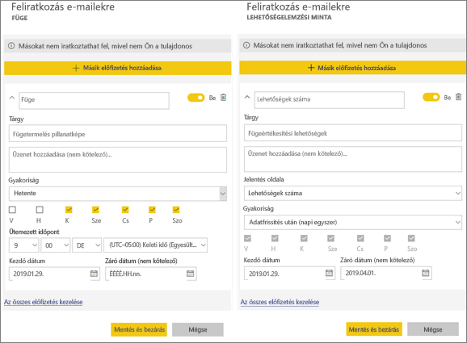
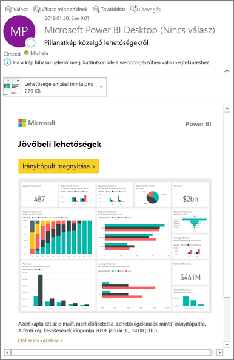
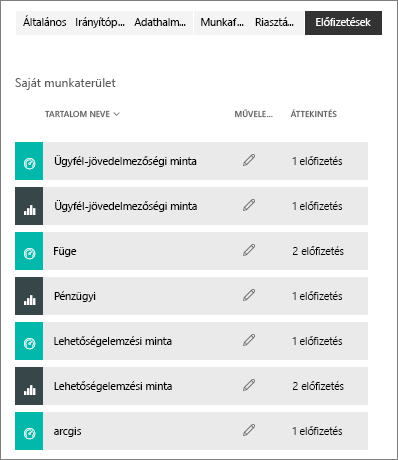

# Feliratkozás egy jelentésre vagy irányítópultra a Power BI szolgáltatásban 
Minden eddiginél egyszerűbb naprakésznek lenni a legfontosabb irányítópultokkal és jelentésekkel kapcsolatban. Feliratkozhat az Önnek leginkább fontos jelentésoldalakra és irányítópultokra, a Power BI pedig pillanatképeket küld e-mailben a postafiókjába. Megadhatja a Power BI-nak, hogy milyen gyakran szeretne ilyen e-mailt kapni: naponta, hetente vagy az adatok frissítésekor. Akár az e-mailek küldésének pontos időpontját is megadhatja a Power BI-nak.  

Az e-mail és a pillanatkép a Power BI beállításaiban szereplő nyelvet fogja használni (lásd [A Power BI által támogatott nyelvek és országok/régiók](../supported-languages-countries-regions.md) témakört). Ha nincs megadva nyelv, a Power BI a böngésző területi beállításait használja. A nyelvi beállításokat megtekintheti vagy módosíthatja a fogaskerék ikon  > **Beállítások > Általános > Nyelv** lehetőség választásával. 

Amikor e-mail érkezik, abban szerepel egy „ugrás a jelentésre vagy irányítópultra” hivatkozás. Olyan mobileszközökön, melyeken telepítve van a Power BI alkalmazás, a hivatkozás választásakor az alkalmazás indul el (szemben az alapértelmezett művelettel, a jelentés vagy az irányítópult a Power BI webhelyén való megnyitásával).

## Követelmények
Az előfizetések **létrehozása** a Power BI Pro egyik funkciója.   

## Feliratkozás irányítópultra vagy jelentésoldalra
Függetlenül attól, hogy irányítópultra vagy jelentésre iratkozik fel, a folyamat hasonló. Ugyanazzal a gombbal iratkozhat fel a Power BI szolgáltatás irányítópultjaira és jelentéseire.
 
.

1. Nyissa meg az irányítópultot vagy a jelentést.
2. A felső menüsávon válassza a **Feliratkozás** lehetőséget vagy a boríték ikont .
   
   

   
    
    A bal oldali képernyő akkor jelenik meg, ha egy irányítópulton választja a **Feliratkozás** lehetőséget. A jobb oldali képernyő akkor jelenik meg, ha egy jelentésoldalon választja a **Feliratkozás** lehetőséget. Ha egy jelentésben több oldalra is fel szeretne iratkozni, válassza a **Másik előfizetés hozzáadása** lehetőséget, és válasszon ki egy másik oldalt. 

3. A feliratkozást a sárga csúszkával kapcsolhatja be és ki.  A csúszkával történő kikapcsolás nem törli a feliratkozást. A feliratkozás törléséhez válassza a kuka ikont.

4. Ha szeretné, az e-mail-üzenet részleteit is megadhatja. 

5. Válasszon **Gyakoriságot** feliratkozásához.  Napi, Heti, vagy Adatfrissítések utáni (Napi) gyakoriságot választhat.  Ha az e-mailt, amelyre feliratkozott, csak bizonyos napokon szeretné megkapni, válassza a **Heti** értéket, majd jelölje ki a napokat.  Ha például az e-mailt csak munkanapokon szeretné megkapni, válassza a **Heti** gyakoriságot, majd távolítsa el a jelölést a szombat és a vasárnap jelölőnégyzetéből.   

6. Az e-mail küldésének időpontját úgy ütemezheti, hogy Napi vagy Heti gyakoriságot választ, majd **Ütemezett** **Időpontot** ad meg a feliratkozáshoz.   

7. A kezdő és záró dátum a dátummezőkbe bevitt értékekkel ütemezhető. A feliratkozás kezdő dátuma alapértelmezés szerint a létrehozás napja, a záró dátum pedig egy évvel későbbi. Amikor egy feliratkozás záró dátuma elérkezik, a küldés leáll, amíg újra nem engedélyezi.  Az ütemezett záró dátum előtt értesítés(eke)t kap, amelyek rákérdeznek a kiterjesztésére.     

5. A feliratkozás mentéséhez válassza a **Mentés és bezárás** lehetőséget. Az beállított ütemezés szerint e-mailt fog kapni az irányítópult vagy jelentés pillanatképével. Minden olyan feliratkozás, amelynek gyakorisága **Adatfrissítések utáni**, csak az adott napi első ütemezett frissítés után küld e-mailt.
   
   
   
    A jelentésoldal frissítésével az adathalmaz nem frissül. Egy adathalmaz manuális frissítését csak annak tulajdonosa végezheti el. Az alapul szolgáló adathalmaz(ok) nevének megkereséséhez kattintson a felső menüsávon található **Kapcsolódó megtekintése** elemre.
   
    

## Feliratkozások kezelése
Csak Ön kezelheti az előfizetéseit. Válassza ismét az **Előfizetés** lehetőséget, és válassza **Az összes előfizetés kezelése** elemet a bal alsó sarokban (lásd a fenti képernyőképet). 

A feliratkozás megszűnik, ha lejár a Pro-licence, ha az irányítópultot vagy jelentést törli a tulajdonosa, vagy ha törlik a feliratkozás létrehozásához használt felhasználói fiókot.

## Megfontolandó szempontok és hibaelhárítás
* Az irányítópultok e-mail-feliratkozásai esetén, ha bármely csempe sorszintű biztonsággal (RLS) rendelkezik, ezek a csempék nem jelennek meg.  A jelentésekhez kapcsolódó e-mail-feliratkozások esetén, ha az adatkészlet sorszintű biztonságot használ, nem hozható létre feliratkozás.
* A jelentésoldalakra való feliratkozás a jelentésoldal nevéhez kapcsolódik. Ha feliratkozik egy jelentés oldalára, és annak megváltozik a neve, újból létre kell hoznia az előfizetést
* Ha nem tudja használni a feliratkozás funkciót, forduljon a rendszergazdához. Lehetséges, hogy vállalata hitelesítési vagy más okból letiltotta ezt a funkciót.  
* Az e-mailekre való feliratkozások az [egyéni vizualizációk](../power-bi-custom-visuals.md) többségét nem támogatják.  Ez alól kivétel a [minősített](../power-bi-custom-visuals-certified.md) egyéni vizualizációk esete.  
* Az e-mailekre való feliratkozások jelenleg nem támogatják az R-alapú egyéni vizualizációkat.  
* Bizonyos típusú csempék különösen az irányítópult-előfizetések esetén jelenleg még nem támogatottak.  Ilyenek többek között a streamelési csempék, a videócsempék és az egyéni webes tartalomcsempék.     
* A különösen nagy méretű képeket tartalmazó irányítópultokra vagy jelentésekre való feliratkozás meghiúsulhat az e-mailek méretkorlátozásai miatt.    
* A Power BI automatikusan felfüggeszti a több mint két hónapja nem látogatott irányítópultokhoz vagy jelentésekhez társított adathalmazok frissítését.  Ha azonban feliratkozik egy irányítópultra vagy jelentésre, az nem lesz felfüggesztve akkor sem, ha nem látogatják.    

## Következő lépések
* További kérdései vannak? [Kérdezze a Power BI-közösséget](http://community.powerbi.com/)    
* [Olvassa el a blogbejegyzést](https://powerbi.microsoft.com/blog/introducing-dashboard-email-subscriptions-a-360-degree-view-of-your-business-in-your-inbox-every-day/)

