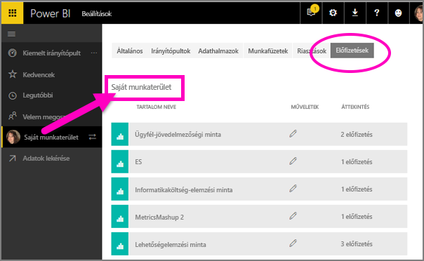

# Feliratkozás egy jelentésre vagy irányítópultra a Power BI szolgáltatásban 
Minden eddiginél egyszerűbb naprakésznek lenni a legfontosabb irányítópultokkal és jelentésekkel kapcsolatban. Feliratkozhat az Önnek leginkább fontos jelentésoldalakra és irányítópultokra, a Power BI pedig pillanatképeket küld e-mailben a postafiókjába. Megadhatja a Power BI-nak, hogy milyen gyakran szeretne ilyen e-mailt kapni: naponta egyszer, vagy csak hetente. 

Az e-mail és a pillanatkép a Power BI beállításaiban szereplő nyelvet fogja használni (lásd [A Power BI által támogatott nyelvek és országok/régiók](../supported-languages-countries-regions.md) témakört). Ha nincs megadva nyelv, a Power BI a böngésző területi beállításait használja. A nyelvi beállításokat megtekintheti vagy módosíthatja a fogaskerék ikon  > **Beállítások > Általános > Nyelv** lehetőség választásával. 

Amikor e-mail érkezik, abban szerepelni fog egy „ugrás a jelentésre vagy irányítópultra” hivatkozás. Olyan mobileszközökön, melyeken telepítve van a Power BI alkalmazás, a hivatkozás választásakor az alkalmazás indul el (szemben az alapértelmezett művelettel, a jelentés vagy az irányítópult a Power BI webhelyén való megnyitásával).

## Követelmények
- Az előfizetések **létrehozása** a Power BI Pro egyik funkciója. 
- Mivel az előfizetési e-mailek csak egy mögöttes adathalmaz frissítésekor lesznek elküldve, az előfizetések nem működnek a nem frissített adathalmazokon.

## Feliratkozás irányítópultra vagy jelentésoldalra
Függetlenül attól, hogy irányítópultra vagy jelentésre iratkozik fel, a folyamat nagyon hasonló. Ugyanazzal a gombbal iratkozhat fel a Power BI szolgáltatás irányítópultjaira és jelentéseire.
 
.

1. Nyissa meg az irányítópultot vagy a jelentést.
2. A felső menüsávon válassza a **Feliratkozás** lehetőséget vagy a boríték ikont .
   
   

3. A feliratkozást a sárga csúszkával kapcsolhatja be és ki.  A csúszkával történő kikapcsolás nem törli a feliratkozást. A feliratkozás törléséhez válassza a kuka ikont.

4. Ha szeretné, az e-mail-üzenet részleteit is megadhatja. 

    Az alábbi képernyőfelvételeken figyelje meg, hogy amikor feliratkozik egy jelentésre, akkor valójában egy jelentés*oldalra* iratkozik fel.  Ha egy jelentésben több oldalra is fel szeretne iratkozni, válassza a **Másik előfizetés hozzáadása** lehetőséget, és válasszon ki egy másik oldalt. 
      
   

5. A feliratkozás mentéséhez válassza a **Mentés és bezárás** lehetőséget. A mögöttes adathalmazok módosulásakor minden alkalommal kap egy e-mailt vagy pillanatfelvételt az irányítópultról vagy a jelentés oldaláról. Ha az irányítópult vagy a jelentés egy nap alatt egynél többször frissül, akkor az e-mailt csak az első frissítés után kapja meg.  
   
   
   
A jelentésoldal frissítésével az adathalmaz nem frissül. Egy adathalmaz manuális frissítését csak annak tulajdonosa végezheti el. Az alapul szolgáló adathalmaz(ok) nevének megkereséséhez kattintson a felső menüsávon található **Kapcsolódó megtekintése** elemre.
   

## Az e-mailek ütemezésének meghatározása
Az alábbi táblázat azt ismerteti, hogy milyen gyakran kap e-mail-értesítést. Ez függ az irányítópult vagy jelentés alapjául szolgáló adathalmaz kapcsolódási módjától (DirectQuery, élő kapcsolat, Power BI-ba importált fájl, vagy Excel-fájl a OneDrive-on vagy a SharePoint Online-ban), valamint az elérhető és kijelölt feliratkozási lehetőségektől (naponta, hetente vagy nincs).

|  | **DirectQuery** | **Élő kapcsolat** | **Ütemezett frissítés (importálás)** | **Excel-fájl a OneDrive-on vagy a SharePoint Online-ban** |
| --- | --- | --- | --- | --- |
| **Milyen gyakran frissül a jelentés vagy az irányítópult?** |15 percenként |A Power BI 15 percenként ellenőrzi, hogy módosult-e az adathalmaz, és ha igen, akkor frissíti a jelentést. |A felhasználó a nincs, a naponta és a hetente lehetőség közül választhat. Naponta legfeljebb 8 alkalom lehet. A heti ütemezést a felhasználó hozza létre és állítja be legalább hetente egyszeri, vagy akár napi frissítésre. |Óránként egyszer |
| **Milyen mértékben befolyásolhatja a felhasználó az feliratkozásokhoz tartozó e-mailek ütemezését?** |Napi vagy heti ütemezés választható |Nem módosítható: a felhasználó a jelentés frissülésekor e-mailt kap, de naponta legfeljebb egyszer. |Ha a frissítés napi ütemezésű, akkor napi vagy heti ütemezés választható.  Ha a frissítés heti ütemezésű, akkor csak heti ütemezés válaszható. |Nem módosítható: a felhasználó az adathalmaz frissítésekor kap e-mailt, de naponta legfeljebb egyszer. |

## Feliratkozások kezelése
Csak Ön kezelheti az előfizetéseit. Válassza ismét az **Előfizetés** lehetőséget, és válassza **Az összes előfizetés kezelése** elemet (lásd a fenti 4. lépés képernyőképeit). 

A feliratkozás megszűnik, ha lejár a Pro-licence, ha az irányítópultot vagy jelentést törli a tulajdonosa, vagy ha törlik a feliratkozás létrehozásához használt felhasználói fiókot.

## Megfontolandó szempontok és hibaelhárítás
* Az irányítópultok e-mail-feliratkozásai esetén, ha bármely csempe sorszintű biztonsággal (RLS) rendelkezik, ezek a csempék nem jelennek meg.  A jelentésekhez kapcsolódó e-mail-feliratkozások esetén, ha az adatkészlet sorszintű biztonságot használ, nem hozható létre feliratkozás.
* A jelentésoldalakra való feliratkozás a jelentésoldal nevéhez kapcsolódik. Ha feliratkozik egy jelentés oldalára, és annak megváltozik a neve, újból létre kell hoznia az előfizetést
* Előfordulhat, hogy a szervezet konfigurált néhány beállítást az Azure Active Directory-ban, amelyek korlátozhatják a Power BI-ban az e-mail-előfizetések használatát.  Ebbe a teljesség igénye nélkül beletartoznak az erőforrások elérésekor a többtényezős hitelesítés és az IP-címtartomány korlátozásai.
* Az élő kapcsolattal rendelkező adathalmazokra vonatkozó e-mailekre való feliratkozáskor csak az adatok változása esetén kap értesítést. Tehát ha frissítés történik, de az adatok nem változnak, akkor a Power BI nem küld e-mailt.
* Az e-mailekre való feliratkozások az [egyéni vizualizációk](../power-bi-custom-visuals.md) többségét nem támogatják.  Az egyetlen kivétel a [minősített](../power-bi-custom-visuals-certified.md) egyéni vizualizációk esete.  
* Az e-mailekre való feliratkozások jelenleg nem támogatják az R-alapú egyéni vizualizációkat.  
* Ha bármely irányítópult-csempe sorszintű biztonsággal (RLS) rendelkezik, ezek a csempék nem jelennek meg.
* Az e-mail-értesítések a jelentés szűrőinek és szeletelőinek alapértelmezett állapotait alkalmazva lesznek elküldve. Az alapértelmezéseknek a feliratkozás után végzett módosításai nem jelennek meg az e-mailben.    
* Bizonyos típusú csempék különösen az irányítópult-előfizetések esetén jelenleg még nem támogatottak.  Ilyenek többek között a streamelési csempék, a videócsempék és az egyéni webes tartalomcsempék.     
* A különösen nagy méretű képeket tartalmazó irányítópultokra vagy jelentésekre való feliratkozás meghiúsulhat az e-mailek méretkorlátozásai miatt.    
* A Power BI automatikusan felfüggeszti a több mint 2 hónapja nem látogatott irányítópultokhoz vagy jelentésekhez társított adathalmazok frissítését.  Ha azonban feliratkozik egy irányítópultra vagy jelentésre, az nem lesz felfüggesztve akkor sem, ha nem látogatják.    

## Következő lépések
* További kérdései vannak? [Kérdezze a Power BI-közösséget](http://community.powerbi.com/)    
* [Olvassa el a blogbejegyzést](https://powerbi.microsoft.com/blog/introducing-dashboard-email-subscriptions-a-360-degree-view-of-your-business-in-your-inbox-every-day/)

