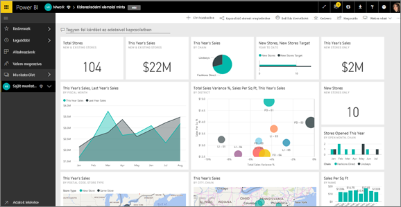
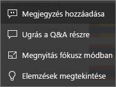
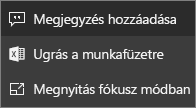
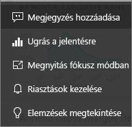

# Irányítópult-csempék a Power BI-ban
A csempék az adatokról készített, és egy *tervező* által az irányítópultra kitűzött pillanatfelvételek. Csempe létrehozható jelentésből, adatkészletből, irányítópultból, a Q&A kérdésmezőjéből, az Excelből, az SQL Server Reporting Servicesből (SSRS) és sok minden másból.  Ezen a képernyőfelvételen több irányítópultra tűzött csempe látható.

A jelentésekből kitűzött csempék mellett a *tervezők* közvetlenül az irányítópulthoz is hozzáadhatnak önálló csempéket a **Csempe hozzáadása** paranccsal. Önmagukban álló csempék lehetnek többek között szövegmezők, képek, videók, streaming-adatok, webtartalmak.

További segítségre van szüksége annak megértéséhez, hogy milyen elemekből épül fel a Power BI?  Tekintse meg a [Power BI alapfogalmait](end-user-basic-concepts.md) ismertető cikket.

## Az irányítópulton levő csempék használata

1. A három pont megjelenítéséhez álljon a csempe fölé.
   
    
2. A három pontra kattintva nyissa meg a csempeműveletek menüjét. A lehetőségek a vizualizáció típusától és a csempe létrehozásához használt módszertől függően változnak. Íme néhány példa arra, hogy mit láthat.

    - a Q&A használatával létrehozott csempe
   
        

    - munkafüzetből létrehozott csempe
   
        

    - jelentésből létrehozott csempe
   
        
   
    Ebből a menüből:
   
   * [Megnyithatja a csempe létrehozásához használt jelentést](end-user-reports.md)   
   
   * [Megnyithatja a csempe létrehozásához használt Q&A-kérdést ](end-user-reports.md)   
   

   * [Megnyithatja a csempe létrehozásához használt munkafüzetet ](end-user-reports.md)   
    * [Megtekintheti a csempét fókusz módban ](end-user-focus.md)   
     * [Elemzéseket futtathat ](end-user-insights.md) 
    * [Megjegyzéseket adhat hozzá, és beszélgetést indíthat](end-user-comment.md) 

3. A művelet menü bezárásához kattintson egy üres területre a vásznon.

### Csempék kiválasztása
Az, hogy mi történik, amikor rákattint valamelyik csempére, attól függ, hogyan lett létrehozva a csempe, és hogy tartozik-e hozzá [egyedi hivatkozás](../service-dashboard-edit-tile.md). Ha tartozik hozzá egyedi hivatkozás, a csempe kiválasztásakor a rendszer a hivatkozott oldalra lépteti. Más esetben a csempére kattintáskor a létrehozásához használt helyszíni jelentéshez, Excel-munkafüzethez, SSRS-jelentéshez vagy Q&A-kérdéshez irányítja a rendszer.

> [!NOTE]
> Ez alól csak a közvetlenül az irányítópulton, a **Csempe hozzáadása** funkcióval létrehozott videócsempék képeznek kivételt. Amikor egy így létrehozott videócsempére kattint, a rendszer közvetlenül az irányítópulton játssza le a videót.   
> 
> 

## Megfontolandó szempontok és hibaelhárítás
* Ha a vizualizáció létrehozásához használt jelentés nem lett mentve, akkor nem történik semmi a csempére kattintáskor.
* Ha a csempe Excel Online-munkafüzetből lett létrehozva, és a felhasználónak ahhoz nincs legalább Olvasási jogosultsága, a csempe kiválasztásakor nem fog megnyílni az Excel Online-munkafüzet.
* Olyan csempe esetén, melyet a **Csempe létrehozása** funkcióval közvetlenül az irányítópulton hozott létre a felhasználó, és beállított hozzá egy egyedi hiperhivatkozást, a csempe címére, alcímére vagy magára a csempére kattintáskor a rendszer megnyitja az adott URL-címet.  Más esetben a közvetlenül az irányítópulton kép, webkód vagy szövegdoboz részére létrehozott csempe kiválasztása nem indít el semmilyen műveletet.
* Ha az SSRS-en nem jogosult egy jelentés használatára, az SSRS alapján létrehozott csempék kiválasztásakor a rendszer megjelenít egy oldalt, amely jelezni fog, hogy a felhasználó nem rendelkezik megfelelő hozzáféréssel (rsAccessDenied).
* Ha nincs hozzáférése ahhoz a hálózathoz, ahol az SSRS található, SSRS-ből létrehozott csempe kiválasztásakor a rendszer megjelenít majd egy oldalt, amely azt jelzi, hogy a kiszolgáló nem található (HTTP 404). Ahhoz, hogy meg tudja tekinteni a jelentést, az Ön eszközének hálózati hozzáféréssel kell rendelkeznie a jelentés-kiszolgálóhoz.
* A csempe létrehozásához használt vizualizációs elem változásakor a csempe nem változik.  Ha például a *tervező* kitűz egy sávdiagramot egy jelentésből, majd a sávdiagramot oszlopdiagramra cseréli, az irányítópulton megjelenő csempén továbbra is egy sávdiagram lesz látható. Az adatok frissülni fognak, de a diagram típusa nem.

## Következő lépések
[Adatfrissítés](../refresh-data.md)

[Power BI – Alapfogalmak](end-user-basic-concepts.md)
