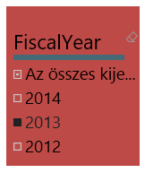
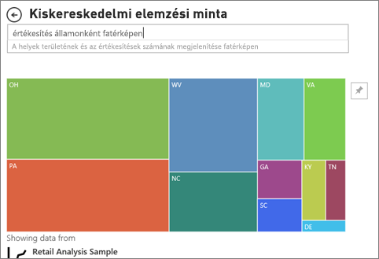

# Vizualizációtípusok a Power BI-ban
Vizualizációk találhatók jelentésekben, irányítópultokon, alkalmazásokban és a Q&A-ban is. A vizualizációk egyes típusai a Power BI részei, de vannak *egyéni vizualizációk* is. Az egyéni vizualizációk a Power BI-on kívül készülnek úgy, hogy a *jelentések tervezői* felvehessék azokat a Power BI-jelentésekbe, -irányítópultokba és -alkalmazásokba. 

Ez a cikk a Power BI részét képező vizualizációtípusokat tekinti át.  Többnyire ezekkel a vizualizációtípusokkal fog találkozni. 

> [!NOTE]
> Ha az egyéni vizualizációkkal szeretne megismerkedni, ilyeneket a [Microsoft AppSource](https://appsource.microsoft.com/marketplace/apps?product=power-bi-visuals) **Power BI-vizualizációk** szakaszában kereshet. Minden vizualizációhoz tartozik leírás, a létrehozója adatai, és képernyőkép vagy videó. 

## A Power BI-ban elérhető vizualizációk listája
Ez alábbi vizualizációk mind megtalálhatók Power BI-alkalmazásokban, -irányítópultokon, -jelentésekben, és [megadhatók a Q&A-ban](#gna).

### Területdiagramok: Alapszintű (rétegzett) és halmozott

Az alapszintű területdiagram a vonaldiagramon alapul, és a tengely és a vonal közötti terület fel van töltve. A területdiagramokon jól látható a változások nagysága időre vetítve, és a használatukkal hatékonyan mutatható meg a teljes érték egy trend mentén. Például a nyereség időbeli alakulását jelző adatok felrajzolhatóak területdiagramként, és így megmutatható a teljes nyereség.

### Sáv- és oszlopdiagramok

 

A sávdiagram egy adott érték különböző kategóriákban való megjelenítésének alapvető eszköze.

### Kártyák: Egyszámos

Az egyszámos kártyák egyetlen tényt, egyetlen adatpontot mutatnak meg. Néha csupán egyetlen szám a legfontosabb, amit nyomon szeretne követni a Power BI-irányítópulton vagy -jelentésben, például az összesített értékesítés, az egy évre vetített piaci részesedés, vagy a lehetőségek száma összesen.  

### Kártyák: Többsoros

Többsoros kártyákkal több, soronként egy adatpont is megjeleníthető.

### Kombinált diagramok

A kombinált diagram egy oszlopdiagram és egy vonaldiagram egyesítésével jön létre. A két diagram kombinációjával gyorsabban hasonlíthat össze adatokat. A kombinált diagramoknak több Y tengelye is lehet, erre érdemes odafigyelni. 

A kombinált diagramok használata nagyszerű választás, ha:
- van egy vonaldiagramja és egy oszlopdiagramja, amelyek ugyanazt az X tengelyt használják;
- több, különböző értéktartományú mértéket szeretne összehasonlítani
- egyetlen vizualizáción szeretné bemutatni két mérték korrelációját
- szeretné ellenőrizni, hogy egy mérték elér-e egy adott célt, amelyet egy másik mérték határoz meg;
- kevesebb helyet szeretne felhasználni a vásznon

### Perecdiagramok

A perecdiagramok a kördiagramokhoz hasonlítanak.  A részek egészhez való viszonyát ábrázolják. Az egyetlen különbség az, hogy a középső rész üres, így helyet biztosít egy címkének vagy ikonnak.

### Tölcsérdiagramok

A tölcsérdiagramokkal megjeleníthetők a szakaszos folyamatok úgy, hogy az egyes elemek sorban haladnak egyik szakaszról a másikra.  Erre példa az értékesítési folyamata, amely a vásárlói érdeklődéssel indul, és a megvalósuló eladásokkal ér véget.

Ilyen például egy értékesítési tölcsér, amelyen keresztül az ügyfelek nyomon követhetőek az egyes fázisokban: Érdeklődő > Minősített érdeklődő > Lehetséges ügyfél > Szerződés > Zárás. A tölcsér alakja egyetlen pillantásra megmutatja a lekövetett folyamat állapotát.
A tölcsér minden egyes szakasza a teljes mennyiséghez viszonyított százalékos arányt mutatja. Így az esetek többségében a tölcsérdiagram alakja valóban egy tölcsérhez hasonlít – az első szakasz a legszélesebb, majd a rákövetkező szakaszok egyre szűkülnek. Persze a körte alakú tölcsérek is hasznosak – segítenek azonosítani a problémákat. Általában véve azonban az első, a „bemeneti” szakasz a legszélesebb.

A tölcsérdiagram remek választás a következő esetekben:
- ha az adatok egymás követik, és legalább 4 fázisban következnek egymásból,
- ha az első fázis „elemeinek” száma várhatóan meghaladja az utolsó fáziséit,
- a fázisonkénti lehetőségek (bevétel/értékesítés/szerződések/stb.) számításához,
- a konverziós és megtartási arányok számításához,
- a lineáris folyamatok szűk keresztmetszeteinek felfedéséhez,
- a bevásárlókosár-munkafolyamatok nyomon követéséhez,
- az átkattintásos reklám-/marketingkampányok haladásának és sikerességének nyomon követéséhez.

### Mérőóra-diagramok

A mérőműszer-diagram köríves alakú és egyetlen értéket jelenít meg, amely egy cél/KPI elérésében tett előrehaladást méri. A célt vagy a célértéket a vonal (tű) jelzi. A cél elérésében tett előrehaladást az árnyékolás mutatja. Az előrehaladást ábrázoló érték pedig félkövér betűvel van feltüntetve az ív belsejében. Minden lehetséges érték egyenlően oszlik el az íven, minimálistól (bal szélső érték) a maximálisig (jobb szélső érték).

A fenti példában autókereskedők vagyunk, akik értékesítési csapatuk havi átlagos értékesítését követik nyomon. A célunk 140, amit a fekete tű jelöl. A lehetséges minimális átlagos értékesítés 0, és a maximális értéket 200-ban határoztuk meg. A kék árnyékolás azt mutatja, hogy a jelenlegi átlag körülbelül 120 értékesítés ebben a hónapban. Szerencsére még van egy hetünk, hogy elérjük a célunkat.

A mérőműszer-diagram remek választás:
- a cél elérésében megtett előrehaladás mutatására
- százalékos mérőszám, például fő teljesítménymutató jelölésére
- egyetlen mérték állapotának mutatására
- gyorsan áttekinthető és megérthető információk megjelenítésére

<!-- ### Key influencers chart

A key influencer chart displays the major contributors to a selected result or value.  -->

### KPI-k

A fő teljesítménymutató (KPI) olyan vizuális jel, amely egy mérhető cél terén elért előrehaladás mértékét jelzi. 

A KPI remek választás:
- az előrehaladás mérésére (miben járok előrébb vagy miben maradtam le?)
- egy céltól való távolság mérésére (mennyivel járok előrébb vagy milyen messze vagyok tőle?)

### Vonaldiagramok

A vonaldiagramok egy teljes értéksorozat alakulását szemléltetik átfogó módon, legtöbbször az idő függvényében.

### Térképek: Alapszintű térképek

Az egyszerű térképek kategorikus és mennyiségi információk térbeli helyekhez való társítására szolgálnak.

### Térképek: ArcGIS-térképek

Az ArcGIS-térképek és a Power BI együttes használata új lehetőségeket kínál a térképkezelésben, amelyek messze túlmutatnak a pontok térképeken való elhelyezésén. Az alaptérképekhez, helytípusokhoz, témákhoz, szimbólumstílusokhoz és referenciarétegekhez elérhető beállítások segítségével lenyűgöző és informatív térképi megjelenítések hozhatók létre. A térképen megjelenített mérvadó adatrétegek (például népszámlálási adatok) és a térbeli elemzés egyesítésével jobban megértheti a képi megjelenítésben szereplő adatokat.

### Térképek: Kitöltött térképek (Choropleth)

A tematikus térképek árnyalással, színezéssel vagy mintázattal jelenítik meg egy értéknek egy földrajzi területen vagy régión belüli viszonylagos eltéréseit. A viszonylagos eltérések gyorsan megjeleníthetők a világostól (ritkább/kevesebb) a sötétig (gyakrabb/több) terjedő árnyalással.

### Térképek: Alakzatleképezések

Az alakzatleképezés vizualizációk a régiók különböző színek használatával történő összehasonlítására szolgálnak. A térkép vizualizációval szemben az alakzatleképezés vizualizáció nem képes az adatpontok pontos földrajzi helyének megjelenítésére a térképen. Ehelyett alkalmazásának fő célja a régiók relatív összehasonlításának megjelenítése egy térképen eltérő színezéssel.

### Mátrix

A mátrixvizualizáció a táblavizualizáció egyik típusa (lásd a „Tábla” szakaszt alább), amely támogatja a lépcsőzetes elrendezést. A jelentéstervezők gyakran foglalnak mátrixokat a jelentésekbe és irányítópultokba, hogy a felhasználók a mátrix egy vagy több elemének (sorok, oszlopok, cellák) kijelölésével keresztkiemelést végezhessenek egy jelentésoldal más vizualizációival.  

### Tortadiagramok

A tortadiagramok a részek egészhez való viszonyát ábrázolják. 

### Szalagdiagram

A szalagdiagramokon jól látható, hogy melyik adatkategória a legmagasabb rangú (értékű). A szalagdiagramokkal hatékonyan ábrázolható a rangok időbeli változása: minden időszakban a legmagasabb rangú (értékű) kategória látható felül.

### Pont-, buborék- és pöttydiagramok

A pontdiagramok mindig két értéktengellyel rendelkeznek. A vízszintes tengely mentén numerikus adatok egy készletét ábrázolják, a függőleges tengely mentén pedig numerikus adatok egy másik készletét. A diagram pontokat jelenít meg az x és y numerikus értékek metszéspontjában, így egyetlen adatponttá kombinálja ezeket az értékeket. Ezek az adatpontok egyenletesen vagy egyenetlenül oszthatók el a vízszintes tengely mentén az adatoktól függően.

A buborékdiagramokban az adatpontok helyett buborékok szerepelnek, és a buborékok mérete az adatok egy további dimenzióját jelöli.

A pöttydiagram hasonlít a buborék- és pontdiagramokra, ám ez numerikus vagy kategorizált adatokat is ábrázolhat az X tengely mentén.

### Nagy pontsűrűség

Meghatározás szerint a nagy sűrűségű adatok mintavételezése a vizualizációk meglehetősen gyors és interakciókra reagáló módon való létrehozása érdekében történik. A nagy sűrűségű mintavételezés algoritmusa kiiktatja az átfedő pontokat, és biztosítja, hogy a vizualizáción az adathalmaz összes pontja megjelenjen. Nem csupán az adatok egy reprezentatív mintáját jeleníti meg.  

Így a legjobb összetételben biztosítja a válaszképességet, valamint a teljes adathalmaz minden kulcsfontosságú pontjának megfelelő ábrázolását és megőrzését.

### Szeletelők

A szeletelő önálló diagram, amely az oldal más vizualizációinak szűrésére használható. A szeletelőknek számos változata (kategória, tartomány, adat stb.) létezik, és formázhatók úgy, hogy a lehetséges értékek közül csak egy, vagy több is kiválasztható legyen. 

A szeletelők a következő helyzetekben a leghasznosabbak:
- gyakran használt vagy fontos szűrők megjelenítése a jelentésvásznon a könnyebb elérhetőség érdekében
- az aktuális szűrt állapot egyszerűbb megjelenítése legördülő lista használata nélkül
- az adattáblák szükségtelen és rejtett oszlopai alapján történő szűrés
- jobban szűrt jelentések létrehozása azáltal, hogy a szeletelőket a lényeges vizualizációk mellett helyezi el

### Önálló képek

Önálló kép a jelentéshez vagy irányítópulthoz adott grafikai elem. 

### Táblák

A táblák olyan táblázatok, amelyek sorok és oszlopok logikai sorozataként jelenítik meg a kapcsolódó adatokat. Tartalmazhatnak fejléceket és összesítősorokat is. A táblák jól használhatók mennyiségi összehasonlításokhoz, ahol több, egy kategóriába tartozó érték vizsgálható egyszerre. Ez a tábla például a Kategória öt különböző mértékét jeleníti meg.

A tábla remek választás a következő esetekben:
- részletes adatok és pontos értékek megtekintéséhez és összehasonlításához (vizualizációk helyett)
- az adatok táblázatos formában való megjelenítéséhez
- numerikus adatok kategóriák szerinti megjelenítéséhez

### Fatérképek

A fatérképek színes téglalapokból állnak, amelyek a méretükkel jelölik az értékeket.  Lehetnek hierarchikusak, a fő téglalapokban található kisebb téglalapokkal. Az egyes téglalapokon belüli területet a mért érték alapján osztja ki a rendszer. A téglalapok pedig méret szerint vannak rendezve, a bal felső saroktól (legnagyobb), a jobb alsó sarokig (legkisebb).

A fatérképek használata nagyszerű választás, ha:
- nagy mennyiségű hierarchikus adatot szeretne megjeleníteni
- egy oszlopdiagram nem tudja hatékonyan kezelni a nagy mennyiségű értéket
- az egyes részek és az egész közötti arányokat szeretné megjeleníteni
- a hierarchia egyes kategóriaszintjein belül megfigyelhető eloszlási mintákat szeretné megjeleníteni
- méret és színek alapján szeretne attribútumokat megjeleníteni
- mintákat, kiugró adatokat, legfontosabb résztvevőket és kivételeket szeretne azonosítani

### Vízesésdiagramok

A vízesésdiagramok göngyölített összeget jelenítenek meg az értékek összeadásakor vagy kivonásakor. Ez hasznos annak megértéséhez, hogy egy kezdeti értékre (pl. nettó bevétel) hogyan hat egy sornyi pozitív és negatív változás.

Az oszlopok színkódolással rendelkeznek, így gyorsan megállapíthatja az értékek növekedését és csökkenését. A kezdeti és végértékeket tartalmazó oszlopok gyakran a vízszintes tengelyről indulnak, míg a középső értékek lebegő oszlopokat képeznek. Emiatt a megjelenés miatt a vízesésdiagramokat híddiagramoknak is nevezik.

A vízesésdiagram remek választás a következőkhöz:
- ha a mérték az idősorok vagy különböző kategóriák között is változik;
- ha naplózni kívánja az összértéket befolyásoló főbb változásokat;
- ha a vállalat éves profitját szeretné ábrázolni különféle bevételi források megjelenítésével, majd az összbevétel (vagy veszteség) kiemelésével;
- ha a vállalat alkalmazottainak számát szeretné ábrázolni az év eleji és év végi értékekkel;
- ha szeretné megjeleníteni, hogy mennyi pénzt keresett és költött az egyes hónapok során, valamint a fiók folyóegyenlegét.

## A Q&A által használt vizualizáció megadása
Ha természetes nyelvű lekérdezéseket ír a Power BI Q&A használatával, megadhatja a vizualizáció típusát a lekérdezésben.  Például:

„***értékesítés államonként fatérképen***”

## Következő lépések
[Vizualizációk Power BI-jelentésekben](end-user-visualizations.md)    
[A megfelelő vizualizáció – referenciaanyag az sqlbi.com-on](http://www.sqlbi.com/wp-content/uploads/videotrainings/dashboarddesign/visuals-reference-may2017-A3.pdf)