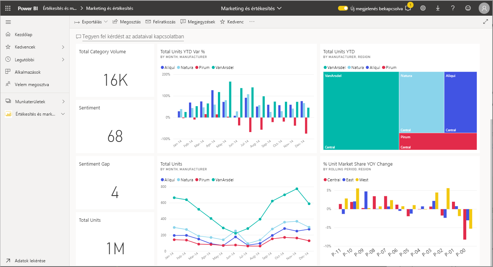
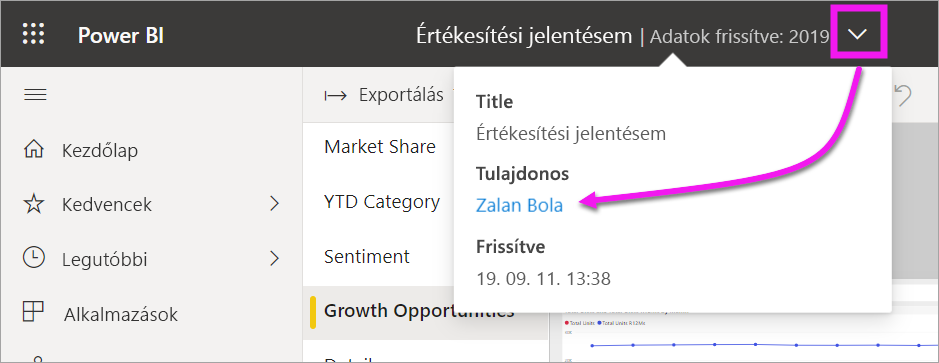

# Interakció vizualizációkkal jelentésekben, irányítópultokon és alkalmazásokban

[!INCLUDE[consumer-appliesto-ynny](../includes/consumer-appliesto-ynny.md)]

Legegyszerűbb formájukban a ***vizualizációk*** olyan diagramok, amelyeket a Power BI *tervezői* hoznak létre a jelentésekben és az adathalmazokban szereplő adatok alapján. 

Vizualizációk szerepelhetnek irányítópultokon és jelentésekben, és a Power BI Q&A használatával menet közben is létrehozhatók. Amikor egy tervező létrehoz egy vizualizációt egy jelentésben, a vizualizációt az irányítópulton *rögzítheti* is. Az [irányítópulton szereplő vizualizációt *csempének* nevezzük](end-user-tiles.md). Ez az irányítópult nyolc csempével rendelkezik. 

> [!TIP]
> Javasoljuk, hogy először olvassa el a [Power BI alapfogalmait bemutató, *felhasználók számára*](end-user-basic-concepts.md) készült áttekintő témakört, mielőtt továbblépne erre a részletesebb leírásra.

## Mire használhatom a vizualizációkat?

A vizualizációkat a jelentések és irányítópultok *tervezői* hozzák létre és osztják meg a *felhasználókkal*. Felhasználóként számos különféle módon használhatja a vizualizációkat, hogy elemzéseket nyerhessen ki, és adatokon alapuló üzleti döntéseket hozhasson. A legtöbb lehetőség megtalálható az alábbi táblázatban, a hivatkozásokon keresztül pedig lépésenkénti útmutatók is elérhetők.

Sok ilyen lehetőségnél az adminisztrátor vagy a *tervező* letilthatja azt, hogy Ön megtekinthesse vagy használhassa ezeket a funkciókat. A funkciók némelyike csak bizonyos vizualizációk esetében működik.  Ha kérdése van, lépjen kapcsolatba a jelentés vagy az irányítópult adminisztrátorával vagy tulajdonosával. A tulajdonos megtalálásához válassza ki az irányítópult vagy a jelentés legördülő menüjét. 

> [!IMPORTANT]
> Ám először ejtsünk szót a Q&A-ről. A Q&A a Power BI természetes nyelvi keresőeszköze. Ha természetes nyelv használatával ad meg egy kérdést, a Q&A egy vizualizáció formájában ad rá választ. A Q&A használatával a felhasználók saját vizualizációkat hozhatnak létre menet közben. Azonban a Q&A használatával létrehozott vizualizációk nem menthetők. Ha olyan konkrét információra kíváncsi az adatokkal kapcsolatban, amelyet a tervező kihagyott a jelentésből, vagy nem szerepel az irányítópulton, akkor jó megoldás a Q&A. A Q&A-vel kapcsolatban bővebben a [Q&A felhasználók számára készült](end-user-q-and-a.md) cikkében olvashat.

|Feladat  |Egy irányítópulton  |Egy jelentésben  | A Q&A-ben
|---------|---------|---------|--------|
|[Megjegyzés hozzáadása a vizualizációhoz saját maga számára, vagy beszélgetés kezdeményezése a munkatársakkal a vizualizációról](end-user-comment.md).     |  igen       |   igen      |  nem  |
|[Azon jelentés megnyitása és felderítése, ahol a vizualizáció létrejött](end-user-tiles.md).     |    igen     |   na      |  nem |
|[A vizualizációra hatással lévő szűrők és szeletelők listájának megtekintése](end-user-report-filter.md).     |    ha fókusz módban nyitja meg     |   igen      |  nem |
|[Vizualizáció megnyitása és felderítése a Q&A-ben (ha a *tervező* a vizualizációt a Q&A használatával hozta létre)](end-user-q-and-a.md).     |   igen      |   na      |  na  |
|[Vizualizáció létrehozása a Q&A-ben (feltáráshoz; menteni nem lehet)](end-user-q-and-a.md).     |   igen      |   ha a tervező Q&A-t adott hozzá a jelentéshez      |  igen  |
|[Érdekes tények vagy trendek Power BI általi keresésének kérése](end-user-insights.md) a vizualizáció adataiban.  Ezeket az automatikusan létrehozott vizualizációkat *betekintéseknek* nevezzük.     |    igen, a csempék esetében    |  nem       | nem   |
|[Egyszerre csak egy vizualizáció megjelenítése a *fókusz* mód használatával](end-user-focus.md).     | igen, a csempék esetében        |   igen, a vizualizációk esetében      | na  |
|[A vizualizáció legutolsó frissítési időpontjának megkeresése](end-user-fresh.md).     |  igen       |    igen     | na  |
|[Egyszerre csak egy vizualizáció megjelenítése keretek és navigációs panelek nélkül a *teljes képernyős* mód használatával](end-user-focus.md).     |   igen      |  igen       | alapértelmezés szerint  |
|[Nyomtatás](end-user-print.md).     |  igen       |   igen      | nem  |
|[Részletes elemzés a vizualizáción vizualizációs szűrők hozzáadásával és módosításával.](end-user-report-filter.md)     |    nem     |   igen      | nem  |
|Az egérmutató a vizualizáció fölé helyezése esetén további részletek és eszköztippek jelennek meg.     |    igen     |   igen      | igen  |
|[Az oldalon található többi vizualizáció keresztszűrése és keresztkiemelése.](end-user-interactions.md)    |   nem      |   igen      | na  |
|[A vizualizáció létrehozásához használt adat megjelenítése](end-user-show-data.md).     |  nem       |   igen      | nem  |
| [A vizualizáció rendezési módjának módosítása](end-user-change-sort.md). | nem  | igen  | a rendezés a kérdés átfogalmazásával módosítható  |
| Kiemelés vizualizációhoz adása. | nem  | igen  |  nem |
| [Exportálás Excelbe.](end-user-export.md) | igen | igen | nem|
| [Riasztás létrehozása](end-user-alerts.md), mellyel értesítést kap, ha az érték meghaladja a beállított küszöbértéket.  | igen  | nem  | nem |
| [Az oldal többi vizualizációjának keresztszűrése és keresztkijelölése](end-user-report-filter.md).  | nem      | igen  | na |
| [Hierarchiával rendelkező vizualizáció részletezése](end-user-drill.md).  | nem  | igen   | nem |

## Következő lépések
Vissza az [alapfogalmakat ismertető szakaszhoz](end-user-basic-concepts.md)    
[Vizualizáció kiválasztása jelentés megnyitásához](end-user-report-open.md)    
[A Power BI-ban elérhető vizualizációtípusok](end-user-visual-type.md)