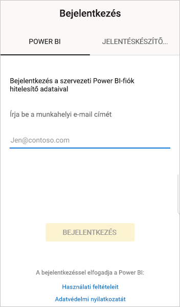
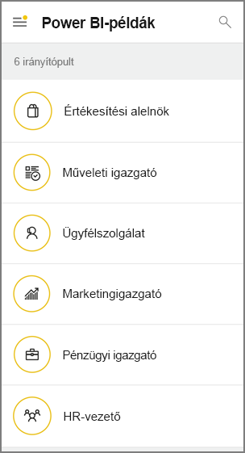

# Első lépések az androidos eszközökhöz készült Power BI mobilalkalmazással
A Microsoft Power BI Android rendszerű eszközökön futó alkalmazása mobil felületet nyújt a Power BI, a Power BI jelentéskészítő kiszolgáló és a Reporting Services használatához. Bárhonnan megtekintheti és kezelheti helyszíni vagy felhőbeli céges irányítópultjait élő, érintésre reagáló mobil hozzáféréssel. Fedezze fel az adatokat az irányítópultokon, és ossza meg eredményeit munkatársaival e-mailben vagy SMS-ben. 

A Power BI Desktopban létrehozhat Power BI-jelentéseket és közzéteheti őket:

* [Közzéteheti őket a Power BI szolgáltatásban](../../fundamentals/power-bi-overview.md), és irányítópultokat hozhat létre.
* [Közzéteheti őket a helyszínen a Power BI jelentéskészítő kiszolgálón](../../report-server/quickstart-create-powerbi-report.md).

Ezután az androidos Power BI alkalmazásban a helyszínen és a felhőben is dolgozhat az irányítópultokkal és a jelentésekkel.

Ismerje meg [a Power BI mobilalkalmazások újdonságait](../../mobile-whats-new-in-the-mobile-apps.md).

## Előfeltételek

### Az alkalmazás beszerzése

[Töltse le az Androidhoz készült Power BI alkalmazást](https://go.microsoft.com/fwlink/?LinkID=544867) a Google Play Áruházból.
  
A Power BI számos különböző androidos eszközön fut, ha azon Android 5.0 vagy annál későbbi operációs rendszer található. Az eszközt a **Beállítások** > **Az eszközről** > **Android verzió** részben ellenőrizheti. 

**Indítás az alkalmazás megnyitásakor**    
Amikor megnyitja az alkalmazást, átugorhatja a bejelentkezési oldalakat, így regisztráció vagy bejelentkezés nélkül is gyorsan áttekintheti, milyen feladatok elvégzésére alkalmas az androidos eszközön futó Power BI alkalmazás. Koppintson a **Kihagyás** gombra a példák megtekintésének mellőzése és az alkalmazás használatával kapcsolatos gyakorlati tapasztalatok szerzése érdekében. Az irányítópultok kezdőlapjáról bármikor [visszatérhet a példákhoz](mobile-android-app-get-started.md#try-the-power-bi-and-reporting-services-samples).

Ismerje meg [a Power BI mobilalkalmazások újdonságait](../../mobile-whats-new-in-the-mobile-apps.md).

## Regisztráció a Power BI szolgáltatásra a weben
Ha meg nem regisztrált, lépjen a [Power BI szolgáltatásra](https://powerbi.com/), és hozzon létre egy saját fiókot, ahol irányítópultokat és jelentéseket hozhat létre és tárolhat, valamint összevonhatja az adatait. Ezután bárhol is tartózkodjon, beléphet a Power BI-ba az androidos eszközről, és megtekintheti saját irányítópultjait.

1. A Power BI szolgáltatásban koppintson a [Regisztráció](https://go.microsoft.com/fwlink/?LinkID=513879) gombra a Power BI-fiók létrehozásához.
2. Hozzáláthat a [saját irányítópultok és jelentések létrehozásához](../../service-get-started.md).

## Első lépések az eszközön futó Power BI alkalmazással
1. Nyissa meg az Androidhoz készült Power BI alkalmazást az androidos eszköz nyitóképernyőjéről.
   
   
2. Ha a Power BI-ba szeretne bejelentkezni, koppintson a **Power BI** lapra, és adja meg a bejelentkezési adatait.

    Ha a Power BI a bejelentkezés sikertelenségéről tájékoztató üzenetet jelenít meg, a probléma megoldásának részleteiért tekintse meg a következő szakaszt: [„A hitelesítés nem sikerült, mert a vállalati SSL-tanúsítványt nem megbízhatóként kezeli ez az eszköz”](mobile-android-app-error-corporate-ssl-account-is-untrusted.md).

   Ha be szeretne jelentkezni a Reporting Services mobiljelentéseibe és a KPI-kbe, koppintson a **Jelentéskészítő kiszolgáló** lapra, és adja meg a bejelentkezési adatait.
   
   

## A Power BI- és Reporting Services-minták kipróbálása
A Power BI- és Reporting Services-mintákat regisztráció nélkül is megtekintheti és kezelheti.

A minták eléréséhez koppintson a navigációs sáv **További lehetőségek** (...) elemére, és válassza a **Minták** lehetőséget.

Néhány Power BI-mintát számos jelentéskészítő kiszolgálói minta követ.
   
   

   
   > [!NOTE]
   > A mintákban nem minden funkció érhető el. Nem tekintheti meg például az irányítópult hátterében álló mintajelentéseket, a mintákat nem oszthatja meg másokkal, és nem jelölheti meg azokat kedvenceiként. 
   > 
   >

## A tartalmak megkeresése a Power BI mobilalkalmazásokban

Koppintson a fejlécben található nagyítóra a Power BI-tartalom keresésének megkezdéséhez.

## A kedvenc irányítópultok és jelentések megtekintése
Koppintson a navigációs sáv **Kedvencek** () elemére a Kedvencek lap megjelenítéséhez. 

További információ a [kedvencekről a Power BI-mobilalkalmazásokban](mobile-apps-favorites.md).

## Nagyvállalati támogatás a Power BI mobilalkalmazásaihoz
A cégek a Microsoft Intune használatával kezelhetik az eszközöket és alkalmazásokat, beleértve az Android és iOS rendszerhez készült Power BI-mobilalkalmazásokat.

A Microsoft Intune segítségével a cégek szabályozhatják az olyan elemeket, mint a hozzáférési PIN-kódok bekérése, az alkalmazások adatkezelési módja, vagy a nem használt alkalmazások alkalmazásadatainak titkosítása.

> [!NOTE]
> Ha a Power BI mobilalkalmazást egy androidos eszközön használja, és a cége konfigurálta a Microsoft Intune MAM felügyeletet, a háttérben futó adatfrissítés ki van kapcsolva. A Power BI a weben futó Power BI szolgáltatásból frissíti az adatokat, amikor legközelebb belép az alkalmazásba.
> 
> 

További információ a [Power BI-mobilalkalmazások Microsoft Intune-nal történő konfigurálásáról](../../service-admin-mobile-intune.md). 

## Következő lépések
Az androidos Power BI alkalmazásban az alábbi műveleteket is elvégezheti a Power BI-irányítópultokkal és -jelentésekkel, valamint a Microsoft Power BI jelentéskészítő kiszolgálón vagy a Reporting Services webes portálján található jelentésekkel és KPI-kkel.

### A Power BI irányítópultok és jelentések
* [Az alkalmazásai](../../service-create-distribute-apps.md) megtekintése.
* Megtekintheti [irányítópultjait](../../mobile-apps-view-dashboard.md).
* Felfedezheti [irányítópultjai csempéit](../../mobile-tiles-in-the-mobile-apps.md).
* Megnyithat [Power BI-jelentéseket](../../mobile-reports-in-the-mobile-apps.md).
* Megtekintheti [alkalmazásait](../../service-create-distribute-apps.md).
* [Jegyzettel láthat el és megoszthat csempéket](mobile-annotate-and-share-a-tile-from-the-mobile-apps.md).
* [Irányítópultok](../../mobile-share-dashboard-from-the-mobile-apps.md) megosztása.
* [Power BI QR-kód beolvasása](../../mobile-apps-qr-code.md) androidos telefonnal egy kapcsolódó irányítópult vagy jelentés megnyitásához. 
* A [Power BI-fiókba érkezett, változásokkal kapcsolatos értesítések megtekintése](../../mobile-apps-notification-center.md) (például a munkatársak által megosztott irányítópultokkal kapcsolatban).

### Jelentések és KPI-k a Power BI jelentéskészítő kiszolgáló és a Reporting Services webes portálján
* [Jelentések és KPI-k megtekintése a webes portálon](mobile-app-ssrs-kpis-mobile-on-premises-reports.md) az androidos eszközökhöz készült Power BI mobilalkalmazásban.
* [KPI-k létrehozása a webes portálon](https://docs.microsoft.com/sql/reporting-services/working-with-kpis-in-reporting-services).
* [Jelentések létrehozása a Power BI Desktopban és közzétételük a Power BI jelentéskészítő kiszolgáló](../../report-server/quickstart-create-powerbi-report.md) webes portálján

### Lásd még:
* [Töltse le az Android-alkalmazást](https://go.microsoft.com/fwlink/?LinkID=544867) az Androidos alkalmazás-áruházból.
* [Mi az a Power BI?](../../fundamentals/power-bi-overview.md)
* Kérdése van? [Kérdezze meg a Power BI közösségét](https://community.powerbi.com/)

