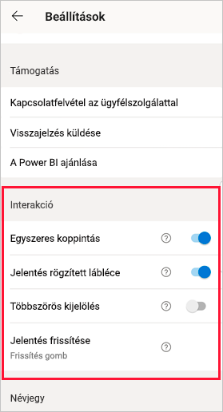
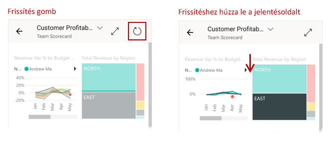
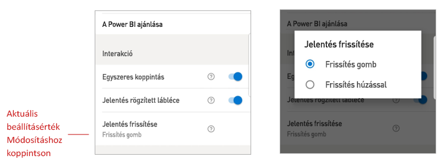

# Jelentések kezelési beállításainak konfigurálása

## Áttekintés

A Power BI mobilalkalmazásnak van néhány konfigurálható „kezelési” beállítása, amelyekkel szabályozhatja az adatok kezelésének módját, és meghatározhatja a Power BI mobilalkalmazás néhány elemének viselkedését. Az alábbi tábla bemutatja a jelenleg elérhető interakciós beállításokat, és azt, hogy melyik eszközön találhatóak meg.

|| Android rendszerű telefon | iPhone | Android rendszerű táblagép  | iPad |
|-|:-:|:-:|:-:|:-:|
| [Jelentésvizualizációk egykoppintásos vagy kétkoppintásos kezelése](#single-tap) |✔|✔|||
| [Egy vagy több adatpont kiválasztása jelentésvizualizációkon](#multi-select) |✔|✔|✔|✔|
| [Jelentés rögzített és dinamikus lábléce](#docked-report-footer) |✔|✔|||
| [Jelentések frissítése gombbal vagy frissítés húzással](#report-refresh) |✔||||
|

A kezelési beállítások eléréséhez nyissa meg az [oldalsó panelt](./mobile-apps-home-page.md#header) a profilképre koppintva, válassza a **Beállítások** lehetőséget, és keresse meg a **Kezelés** szakaszt.

Az interakció beállításait a következő szakaszok ismertetik.

## Kezelési beállítások

### Egyszeres koppintás
Amikor letölti a Power BI mobilalkalmazást, az egykoppintásos kezelésre van beállítva. Ez azt jelenti, hogy amikor valamilyen művelet, például egy szeletelőelem kijelölése, keresztkiemelés, hivatkozás vagy gomb választása céljából egy vizualizációra koppint, a koppintás kijelöli a vizualizációt, és a kívánt műveletet is végrehajtja.

Ha kívánja, kikapcsolhatja az egykoppintásos kezelést. Ezzel kétkoppintásos kezelésre tér át. Kétkoppintásos kezelés esetén a vizualizációra koppintva kijelöli azt, majd egy újabb koppintással hajthatja végre a kívánt műveletet.

### Többszörös kijelölés

A többszörös kiválasztási lehetőséggel több adatpont választható ki egy jelentésoldalon. Ha a többszörös kiválasztás be van kapcsolva, a megérintett egyes adatpontok hozzá lesznek adva a többi kiválasztott adatponthoz, és az összesített eredmények automatikusan ki lesznek emelve az oldal összes vizualizációján. Ha a többszörös kiválasztás ki van kapcsolva, amikor megérint egy adatpontot a kiválasztásához, az új kiválasztás felülírja a korábbit.

Az adatpont kiválasztásának megszüntetéséhez érintse meg az adatpontot még egyszer.

>[!NOTE]
>A többszörös kiválasztás egyéni vizualizációkban nem támogatott.
>
>A többszörös kiválasztási mód támogatott lesz a Power BI jelentéskészítő kiszolgálón a jelentéskészítő kiszolgáló következő kiadásában.

### Jelentés rögzített lábléce

A jelentés láblécének rögzítése beállítás azt adja meg, hogy a jelentés lábléce dokkolva maradjon (tehát rögzített és mindig látható legyen) a jelentés alján, vagy el legyen rejtve, és a jelentésen végzett műveletek, például görgetés függvényében jelenjen meg.

Androidos telefonokon a jelentéslábléc rögzítése alapértelmezés szerint **be** van kapcsolva, tehát a jelentés lábléce rögzítve van, és mindig látható a jelentés alján. Kapcsolja **ki** ezt a beállítást, ha azt szeretné, hogy a jelentés lábléce dinamikusan eltűnjön és megjelenjen a jelentésen végzett műveletektől függően.

### Jelentés frissítése

A jelentés frissítése beállítás azt adja meg, hogy hogyan kezdeményezhetők a jelentés frissítései. A jelentés frissítéséhez frissítési gombot helyezhet el a jelentés fejlécében, vagy használhatja a frissítés húzással műveletet a jelentés lapon (húzza enyhén felülről lefelé). Az alábbi ábra ezt a két lehetőséget mutatja be. 

Androidos telefonokon alapértelmezetten a Frissítés gomb van felvéve.

A jelentés frissítési beállításainak módosításához nyissa meg a kezelési beállítások Jelentés frissítése elemét. Itt az aktuális beállítás látható. Az értékre koppintva nyithatja meg az előugró panelt, amelyen új értéket választhat.

## Távoli konfigurálás

A kezelési módokat a rendszergazdák távolról is konfigurálhatják egy MDM-eszköz és egy alkalmazáskonfigurációs fájl használatával. Ezen a módon egységesíthető a jelentések kezelőfelülete a teljes vállalat, vagy a meghatározott felhasználói csoportok számára. Erről a [Kezelési mód konfigurálása mobileszköz-felügyelettel](./mobile-app-configuration.md) szakaszban olvashat.

## Következő lépések
* [A jelentésekkel végezhető műveletek](./mobile-reports-in-the-mobile-apps.md#interact-with-reports)
* [Kezelési mód konfigurálása mobileszköz-felügyelettel](./mobile-app-configuration.md)
