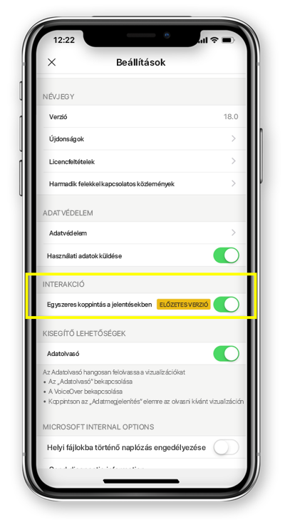

# Jelentések egy- és duplakoppintásos kezelésének beállítása
A következőkre vonatkozik:

|  |  | 
|:--- |:--- |
| iPhone-ok |Android rendszerű telefonok |

A Power BI jelentés egy interaktív nézet az adatokról különböző, az adatokból származó eredményeket és elemzéseket bemutató vizualizációkkal.

Beállíthatja, hogyan kívánja kezelni az adatait. Eldöntheti, hogy az egykoppintásos vagy a duplakoppintásos kezelési módot választja.

* Duplakoppintásos beállítás esetén először a vizualizációra koppintva kiválasztja a műveletet, amelyet a második koppintás fog végrehajtani, ilyen például a szeletelő elemeinek kiválasztása, a keresztkijelölés vagy a hivatkozásra, gombra történő kattintás és így tovább.

* Az egykoppintásos beállításnál egyetlen koppintás hajtja végre mindkét lépést, vagyis a vizualizáció kijelölését és a művelet végrehajtását is.

A Power BI alkalmazás 18.0-s iOS-es és 112540-es androidos verziójától kezdve az összes új telepítés alapértelmezés szerint egykoppintásos működésű lesz.
Azok a felhasználók, akiknek a Power BI már telepítve van a telefonján, az új verziók telepítésekor dönthetnek úgy, hogy az egykoppintásos működésre váltanak.

## A kezelés működésének módosítása

A kezelés működésének módosításához az alkalmazás beállításai között be- vagy kikapcsolhatja az egykoppintásos kezelést.

Ez a cikk a fekvő tájolású és a telefonos jelentésekre is vonatkozik.

## Következő lépések
* [Telefonra optimalizált Power BI-jelentések megtekintése és használata](mobile-apps-view-phone-report.md)
* Kérdése van? [Kérdezze meg a Power BI közösségét](http://community.powerbi.com/)

