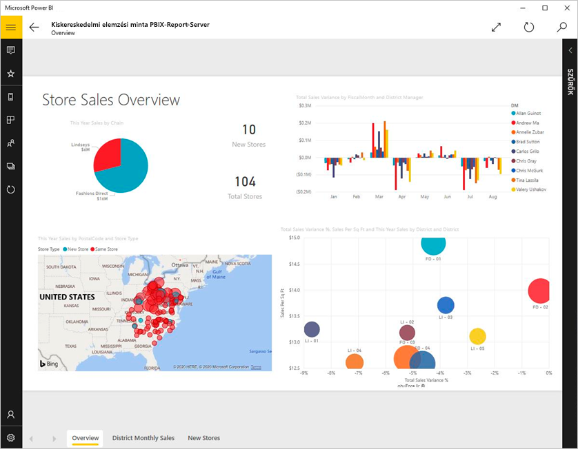
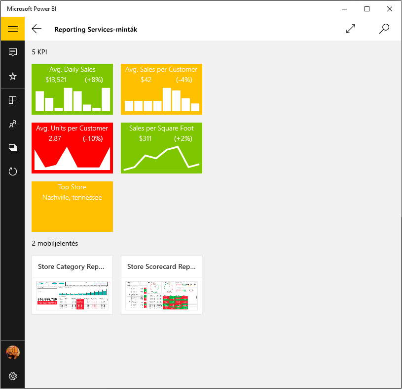
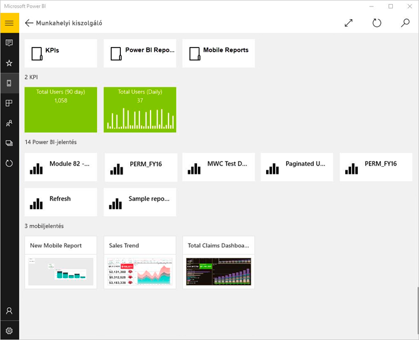
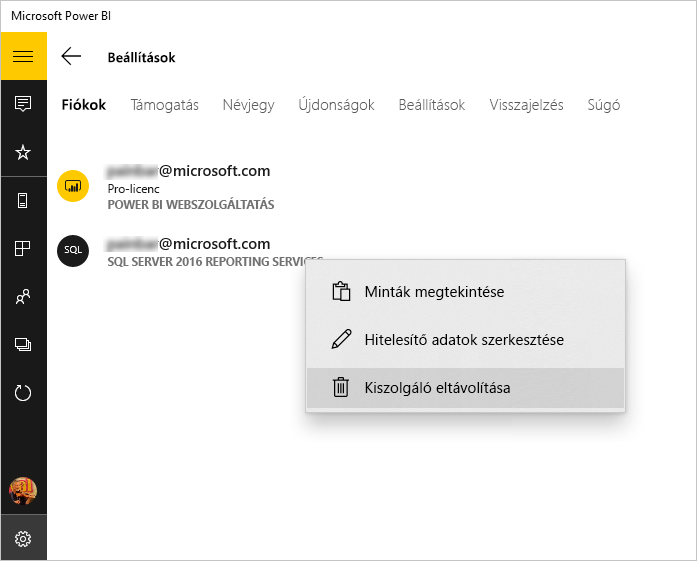

# Helyszíni jelentések és KPI-k megtekintése a Power BI Windows-alkalmazásban
A Windows 10-hez készült Power BI alkalmazás valós idejű, érintéssel vezérelhető mobil hozzáférést biztosít az SQL Server 2016 Reporting Services szolgáltatásban található fontos helyszíni vállalati információkhoz. 

## Először a lényeg
Az SQL Server 2016 Enterprise kiadás mobiljelentés-közzétevőjének segítségével [saját Reporting Services-mobiljelentéseket hozhat létre](https://msdn.microsoft.com/library/mt652547.aspx), és közzéteheti őket a [Reporting Services webes portálon](https://msdn.microsoft.com/library/mt637133.aspx). KPI-ket hozhat létre közvetlenül a webes portálon. Mappákba rendezheti őket, és megjelölheti kedvenceit, hogy könnyedén megtalálhassa azokat. 

Ezt követően megtekintheti a mappákba rendezett vagy kedvencekként összegyűjtött KPI-ket, mobiljelentéseket és Power BI-jelentéseket a Windows 10-hez készült Power BI alkalmazásban. 

> [!NOTE]
> Az eszközön a Windows 10 operációs rendszernek kell futnia. Az alkalmazás optimális működéséhez 1 GB RAM és 8 GB belső tárhely szükséges.

>[!NOTE]
>A Power BI-mobilalkalmazás támogatása a **Windows 10 Mobile rendszerű telefonokhoz** 2021. március 16-án megszűnik. [További információ](https://go.microsoft.com/fwlink/?linkid=2121400)

## Minták böngészése SQL Server 2016 Reporting Services-kiszolgáló nélkül
Akkor is böngészhet a Reporting Services-mobiljelentések funkciói között, ha nem fér hozzá a Reporting Services webes portálhoz.

1. Nyissa meg a Power BI alkalmazást Windows 10-es eszközén.
2. Koppintson a globális navigációs gombra.  a bal felső sarokban.
3. Koppintson a **Beállítások** ikonra , kattintson a jobb gombbal vagy koppintson és tartsa nyomva a **Csatlakozás kiszolgálóhoz** elemet, majd koppintson a **Minták megtekintése** elemre.
   
   
4. A Kiskereskedelmi jelentések vagy Értékesítési jelentések mappát megnyitva megismerheti az azokhoz tartozó KPI-ket és mobiljelentéseket.
   
   

Böngéssze át a mintákat a KPI-kkel és mobiljelentésekkel való interakcióhoz.

## Kapcsolódás a Reporting Services jelentéskészítő kiszolgálóhoz
1. Az új navigációs panel alján koppintson a **Beállítások** lehetőségre 
2. Koppintson a **Csatlakozás kiszolgálóhoz** lehetőségre.
3. Töltse ki a kiszolgáló címét, és adja meg felhasználónevét és jelszavát. A kiszolgáló címét az alábbi formátumban kell megadni:
   
     `https://<servername>/reports` VAGY `https://<servername>/reports`
   
   > [!NOTE]
   > Írja be a **http** vagy **https** előtagot a kapcsolati sztring elejére.
   > 
   > 
   
    Koppintson a **Speciális beállítás** lehetőségre, ha meg szeretne adni egy nevet a kiszolgáló számára.
4. Kattintson a pipa jelre a kapcsolódáshoz. 
   
   A kiszolgáló megjelenik a navigációs ablaktáblán.
   
   
   
   >[!TIP]
   >A globális navigációs gombra  koppintva bármikor válthat a Reporting Services-mobiljelentések és az irányítópultok között a Power BI szolgáltatásban. 
   > 

## Reporting Services-KPI-k és -mobiljelentések megtekintése a Power BI alkalmazásban
A Reporting Services-KPI-k, a mobiljelentések és a Power BI-jelentések (előzetes verzió) ugyanabban a mappában találhatók, mint a Reporting Services webes portálon.

* Koppintson egy KPI-re annak Fókusz módban való megtekintéséhez.
  
    
* Koppintson egy mobiljelentésre annak a Power BI alkalmazásban történő megnyitásához és kezeléséhez.
  
    

## A kedvenc KPI-jeinek és jelentéseinek megtekintése
Megjelölhet KPI-ket, mobilejelentéseket és Power BI-jelentéseket kedvencként a Reporting Services webes portálon, majd megtekintheti azokat egyetlen, kényelmesen elérhető mappában Windows 10-es eszközén, a kedvenc Power BI-irányítópultjaival és -jelentéseivel együtt.

* Koppintson a **Kedvencek** elemre.
  
   
  
   A webes portálon található összes kedvencét megtalálhatja ezen az oldalon.
  
További információ a [kedvencekről a Power BI-mobilalkalmazásokban](mobile-apps-favorites.md).

## Jelentéskészítő kiszolgálóval való kapcsolat eltávolítása
Egyszerre csak egy jelentéskészítő kiszolgálóhoz kapcsolódhat a Power BI mobilalkalmazásából. Ha másik kiszolgálóhoz szeretne kapcsolódni, meg kell szakítania a kapcsolatot a jelenlegivel.

1. Az új navigációs panel alján koppintson a **Beállítások** lehetőségre .
2. Koppintson azon kiszolgáló nevére, amelyhez nem szeretne a továbbiakban kapcsolódni, és tartsa nyomva.
3. Koppintson a **Kiszolgáló eltávolítása** lehetőségre.
   
    

## Reporting Services-mobiljelentések és -KPI-k létrehozása
A Power BI-mobilalkalmazásban nincs lehetősége Reporting Services-KPI-k és -mobiljelentések létrehozására. Ezt az SQL Server mobiljelentés-közzétevője és egy SQL Server 2016 Reporting Services webes portál segítségével teheti meg.

* [Saját Reporting Services-mobiljelentések létrehozása](https://msdn.microsoft.com/library/mt652547.aspx) és a Reporting Services webes portálon történő közzététele.
* [KPI-k létrehozása egy Reporting Services webes portálon](https://msdn.microsoft.com/library/mt683632.aspx)

## Következő lépések
* [A Windows 10-hez készült Power BI mobilalkalmazás használatának első lépései](mobile-windows-10-phone-app-get-started.md)  
* [Mi az a Power BI?](../../fundamentals/power-bi-overview.md)  
* Kérdése van? [Kérdezze meg a Power BI közösségét](https://community.powerbi.com/)

