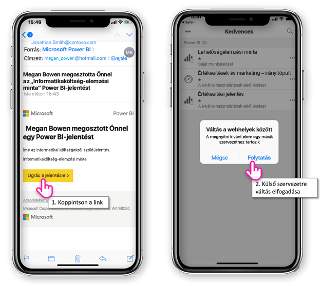

# Külső vállalat által Önnel megosztott Power BI-tartalom megtekintése

A Power BI integrálható az Azure Active Directory vállalatközi felhasználásra szánt verziójával (Azure AD B2B), ami lehetővé teszi, hogy a Power BI-tartalmakat a vállalatán kívüli vendégfelhasználókkal is biztonságosan meg tudja osztani. A külső vendégfelhasználók a Power BI-mobilalkalmazás használatával férhetnek hozzá a velük megosztott Power BI-tartalomhoz. 

A következőkre vonatkozik:

|  |  |  |  |
|:--- |:--- |:--- |:--- |
| iPhone-ok |iPadek |Android rendszerű telefonok |Android rendszerű táblagépek |

## Hozzáférés megosztott tartalomhoz

**Az első lépés, hogy valaki egy külső vállalattól megosszon Önnel valamit.** Amikor valaki a vállalaton belül vagy egy külső vállalatnál [megoszt Önnel egy elemet](../../service-share-dashboards.md), Ön e-mailt kap a megosztott elemre mutató hivatkozással. Ha a mobileszközén követi ezt a hivatkozást, megnyílik a Power BI-mobilalkalmazás. Ha az alkalmazás azt észleli, hogy az elem egy külső vállalatnál lett megosztva Önnel, az alkalmazás újracsatlakozik ahhoz a vállalathoz az Ön identitásával. Az alkalmazás ez után betölti az annál a vállalatnál Önnel megosztott összes elemet.

> [!NOTE]
> Ha ez az első elem, amelyet külső vendégfelhasználóként Önnel megosztottak, a meghívót egy böngészőben kell elfogadnia. A meghívót a Power BI-alkalmazásban nem fogadhatja el.

Amíg külső vállalathoz van csatlakoztatva, az alkalmazásban fekete fejléc látható. Ez a fejléc jelzi, hogy nem a saját vállalatához csatlakozik. A saját vállalatához úgy csatlakozhat újra, hogy kilép a vendég módból.

A külső vállalathoz való csatlakozáshoz egy Power BI-elemre mutató hivatkozás szükséges, de miután az alkalmazás vált, az összes Önnel megosztott elemhez hozzáférhet (nem csak ahhoz, amelyet az e-mailből nyitott meg). A külső vállalatnál elérhető összes elem megtekintéséhez válassza az alkalmazás menüjének **Velem megosztva** elemét. Az **Alkalmazások** területen olyan alkalmazásokat is talál, amelyeket használhat.

## Korlátozások

- A felhasználóknak aktív Power BI-fiókkal és saját bérlővel kell rendelkezniük.
- Ahhoz, hogy hozzáférjenek a külső bérlőből velük megosztott tartalomhoz, a felhasználóknak be kell jelentkezniük a saját Power BI-bérlőjükbe.
- Az Azure AD B2B és a Power BI Mobile nem támogatja a feltételes hozzáférést és más Intune-szabályzatokat. Ez azzal jár, hogy az alkalmazás csak a saját vállalat szabályzatait érvényesíti, ha vannak ilyenek.
- Csak a saját vállalat webhelyéről származó leküldéses értesítések lesznek fogadva (még akkor is, ha a felhasználó vendégként egy külső vállalathoz van csatlakoztatva). Az értesítés megnyitása újra a felhasználó saját vállalatának webhelyéhez csatlakoztatja az alkalmazást.
- Ha a felhasználó bezárja az alkalmazást, akkor a legközelebbi megnyitásakor az alkalmazás automatikusan a felhasználó saját vállalatához csatlakozik.
- Külső vállalathoz csatlakoztatva bizonyos műveletek le vannak tiltva: kedvenc elemek, adatriasztások, megjegyzések és megosztás.
- Amíg külső vállalathoz csatlakozik, nem érhetők el offline adatok.
- Ha a Céges portál alkalmazás telepítve van az eszközön, akkor az eszközt regisztrálni kell.
