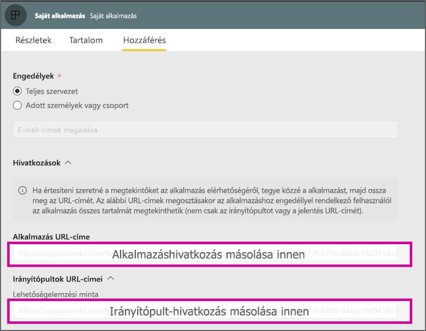

# <a name="create-a-link-to-a-specific-location-in-the-power-bi-mobile-apps"></a>A Power BI-mobilalkalmazásokon belül egy meghatározott helyre mutató hivatkozás létrehozása
A hivatkozásokkal közvetlenül férhet hozzá a Power BI adott elemeihez: jelentésekhez, irányítópultokhoz és csempékhez.

Hivatkozásokat általában két esetben használunk a Power BI Mobile-ban: 

* A Power BI megnyitása az **alkalmazáson kívülről**, és adott tartalomra való ugrás (jelentésre/irányítópultra/alkalmazásra). Ez általában integrációs helyzetekben fordul elő, amelyekben a Power BI Mobile-t egy másik alkalmazásból szeretné megnyitni. 
* **Navigálás** a Power BI-on belül. Ez általában akkor történik, ha egyéni navigálást szeretne létrehozni a Power BI-ban.


## <a name="use-links-from-outside-of-power-bi"></a>Hivatkozások használata Power BI-on kívülről
Ha Power BI alkalmazáson kívüli hivatkozást használ, ellenőrizze, hogy az alkalmazás megnyitja-e az alkalmazást, és ha az alkalmazás nincs telepítve az eszközön, akkor érdemes felajánlani a felhasználónak, hogy telepítse azt. Létrehoztunk egy speciális hivatkozásformátumot, amely pontosan ezt támogatja. Ez a hivatkozásformátum gondoskodik arról, hogy az eszköz az alkalmazás használatával nyissa meg a hivatkozást, és ha az alkalmazás nincs telepítve az eszközön, akkor felajánlja a felhasználónak, hogy azt az áruházból beszerezze.

A hivatkozásnak a következővel kell kezdődnie  
```html
https://app.powerbi.com/Redirect?[**QUERYPARAMS**]
```

> [!IMPORTANT]
> Ha a tartalma speciális adatközpontban található, amilyen például a Government, a China stb. A hivatkozásnak a megfelelő Power BI-címmel kell kezdődnie, például `app.powerbigov.us` vagy `app.powerbi.cn`.   
>


A **QUERY PARAMS** a következőkből áll:
* **action** (kötelező) = OpenApp / OpenDashboard / OpenTile / OpenReport
* **appId** = ha egy alkalmazás részét képező jelentést vagy irányítópultot szeretne megnyitni 
* **groupObjectId** = ha egy olyan jelentést vagy irányítópultot szeretne megnyitni, amely a munkaterület részét képezi (de nem a saját munkaterületet)
* **dashboardObjectId** = az irányítópult objektum azonosítója (ha a művelet OpenDashboard vagy OpenTile)
* **reportObjectId** = a jelentés objektum azonosítója (ha a művelet az OpenReport)
* **tileObjectId** = a csempe objektum azonosítója (ha a művelet OpenTile)
* **reportPage** = ha egy adott jelentésszakaszt szeretne megnyitni (ha a művelet OpenReport)
* **ctid** = elem szervezetazonosító (B2B-forgatókönyvek esetén. Ez kihagyható, ha az elem a felhasználó szervezetéhez tartozik).

**Példák:**

* Alkalmazáshivatkozás megnyitása 
  ```html
  https://app.powerbi.com/Redirect?action=OpenApp&appId=appidguid&ctid=organizationid
  ```

* Alkalmazás részét képező irányítópult megnyitása 
  ```html
  https://app.powerbi.com/Redirect?action=OpenDashboard&appId=**appidguid**&dashboardObjectId=**dashboardidguid**&ctid=**organizationid**
  ```

* Munkaterület részét képező jelentés megnyitása
  ```html
  https://app.powerbi.com/Redirect?Action=OpenReport&reportObjectId=**reportidguid**&groupObjectId=**groupidguid**&reportPage=**ReportSectionName**
  ```

### <a name="how-to-get-the-right-link-format"></a>A megfelelő hivatkozásformátum beszerzése

#### <a name="links-of-apps-and-items-in-app"></a>Alkalmazások és elemek hivatkozásai az alkalmazásban

Az **alkalmazások és az alkalmazás részét képező jelentések és irányítópultok** esetében a hivatkozás elérésének legegyszerűbb módja, ha megnyitja a munkaterületet, majd az Alkalmazás frissítése lehetőséget választja. Ekkor megnyílik az „Alkalmazás közzététele” felület, és a Hozzáférés lapon megtalálja a **Hivatkozások** szakaszt. A szakasz kibontásával megtekintheti az alkalmazás és annak összes tartalmi hivatkozását, amelyekkel azok közvetlenül elérhetők.



#### <a name="links-of-items-not-in-app"></a>Az alkalmazásban nem szereplő elemek hivatkozásai 

Olyan jelentésekhez és irányítópultokhoz, amelyek nem részei egy alkalmazásnak, az azonosítókat az elem URL-címéből kell kinyernie.

Például a 36 karakterből álló **irányítópultobjektum-azonosító** megkereséséhez lépjen a Power BI szolgáltatásban az adott irányítópultra 

```html
https://app.powerbi.com/groups/me/dashboards/**dashboard guid comes here**?ctid=**organization id comes here**`
```

A 36 karakterből álló **jelentésobjektum-azonosító** megkereséséhez navigáljon a Power BI szolgáltatásban az adott jelentéshez
Ez egy példa a „Saját munkaterületen” található jelentésre

```html
https://app.powerbi.com/groups/me/reports/**report guid comes here**/ReportSection3?ctid=**organization id comes here**`
```
A fenti URL-cím a konkrét **„ReportSection3”** jelentéslapot is tartalmazza.

Ez egy példa egy munkaterületen található jelentésre (nem a Saját munkaterületen lévő)

```html
https://app.powerbi.com/groups/**groupid comes here**/reports/**reportid comes here**/ReportSection1?ctid=**organizationid comes here**
```

## <a name="use-links-inside-power-bi"></a>Hivatkozások használata Power BI-on belül

A Power BI-on belüli hivatkozások a mobilalkalmazásokban ugyanúgy működnek, mint a Power BI szolgáltatásban.

Ha a jelentésre mutató hivatkozást szeretne felvenni, amely egy másik Power BI-elemre mutat, egyszerűen kimásolhatja az elem URL-címét a böngésző címsorában. További információt olvashat arról, [hogyan adhat hozzá hivatkozást egy jelentésbeli szövegdobozhoz](https://docs.microsoft.com/power-bi/service-add-hyperlink-to-text-box).

## <a name="use-report-url-with-filter"></a>Jelentés URL-címének használata szűrővel
Ahogy a Power BI szolgáltatás, úgy a Power BI Mobile alkalmazások is támogatják a jelentés URL-címét, amely egy szűrő lekérdezési paraméterét tartalmazza. Megnyithat egy jelentést Power BI Mobile alkalmazásban, és szűrheti azt adott állapotra. Ez az URL-cím például megnyitja az értékesítési jelentést, és a terület alapján szűri azt

```html
https://app.powerbi.com/groups/me/reports/**report guid comes here**/ReportSection3?ctid=**organization id comes here**&filter=Store/Territory eq 'NC'
```

További információ: [Lekérdezési paraméterek készítése a jelentések szűréséhez](https://docs.microsoft.com/power-bi/service-url-filters).

## <a name="next-steps"></a>Következő lépések
A visszajelzése segít eldönteni, hogy milyen fejlesztésekre koncentráljunk a jövőben, ezért kérjük, ne mulasszon el szavazni más szolgáltatásokra, amelyeket szívesen látna a Power BI-mobilalkalmazásokban. 

* [Power BI-alkalmazások mobileszközökre](mobile-apps-for-mobile-devices.md)
* @MSPowerBI követése Twitteren
* Vegyen részt [a Power BI-közösség](https://community.powerbi.com/) beszélgetéseiben
* [Mi az a Power BI?](../../fundamentals/power-bi-overview.md)

