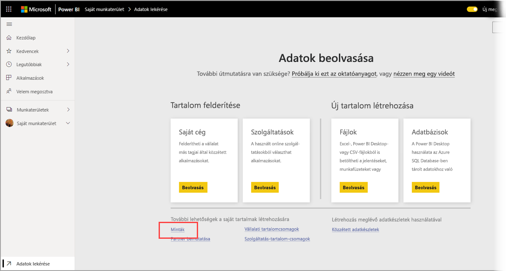
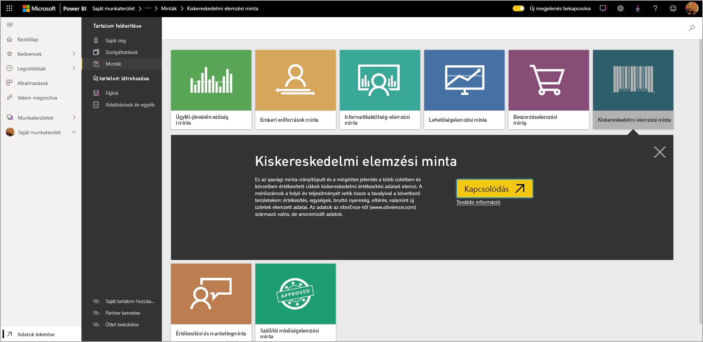
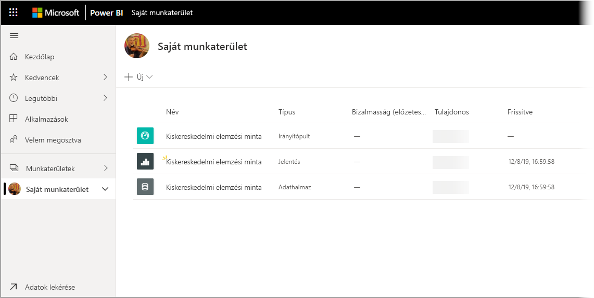

# Minták letöltése a Saját munkaterületre a Power BI szolgáltatásban

A mobilalkalmazás itt elérhető egyes dokumentációja illusztrációs célokra mintaadatokat használ. Ahhoz, hogy követni tudja az eszközén, letöltheti a mintaadatokat a Power BI-szolgáltatásfiókjába, ahol megtekintheti azokat a Power BI mobilalkalmazásból az eszközén. Ez a cikk azt ismerteti, hogyan töltheti le a mintaadatokat a Power BI-szolgáltatásfiókjába. 

## Előfeltételek

Az adatletöltéshez fiókkal kell rendelkeznie a Power BI szolgáltatásban. Ha még nem regisztrált a Power BI-ra, a kezdés előtt [hozzon létre egy ingyenes próbaverziós fiókot](https://app.powerbi.com/signupredirect?pbi_source=web).

## Minta letöltése

1. Nyissa meg a [Power BI szolgáltatást](https://app.powerbi.com) a böngészőben, és jelentkezzen be.

2. A navigációs panel bal alsó sarkában válassza az **Adatok lekérése** elemet. Ha a navigációs panel rejtett, és nem jelenik meg az Adatok lekérése hivatkozás, a panelt úgy jelenítheti meg, ha rákattint a megjelenítés/elrejtés ikonra .  
   
    

3. A Lekérdezés lapon válassza a **Minták** hivatkozást.
   
   

4. Válassza ki a letölteni kívánt mintát. Ügyeljen rá, hogy azt a mintát töltse le, amelyiket az oktatóanyag, a gyorsútmutató vagy a cikk kér. Miután kiválasztotta, kattintson a **Csatlakozás** lehetőségre.
  
   
   
5. A Power BI importálja a mintát, majd új irányítópultot, jelentést és adatkészletet ad hozzá a Saját munkaterülethez.
   
   
  
Most már megnézheti a mintákat a mobileszközén.

## Következő lépések
* [Gyors útmutató](mobile-apps-quickstart-view-dashboard-report.md)
* Kérdése van? Látogasson el a [Power BI közösség mobilalkalmazásokról szóló oldalára](https://go.microsoft.com/fwlink/?linkid=839277).
