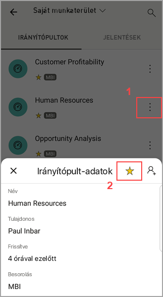

# Kedvencek rögzítése és megjelenítése a Power BI-mobilalkalmazásokban
A következőkre vonatkozik:

|  |  |  |  |  |
|:--- |:--- |:--- |:--- |:--- |
| iPhone-ok |iPadek |Android rendszerű telefonok |Android rendszerű táblagépek |Windows 10-eszközök |

A kedvenc Power BI-irányítópultok, jelentések és alkalmazások létrehozásáról és megjelenítéséről olvashat kedvenc helyszíni Power BI jelentéskészítő kiszolgáló- és Reporting Services-KPI-jeivel és mobil jelentéseivel.

Ha egy elemet a kedvencek közé sorol a Power BI mobilalkalmazásokban, akkor az megjelenik a Kedvencek oldalon a [Power BI szolgáltatásban](https://powerbi.com) és minden mobileszközén.

A Kedvencek oldal megtekintéséhez koppintson a navigációs sáv Kedvencek ikonjára:

Megteheti azt is, hogy [a Power BI szolgáltatásban vesz fel Power BI-irányítópultokat és alkalmazásokat a kedvencek közé](../end-user-favorite.md). Ez után megjelennek a mobilalkalmazás Kedvencek oldalán.

KPI-ket és jelentéseket jelölhet meg kedvencekként a Power BI jelentéskészítő kiszolgáló vagy a Reporting Services webes portálján, majd a kedvenc Power BI-irányítópultjaival együtt ezeket is megtekintheti egy Önnek megfelelő mappában a mobileszközén.

## Alkalmazás felvétele a kedvencek közé
1. Koppintson az alsó navigációs sáv Alkalmazások ikonjára az alkalmazás oldalának megnyitásához.

2. iOS-eszközön koppintson a kedvencként megjelölendő alkalmazás nevétől jobbra található információs gombra. Android rendszerű eszközön az információs gomb helyett a További lehetőségek (...) ikon jelenik meg. 

3. A megnyíló Alkalmazás-információs területen koppintson a csillagra.
   
    
   
    Az alkalmazás ettől kezdve megjelenik a Kedvencek oldalon a többi kedvenc irányítópult, jelentés és alkalmazás között.
   
## Irányítópult vagy jelentés felvétele a kedvencek közé iOS- és Windows 10-mobilalkalmazásokban
Egy Power BI-irányítópult vagy jelentés az irányítópultok vagy jelentések listájáról vagy magáról az irányítópultról vagy jelentésről is felvehető a kedvencek közé.

* Az irányítópultoknak vagy jelentéseknek a mobilalkalmazáson belüli listájában koppintson a név melletti üres csillagra . A csillag sárga színűre változik .
  
    
* Ha egy irányítópulton van, koppintson a üres csillagra  a menüszalagon. Jelentésben a csillag a **További lehetőségek** (...) alatt található.  A csillag feketére változik .
  
    

## Irányítópult vagy jelentés felvétele a kedvencek közé Android-mobilalkalmazásokban
Egy irányítópult vagy jelentés az irányítópultok vagy jelentések listájáról vagy magáról az irányítópultról vagy jelentésről is felvehető a kedvencek közé.

* Az irányítópultok vagy jelentések mobilalkalmazáson belüli listájában koppintson a név melletti függőleges három ponttal jelölt **További lehetőségek** (...) elemre, majd a megjelenő információs lapon a Kedvencek csillagra.
  
    

* Irányítópulton koppintson a menüszalagon található üres csillagra. . A csillag sötétszürkére változik .
  
    

* Ha jelentésben van, pöccintsen lefelé a menüszalag megjelenítéséhez, koppintson a **További lehetőségek** (...) elemre, majd görgessen lefelé az üres csillagig , és koppintson rá. A csillag sötétszürkére változik .
  
    

## Power BI jelentéskészítő kiszolgáló- és Reporting Services-jelentések és KPI-k felvétele a kedvencek közé
Kedvenc Power BI jelentéskészítő kiszolgáló- és Reporting Services-jelentéseit és KPI-it megtekintheti a Power BI mobilalkalmazásokban, de a kedvencek közé nem tudja felvenni őket a mobilon. [Jelölje meg őket kedvencekként a webes portálon](../../report-server/tutorial-explore-report-server-web-portal.md#tag-your-favorites). 

## Következő lépések
* [Népszerű irányítópultok a Power BI szolgáltatásban](../end-user-favorite.md) 
* Kérdése van? [Kérdezze meg a Power BI közösségét](https://community.powerbi.com/)

