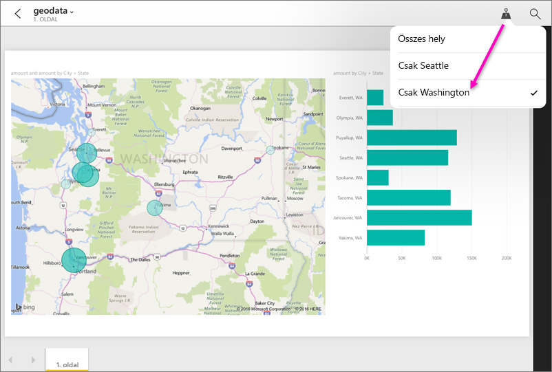

# Jelentések szűrése földrajzi hely alapján a Power BI mobilalkalmazásokban
Hatóköre:

|  |  |  |  |  |
|:--- |:--- |:--- |:--- |:--- |
| iPhone-ok |iPadek |Android rendszerű telefonok |Android-táblagépek |Windows 10 rendszerű telefonok |

A mobileszközön megjelenített Power BI-jelentés jobb felső sarkában látható egy kis gombostű? Ha igen, akkor a jelentés szűrhető földrajzi hely alapján.

> [!NOTE]
> Csak akkor szűrhet hely alapján, ha a földrajzi nevek angol nyelven szerepelnek a jelentésben – például „New York City” vagy „Germany”. A Windows 10 rendszerű táblagépek és számítógépek nem támogatják a földrajzi szűrést, a Windows 10 rendszerű telefonok azonban igen.

>[!NOTE]
>A Power BI-mobilalkalmazás támogatása a **Windows 10 Mobile rendszerű telefonokhoz** 2021. március 16-án megszűnik. [További tudnivalók](https://go.microsoft.com/fwlink/?linkid=2121400)

## Jelentés szűrése földrajzi hely alapján
1. Nyisson meg egy jelentést mobileszközén a Power BI mobilalkalmazásban.
2. Ha a jelentés tartalmaz földrajzi adatokat, egy üzenet jelenik meg, amely a helymeghatározás engedélyezésére kéri a Power BI számára. Kattintson az **Engedélyezés**, majd ismét az **Engedélyezés** gombra.
3. Koppintson a gombostűre. . A jelentésben foglalt adatoktól függően szűrhet városra, államra/tartományra és országra/régióra is. A szűrő kizárólag azokat a lehetőségeket listázza, amelyek megfelelnek az aktuális helyének.
   
    

## Miért nem láthatók a helyek címkéi a jelentésben?
Ahhoz, hogy a helyek címkéi megjelenjenek, mindhárom alábbi feltételnek teljesülnie kell. 

* A jelentést a Power BI Desktop alkalmazásban létrehozó személynek legalább egy oszlop esetében [kategorizált földrajzi adatokat](../../transform-model/desktop-mobile-geofiltering.md) (például Város, Állam vagy Ország/Régió) kellett megadnia.
* Olyan helyen tartózkodik, amelyik rendelkezik adattal a kérdéses oszlopban.
* A következő mobileszközök valamelyikét használja:
  * iOS (iPad, iPhone vagy iPod).
  * Android (telefon, táblagép).
  * Windows 10 rendszerű telefon (az egyéb Windows 10 rendszerű eszközök, például számítógépek és táblagépek nem támogatják a földrajzi szűrést).

A Power BI Desktop [földrajzi szűrésének beállításáról itt](../../transform-model/desktop-mobile-geofiltering.md) olvashat további információkat.

### További lépések
* [Power BI-információk elérése a való világból](mobile-apps-data-in-real-world-context.md) a mobilalkalmazásokkal
* [Adatok kategorizálása a Power BI Desktopban](../../transform-model/desktop-data-categorization.md) 
* Kérdései vannak? [Kérdezze meg a Power BI-közösséget](https://community.powerbi.com/)
