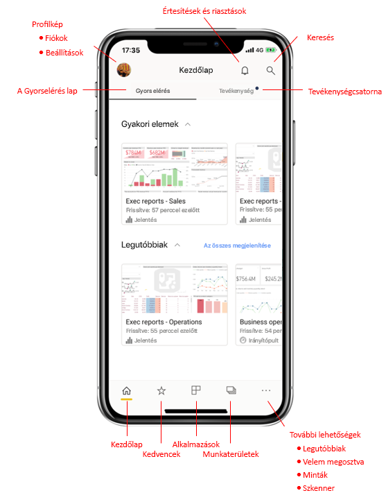
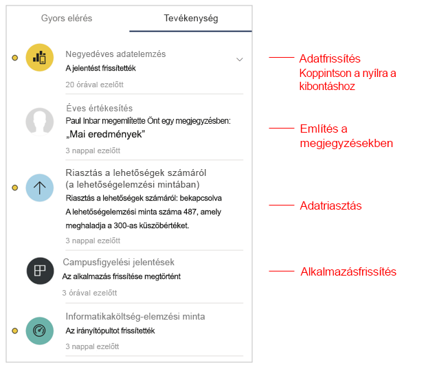
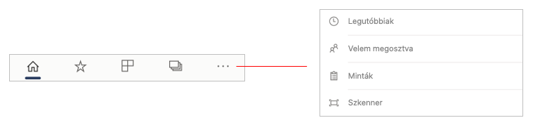
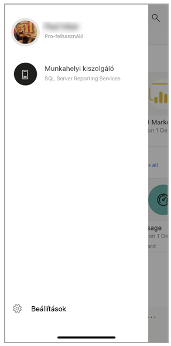
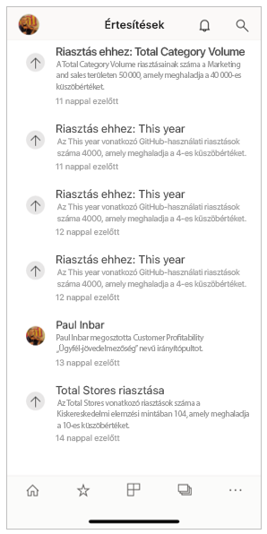
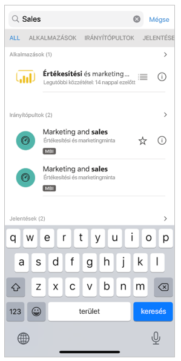

# A mobilalkalmazás kezdőlapjának rövid bemutatása
A bemutató során megismerkedhet a Power BI mobilalkalmazás kezdőlapjával és azokkal a navigációs segédeszközökkel, amelyekkel gyorsan elérheti, amire szüksége van.

Hatóköre:

|  |  |  |
|:--- |:--- |:--- |
| iPhone | iPad | Android | 

A Power BI mobilalkalmazás megnyitásakor a kezdőlapra érkezik, ahonnan gyorsan hozzáférhet a leggyakrabban vagy legutóbb felkeresett jelentésekhez, irányítópultokhoz és alkalmazásokhoz. Ezen felül egy tevékenység-hírcsatorna tájékoztatja folyamatosan a Power BI-tartalmakkal kapcsolatos eseményekről, a kényelmesen használható navigációs segédeszközökkel pedig gyorsan elérheti a szükséges tartalmat.

 
## A Gyorselérés lap

A gyorselérési lapon a leggyakrabban és a közelmúltban megtekintett jelentéseket, irányítópultokat és alkalmazásokat találhatja meg két összecsukható szakaszba csoportosítva. A legutóbb megtekintett elemek hosszabb listájának megtekintéséhez koppintson az **Összes megtekintése** elemre a Legutóbbiaktól jobbra. 

## Tevékenységcsatorna

A tevékenység-hírcsatornával nyomon követheti mindazt, ami a Power BI-tartalmaival történik. Itt láthatók a legújabb értesítések, riasztások, megjegyzések és @mentions.

A hírcsatorna frissítéseiben szerepelnek a következők:
* **Frissített adatok**: ha a kedvenc vagy legutóbbi jelentések és irányítópultok egyikében frissítve vannak a mögöttes adatok.
* **Új megjegyzések**: ha valaki megjegyzést hoz létre egy olyan jelentéshez vagy irányítópulthoz, amely az Ön kedvencei vagy a legutóbbiak között szerepel, vagy ha valaki megemlíti Önt egy megjegyzésben.
* **Adatriasztások**: amikor az adatok elérnek egy küszöböt, amelyet korábban Ön határozott meg egy [adatriasztásban](../../mobile-set-data-alerts-in-the-mobile-apps.md).
* **Alkalmazás-frissítések**: amikor egy alkalmazás készítője frissítést tesz közzé egy Ön által használt alkalmazáshoz.

 A további vizsgálódáshoz a tevékenységelemre koppintva ugorhat a megfelelő helyre.

A tevékenység-elemek összesítve vannak, így az egy alkalmazásból vagy munkaterületről származó adatfrissítések egy csoportba lesznek sorolva. Válassza a  nyilat az összesített elemek kibontásához és megjelenítéséhez. A lista elején mindig a legutóbbi elem áll.

## Navigációs sáv

A navigációs sáv az oldal alján található.

A navigációs sáv a következőkhöz kínál gyors hozzáférést:

*  **Kezdőlap** – visszalépteti a kezdőlapra.
*  **Kedvencek** – az Ön által [kedvencekként](../../mobile-apps-favorites.md) megjelölt jelentések, irányítópultok és alkalmazások.
*  **Alkalmazások** – azok az alkalmazások, amelyeket Ön telepített a fiókjában.
*  **Munkaterületek** – a tartalomkészítők által készített jelentéseket és irányítópultokat egy helyen tartó munkamappák.
*  **Legutóbbiak** – a közelmúltban megtekintett elemek.
*  **Velem megosztva** – azok az elemek, amelyeket mások osztottak meg Önnel.
*  **Minták** – Power BI-minták, amelyek segítségével megismerheti a Power BI képességeit.
*  **Szkenner** – az eszköz kamerája, amelyet szkennerként használhat [vonalkódok](../../mobile-apps-scan-barcode-iphone.md) és [QR-kódok](../../mobile-apps-qr-code.md) beolvasására.

## Fejléc

Az oldal tetején található fejlécen látható az aktuális Power BI-oldal, -jelentés vagy -irányítópult neve.

A fejlécen a következő navigációs elemek találhatók:
* **Profilkép vagy avatar** – oldalpanelt nyit meg, amelyen [váltani tud a Power BI szolgáltatás és a Jelentéskészítő kiszolgáló fiókjai között](../../mobile-app-ssrs-kpis-mobile-on-premises-reports.md), valamint hozzáférhet a Power BI mobilalkalmazás beállításaihoz.

    

* **Értesítések** – megnyitja az [Értesítések oldalt](../../mobile-apps-notification-center.md), ahol az értesítéseket tekintheti meg és érheti el. Az értesítés harangján látható pont azt jelzi, hogy új értesítései vannak.

    

* **Keresés** – Power BI-tartalom keresése az előfizetésében.

    

## További lépések
Ebben a bemutatóban a Power BI mobilalkalmazás kezdőlapját ismerhette meg. A Power BI mobilalkalmazás használatáról további információk állnak rendelkezésére. 
* [Irányítópultok és jelentések felfedezése](../../mobile-apps-quickstart-view-dashboard-report.md)
* [Jelentések vizsgálata a Power BI-mobilalkalmazásokban](../../mobile-reports-in-the-mobile-apps.md)
