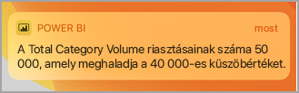
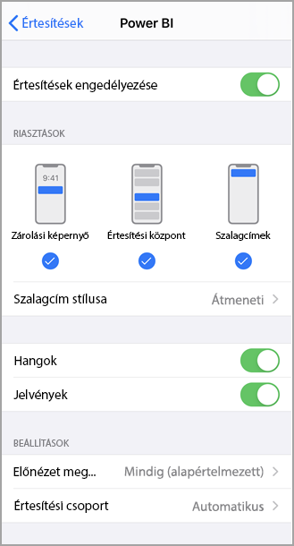

# Értesítések fogadása a Power BI-mobilalkalmazásokban
Hatóköre:

|  |  |  |  |  |
|:--- |:--- |:--- |:--- |:--- |
| iPhone-ok |iPadek |Android rendszerű telefonok |Android-táblagépek |Windows 10 rendszerű eszközök |

>[!NOTE]
>A Power BI-mobilalkalmazás támogatása a **Windows 10 Mobile rendszerű telefonokhoz** 2021. március 16-án megszűnik. [További tudnivalók](https://go.microsoft.com/fwlink/?linkid=2121400)

Az Értesítések szolgáltatás a Power BI használatával kapcsolatos információt közvetlenül Önnek küldi a Power BI szolgáltatásban vagy a mobileszközén. Az Értesítések megnyitásakor megjelennek a [beállított értesítések](mobile-set-data-alerts-in-the-mobile-apps.md) alapján az egymást követő üzenetek a hírcsatornában, az Önnel megosztott új irányítópultok, a csoport munkaterületének változásai, a Power BI-eseményekre és -értekezletekre vonatkozó információk és egyebek.

> [!NOTE]
> Amikor iOS-eszközön először jelentkezik be a [Power BI alkalmazás frissített verziójába](https://powerbi.microsoft.com/mobile/), megjelenik egy üzenet, hogy szeretné-e, ha a Power BI értesítéseket küldene. Az eszköze **Beállítások** menüjében is megadhatja, hogyan értesítse a Power BI. 
> 
> 

## Értesítések megtekintése a mobileszközön
1. Amikor értesítés érkezik a mobileszközre a Power BI alapértelmezés szerint hangjelzést ad, és megjelenít egy értesítésszalagot.
   
   
   

   Megváltoztathatja a [Power BI értesítési módját](mobile-apps-notification-center.md#change-or-turn-off-notifications-on-your-mobile-device).
2. Ha értesítéseket kapott, amikor bejelentkezik a mobileszközén a Power BI-ba, egy sárga pontot fog látni a harang alakú Értesítések ikonon  (iOS és Android rendszeren) vagy a globális navigációs gombon  (Windows 10-eszközökön). 

3. Az értesítéseket úgy tekintheti meg az Értesítési központban, hogy az Értesítések ikonra koppint  (iOS és Android rendszeren), vagy az Értesítési központ ikonjára  (Windows 10-eszközökön).
   
    A legújabb értesítés látható legfölül, az olvasatlan üzenetek pedig kiemelten jelennek meg. Az értesítések 90 napig őrződnek meg, ha nem törli őket, vagy a számuk el nem éri a maximális határértéket, a 100-at.
   
   
4. Egy értesítés elvetéséhez iOS- és Android-eszközökön koppintson rá hosszan, majd pöccintsen. Windows 10-eszközökön kattintson a jobb gombbal és válassza az **Elvetés** lehetőséget.

## Értesítések módosítása vagy kikapcsolása a mobileszközön
Megváltoztathatja a Power BI értesítési módját.

1. iOS-eszközön lépjen a **Beállítások** > **Értesítések** pontra. 
   
    Android telefonon lépjen az **Beállítások** > **Értesítések** pontra.
   
    Windows-eszközön a **Beállítások** menüben lépjen a **Rendszer** > **Értesítések és műveletek** menüpontra.
2. Az alkalmazások listájában válassza a **Power BI** elemet. 
3. Itt teljes egészében kikapcsolhatja az értesítéseket, vagy kiválaszthatja, melyeket szeretne megtartani.
   
    **iPhone-on**
   
    
   
    **Androidos telefonon**
   
    

    **Windows 10-eszközön**

    

## További lépések
* [Adatokkal kapcsolatos értesítések a Power BI szolgáltatásban](../../create-reports/service-set-data-alerts.md)
* [Adatriasztások beállítása az iPhone-alkalmazásban (a Power BI for iOS-ben)](mobile-set-data-alerts-in-the-mobile-apps.md)
* [Adatriasztások beállítása a Windows 10-hez készült Power BI mobilalkalmazásban](mobile-set-data-alerts-in-the-mobile-apps.md)
* [A Power BI-alkalmazások legújabb verziójának letöltése](https://powerbi.microsoft.com/mobile/) mobileszközökhöz
