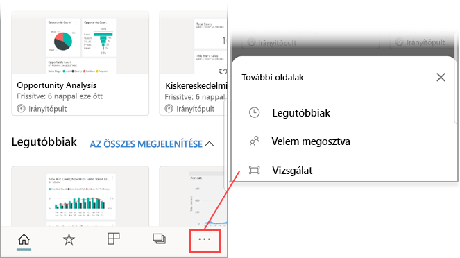
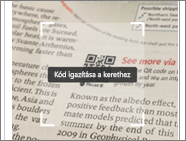
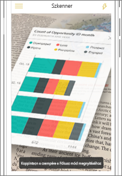
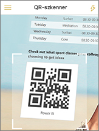
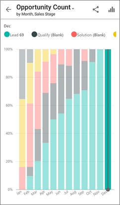

# Power BI QR-kód beolvasása mobileszközzel
A következőkre vonatkozik:

|  |  |  |  |
|:--- |:--- |:--- |:--- |
|iPhone-ok |iPadek |Android rendszerű telefonok |Android rendszerű táblagépek |

A Power BI-ban lévő QR-kódok a való világból bármit közvetlenül összekapcsolhatnak a kapcsolódó BI-információkkal, és ehhez nincs szükség navigálásra vagy keresésre.

Tegyük fel, hogy egy kollégája [létrehozott egy QR-kódot a Power BI szolgáltatásban](../../service-create-qr-code-for-tile.md) egy jelentéshez vagy egy irányítópult valamely csempéjéhez, majd megosztotta Önnel az irányítópultot vagy a jelentést, a QR-kódot pedig elhelyezte a kívánt helyen, például egy e-mailben vagy valamilyen tárgyon. 

A Power BI alkalmazás beolvasó funkciójával vagy a telefonra telepített bármely egyéb olvasóval beolvashatja a QR-kódot, és ezáltal azonnal, közvetlenül a telefonjáról érheti el a vonatkozó csempét vagy jelentést. 

Ha kollégája nem osztotta meg Önnel az irányítópultot vagy jelentést, közvetlenül a mobilalkalmazásból kérhet hozzáférést. 

> [!NOTE]
> [A jelentés QR-kódját a Power BI vegyes valósághoz alkalmazással is beolvashatja](mobile-mixed-reality-app.md#scan-a-report-qr-code-in-holographic-view).

## Power BI QR-kód beolvasása iPhone-on a Power BI-olvasóval

1. A navigációs sávon koppintson a **további beállítások** (...) lehetőségre, majd a **Vizsgálat** elemre.

    

2. Ha a kamera nincs engedélyezve, engedélyeznie kell, hogy a Power BI alkalmazás használhassa azt. Ezt csak egyszer kell megtennie. 
 
3. Irányítsa az olvasót a Power BI QR-kódra. 
   
    
4. A csempe vagy jelentés háttér előtt lebegve jelenik meg a kiterjesztett valóságban.
   
    

5. Koppintson a jelentésre vagy a csempére annak Fókusz módban való megnyitásához, vagy lépjen vissza az olvasóra.

### QR-kód beolvasása az iPhone-on lévő külső olvasóval
1. A telefonra telepített bármely olvasó használatával a kamerát egy adott Power BI QR-kódra irányítva azonnal elérheti a vonatkozó csempét vagy jelentést. 
2. Ha a Power BI alkalmazás nincs telepítve, a rendszer átirányítja az [Apple App Store áruházba, ahonnan letöltheti azt](https://go.microsoft.com/fwlink/?LinkId=522062) iPhone készülékére.

## Power BI QR-kód beolvasása Android-eszközön a Power BI-olvasóval

1. A navigációs sávon koppintson a **további beállítások** (...) lehetőségre, majd a **Vizsgálat** elemre.

    

2. Ha a kamera nincs engedélyezve, engedélyeznie kell, hogy a Power BI alkalmazás használhassa azt. Ezt csak egyszer kell megtennie. 

3. Irányítsa az olvasót a Power BI QR-kódra. 
   
    
4. A csempe vagy jelentés automatikusan megnyílik a Power BI alkalmazásban.
   
    

### QR-kód beolvasása az Android-eszközön lévő külső olvasóval
1. Az Android-eszközön telepített bármely olvasó használatával a kamerát egy adott Power BI QR-kódra irányítva azonnal elérheti a vonatkozó csempét vagy jelentést. 
2. Ha a Power BI alkalmazás nincs telepítve, a rendszer átirányítja a [Google Play áruházba, ahonnan letöltheti azt](https://go.microsoft.com/fwlink/?LinkID=544867). 

## Következő lépések
* [Power BI-információk elérése a való világból](mobile-apps-data-in-real-world-context.md) a mobilalkalmazásokkal
* [QR-kód létrehozása a Power BI szolgáltatásban lévő csempékhez](../../service-create-qr-code-for-tile.md)
* [QR-kód létrehozása a Power BI szolgáltatásban lévő jelentésekhez](../../service-create-qr-code-for-report.md)
* [QR-kódot a Power BI vegyes valósághoz alkalmazással is beolvashat](mobile-mixed-reality-app.md)
* Kérdése van? [Kérdezze meg a Power BI közösségét](https://community.powerbi.com/)

