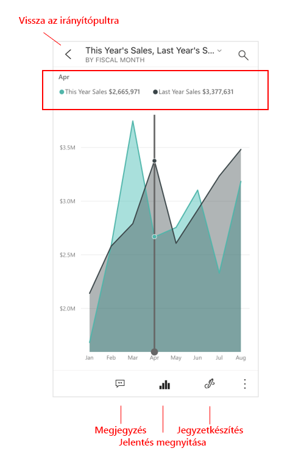

# Gyors útmutató: Irányítópultok és jelentések felfedezése a Power BI-mobilalkalmazásokban
Ebben a gyorsútmutatóban röviden körbejárjuk a Power BI mobilalkalmazást, és példaként bemutatunk egy irányítópultot és egy jelentést. Az útmutatóban az iOS rendszerre készült Power BI alkalmazás szerepel, de a lépéseket más eszközökön is egyszerűen követheti.

A következőkre vonatkozik:

|  |  |  |  |
|:--- |:--- |:--- |:--- |
| iPhone | iPad | Android | Windows 10 |

Az irányítópultok betekintést nyújtanak és hozzáférést biztosítanak a vállalat életciklusához és folyamataihoz. Ez a funkció egy központi helyet biztosít, ahonnan áttekintheti és nyomon követheti vállalkozása aktuális állapotát. A jelentés interaktív rálátást kínál az adatokhoz, és vizualizációk segítségével mutatja be az adatokból származó eredményeket és elemzéseket. 

## Előfeltételek

* **Regisztráció a Power BI-ra**: Ha még nem regisztrált a Power BI-ra, a kezdés előtt [hozzon létre egy ingyenes próbaverziós fiókot](https://app.powerbi.com/signupredirect?pbi_source=web).
* **Az Ön eszközére készült Power BI mobilalkalmazás telepítése**: Töltse le a Power BI mobilalkalmazást** az [App Store-ból](https://apps.apple.com/app/microsoft-power-bi/id929738808) (iOS) vagy a [Google Play Áruházból](https://play.google.com/store/apps/details?id=com.microsoft.powerbim&amp;amp;clcid=0x409) (Android).
* **Kiskereskedelmi elemzési minta letöltése**: A gyorsútmutató első lépéseként töltse le a Kiskereskedelmi elemzési mintát a Power BI szolgáltatásba. Az alkalmazás használatának megkezdéséhez [ismerje meg, hogyan tud letölteni egy mintát](./mobile-apps-download-samples.md) a Power BI-fiókjába. Mindenképp a Kiskereskedelmi elemzési mintát válassza.

Ha teljesítette az előfeltételeket és letöltötte a Kiskereskedelmi elemzési mintát a Power BI-fiókjába, készen áll e rövid bemutató megkezdésére.

## Irányítópult megtekintése a mobileszközön
1. Nyissa meg a Power BI alkalmazást az eszközön, és jelentkezzen be a Power BI-fiók azon hitelesítő adataival, amelyeket a böngészőben is használt a Power BI szolgáltatáshoz.
 
1. Koppintson a **Munkaterületek** ikonra , válassza a **Saját munkaterületek** lehetőséget, majd a megnyitáshoz koppintson a Kiskereskedelmi elemzési mintára.

    
   
    A Power BI-irányítópultok megjelenése a mobileszközön némileg eltér a Power BI szolgáltatásban megszokottól. Minden csempe ugyanolyan szélesen jelenik meg, és felülről lefelé egymás után vannak rendezve.

5. Koppintson a csillag ikonra  az alsó eszköztárban, ha szeretné a kedvencek közé helyezni ezt az irányítópultot. Amit a mobilalkalmazásban kedvencnek jelöl, az a Power BI szolgáltatásban is bekerül a kedvencek közé, és fordítva.

6. Görgessen lefelé, és koppintson a „Folyó évi értékesítés, Elmúlt évi értékesítés” kitöltött vonaldiagramra.

    

    A grafikon fókusz módban nyílik meg.

7. Fókusz módban koppintson az **Apr** (április) elemre a grafikonon. Ekkor a grafikon felső részén megjelennek az áprilisi értékek.

    

8. Koppintson a Jelentés ikonra  a képernyő alján (androidos eszközökön ez a képernyő tetején is lehet). A csempéhez kapcsolódó jelentés fekvő tájolásban nyílik meg.

    

9. Koppintson a „040 – Beosztottak” buborékra a buborékdiagramban. Figyelje meg, hogyan emeli ki ez a lépés a kapcsolódó értékeket a többi grafikonon. 

    

10. Pöccintsen felfelé, hogy láthatóvá váljon a lap alján lévő eszköztár, majd koppintson a **További lehetőségek (...)** elemre.

    

11. Görgesse lejjebb a listát, majd válassza a **Jegyzetkészítés** lehetőséget.

    

12. A jegyzetkészítési eszköztárban koppintson a mosolygós arc ikonra, majd arra a jelentésoldalra, ahol a mosolygós arcokat szeretné elhelyezni.
 
    

13. Ezt követően koppintson a **Megosztás** elemre a jobb felső sarokban.

14. Válassza ki, hogyan szeretné megosztani a jelentést.  

    

    A pillanatképet bárkivel megoszthatja cégen belül és kívül. A cégen belüli és saját Power BI-fiókkal rendelkező címzettek a Kiskereskedelmi elemzési mintát is megnyithatják.

## Erőforrások felszabadítása

Miután végzett ezzel a gyors útmutatóval, igény szerint eltávolíthatja a Kiskereskedelmi elemzési mintát, a jelentést és az adatkészletet.

1. Nyissa meg a Power BI szolgáltatást ([Power BI szolgáltatás](https://app.powerbi.com)), és jelentkezzen be.

2. A navigációs panelen válassza a **Saját munkaterület** lehetőséget.

3. Válassza az irányítópultok lapfület, majd kattintson a kuka ikonra.

    

    Kattintson a jelentések lapfülére, és tegye ugyanezt.

4. Válassza ki az adathalmazok lapfülét, kattintson a **További lehetőségek** (...) elemre, majd válassza a **Törlés** elemet. 

    

## Következő lépések

Ebből a rövid útmutatóból egy irányítópult és egy jelentés mintáját ismerhette meg a mobileszközén. Tájékozódjon tovább a Power BI szolgáltatásban végzett munkáról. 

> [!div class="nextstepaction"]
> [Rövid útmutató:: Eligazodás a Power BI szolgáltatásban](../end-user-experience.md)

