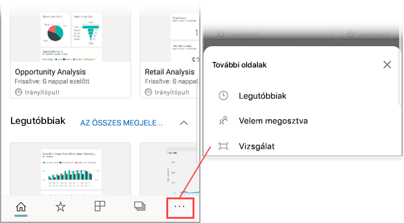

# Vonalkód beolvasása saját eszközzel a Power BI mobilalkalmazásból
Beolvashatja a való világbeli vonalkódokat, hogy közvetlenül a szűrt BI-adatokhoz jusson a Power BI mobilalkalmazásban.

A következőkre vonatkozik:

|  |  | 
|:--- |:--- |
| iPhone | Android (telefon, táblagép) | 

Tegyük fel, hogy az egyik munkatársa [megcímkézett egy vonalkódmezőt egy jelentésben a Power BI Desktopban](../../desktop-mobile-barcodes.md), majd megosztotta ezt a jelentést Önnel. 

Amikor beolvassa egy termék vonalkódját a Power BI alkalmazás olvasójával az eszközén, megjelenik a vonalkódot tartalmazó jelentés (vagy a jelentések listája). Ezt a jelentést megnyithatja a vonalkód alapján szűrve.

## Vonalkód beolvasása a Power BI-olvasóval
1. A navigációs sávon koppintson a **További beállítások** (...) lehetőségre, majd a **Vizsgálat** elemre.

    

2. Ha a kamera nincs engedélyezve, engedélyeznie kell, hogy a Power BI alkalmazás használhassa azt. Ezt csak egyszer kell megtennie. 
4. Irányítsa az olvasót egy termék vonalkódjára. Ekkor megjelenik a vonalkódhoz társított jelentések listája.
5. A jelentés nevére koppintva megnyithatja az adott jelentést az eszközén, a vonalkód alapján automatikusan szűrve.

## A jelentés szűrése más vonalkódok alapján
Az eszközön megtekintett, vonalkód alapján szűrt jelentést más vonalkódok alapján is szűrheti.

* Ha a vonalkód ikonon szűrő  látható, akkor a szűrő aktív, és a jelentés már szűrve van egy vonalkód alapján. 
* Ha az ikon nem tartalmaz szűrőt , akkor a szűrő nem aktív, és a jelentés nincs vonalkód alapján szűrve. 

Bárhogy is van, koppintson az ikonra, és megnyílik egy kisméretű menü úszó olvasóval.

* Fókuszálja az olvasót az új elemre a jelentés szűrőjének egy másik vonalkódértékre való megváltoztatásához. 
* Válassza a **Vonalkódszűrő törlése** lehetőséget a nem szűrt jelentéshez való visszatéréshez.
* Koppintson a **Szűrés a legutóbbi vonalkódok alapján** pontra a jelentés szűrőjének a jelenlegi munkamenetben beolvasott egyik vonalkódra váltásához.

## Problémák a vonalkód beolvasásakor
Íme néhány üzenet, melyeket egy termék vonalkódjának beolvasásakor láthat.

### „Couldn’t filter report...” (Nem lehetett szűrni a jelentést...)
A jelentés, amelynek a szűrését választotta olyan adatmodellen alapul, amely ezt a vonalkódértéket nem tartalmazza. A „mineral water” (ásványvíz) termék például nem szerepel a jelentésben.  

### A jelentés vizualizációi vagy azok egy része semmilyen értéket sem tartalmaz
A beolvasott vonalkódérték megtalálható a modellben, de a jelentés vizualizációi vagy azok egy része ezt az értéket nem tartalmazza, ezért a szűrés üres állapotot ad vissza. Próbáljon meg más jelentésoldalakon keresni, vagy szerkessze a jelentést a Power BI Desktopban, hogy tartalmazza ezt az értéket. 

### „Looks like you don’t have any reports that can be filtered by barcodes.” (Úgy tűnik, nem rendelkezik egyetlen, vonalkód alapján szűrhető jelentéssel sem.)
Ez azt jelenti, hogy nincs egyetlen jelentés sem, amelyben engedélyezett lenne a vonalkódok használata. A vonalkódolvasó csak azokat a jelentéseket tudja szűrni, amelyekben van **Barcode** (Vonalkód) megjelölésű oszlop.  

Győződjön meg róla, hogy Ön vagy a jelentés tulajdonosa **Barcode** (Vonalkód) címkével látott el egy oszlopot a Power BI Desktopban. További tudnivalók a [vonalkódmezők Power BI Desktopban való címkézéséről](../../desktop-mobile-barcodes.md)

### „Couldn’t filter report - Looks like this barcode doesn't exist in the report data.” (Nem lehetett szűrni a jelentést – úgy tűnik ez a vonalkód nincs benne a jelentésadatokban.)
A jelentés, amelynek a szűrését választotta olyan adatmodellen alapul, amely ezt a vonalkódértéket nem tartalmazza. A „mineral water” (ásványvíz) termék például nem szerepel a jelentésben. Beolvashat egy másik terméket, választhat másik jelentést (ha több jelentés is rendelkezésre áll), vagy megtekintheti a jelentést szűrés nélkül. 

## Következő lépések
* [Vonalkódmező címkézése a Power BI Desktopban](../../desktop-mobile-barcodes.md)
* [A Power BI-irányítópultok csempéi](../end-user-tiles.md)
* [A Power BI-irányítópultok](../end-user-dashboards.md)

