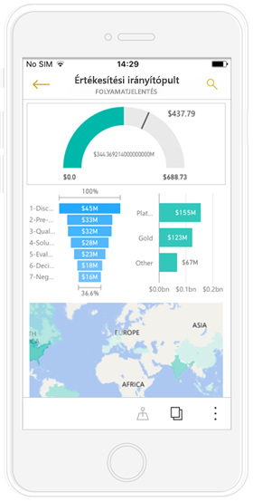
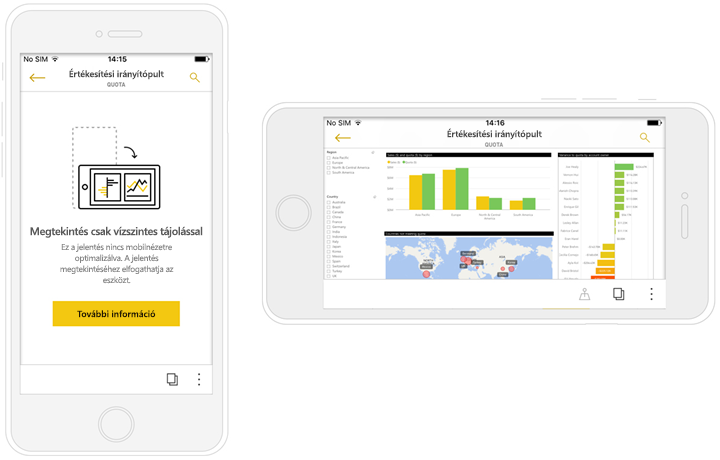
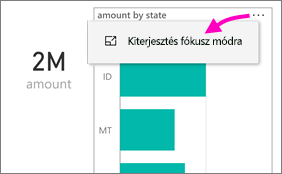
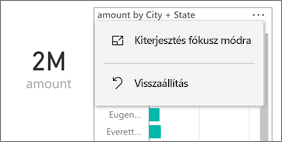
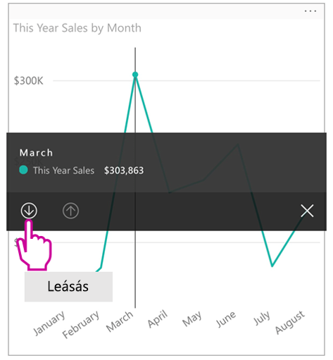
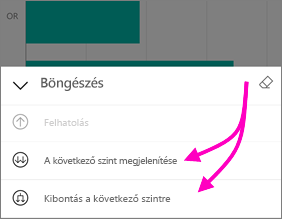
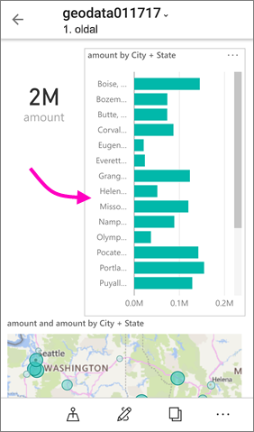
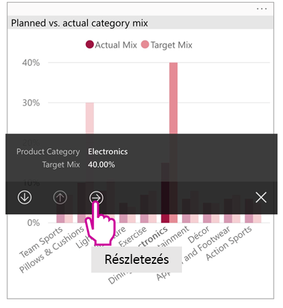
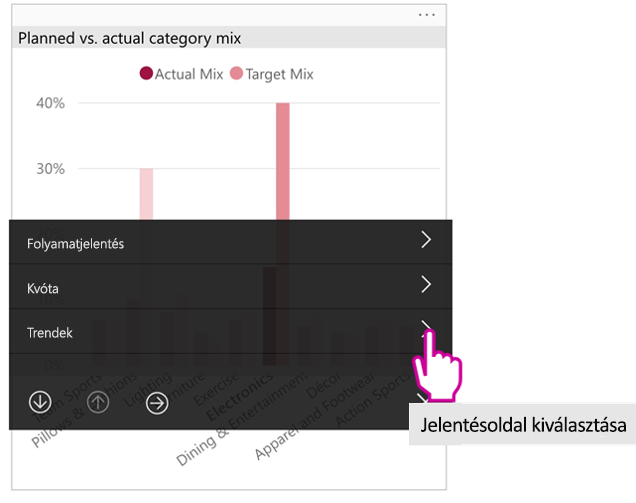

# Telefonra optimalizált Power BI-jelentések megtekintése

A következőkre vonatkozik:

|  |  |
|:--- |:--- |
| iPhone-ok |Android rendszerű telefonok |

Ha egy Power BI-jelentést a telefonon tekint meg, a Power BI ellenőrzi, hogy a jelentés optimalizálva lett-e telefonokra. Ha igen, a Power BI automatikusan álló nézetben nyitja meg az optimalizált jelentést.

Ha a jelentésnek nem létezik telefonra optimalizált változata, a jelentés megnyílik, azonban a nem optimalizált fekvő tájolásban. Még a telefonra optimalizált jelentések esetében is, ha a telefont oldalra fordítja, a jelentés a nem optimalizált nézetben jelenik meg az eredeti jelentéselrendezésben. Ha csak egyes oldalak vannak optimalizálva, álló tájolásban egy üzenet jelenik meg, amely értesíti, hogy a jelentés fekvő tájolásban tekinthető meg.

A Power BI jelentések többi funkciója továbbra is működik a telefonra optimalizált jelentésekben. Ismerje meg részletesebben az alábbiak kínálta lehetőségeket:

* [Jelentések iPhone készülékeken](mobile-reports-in-the-mobile-apps.md). 
* [Jelentések Android telefonokon](mobile-reports-in-the-mobile-apps.md).

## Jelentésoldalak szűrése telefonon
Ha egy telefonra optimalizált jelentéshez szűrők vannak definiálva, a jelentés telefonon való megtekintésekor alkalmazhatja ezeket a szűrőket. A jelentés a weben beállított értékekre szűrve jelenik meg a telefonon. Egy üzenet tájékoztat arról, hogy az oldalon aktív szűrés van érvényben. A szűrők a telefonon módosíthatók.

1. Koppintson a Szűrő ikonra  a lap alján.

2. Az alapszintű és a speciális szűrők használatával az Ön számára érdekes eredményeket jelenítheti meg.
   
    

## Vizualizációk keresztkiemelése
A vizualizációk keresztkiemelése telefonos jelentésekben ugyanúgy működik, mint a Power BI szolgáltatásban, és telefonokon a fekvő tájolású jelentésekben: Ha egy vizualizáción ki van jelölve egy adat, akkor az ahhoz kapcsolódó adatok is ki lesznek emelve az oldal többi vizualizációjában.

A [Power BI szűrés és kiemelés funkcionalitásáról itt talál](../../power-bi-reports-filters-and-highlighting.md) további információkat.

## Vizualizációk kijelölése
Amikor a telefonos jelentésekben kijelöl egy vizualizációt, a telefonos jelentés kiemeli és középre fókuszálja az adott vizualizációt, és kikapcsolja a vászonmozdulatokat.

Ha egy vizualizáció van kijelölve, azon belül végezhet különféle mozdulatokat, például görgetést. A vizualizáció kijelölésének megszüntetéséhez csak érintse meg a képernyőt a vizualizáció területén kívül.

## Vizualizáció megnyitása fókusz módban
A telefonos jelentések a fókusz módot is támogatják: Nagyobb áttekintést kaphat egy adott vizualizációról, és könnyebben megismerheti azt.

* A telefonos jelentésben koppintson a vizualizáció jobb felső sarkában a három pontra ( **...** ), majd a **Kiterjesztés fókusz módra** lehetőségre.
  
    

A fókusz módban végrehajtott módosítások megjelennek a jelentésvásznon és viszont. Ha például kiemel egy értéket egy vizualizációban, majd visszavált a teljes jelentésre, a jelentés a vizualizációban kiemelt értékre szűrve jelenik meg.

Egyes műveletek a képernyőméret-korlátok miatt csak fókusz módban hajthatóak végre:

* A vizualizációban megjelenő információk **részletes elemzése**. A telefonos jelentésekben [a részletes elemzések kibontásáról és összecsukásáról](mobile-apps-view-phone-report.md#drill-down-in-a-visual) az alábbiakban olvashat.
* A vizualizációban lévő értékek **rendezése**.
* **Visszaállítás**: A vizualizáció vizsgálata során végrehajtott lépések törlése, és a jelentés létrehozásakor megadott definíciók visszaállítása.
  
    Az összes vizsgálati lépés a vizualizációról való törléséhez koppintson a három pontra ( **...** ), majd a **Visszaállítás** lehetőségre.
  
    
  
    A visszaállítás a jelentés szintjén (az összes vizualizáció minden vizsgálati lépésének törlése) vagy az egyes vizualizációk szintjén (egy kiválasztott vizualizáció minden vizsgálati lépésének törlése) lehetséges.   

## Vizualizációk részletes elemzése
Ha a vizualizációban vannak hierarchiaszintek definiálva, részletes elemzést végezhet a vizualizációban megjelenő részletes információk szintjén majd onnan vissza léphet. A [vizualizációk részletes elemzési funkcionalitását](../end-user-drill.md) a Power BI szolgáltatásban vagy a Power BI Desktopban adhatja hozzá.

A részletezésnek néhány típusa van:

### Részletezés egy érték alapján
1. Hosszú koppintás (koppintás és nyomva tartás) egy vizualizáció adatpontjára.
2. Megjelenik az elemleírás, és ha definiálva van a hierarchia, akkor az elemleírás láblécében megjelenik a részletezés felfelé és lefelé mutató nyila.
3. Koppintson a lefelé mutató nyílra a részletezéshez

    
    
4. Koppintson a felfelé mutató nyílra a felhatoláshoz.

### Részletezés a következő szintre
1. A telefonos jelentésben koppintson a jobb felső sarokban a három pontra ( **...** ), majd a **Kiterjesztés fókusz módra** lehetőségre.
   
    
   
    Ebben a példában a sávok az államokra vonatkozó értékeket mutatják.
2. Koppintson a Vizsgálat ikonra  a bal alsó sarokban.
   
    
3. Koppintson **A következő szint megjelenítése** vagy a **Kibontás a következő szintre** lehetőségre.
   
    
   
    Most a sávok a városokra vonatkozó értékeket mutatják.
   
    
4. Ha a bal felső sarokban lévő nyílra koppint, visszatérhet a telefonos jelentéshez, miközben az értékek még mindig az alsóbb szinten vannak kibontva.
   
    
5. Az eredeti szintre való visszalépéshez koppintson ismét a három pontra ( **...** ), majd a **Visszaállítás** lehetőségre.
   
    

## Részletezés egy értékről
Az áthatolásos részletezés az egyik jelentésoldal értékeit más jelentésoldalakkal kapcsolja össze. Ha egy adatpontról egy másik jelentéslapra végez részletezést, a rendszer az adatpontok értékeit használja az áthatolásos részletezésű oldal szűrésére, vagy a kijelölt adatok kontextusát használja majd.
A jelentés szerzője a jelentés létrehozásakor [definiálhatja az áthatolásos részletezést](https://docs.microsoft.com/power-bi/desktop-drillthrough).

1. Hosszú koppintás (koppintás és nyomva tartás) egy vizualizáció adatpontjára.
2. Megjelenik az elemleírás, és ha definiálva van az áthatolás, akkor az elemleírás láblécében megjelenik az áthatolást jelző nyíl.
3. Koppintson az áthatolást jelző nyílra

    

4. Az áthatoláshoz használandó jelentésoldal kiválasztása

    

5. Az alkalmazás fejlécében található Vissza gombbal visszaléphet arra az oldalra, ahonnan indult.

## Következő lépések
* [A Power BI telefonos alkalmazásokhoz optimalizált jelentések létrehozása](../../desktop-create-phone-report.md)
* [Power BI-irányítópult telefonos nézetének létrehozása](../../service-create-dashboard-mobile-phone-view.md)
* [Bármely méretre optimalizált rugalmas vizualizációk létrehozása](../../visuals/desktop-create-responsive-visuals.md)
* További kérdései vannak? [Kérdezze meg a Power BI közösségét](https://community.powerbi.com/)

