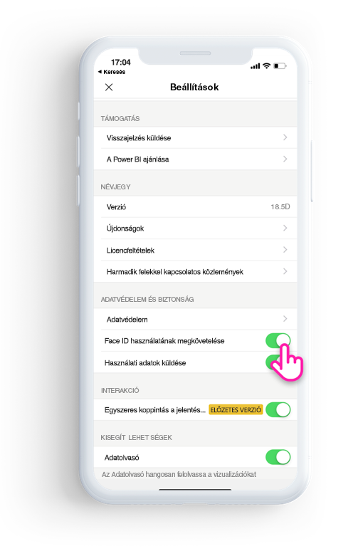

# A Power BI alkalmazás védelme a Face ID, a Touch ID vagy hitelesítő kód használatával 

A Power BI-ban kezelt adatok sok esetben bizalmasak, így védelemre van szükségük, hogy csak engedéllyel rendelkező felhasználók férhessenek hozzá. 

Az iOS Power BI alkalmazásban további azonosítási beállítások konfigurálásával védheti meg az adatait. Az alkalmazás minden elindításakor, illetve előtérbe hívásakor Face ID, Touch ID vagy hitelesítő kód megadásával léphet csak be.

|  |  |
|:--- |:--- |
| iPhone-ok |iPadek |

## A Face ID, a Touch ID vagy a hitelesítő kód bekapcsolása az alkalmazásbeállításokban

A Power BI további azonosítási beállításainak használatához lépjen az **Adatvédelem és biztonság** terület alkalmazásbeállításaira. Itt láthatók a Face ID, a Touch ID és a hitelesítő kód bekapcsolására vonatkozó beállítások az eszközfunkcióktól függően.

A beállítás bekapcsolása után a Power BI minden elindítása vagy előtérbe hívása után meg kell adnia a megfelelő azonosító adatokat. 

A Face ID, Touch ID vagy hitelesítő kód egyikének megkövetelését az iOS dönti el az eszközfunkcióktól függően. Ha az eszköz támogatja a Face ID-t, azt kell használnia. Ha az eszköz támogatja a Touch ID-t, azt kell használnia. Ha egyiket sem támogatja, hitelesítő kódot kell alkalmaznia.

## Face ID, Touch ID vagy hitelesítő kód megkövetelése MDM-mel

Egyes szervezetek olyan biztonsági szabályzatokkal és megfelelőségi követelményekkel rendelkeznek, amelyek további azonosítást tesznek kötelezővé a bizalmas üzleti adatok eléréséhez. 

Az iOS Power BI mobilalkalmazással a rendszergazdák leküldhetik az alkalmazáskonfigurációs beállításokat a Microsoft Intune-ból és egyéb mobileszköz-kezelési (MDM-) megoldásból, így vezérelhetik ezt a beállítást. A rendszergazdák az alkalmazásvédelmi szabályzattal kapcsolhatják be ezt a beállítást az összes felhasználónak vagy csak egyes csoportoknak.

|Kulcs  |Típus  |Leírás  |
|---------|---------|---------|
| com.microsoft.powerbi.mobile.ForceDeviceAuthentication | Logikai érték | Az alapértelmezett érték False (Hamis).  Ha True (Igaz) értékre van állítva, az alkalmazás megköveteli a Face ID, Touch ID vagy hitelesítő kód használatával történő azonosítást a felhasználóktól, mielőtt megtekinthetnék a Power BI-adatokat. Azoknak a felhasználóknak, akiknek nincs sem, Face ID, sem Touch ID vagy hitelesítő kód beállítva az eszközükön, kötelező ezt konfigurálniuk a Power BI megnyitásához.  |

## Következő lépések

[Az iOS Power BI alkalmazás távoli konfigurálása egy MDM-megoldással](mobile-app-configuration.md)
