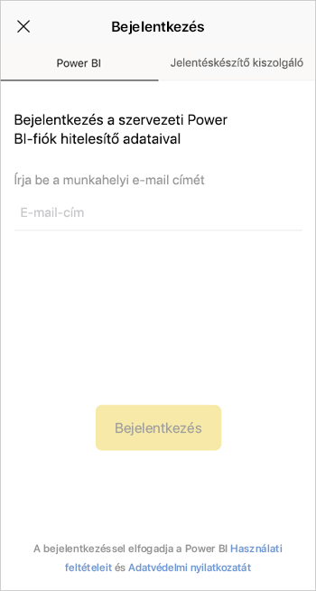
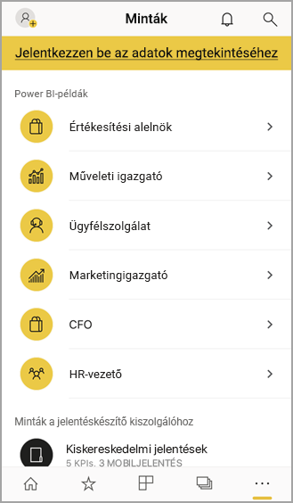

# Első lépések az iOS-eszközökhöz készült Power BI mobilalkalmazással
Az iPhone-on vagy iPad-en futó iOS-es Microsoft Power BI-alkalmazás mobil BI-élményt kínál a Power BI-hoz, a Power BI jelentéskészítő kiszolgálóhoz és a Reporting Services-hez. Az élő, érintéssel vezérelhető mobil hozzáférés révén bárhonnan megtekintheti és kezelheti vállalata helyszíni és felhőbeli irányítópultjait. Böngészheti az irányítópultokon szereplő adatokat, és megoszthatja azokat kollégáival e-mail vagy szöveges üzenet formájában. Kísérje figyelemmel a legidőszerűbb adatokat [Appla Watch](mobile-apple-watch.md)on.  

Létrehozhat Power BI-jelentéseket a Power BI Desktopban, és közzéteheti őket:

* [Közzéteheti őket a Power BI szolgáltatásban](../../service-get-started.md), és irányítópultokat hozhat létre.
* [Közzéteheti őket a helyszínen a Power BI jelentéskészítő kiszolgálón](../../report-server/quickstart-create-powerbi-report.md).

Ezután az iOS-es Power BI mobilalkalmazásban a helyszínen és a felhőben is dolgozhat az irányítópultokkal és a jelentésekkel.

Ismerje meg [a Power BI mobilalkalmazások újdonságait](mobile-whats-new-in-the-mobile-apps.md).

## Alkalmazás letöltése
[iOS-alkalmazás letöltése](https://go.microsoft.com/fwlink/?LinkId=522062 "Az iOS-alkalmazás letöltése") az Apple App Store-ból iPhone-ra vagy iPad-re.

Az iOS-es Power BI mobilalkalmazást az iOS 11 vagy újabb rendszert futtató eszközök bármelyikén futtathatja. 

## Regisztráció a Power BI szolgáltatásra
Ha még nem regisztrált, látogasson el a [powerbi.com](https://powerbi.microsoft.com/get-started/) webhelyre, és a **Power BI - Felhőbeli együttműködés és megosztás** területen válassza az **Ingyenes próba** lehetőséget.

## Power BI alkalmazás – Az első lépések
1. Nyissa meg az iOS-eszközön a Power BI alkalmazást.
2. Ha a Power BI-ba szeretne bejelentkezni, koppintson a **Power BI** lapra, és adja meg a bejelentkezési adatait.  
   Ha be szeretne jelentkezni a Reporting Services mobiljelentéseibe és a KPI-kbe, koppintson a **Jelentéskészítő kiszolgáló** lapra, és adja meg a bejelentkezési adatait.
   
   
   
   Az alkalmazásban elég a fióknak a képernyő bal felső sarkában található profilképére koppintania a Power BI és a jelentéskészítő kiszolgáló közötti váltáshoz. 

## A Power BI- és Reporting Services-minták kipróbálása
A Power BI- és Reporting Services-mintákat regisztráció nélkül is megtekintheti és kezelheti.

A minták eléréséhez koppintson a navigációs sáv **További lehetőségek** (...) elemére, és válassza a **Minták** lehetőséget.

Néhány Power BI-mintát számos jelentéskészítő kiszolgálói minta követ.

   
   
   > [!NOTE]
   > A mintákban nem minden funkció érhető el. Nem tekintheti meg például az irányítópult hátterében álló mintajelentéseket, a mintákat nem oszthatja meg másokkal, és nem jelölheti meg azokat kedvenceiként. 
   > 
   >

## A tartalmak megkeresése a Power BI mobilalkalmazásokban

Koppintson a fejlécben található nagyítóra a Power BI-tartalom keresésének megkezdéséhez.

## A kedvenc irányítópultok és jelentések megtekintése
Koppintson a navigációs sáv **Kedvencek** () elemére a Kedvencek lap megjelenítéséhez. 

További információ a [kedvencekről a Power BI-mobilalkalmazásokban](mobile-apps-favorites.md).

## Nagyvállalati támogatás a Power BI mobilalkalmazásaihoz
A cégek a Microsoft Intune használatával kezelhetik az eszközöket és alkalmazásokat, beleértve az Android és iOS rendszerhez készült Power BI-mobilalkalmazásokat.

A Microsoft Intune segítségével a cégek szabályozhatják az olyan elemeket, mint a hozzáférési PIN-kódok bekérése, az alkalmazások adatkezelési módja, vagy a nem használt alkalmazások alkalmazásadatainak titkosítása.

> [!NOTE]
> Ha a Power BI mobilalkalmazást egy iOS-eszközön használja, és a cége konfigurálta a Microsoft Intune MAM felügyeletet, a háttérben futó adatfrissítés ki van kapcsolva. A Power BI a weben futó Power BI szolgáltatásból frissíti az adatokat, amikor legközelebb belép az alkalmazásba.
> 

További információ a [Power BI-mobilalkalmazások Microsoft Intune-nal történő konfigurálásáról](../../service-admin-mobile-intune.md). 

## Következő lépések

* [Mi az a Power BI?](../../fundamentals/power-bi-overview.md)
* Kérdése van? [Kérdezze meg a Power BI közösségét](https://community.powerbi.com/)

