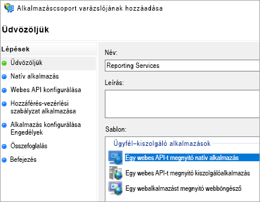
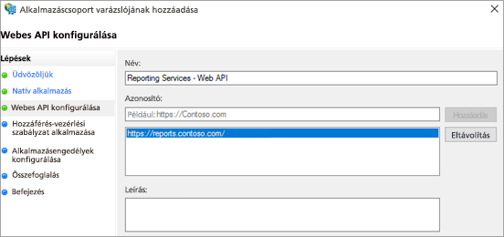
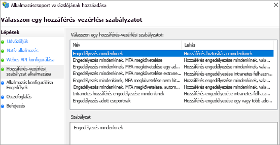
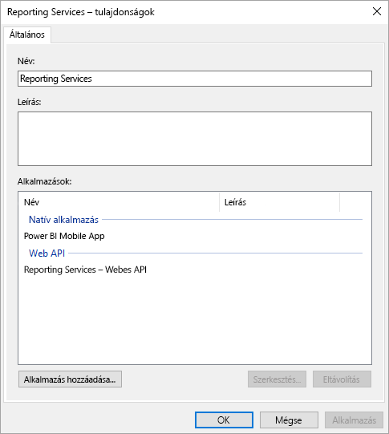
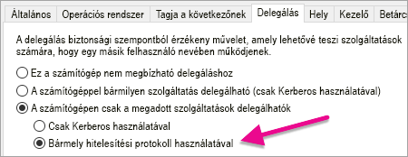
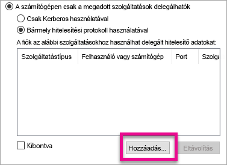
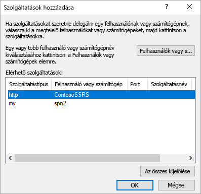
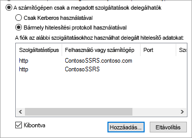
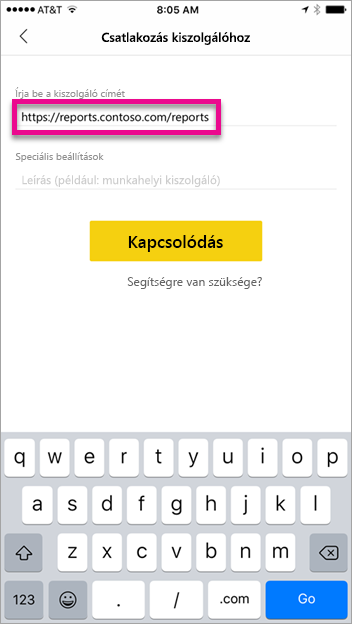
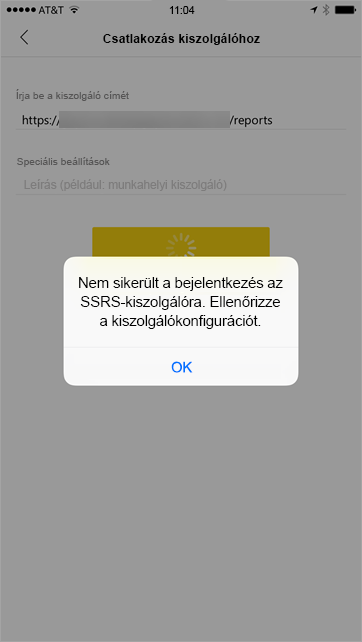

# <a name="using-oauth-to-connect-to-power-bi-report-server-and-ssrs"></a>OAuth használata a Power BI jelentéskészítő kiszolgáló és az SSRS csatlakoztatásához
Megtudhatja, hogyan konfigurálhatja a környezetét OAuth-hitelesítés támogatására a Power BI mobilalkalmazásban a Power BI jelentéskészítő kiszolgáló és az SQL Server Reporting Services 2016 (vagy újabb) csatlakoztatásához.


Az OAuth-hitelesítést a Power BI jelentéskészítő kiszolgálóhoz való csatlakozásra használhatja, a Reporting Services-t pedig mobiljelentések és KPI-k megjelenítésére. A Windows Server 2016 webalkalmazás-proxyhoz (WAP) biztosított fejlesztései lehetővé tették az ilyen típusú hitelesítés használatát.

   > [!NOTE]
   > Ne feledje, hogy a Microsoft Power BI jelentéskészítő kiszolgálón üzemeltetett Power BI-jelentések megtekintéséhez a WAP-on keresztül végzett hitelesítés jelenleg hivatalosan nem támogatott.

## <a name="requirements"></a>Követelmények
Szükséges a Windows Server 2016 a webalkalmazás-proxy (WAP) és az Active Directory összevonási szolgáltatások (ADFS) kiszolgálóihoz. Nincs szükség Windows 2016-os tartományműködési szintre.

## <a name="domain-name-services-dns-configuration"></a>A tartománynév-szolgáltatások (DNS) konfigurációja
Meg kell határoznia, milyen nyilvános URL-címhez csatlakozzon a Power BI mobilalkalmazás. Például az alábbihoz hasonlóan nézhet ki.

```
https://reports.contoso.com
```

A **jelentések** DNS-rekordját át kell irányítania a webalkalmazás-proxy (WAP) kiszolgáló nyilvános IP-címére. Ezen kívül konfigurálnia kell egy nyilvános DNS-rekordot is az ADFS-kiszolgálóhoz. Elképzelhető például, hogy az alábbi URL-címmel konfigurálta az ADFS-kiszolgálót.

```
https://fs.contoso.com
```

Az **fs** DNS-rekordját át kell irányítania a webalkalmazás-proxy (WAP) kiszolgáló nyilvános IP-címére, mert az is közzé lesz téve a WAP-alkalmazás részeként.

## <a name="certificates"></a>Tanúsítványok
A WAP-alkalmazáshoz és az ADFS-kiszolgálóhoz is konfigurálnia kell tanúsítványt. Mindkét tanúsítványnak egy érvényes, a mobileszközei által felismert, érvényes hitelesítésszolgáltatóhoz kell tartoznia.

## <a name="reporting-services-configuration"></a>Reporting Services – konfiguráció
A Reporting Services oldalán nem sok mindent kell konfigurálni. Csak meg kell győződnünk arról, hogy van egy érvényes egyszerű szolgáltatásnevünk (SPN), amely lehetővé teszi a Kerberos-hitelesítés megfelelő működését, és hogy a Reporting Servicesben engedélyezett az egyeztetéses hitelesítés.

### <a name="service-principal-name-spn"></a>Egyszerű szolgáltatásnév (SPN)
Az SPN egy egyedi azonosító egy Kerberos-hitelesítést használó szolgáltatáshoz. Mindenképpen szüksége lesz egy megfelelő HTTP SPN-re a jelentéskészítő kiszolgálón.

Információk a megfelelő egyszerű szolgáltatásnév (SPN) konfigurálásáról a jelentéskészítő kiszolgálón: [Egyszerű szolgáltatásnév (SPN) regisztrálása egy jelentéskészítő kiszolgálóhoz](https://msdn.microsoft.com/library/cc281382.aspx).

### <a name="enabling-negotiate-authentication"></a>Egyeztetéses hitelesítés engedélyezése
Ha engedélyezni szeretné a Kerberos-hitelesítés használatát, konfigurálnia kell a hitelesítés típusát a jelentéskészítő kiszolgálón RSWindowsNegotiate értékre. Ezt az rsreportserver.config fájlban teheti meg.

```xml
<AuthenticationTypes>  
    <RSWindowsNegotiate />  
    <RSWindowsKerberos />  
    <RSWindowsNTLM />  
</AuthenticationTypes>
```

További információk: [Reporting Services konfigurációs fájl módosítása](https://msdn.microsoft.com/library/bb630448.aspx) és [Windows-hitelesítés konfigurálása egy jelentéskészítő kiszolgálón](https://msdn.microsoft.com/library/cc281253.aspx).

## <a name="active-directory-federation-services-adfs-configuration"></a>Active Directory összevonási szolgáltatások (ADFS) – konfiguráció
Konfigurálnia kell az ADFS-t egy, a környezetén belül lévő Windows 2016-kiszolgálón. Ez a Kiszolgálókezelőben lehetséges a Kezelés területen a Szerepkörök és szolgáltatások hozzáadása lehetőség kiválasztásával. További információk: [Active Directory összevonási szolgáltatások](https://technet.microsoft.com/windows-server-docs/identity/active-directory-federation-services).

### <a name="create-an-application-group"></a>Alkalmazáscsoport létrehozása
Az AD FS-kezelő képernyőjén létre kell hoznia egy alkalmazáscsoportot a Reporting Serviceshez, amelyben majd szerepelhetnek a Power BI mobilalkalmazásokhoz tartozó adatok.

Az alkalmazáscsoportot az alábbi lépéseket követve hozhatja létre.

1. Az AD FS-kezelő alkalmazásban kattintson jobb gombbal az **Alkalmazáscsoportok** elemre, és válassza az **Alkalmazáscsoport hozzáadása...** lehetőséget.
   
   
2. Az Alkalmazáscsoport hozzáadása varázslón belül adjon **nevet** az alkalmazáscsoportnak, és válassza a **Webes API-t elérő natív alkalmazás** elemet.
   
   
3. Kattintson a **Tovább** gombra.
4. Adjon **nevet** a hozzáadni kívánt alkalmazásnak. 
5. Bár az **Ügyfél-azonosítót** automatikusan létrehozza a rendszer, a *484d54fc-b481-4eee-9505-0258a1913020* értéket adja meg iOS és Android rendszer esetében is.
6. Az alábbi **Átirányítási URL-címeket** érdemes felvenni:
   
   **Bejegyzések a Power BI – Mobileszközök alkalmazáshoz iOS esetében:**  
   msauth://code/mspbi-adal://com.microsoft.powerbimobile  
   msauth://code/mspbi-adalms://com.microsoft.powerbimobilems  
   mspbi-adal://com.microsoft.powerbimobile  
   mspbi-adalms://com.microsoft.powerbimobilems
   
   **Az Android alkalmazásoknak csak a következőre van szükségük:**  
   urn:ietf:wg:oauth:2.0:oob
   
   
7. Kattintson a **Tovább** gombra.
8. Adja meg a jelentéskészítő kiszolgáló URL-címét. Ez a külső URL-cím, amely eléri a webalkalmazás-proxyt. Ennek az alábbi formátumban kell lennie.
   
   > [!NOTE]
   > Ez az URL-cím megkülönbözteti a kis- és nagybetűket!
   > 
   > 
   
   *https://<url to report server>/reports*
   
   
9. Kattintson a **Tovább** gombra.
10. Válassza a vállalata igényeinek megfelelő **Hozzáférés-vezérlési házirendet**.
    
    
11. Kattintson a **Tovább** gombra.
12. Kattintson a **Tovább** gombra.
13. Kattintson a **Tovább** gombra.
14. Kattintson a **Bezárás** gombra.

Ha elkészült, az alkalmazáscsoport tulajdonságainak az alábbihoz hasonlóan kell megjelenniük.



## <a name="web-application-proxy-wap-configuration"></a>Webalkalmazás-proxy (WAP) konfigurációja
Érdemes engedélyeznie a Webalkalmazás-proxy (szerepkör) Windows-szerepkört a környezete egy kiszolgálóján. Ennek egy Windows 2016-kiszolgálón kell lennie. További információ: [Webalkalmazás-proxy a Windows Server 2016-ban](https://technet.microsoft.com/windows-server-docs/identity/web-application-proxy/web-application-proxy-windows-server) és [Alkalmazások közzététele AD FS előhitelesítéssel](https://technet.microsoft.com/windows-server-docs/identity/web-application-proxy/publishing-applications-using-ad-fs-preauthentication#a-namebkmk14apublish-an-application-that-uses-oauth2-such-as-a-windows-store-app).

### <a name="constrained-delegation-configuration"></a>Korlátozott delegálás konfigurálása
Az OAuth-hitelesítésről Windows-hitelesítésre váltáshoz korlátozott delegálást kell használnia protokollváltással. Ez része a Kerberos konfigurálásának. Már meghatároztuk a Reporting Services SPN-t a Reporting Services konfigurálása során.

A korlátozott delegálást konfigurálnunk kell a WAP-kiszolgáló gép Active Directory-fiókjában. Ha nem rendelkezik Active Directory jogosultságokkal, szüksége lehet egy tartományi rendszergazda segítségére.

A korlátozott delegálás konfigurálásához a következőket kell tennie.

1. Indítsa el az **Active Directory – felhasználók és számítógépek** elemet egy olyan számítógépen, ahol telepítve vannak az Active Directory-eszközök.
2. Keresse meg a WAP-kiszolgálóhoz tartozó számítógépfiókot. Alapértelmezés szerint ez a számítógépek tárolójában van.
3. Kattintson a jobb gombbal a WAP-kiszolgálóra, és lépjen a **Tulajdonságok** elemhez.
4. Válassza a **Delegálás** lapot.
5. Válassza **A számítógépen csak a megadott szolgáltatások delegálhatók**, majd a **Bármely hitelesítési protokoll használatával** elemet.
   
   
   
   Ez beállítja a korlátozott delegálást ehhez a WAP-kiszolgáló számítógépfiókhoz. Ezután meg kell adnunk a szolgáltatásokat, amelyekre ez a számítógép delegálhat.
6. Válassza a **Hozzáadás...** lehetőséget a szolgáltatások panelen.
   
   
7. Válassza a **Felhasználók vagy számítógépek...** elemet
8. Adja meg a Reporting Servicesben használt szolgáltatásfiókját. Ehhez a fiókhoz adta hozzá a SPN-t a Reporting Services konfigurálása során.
9. Válassza ki a Reporting Services SPN-jét, majd válassza az **OK** gombot.
   
   > [!NOTE]
   > Elképzelhető, hogy csak a NetBIOS SPN-t látja. Valójában a NetBIOS és az FQDN SPN-t is ki fogja választani a rendszer, ha létezik mindkettő.
   > 
   > 
   
   
10. Az eredményeknek a következőképpen kell kinéznie, ha bejelölte a **Kibontva** jelölőnégyzetet.
    
    
11. Kattintson az **OK** gombra.

### <a name="add-wap-application"></a>WAP-alkalmazás hozzáadása
Bár közzétehet alkalmazásokat a Jelentéshozzáférés-felügyeleti konzolon, mi az alkalmazást a PowerShellen keresztül szeretnénk létrehozni. Itt látható az alkalmazás hozzáadására szolgáló parancs.

```powershell
Add-WebApplicationProxyApplication -Name "Contoso Reports" -ExternalPreauthentication ADFS -ExternalUrl https://reports.contoso.com/reports/ -ExternalCertificateThumbprint "0ff79c75a725e6f67e3e2db55bdb103efc9acb12" -BackendServerUrl http://ContosoSSRS/reports/ -ADFSRelyingPartyName "Reporting Services - Web API" -BackendServerAuthenticationSPN "http/ContosoSSRS.contoso.com" -UseOAuthAuthentication
```

| Paraméter | Megjegyzések |
| --- | --- |
| **ADFSRelyingPartyName** |Ez az ADFS-en belüli alkalmazáscsoport részeként létrehozott webes API név. |
| **ExternalCertificateThumbprint** |Ez a külső felhasználókhoz használható tanúsítvány. Fontos, hogy ez a tanúsítvány érvényes legyen a mobileszközökön, és megbízható hitelesítésszolgáltatótól származzon. |
| **BackendServerUrl** |Ez a jelentéskészítő kiszolgáló URL-címe a WAP-kiszolgálóról. Ha a WAP-kiszolgáló egy DMZ-ben van, előfordulhat, hogy teljes tartománynevet kell használnia. Győződjön meg arról, hogy ezt az URL-t el tudja érni a webböngészőből a WAP-kiszolgálón. |
| **BackendServerAuthenticationSPN** |Ez a Reporting Services konfigurálása során létrehozott SPN. |

### <a name="setting-integrated-authentication-for-the-wap-application"></a>Integrált hitelesítés beállítása a WAP-alkalmazáshoz
A WAP-alkalmazás hozzáadása után be kell állítania a BackendServerAuthenticationMode módot az IntegratedWindowsAuthentication használatához. Ennek beállításához szüksége lesz a WAP-alkalmazás azonosítójára.

```powershell
Get-WebApplicationProxyApplication “Contoso Reports” | fl
```


Futtassa az alábbi parancsot a BackendServerAuthenticationMode beállításához a WAP-alkalmazás azonosítójával.

```powershell
Set-WebApplicationProxyApplication -id 30198C7F-DDE4-0D82-E654-D369A47B1EE5 -BackendServerAuthenticationMode IntegratedWindowsAuthentication
```


## <a name="connecting-with-the-power-bi-mobile-app"></a>Csatlakozás a Power BI mobilalkalmazással
A Power BI mobilalkalmazással csatlakoznia kell a Reporting Services-példányhoz. Ehhez adja meg a WAP-alkalmazása **Külső URL-címét**.



Amikor a **Csatlakozás** lehetőséget választja, a rendszer átirányítja az ADFS bejelentkezési oldalára. Adjon meg érvényes hitelesítő adatokat a tartományhoz.


Miután a **Bejelentkezés** lehetőséget választja, megjelennek a Reporting Services-kiszolgáló elemei.


## <a name="multi-factor-authentication"></a>Többtényezős hitelesítés
A többtényezős hitelesítés engedélyezésével még biztonságosabbá teheti a környezetet. További információk: [Az AD FS 2016 és az Azure MFA konfigurálása](https://technet.microsoft.com/windows-server-docs/identity/ad-fs/operations/configure-ad-fs-2016-and-azure-mfa).

## <a name="troubleshooting"></a>Hibaelhárítás

### <a name="you-receive-the-error-failed-to-login-to-ssrs-server-please-verify-server-configuration"></a>A következő üzenet jelenik meg: Nem sikerült a bejelentkezés az SSRS-kiszolgálóra. Ellenőrizze a kiszolgálókonfigurációt.



Beállíthatja a [Fiddlert](http://www.telerik.com/fiddler) proxynak a mobileszközökhöz, hogy lássa, meddig jutott a kérés. Ha engedélyezni szeretné a Fiddler-proxyt a telefonján, be kell állítania az [iOS és Android rendszerhez készült CertMaker](http://www.telerik.com/fiddler/add-ons) eszközt a Fiddlert futtató számítógépen. Ez egy Telerik-bővítmény a Fiddlerhez.

Ha a bejelentkezés sikeresen működik a Fiddler használatakor, előfordulhat, hogy probléma van a WAP-alkalmazás vagy az ADFS-kiszolgáló tanúsítványával. A tanúsítványok érvényességének ellenőrzéséhez használhat olyan eszközöket, mint a [Microsoft Message Analyzer](https://www.microsoft.com/download/details.aspx?id=44226).

## <a name="next-steps"></a>Következő lépések
[Egyszerű szolgáltatásnév (SPN) regisztrálása egy jelentéskészítő kiszolgálóhoz](https://msdn.microsoft.com/library/cc281382.aspx)  
[Reporting Services konfigurációs fájl módosítása](https://msdn.microsoft.com/library/bb630448.aspx)  
[Windows-hitelesítés konfigurálása egy jelentéskészítő kiszolgálón](https://msdn.microsoft.com/library/cc281253.aspx)  
[Active Directory összevonási szolgáltatások](https://technet.microsoft.com/windows-server-docs/identity/active-directory-federation-services)  
[Webalkalmazás-proxy a Windows Server 2016-ban](https://technet.microsoft.com/windows-server-docs/identity/web-application-proxy/web-application-proxy-windows-server)  
[Alkalmazások közzététele AD FS előhitelesítéssel](https://technet.microsoft.com/windows-server-docs/identity/web-application-proxy/publishing-applications-using-ad-fs-preauthentication#a-namebkmk14apublish-an-application-that-uses-oauth2-such-as-a-windows-store-app)  
[Az AD FS 2016 és az Azure MFA konfigurálása](https://technet.microsoft.com/windows-server-docs/identity/ad-fs/operations/configure-ad-fs-2016-and-azure-mfa)  
További kérdései vannak? [Kérdezze meg a Power BI közösségét](http://community.powerbi.com/)

