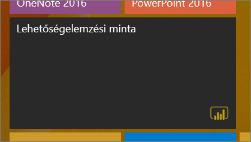
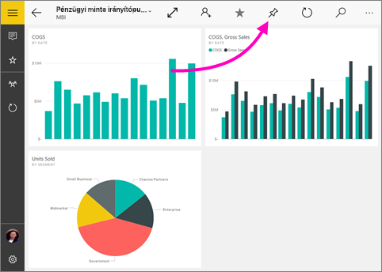
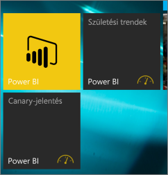

# Irányítópult rögzítése a Windows 10 kezdőképernyőjén a Power BI mobilalkalmazásból
A Power BI-irányítópultok rögzíthetők a Windows kezdőképernyőjén a Windows 10 rendszerhez készült Power BI mobilalkalmazásból. Amikor a kezdőképernyőn a csempére koppint, az irányítópult megnyílik a Windows 10 rendszerhez készült Power BI mobilalkalmazásban.

>[!NOTE]
>A Power BI-mobilalkalmazás támogatása a **Windows 10 Mobile rendszerű telefonokhoz** 2021. március 16-án megszűnik. [További információ](https://go.microsoft.com/fwlink/?linkid=2121400)

## Irányítópult rögzítése a kezdőképernyőn csempeként
1. Nyisson meg egy irányítópultot.
2. Koppintson a **Rögzítés a kezdőképernyőn**  ikonra.
   
   
   
   A csempe megtekintéséhez lépjen az eszköz kezdőképernyőjére.
   
   

## Következő lépések
* [A Windows 10-hez készült Power BI mobilalkalmazás letöltése](https://go.microsoft.com/fwlink/?LinkID=526478) a Windows Áruházból  
* [A Windows 10-hez készült Power BI mobilalkalmazás használatának első lépései](mobile-windows-10-phone-app-get-started.md)  
* [Mi az a Power BI?](../../fundamentals/power-bi-overview.md)
* Kérdése van? [Kérdezze meg a Power BI közösségét](https://community.powerbi.com/)
