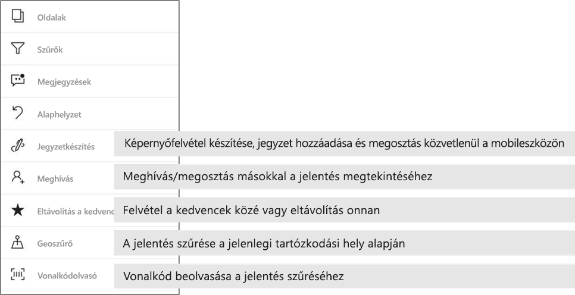

# Jelentések vizsgálata a Power BI mobilalkalmazásokban
A következőkre vonatkozik:

|  |  |  |  |  |
|:--- |:--- |:--- |:--- |:--- |
| iPhone-ok |iPadek |Android rendszerű telefonok |Android rendszerű táblagépek |Windows 10-eszközök |

A Power BI jelentés egy interaktív nézet az adatokról különböző, az adatokból származó eredményeket és elemzéseket bemutató vizualizációkkal. A jelentések megtekintése a Power BI mobilalkalmazásokban a harmadik lépés egy háromlépéses folyamatban.

1. [Jelentések létrehozása a Power BI Desktopban](../../desktop-report-view.md). A jelentéseket [optimalizálhatja is telefonra](mobile-apps-view-phone-report.md) a Power BI Desktopban. 
2. A jelentéseket tegye közzé a Power BI szolgáltatásban [(https://powerbi.com)](https://powerbi.com) vagy a [Power BI jelentéskészítő kiszolgálón](../../report-server/get-started.md).  
3. Ezután használhatja a jelentéseket a Power BI mobilalkalmazásokban.

## Power BI jelentések megnyitása a mobilalkalmazásban
A Power BI jelentéseket a rendszer a beszerzési helyük függvényében különböző helyeken tárolja a mobilalkalmazásban. Lehetnek az Alkalmazások, a Velem megosztva, a Munkaterületek (beleértve a Saját munkaterületet) területen vagy egy jelentéskészítő kiszolgálón. Néha át kell lépnie egy kapcsolódó irányítópultra egy jelentésért, néha pedig listázva vannak.

A listákban és a menükben egy ikon látható a jelentések neve mellett, így könnyebben felismerhető, hogy egy bizonyos elem jelentés. 

 

A Power BI Mobile alkalmazásokban kétféle ikon jelöli a jelentéseket:

*  Ez arra utal, hogy a jelentés fekvő tájolással jelenik meg az alkalmazásban, és ugyanolyan, mint a böngészőben.

*  Ez arra utal, hogy a jelentésnek van legalább egy olyan oldala, amely telefonra van optimalizálva, és álló elrendezéssel jelenik meg. 

Megjegyzés: Ha fekvő tájolással tartja a telefont, akkor is a fekvő elrendezés jelenik meg, ha a jelentésoldalnak van telefonos elrendezése. 

Ha meg szeretne nyitni egy jelentést egy irányítópultról, koppintson egy csempén a jobb felső sarokban látható három pontra (...), majd válassza a **Jelentés megnyitása** parancsot.
  
  
  
  Nem minden csempénél van lehetőség a jelentés megnyitására. Azok a csempék például, amelyek egy, a Q&A mezőben feltett kérdéssel jöttek létre, nem nyitnak meg jelentéseket a rájuk koppintáskor. 
  
## A jelentésekkel végezhető műveletek
Ha megnyitott egy jelentést az alkalmazásban, elkezdhet dolgozni vele. A jelentésekkel és az adataikkal sokféle művelet végezhető. A jelentés láblécében találja a jelentésben elvégezhető műveleteket. Ezenkívül a jelentésben látható adatokra koppintva, illetve az adatokat hosszan megérintve részletezve is vizsgálhatja az adatokat.

### A koppintás és a hosszú érintés használata
A koppintás ugyanúgy működik, mint egy egérkattintás. Ha tehát egy jelentésben keresztkijelölést szeretne használni egy adatpont alapján, akkor koppintson rá arra az adatpontra.
Ha rákoppint egy szeletelőértékre, azzal kijelöli az értéket, a jelentés többi részét pedig szeleteli ennek az értéknek az alapján. Ha egy hivatkozásra, gombra vagy könyvjelzőre koppint, akkor az aktiválódik, azzal a művelettel, amit a jelentés készítője meghatározott.

Alighanem észrevette már, hogy ha rákoppint egy vizualizációra, szegély jelenik meg körülötte. A szegély jobb felső sarkában három pont (...) látható. Ha erre koppint, megjelenik egy menü, benne a vizualizáción elvégezhető műveletekkel.

### Elemleírások és részletezési műveletek

Ha hosszan megérint egy adatpontot, megjelenik egy elemleírás, amely bemutatja az adatpont által megjelenített adatokat. 

Ha a jelentés készítője beállította a jelentésoldal elemleírását, akkor a jelentésoldal elemleírása lesz az alapértelmezett elemleírás.

> [!NOTE]
> A jelentések elemleírásai 640 pixelesnél nagyobb eszközökön, 320-as megjelenítéssel támogatottak. Ha kisebb eszközt használ, akkor az alkalmazás az alapértelmezett elemleírásokat használja.

A jelentések szerzői meghatározhatnak hierarchiákat adatokban és a jelentés oldalai közötti kapcsolatban. A hierarchia lehetővé teszi a vizualizációkban és az értékeknél a lehatolást, a felhatolást és részletezést egy másik jelentéslapon. Így tehát nemcsak az elemleírásban láthatja az elérhető részletezési lehetőségeket, hanem a láblécben is, ha hosszan megérint egy értéket. 

*Részletezés* használatakor, ha rákoppint a vizualizáció egy meghatározott részére, a Power BI a jelentés egy másik oldalára irányítja, amelyet annak az értéknek az alapján szűr, amelyre koppintott.  A jelentés szerzője definiálhat egy vagy több részletező beállítást, amelyek mindegyike egy másik oldalra irányítja át. Ebben az esetben kiválaszthatja, hogy melyiket szeretné részletesen megjeleníteni. A vissza gomb visszaviszi a jelentés előző oldalára.

Olvassa el, hogyan [adhat hozzá részletezést a Power BI Desktopban](../../desktop-drillthrough.md).
   
   > [!IMPORTANT]
   > A Power BI Mobile alkalmazásban megjelenő mátrix és a tábla típusú vizualizációkban csak a cellaértékeknél lehet részletezést indítani, oszlop- és sorfejlécekből nem.
   
   
   
### A jelentés láblécében szereplő műveletek használata
A jelentés láblécében azokat a műveleteket találja, amelyeket végrehajthat az adott jelentésoldalon vagy a teljes jelentésben. A láblécben gyorsan elérheti a leghasznosabb műveleteket, a három pontnál (...) pedig minden műveletet megtalál.

A láblécről végrehajtható műveletek a következők:
1) A jelentés szűrője és a keresztkijelölések visszaállíthatók az eredeti állapotukba.
2) Megnyitható a beszélgetési panel, ahol megtekinthetők a jelentéshez fűzött megjegyzések, és újak is megadhatók.
3) Megnyitható a szűrőpanel, amelyen látható és módosítható a jelentésben pillanatnyilag használt szűrő.
4) Listázható a jelentés összes oldala. Ha rákoppint egy oldal nevére, akkor betöltődik és megjelenik az az oldal.
Úgy lapozhatja a jelentést, hogy a képernyő szélétől a közepe felé pöccint.
5) Megtekintheti a jelentés összes műveletét.

#### A jelentés összes művelete
Ha jelentés láblécén látható ... elemre koppint, megjelenik minden olyan művelet, amelyet végrehajthat a jelentésen. 

Előfordulhat, hogy egyes műveletek le vannak tiltva, mert az adott jelentésen nem lehet elvégezni őket.
Például:
1) **Az aktuális hely alapján történő szűrés** csak akkor érhető el, ha a jelentés adatait földrajzi adatokkal kategorizálta a készítője. [Ebből a cikkből megtudhatja, hogyan azonosíthatja a földrajzi adatokat a jelentésben](https://docs.microsoft.com/power-bi/desktop-mobile-geofiltering).
2) A **jelentésnek a beszkennelt vonalkód alapján történő szűrése** csak akkor érhető el, ha korábban a jelentés adathalmazát vonalkódként címkézték meg. [Így címkézheti meg a vonalkódokat a Power BI Desktopban](https://docs.microsoft.com/power-bi/desktop-mobile-barcodes). 
3) A **meghívás** lehetősége csak akkor érhető el, ha Önnek van engedélye arra, hogy másokkal megossza a jelentést. Erre csak akkor van engedélye, ha Ön a jelentés tulajdonosa, vagy a tulajdonos adott Önnek újramegosztási engedélyt.
4) A **feliratozásra és megosztásra** való lehetőség le lehet tiltva, ha a cégnél egy olyan [Intune-beli védelmi szabályzat](https://docs.microsoft.com/intune/app-protection-policies) van érvényben, amely tiltja a Power BI Mobile alkalmazásból történő megosztást. 

## Következő lépések
* [Telefonra optimalizált Power BI-jelentések megtekintése és használata](mobile-apps-view-phone-report.md)
* [Telefonra optimalizált verzió létrehozása egy jelentéshez](../../desktop-create-phone-report.md)
* Kérdése van? [Kérdezze meg a Power BI közösségét](http://community.powerbi.com/)

