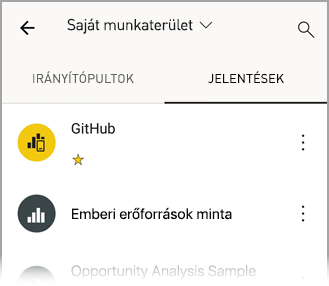
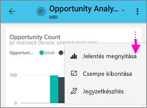
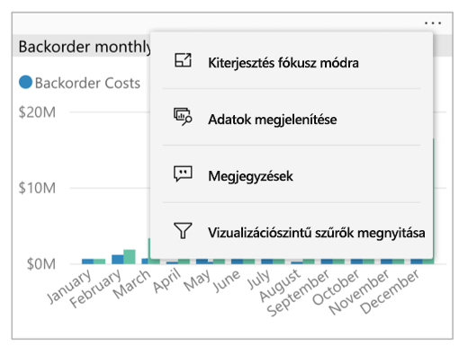
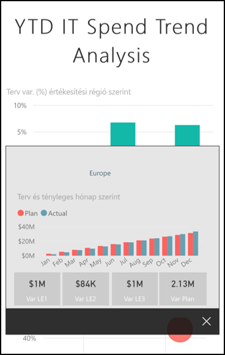
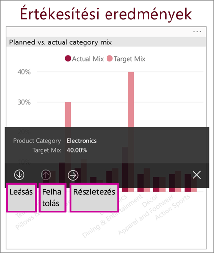
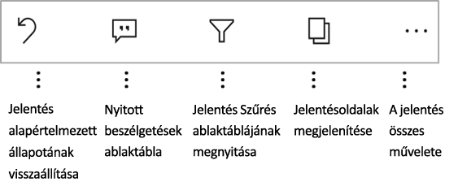
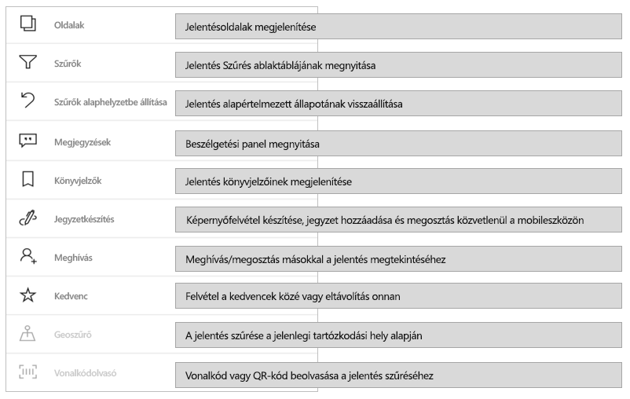
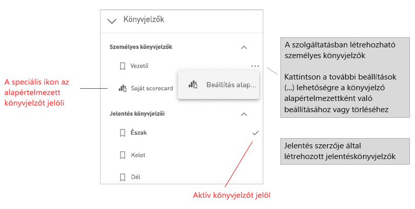
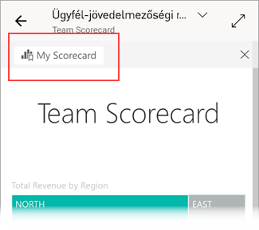

# Jelentések vizsgálata a Power BI mobilalkalmazásokban
A következőkre vonatkozik:

|  |  |  |  |  |
|:---: |:---: |:---: |:---: |:---: |
| iPhone-ok |iPadek |Android rendszerű telefonok |Android rendszerű táblagépek |Windows 10-eszközök |

A Power BI jelentés egy interaktív nézet az adatokról különböző, az adatokból származó eredményeket és elemzéseket bemutató vizualizációkkal. A jelentések megtekintése a Power BI mobilalkalmazásokban a harmadik lépés egy háromlépéses folyamatban:

1. [Jelentések létrehozása a Power BI Desktopban](../../desktop-report-view.md). A jelentéseket [optimalizálhatja is telefonra](mobile-apps-view-phone-report.md) a Power BI Desktopban.
2. A jelentéseket tegye közzé a Power BI szolgáltatásban [(https://powerbi.com)](https://powerbi.com) vagy a [Power BI jelentéskészítő kiszolgálón](../../report-server/get-started.md).  
3. Ezután használhatja a jelentéseket a Power BI mobilalkalmazásokban.

## Power BI jelentések megnyitása a mobilalkalmazásban
A Power BI jelentéseket a rendszer a beszerzési helyük függvényében különböző helyeken tárolja a mobilalkalmazásban. Lehetnek az Alkalmazások, a Velem megosztva, a Munkaterületek (beleértve a Saját munkaterületet) területen vagy egy jelentéskészítő kiszolgálón. Néha át kell lépnie egy kapcsolódó irányítópultra egy jelentésért, néha pedig listázva vannak.

A listákban és a menükben egy ikon látható a jelentések neve mellett, így könnyebben felismerhető, hogy egy bizonyos elem jelentés:

A Power BI-mobilalkalmazásokban kétféle ikon jelöli a jelentéseket:

*  Egy fekvő tájolásban megjelenő jelentést jelez. Ez ugyanúgy fog megjelenni, mint egy böngészőben.

*  Ez arra utal, hogy a jelentésnek van legalább egy olyan oldala, amely telefonra van optimalizálva, és álló elrendezéssel jelenik meg.

> [!NOTE]
> Ha fekvő tájolással tartja a telefont, akkor is a fekvő elrendezés jelenik meg, ha a jelentésoldalnak van telefonos elrendezése.

Ha meg szeretne nyitni egy jelentést egy irányítópultról, koppintson egy csempén a jobb felső sarokban látható **További beállítások** (...) elemre, majd koppintson a **Jelentés megnyitása** elemre:
  
  
  
  Nem minden csempe nyitható meg jelentésként. Azok a csempék például, amelyek egy, a Q&A mezőben feltett kérdéssel jöttek létre, nem nyitnak meg jelentéseket, ha rájuk koppint.
  
## Jelentések használata
Ha megnyitott egy jelentést az alkalmazásban, elkezdhet dolgozni vele. A jelentésekkel és az adataikkal sokféle művelet végezhető. A jelentés láblécében találja a jelentésben elvégezhető műveleteket. Ezenkívül a jelentésben látható adatokra koppintva, illetve az adatokat hosszan megérintve részletezve is vizsgálhatja az adatokat.

### Egykoppintásos és kétkoppintásos kezelés
Amikor letölti a Power BI mobilalkalmazást, az egykoppintásos kezelésre van beállítva. Ez azt jelenti, hogy amikor valamilyen művelet, például egy szeletelőelem kijelölése, keresztkiemelés, hivatkozás vagy gomb választása céljából egy vizualizációra koppint, a koppintás kijelöli a vizualizációt, és a kívánt műveletet is végrehajtja.

Ha kívánja, átválthat kétkoppintásos kezelésre. Kétkoppintásos kezelés esetén a vizualizációra koppintva kijelöli azt, majd egy újabb koppintással hajthatja végre a kívánt műveletet.

Kétkoppintásos kezelésre átváltani vagy az egykoppintásos kezelésre visszaváltani az [alkalmazás kezelési beállításai](./mobile-app-interaction-settings.md) között lehet.

### A koppintás és a hosszú érintés használata
A koppintás egyenértékű a kattintással. Ha tehát egy jelentésben keresztkijelölést szeretne használni egy adatpont alapján, akkor koppintson rá arra az adatpontra.
Ha rákoppint egy szeletelőértékre, azzal kijelöli az értéket, a jelentés többi részét pedig szeleteli ennek az értéknek az alapján.
Ha egy hivatkozásra, gombra vagy könyvjelzőre koppint, akkor az aktiválódik azzal a művelettel, amelyet a jelentés készítője meghatározott.

Alighanem észrevette már, hogy ha rákoppint egy vizualizációra, szegély jelenik meg körülötte. A szegély jobb felső sarkában látható a **További beállítások** (...). Ha a három pontra koppint, megjelenik az adott vizualizáción elvégezhető műveletek menüje:

### Elemleírások és részletezési műveletek
Ha hosszan megérint egy adatpontot, megjelenik egy elemleírás, amely bemutatja az adatpont által megjelenített adatokat:

Ha a jelentés készítője beállította a jelentésoldal elemleírását, akkor a jelentésoldal elemleírása lesz az alapértelmezett elemleírás:

> [!NOTE]
> A jelentések elemleírásai legalább 640 pixeles eszközökön, 320 pixeles megjelenítéssel támogatottak. Ha kisebb eszközt használ, akkor az alkalmazás az alapértelmezett elemleírásokat használja.

A jelentések szerzői meghatározhatnak hierarchiákat adatokban és a jelentés oldalai közötti kapcsolatban. A hierarchia lehetővé teszi a vizualizációkban és az értékeknél a lehatolást, a felhatolást és részletezést egy másik jelentéslapon. Így tehát nemcsak az elemleírásban láthatja az elérhető részletezési lehetőségeket, hanem a láblécben is, ha hosszan megérint egy értéket:

*Részletezés* használatakor, ha rákoppint a vizualizáció egy meghatározott részére, a Power BI a jelentés egy másik oldalára irányítja, amelyet annak az értéknek az alapján szűr, amelyre koppintott. A jelentés szerzője definiálhat egy vagy több részletező beállítást, amelyek mindegyike egy másik oldalra irányítja át. Ebben az esetben kiválaszthatja, hogy melyiket szeretné részletesen megjeleníteni. A vissza gomb visszaviszi az előző oldalra.

További információért olvassa el, hogyan [adhat hozzá részletezést a Power BI Desktopban](../../desktop-drillthrough.md).
   
   > [!IMPORTANT]
   > A Power BI-mobilalkalmazásokban megjelenő mátrix és a tábla típusú vizualizációkban csak a cellaértékeknél lehet részletezést indítani, oszlop- és sorfejlécekből nem.
   
   
   
### A jelentés láblécében szereplő műveletek használata
A jelentés láblécében azokat a műveleteket találja, amelyeket végrehajthat az adott jelentésoldalon vagy a teljes jelentésben. A lábléc gyors hozzáférést biztosít a leggyakrabban használt műveletekhez. A **További beállítások** (...) gombra koppintva más műveleteket is elérhet:

A láblécről végrehajtható műveletek a következők:
* A jelentés szűrője és a keresztkijelölések visszaállíthatók az eredeti állapotukba.
* Megnyitható a beszélgetési panel, ahol megtekinthetők a jelentéshez fűzött megjegyzések, és újak is megadhatók.
* Megnyitható a szűrőpanel, amelyen látható és módosítható a jelentésben pillanatnyilag használt szűrő.
* A jelentés oldalainak listázása. Ha rákoppint egy oldal nevére, akkor betöltődik és megjelenik az oldal.
Úgy lapozhatja a jelentést, hogy a képernyő szélétől a közepe felé pöccint.
* Megtekintheti a jelentés összes műveletét.

#### A jelentés összes művelete
Ha jelentés láblécén a **További beállítások** (...) elemre koppint, megjelenik minden olyan művelet, amelyet végrehajthat a jelentésen:

Előfordulhat, hogy egyes műveletek le vannak tiltva, mert az adott jelentésen nem lehet elvégezni őket.
Például:

A **Könyvjelzők** elem csak akkor jelenik meg, ha lettek beállítva [könyvjelzők](mobile-reports-in-the-mobile-apps.md#bookmarks) a jelentésben. A Power BI szolgáltatásban definiálható személyes könyvjelzők és a jelentés létrehozója által definiált könyvjelzők is megjelennek. Ha egy könyvjelző alapértelmezett könyvjelzőként van definiálva, a jelentés ebben a nézetben nyílik meg, amikor betöltődik.

A **feliratozásra és megosztásra** való lehetőség ki lehet kapcsolva, ha a cégnél egy olyan [Intune-beli védelmi szabályzat](https://docs.microsoft.com/intune/app-protection-policies) van érvényben, amely tiltja a Power BI-mobilalkalmazásból történő megosztást.

A **meghívás** lehetősége csak akkor érhető el, ha Önnek van engedélye arra, hogy másokkal megossza a jelentést. Erre csak akkor van engedélye, ha Ön a jelentés tulajdonosa, vagy a tulajdonos adott Önnek újramegosztási engedélyt.

**Az aktuális hely alapján történő szűrés** csak akkor érhető el, ha a jelentés adatait földrajzi adatokkal kategorizálta a készítője. További információ: [Földrajzi adatok azonosítása jelentésekben](https://docs.microsoft.com/power-bi/desktop-mobile-geofiltering).

A **jelentésnek a beszkennelt vonalkód alapján történő szűrése** csak akkor érhető el, ha korábban a jelentés adathalmazát **vonalkódként** címkézték meg. További információt a [Vonalkódok felcímkézése a Power BI Desktopban](https://docs.microsoft.com/power-bi/desktop-mobile-barcodes) című cikkben találhat.

### Könyvjelzők

A Power BI mobilalkalmazás a jelentés létrehozója által definiált és a Power BI szolgáltatásban definiálható személyes könyvjelzőket is támogatja. A könyvjelzők menüjét a **További beállítások** (...) alatt találhatja meg a [Jelentés műveletei eszköztárban](mobile-reports-in-the-mobile-apps.md#all-report-actions).

Az alapértelmezett könyvjelzőket egy speciális ikon jelöli. A személyes könyvjelzőkhöz úgy állíthatja be, kapcsolhatja ki vagy módosíthatja az alapértelmezett beállítást, hogy a módosítani kívánt könyvjelző melletti **További lehetőségek (...)** elemre koppint, majd a **Beállítás alapértelmezettként** vagy az **Alapértelmezés törlése** lehetőségre kattint.

Ha egy jelentésnek egy könyvjelzőnézete van megnyitva, a könyvjelző neve megjelenik a jelentés tetején.

[További információ a könyvjelzőkről a Power BI szolgáltatásban](https://docs.microsoft.com/power-bi/consumer/end-user-bookmarks).

## Jelentések felhasználói felületének konfigurálása
A Power BI mobilalkalmazásban többféle beállítással szabályozható a jelentés felülete. Jelenleg a következők konfigurálhatók
* **Jelentésvizualizációk kezelése**: Választhat az egykoppintásos és a kétkoppintásos kezelési mód között.
* **Adatfrissítési mód**: Kiválaszthatja, hogy a jelentés adatainak frissítéséhez egy gomb vagy egy legördíthető művelet álljon rendelkezésre.
* **Jelentés láblécének láthatósága**: Választhat, rögzített láblécet, amely mindig látható, vagy dinamikus láblécet, amely a műveletektől (például görgetéstől) függően van elrejtve vagy megjelenítve.

Ezeknek a beállításoknak a módosításáról az [alkalmazás kezelési beállításairól](./mobile-app-interaction-settings.md) szóló szakaszban talál információ.

## Következő lépések
* [Telefonra optimalizált Power BI-jelentések megtekintése és használata](mobile-apps-view-phone-report.md)
* [Telefonra optimalizált verzió létrehozása egy jelentéshez](../../desktop-create-phone-report.md)
* Kérdése van? [Kérdezze meg a Power BI közösségét](https://community.powerbi.com/)

