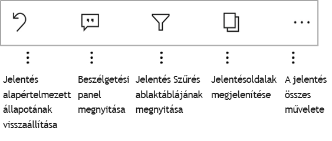

# Jelentések vizsgálata a Power BI mobilalkalmazásokban
A következőkre vonatkozik:

|  |  |  |  |  |
|:--- |:--- |:--- |:--- |:--- |
| iPhone-ok |iPadek |Android rendszerű telefonok |Android rendszerű táblagépek |Windows 10-eszközök |

A Power BI jelentés egy interaktív nézet az adatokról különböző, az adatokból származó eredményeket és elemzéseket bemutató vizualizációkkal. A jelentések megtekintése a Power BI mobilalkalmazásokban a harmadik lépés egy háromlépéses folyamatban.

1. [Jelentések létrehozása a Power BI Desktopban](../../desktop-report-view.md). A jelentéseket [optimalizálhatja is telefonra](mobile-apps-view-phone-report.md) a Power BI Desktopban. 
2. A jelentéseket tegye közzé a Power BI szolgáltatásban [(https://powerbi.com)](https://powerbi.com) vagy a [Power BI jelentéskészítő kiszolgálón](../../report-server/get-started.md).  
3. Ezután használhatja a jelentéseket a Power BI mobilalkalmazásokban.

## Power BI jelentések megnyitása a mobilalkalmazásban
A Power BI jelentéseket a rendszer a beszerzési helyük függvényében különböző helyeken tárolja a mobilalkalmazásban. Lehetnek az Alkalmazások, a Velem megosztva, a Munkaterületek (beleértve a Saját munkaterületet) területen vagy egy jelentéskészítő kiszolgálón. Néha át kell lépnie egy kapcsolódó irányítópultra egy jelentésért, néha pedig listázva vannak.

A listákat és menüket megtalálja a jelentés neve melletti ikon tisztában vele, hogy ezt az elemet a jelentés segít. 

 

Nincsenek két ikon közül a jelentések a Power BI Mobile-alkalmazások:

*  azt jelzi, hogy egy jelentést, amely fekvő tájolás esetén, az alkalmazásban megjelenik, és azok ugyanúgy néznek hogyan jelenik meg a böngészőben.

*  azt jelzi, hogy egy jelentést, amelyben legalább egy telefonos optimalizált jelentésoldal, álló megjelenik. 

Megjegyzés: A telefonon fekvő birtoklása, mindig megjelenik a Fekvő elrendezés akkor is, ha a jelentés oldal rendelkezik telefonos elrendezés. 

Egy jelentés beolvasása egy irányítópultot, koppintson a csempe jobb felső sarkában a három pontra (...) > **nyissa meg a jelentés**.
  
  
  
  Nem minden csempénél van lehetőség a jelentés megnyitására. Azok a csempék például, amelyek egy, a Q&A mezőben feltett kérdéssel jöttek létre, nem nyitnak meg jelentéseket a rájuk koppintáskor. 
  
## A jelentések
Miután az alkalmazásban megnyitott egy jelentést, elkezdhet dolgozni vele. Számos dolgot a jelentést és adatokat is végezhet. A jelentés láblécének található meg a jelentésben, és koppintson és hosszú koppintson a jelentés is szeletelni és az adatok menően megjelenített adatok az elvégezhető műveleteket.

### Koppintson a használatával, és koppintson hosszan
Kattintson az egér koppintson tárolóhellyel. Így közötti jelöljön ki egy adatpontot alapuló jelentést szeretne, koppintson az adott adatok pontokon.
Koppintson egy szeletelő értékének a, lehetővé teszi a kiválasztott érték és a jelentés többi szeletelés szerint ezt az értéket. Koppintson a hivatkozásra, gomb vagy a könyvjelzők lesz az aktiválást a művelet a szerző által megadott alapján.

Valószínűleg észrevette, hogy ha egy Vizualizáció koppint, szegély jelenik meg. A szegély jobb felső sarkában a három pontra (...). Koppintson rá állítaniuk műveleteket végezhet el, hogy a vizualizációt tartalmazó menü.

### Elemleírás és részletezési műveletek

Ha hosszú rákoppint (Koppintson és tartsa) egy adatpont elemleírásokban jelennek meg az értékeket az adatponthoz jelöli bemutatása. 

Jelentések szerzői hierarchiák adhatja meg az adatokat és a jelentésoldalak közötti kapcsolatokat. Hierarchia lehetővé teszi, hogy a Lehatolási, Részletezés fel, és áthatoló részletezést egy vizualizációt és a egy értéke a másik jelentésoldalra. Tehát hosszú koppintva egy értéket, az elemleírás mellett a kapcsolódó részletes elemzési lehetőség fog megjelenni a láblécben. 

*Részletezés* használatakor, ha rákoppint a vizualizáció egy meghatározott részére, a Power BI a jelentés egy másik oldalára irányítja, amelyet annak az értéknek az alapján szűr, amelyre koppintott.  A jelentés szerzője definiálhat egy vagy több részletező beállítást, amelyek mindegyike egy másik oldalra irányítja át. Ebben az esetben kiválaszthatja, hogy melyiket szeretné részletesen megjeleníteni. A vissza gomb visszatér az előző jelentésoldalra.

Olvassa el, hogyan [adhat hozzá részletezést a Power BI Desktopban](../../desktop-drillthrough.md).
   
   > [!IMPORTANT]
   > A Power BI Mobile app mátrix-és a részletezés csak egy cella értékét, és nem a oszlopok és sorok fejlécek engedélyezve van.
   
   
   
### A jelentés láblécének műveletekkel
A jelentés láblécének végezhet műveleteket tartalmaz, a jelentés aktuális oldalán vagy a teljes jelentés. A lábléc gyors hozzáfér a leghasznosabb műveleteket, és minden műveletet a három pontra (...) érhetők el.

A lábléc elvégezheti a műveletek a következők:
1) A jelentés szűrőjének alaphelyzetbe, és több jelölje ki a beállításokat az eredeti állapotába.
2) Nyissa meg a beszélgetési panelen megtekintéséhez, vagy adjon hozzá megjegyzéseket a jelentés.
3) Nyissa meg a szűrő panelen megtekintheti, és módosítsa a szűrőt, jelenleg a jelentés a alkalmazni.
4) Ez a jelentés összes oldalára listája. Koppintson a lap neve betölti és adott oldalon található.
Jelentésoldalak közötti áthelyezése érintőképernyőn az Edge, a képernyő közepéhez elvégezhető.
5) Tekintse meg a jelentés összes műveletet.

#### Minden jelentés műveletei
A koppintva a... a jelentés láblécének beállításra kattint, a műveleteket hajthat végre egy jelentés állapotba kerül. 

Műveletek némelyike le lehetnek tiltva, mivel azok függenek meghatározott jelentéssel kapcsolatos lehetőségét.
Például:
1) **Aktuális hely szűrés** engedélyezve van, ha a jelentésben szereplő adatok kategorizálása a szerző földrajzi adatokkal. [Ismerje meg a jelentésben szereplő földrajzi adatok azonosítása](https://docs.microsoft.com/power-bi/desktop-mobile-geofiltering).
2) **Vizsgálat szeretné szűrni a jelentést a vonalkód szerint** engedélyezve van, csak akkor, ha az adatkészlet a jelentés a vonalkód lett megjelölve. [Hogyan vonalkódok címkézése a Power BI Desktopban](https://docs.microsoft.com/power-bi/desktop-mobile-barcodes). 
3) **Meghívás** engedélyezve van, csak akkor, ha rendelkezik engedéllyel a jelentés megosztásához másokkal. Csak akkor, ha Ön a jelentés tulajdonosa, vagy ha a tulajdonos újraosztás engedélyt kapott engedélyt kell.
4) **Jegyzetkészítés és megosztás** lehet tiltsa le, ha van egy [az Intune alkalmazásvédelmi szabályzat](https://docs.microsoft.com/intune/app-protection-policies) a szervezetben, hogy a megosztás Power BI Mobile app. 

## Következő lépések
* [Telefonra optimalizált Power BI-jelentések megtekintése és használata](mobile-apps-view-phone-report.md)
* [Telefonra optimalizált verzió létrehozása egy jelentéshez](../../desktop-create-phone-report.md)
* Kérdése van? [Kérdezze meg a Power BI közösségét](http://community.powerbi.com/)

