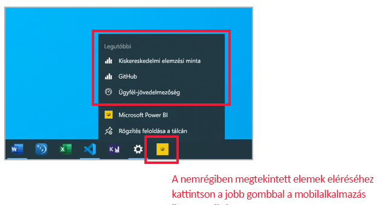
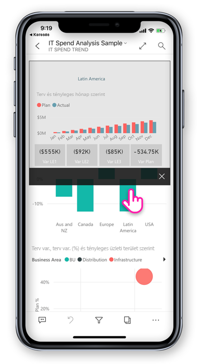
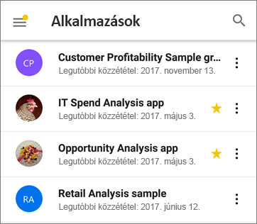
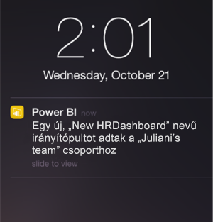

# A Power BI mobilalkalmazásainak újdonságai
Az újdonságokra vonatkozó kapcsolódó információk:

* [A Power BI csapatának blogja a mobilalkalmazásokról](https://powerbi.microsoft.com/blog/tag/mobile/)
* [A Power BI Desktop újdonságai](../../desktop-latest-update.md)  
* [A Power BI szolgáltatás újdonságai](../../service-whats-new.md)

>[!NOTE]
>A Power BI-mobilalkalmazás támogatása a **Windows 10 Mobile rendszerű telefonokhoz** 2021. március 16-án megszűnik. [További információ](https://go.microsoft.com/fwlink/?linkid=2121400)

## 2020. április

### Mostantól elérhető a munkaterületekről való megosztás
Mostantól a munkaterületekről is megoszthatók jelentések és irányítópultok. A Power BI szolgáltatáshoz hasonlóan megoszthatja a tartalmakat a Saját munkaterületről és az egyéb munkaterületekről, ha a tulajdonos engedélyezi. 

### Az irányítópultok most már támogatják a teljes képernyős módot (iOS és Android rendszeren)
Most már megtekintheti az irányítópultokat teljes képernyős módban, így könnyebben áttekintheti a tartalmukat. 

## 2020. március

### Tartalom megjelenítése parancsikonok és a Google Search szolgáltatás használatával (Android)
Az adatok könnyebb keresése és megjelenítése érdekében integráltuk a parancsikonokat és a Google Search szolgáltatást a Power BI alkalmazással. Parancsikonokat hozhat létre, amelyekkel közvetlenül az eszköze kezdőképernyőjéről érheti el kedvenc jelentéseit és irányítópultjait. A Google Search szolgáltatás használatával gyorsan megkeresheti és megnyithatja a Power BI-beli tartalmakat. További információ az [androidos alkalmazás-parancsikonokról](mobile-app-quick-access-shortcuts.md) és a [Google Search](mobile-app-find-access-google-search.md) szolgáltatásról.

### Fokozott biztonság az eszközvédelem használatával (előzetes verzió) (Android)
Eszköze beépített védelmi képességei révén biztonságossá teheti a Power BI alkalmazást, és kialakíthatja a szükséges adatvédelmet. Ha biometrikus hitelesítést (ujjlenyomat-azonosítót) kér a Power BI alkalmazás eléréséhez, biztonságban lesznek az adatai, és csak Ön láthatja őket. [A natív biztonságos hozzáférés megismerése](mobile-native-secure-access.md)

### Már elérhető az iPaden a szkennelés
Mostantól közvetlenül az iPadjéről szkennelhet be vonalkódokat a jelentések szűréséhez, és QR-kódok segítségével nyithatja meg gyorsan a jelentéseket.  

### Frissített szűrési élmény
A Power BI-alkalmazás szűrői új funkciókkal és megjelenéssel rendelkeznek. Ilyen például a jelentésekben szereplő vizualizációkra ható szűrők jobb láthatósága, és a szűrők zárolása vagy akár elrejtése. Ezek a változások javítják a Power BI szolgáltatás szűrőivel való kompatibilitást is.

## 2020. február

### Többszörös kiválasztási mód (Android és iOS)

Mostantól lehetséges több adatpont kiválasztani egy jelentésoldalon. Ha a többszörös kiválasztás be van kapcsolva, a megérintett egyes adatpontok hozzá lesznek adva a többi kiválasztott adatponthoz, és az összesített eredmények automatikusan ki lesznek emelve az oldal összes vizualizációján. A többszörös kiválasztási mód bekapcsolásához lépjen a [mobilalkalmazás-beállítások](./mobile-app-interaction-settings.md) oldalára.

>[!NOTE]
>A többszörös kiválasztási mód támogatott lesz a Power BI jelentéskészítő kiszolgálón a jelentéskészítő kiszolgáló következő kiadásában.

### A jelentés lábléce mostantól mindig látható lehet az iPhone-ra készült mobilalkalmazásban

iPhone-ján és androidos telefonján mostantól a jelentés láblécét a jelentésoldal aljához rögzítheti, ahol a lapon végzett műveleteitől függetlenül mindig látható és elérhető marad. Így az általa kínált lehetőségek könnyebben használhatók. A lábléc rögzítéséhez kapcsolja át a **Rögzített jelentéslábléc** kapcsolót a [mobilalkalmazás-beállítások](./mobile-app-interaction-settings.md) lapján.

### A PBIRS-jelentések támogatása (előzetes verzió) (Windows)

Mostantól megnyithatja a Power BI jelentéskészítő kiszolgáló (PBIRS) jelentéseit a Power BI alkalmazásban.

### Gyorsan hozzáférhet a legutóbbi elemeihez (Windows)

Kattintson a jobb gombbal a Power BI alkalmazás ikonjára a Windows tálcán az utoljára megtekintett elemek listájának megtekintéséhez. Kattintson a lista bármelyik elemére a gyors ismételt megtekintéséhez.

## 2020. január

### Bemutató módban létrehozott jegyzetek megosztása (Windows)

A bemutatók során létrehozott jegyzetek a bemutató szerves részét képezik, és a megbeszélések egyik fő összetevői lesznek. Ha a jelentéseket bemutató módban jegyzetekkel látja el, megoszthatja a jelentés oldalának a pillanatképét a kollégáival is. [További információ](./mobile-windows-10-app-presentation-mode.md#use-presentation-mode)

## 2019. december

### Rögzített jelentéslábléc és frissítés gomb – új felületek a jelentések kezeléséhez (Android)

Android-felhasználóinktól úgy értesültünk, hogy a jelentések használatára szolgáló felület nem optimális – a jelentés lábléce nehézkesen használható, a lehúzásos frissítés pedig bizonyos eszközökön túl érzékeny. Ebben a kiadásban ezért megváltoztattuk az alábbi viselkedéseket:
* **Rögzített jelentéslábléc** – mostantól a telefonon megnyitott jelentés lábléce dokkolva van a jelentésoldal alján, ahol az oldalon végzett műveletektől függetlenül mindig látható és elérhető. Így az általa kínált lehetőségek könnyebben használhatók.
* **Frissítés gomb a jelentés fejlécében** – a jelentés fejlécében egy Frissítés gombot is talál, amellyel egyszerűbben frissítheti a jelentést pontosan akkor, amikor Ön akarja.

Akiknek jobban tetszett a korábbi működés, a mobilalkalmazás új, kibővített [kezelési beállításaival](./mobile-app-interaction-settings.md) állíthatja vissza ezeket a viselkedésmódokat.

Ezen kívül az informatikai rendszergazdák [távolról felülbírálhatják az új alapértelmezett beállításokat](./mobile-app-configuration.md#interaction-settings-ios-and-android) a felhasználók nevében egy tetszőleges MDM-eszköz és egy alkalmazáskonfigurációs fájl használatával. Így elérhető, hogy a vállalaton belül minden felhasználónál ugyanaz a viselkedés legyen konfigurálva.

> [!NOTE]
> A frissítés gombra és a jelentéslábléc dokkolására vonatkozó kezelési beállítások jelenleg nem működnek a Jelentéskészítő kiszolgáló jelentésein. Ez a Jelentéskészítő kiszolgáló januári kiadásával változni fog!

### Alapértelmezett könyvjelzők beállítása a mobilalkalmazásból
Mostantól közvetlenül a Power BI mobilalkalmazásból állíthat be alapértelmezett könyvjelzőket a jelentésekhez. Így egy jelentés minden megnyitásakor automatikusan alkalmazva lesznek annak alapértelmezett könyvjelzői. [További információ!](./mobile-reports-in-the-mobile-apps.md#bookmarks)

### Tartózkodási hely szerinti szűrés Android-táblagépen
Földrajzi hely szerinti szűréssel az aktuális tartózkodási helye szerint szűrhet jelentéseket. Ez a funkció már az Androidos táblagépekhez készült Power BI alkalmazásban is elérhető. [További információ!](./mobile-apps-geographic-filtering.md)

## 2019. november

### A Power BI alkalmazás új kezelőfelülete már alapértelmezés szerint be van kapcsolva
 
Mostantól az alkalmazás megnyitásakor automatikusan be lesz kapcsolva az új kezelőfelület a navigációs sávokkal, amelyekkel egyszerűbben találhatja és nyithatja meg a tartalmat. Az alkalmazás [kezdőlapjáról](mobile-apps-home-page.md) kiindulva gyorsan elérheti a legfontosabb tartalmakat, valamint egy [tevékenység-hírcsatornát](mobile-apps-home-page.md#activity-feed), amely naprakészen tartja a legújabb riasztásokkal, értesítésekkel és sok mással kapcsolatban.

### Az összes legutóbbi Power BI-tevékenység megtekintése
 
A tevékenység-hírcsatornával valós időben nyomon követheti mindazt, ami a Power BI-tartalmaival történik. Ehhez elég az alkalmazás kezdőlapjára lépnie, és megnyitnia a Tevékenység lapot, ahol az összes új értesítés, riasztás, megjegyzés, @mentions és sok más is megtalálható. [További információ](mobile-apps-home-page.md#activity-feed).

### Könyvjelzők használata a jelentésekben

A Power BI mobilalkalmazás mostantól támogatja a Power BI-ban létrehozott könyvjelzőket. Az alkalmazás megnyitásakor a jelentés készítője által létrehozott könyvjelzőket és a saját készítésű személyes könyvjelzőket is használhatja. [További információ](mobile-reports-in-the-mobile-apps.md#bookmarks).

## 2019. október

### Android-támogatás Jelentéskészítő kiszolgáló hozzáférési beállításainak távoli konfigurálásához

Android-támogatást adtunk a Power BI-mobilalkalmazások Jelentéskészítő kiszolgálóhoz való hozzáférési beállításainak távoli konfigurálásához. Az informatikai rendszergazdák mostantól iOS- és Android-eszközökön is távolról konfigurálhatják ezeket a beállításokat a vállalati MDM-eszköz használatával. További részleteket [A Power BI-mobilalkalmazás jelentéskészítő kiszolgálóhoz való távoli hozzáférésének konfigurálása](https://docs.microsoft.com/power-bi/report-server/configure-powerbi-mobile-apps-remote) című témakörben talál.

### Több jelentésre kiterjedő részletezés

Ebben a hónapban hozzáadtuk a több jelentésre kiterjedő részletezés támogatását. Most már rákoppinthat a megfelelő adatpontra, hogy részletezve hozzáférhessen más jelentésekhez és jelentésoldalakhoz. Egy céloldalhoz való részletező hozzáféréskor a rendszer a részletezés beállításai alapján szűri az adott oldal tartalmát.

> [!NOTE]
> A több jelentésre kiterjedő részletezés csak akkor érhető el, ha engedélyezték a jelentés létrehozásakor. [További információ a több jelentésre kiterjedő részletezésről](https://docs.microsoft.com/power-bi/desktop-cross-report-drill-through).

### Adatbizalmassági címkék

Mostantól láthatók a tartalomtulajdonosok által a jelentésekre, az irányítópultokra, az adathalmazokra és adatfolyamokra beállított bizalmassági címkék, amelyek a bennük foglalt adatok bizalmasságát osztályozzák. A bizalmassági címkék meghatározzák, hogyan lehet a tartalmat megosztani más felhasználókkal. [További információ a Power BI-ban használt adatbizalmassági címkékről](https://docs.microsoft.com/power-bi/admin/service-security-data-protection-overview).

### Egyéni alkalmazásnavigáció támogatása (Windows)

Az egyéni alkalmazásnavigáció támogatása mostantól az iOS és az Android mellett a Windows-eszközökön is elérhető (lásd a [szeptemberi Újdonságok bejegyzést](#september-2019)).

## 2019. szeptember

### Egyéni alkalmazásnavigáció támogatása (iOS és Android)

Mostantól támogatott az egyéni alkalmazásnavigáció. Ha megnyit egy alkalmazást a Power BI Mobile-ban, elérhető lesz az alkalmazás létrehozója által készített egyéni navigációs felület. Az alkalmazásnavigáció rendezhető tartalom alapján, és új elemeket, például hivatkozásokat és összecsukható szakaszokat is tartalmazhat.
További tudnivalók az [egyéni navigációról](https://powerbi.microsoft.com/blog/designing-custom-navigation-for-power-bi-apps-is-now-available/).

## 2019. augusztus

### A Power BI Mobile új megjelenésének bemutatkozása (előzetes verzió) (iOS és Android)

Alkalmazásunkat új felhasználói felületek bevezetésével frissítettük. Hozzáadtunk egy kezdőlapot, amely a gyakran használt tartalmakhoz kínál gyors hozzáférést, valamint új navigációs ablaktáblákat, amelyek megkönnyítik az alkalmazáson belüli navigálást. Az új és frissített felületeken gyorsabban és egyszerűbben megtalálhatja azt, amire szüksége van, akkor, amikor szüksége van rá.
Mivel az új külső előzetes verziójú, be kell kapcsolnia, hogy megcsodálhassa.
További tudnivalók a [Power BI Mobile új megjelenéséről](https://powerbi.microsoft.com/blog/introducing-power-bi-mobile-apps-new-look-preview/).

### Biztonságos hozzáférés az Azure Active Directory (AD) alkalmazásproxyján keresztül (iOS és Android)

Az Azure Active Directory csapatával együttműködve integráltuk a Power BI-mobilalkalmazásokat az Azure Active Directory- (AAD-) alkalmazásproxyval. Ezzel a konfigurációval csatlakozhat a vállalati határokon belül futtatott jelentéskészítő kiszolgálóhoz a Power BI mobilalkalmazásból anélkül, hogy bonyolult helyszíni konfigurációt kellene beállítania. További információ: [A Power BI Mobile és az Azure AD alkalmazásproxyjának integrációja](https://powerbi.microsoft.com/blog/access-on-prem-report-server-from-your-power-bi-mobile-app-with-azure-active-directory-application-proxy/). Ismerje meg, [hogyan konfigurálható az Azure AD alkalmazásproxyja és a Power BI](https://docs.microsoft.com/azure/active-directory/manage-apps/application-proxy-integrate-with-power-bi).

## 2019. július

### Jelentésoldal elemleírásai

A jelentésoldalakhoz készült elemleírások már támogatottak, ha mobilalkalmazásban tekinti meg a jelentéseket. Elég hosszan rákoppintani egy jelentéshez készült elemleírással rendelkező vizualizációra, hogy az elemleírás megjelenjen.  

 
> [!NOTE]
> A jelentésekhez készült elemleírások 640 pixelnél nagyobb eszközökön, 320-as megjelenítéssel támogatottak. A kisebb eszközök az alapértelmezett elemleírásokat használják.

## 2019. június

### A vonalkód-leolvasás mostantól Androidon is elérhető
Mostantól androidos eszközön (telefonon és táblagépen) is használhatja a Power BI alkalmazást a termékeken vagy az üzlet polcain lévő vonalkódok beolvasásához, és megjelenítheti a kapcsolódó Power BI-jelentéseket a beolvasott értékek alapján szűrve. További információk [az adatok vonalkódokkal való szűréséről](mobile-apps-scan-barcode-iphone.md).

### A PBI-RS-ben ADFS-konfigurációval üzemeltetett PBIX-jelentések támogatása (iOS, Android)

A PBI-RS-ben ADFS-konfigurációval üzemeltetett Power BI-jelentések (PBIX) mostantól elérhetők a Power BI mobilalkalmazásokból is.

## 2019. május

### Siri-parancsikonok támogatása (iOS)
A felhasználók a jelentéseikre és irányítópultjaikra mutató Siri-parancsikonokat hozhatnak létre, majd ezeket közvetlenül Siri hangos kezelőfelületéről nyithatják meg. [Útmutató Siri-parancsikonok iOS-es Power BI-alkalmazásban való használatához](https://powerbi.microsoft.com/blog/introducing-siri-integration-with-power-bi-mobile-ios-app-preview/).

### Keresés az eszközön (iOS)
A Power BI integrációja az iOS-es eszközökön végzett kereséssel (kiemelt). Az iPhone-on vagy iPad-en végzett tartalomkeresés már Power BI-elemekre is kiterjed. Amikor a felhasználók az eszköz natív keresési lehetőségét használják, az eredmények között a feltételeknek megfelelő Power BI-jelentések, -irányítópultok, -alkalmazások, -munkaterületek és személyek is megjelennek. [Tovább tájékozódhat a blogbejegyzés megnyitásával](https://powerbi.microsoft.com/blog/introducing-siri-integration-with-power-bi-mobile-ios-app-preview/).

### Egykoppintásos jelentéskezelés – általános elérhetőség

Az egykoppintásos kezelés már általánosan elérhető, és új felhasználók számára már ez lesz az alapértelmezett érintőképernyős kezelési mód. A felhasználók ezt kikapcsolhatják, és választhatják a kettős koppintást az alkalmazás beállításaiban.

### Továbbfejlesztett feltételes hozzáférés-védelem (iOS, Android)

Az AAD [új alkalmazásvédelem-alapú feltételes hozzáférési képességével](https://docs.microsoft.com/azure/active-directory/conditional-access/app-protection-based-conditional-access) való integráció azáltal fokozza a biztonságot, hogy már az alkalmazásszabályzat alkalmazása előtt korlátozza a Power BI-hoz való hozzáférést.

### Eszközvédelem (iOS)

A felhasználók az eszköz beépített védelmével tehetik biztonságossá a Power BI-t arcfelismerés, ujjlenyomat vagy PIN-kód megkövetelésével a Power BI eléréséhez. Ezt szabályozhatja a felhasználó az alkalmazásbeállításokkal, a rendszergazdák pedig az Intune vagy bármely más MDM-eszköz használatával. [További információ](https://docs.microsoft.com/power-bi/consumer/mobile/mobile-ios-native-secure-access).

### Egyoldalas jelentés diavetítésben (Windows)

Az automatikus frissítés egyoldalas jelentésekhez is támogatott diavetítés során. Így ha a jelentés alapját képező adatforrást módosítják, a rendszer észleli ezt, és frissíti az oldalon megjelenő adatokat.

## 2019. április

### Főbb befolyásolók vizualizáció 

A Főbb befolyásolók vizualizáció már elérhető a mobilalkalmazásban. A vizualizáció lehetővé teszi, hogy néhány koppintással elvégezze az adatok fő meghatározóinak elemzését.

### Megjegyzések hozzáadása egy jelentés tartalmához (Android és iOS)

Az együttműködéshez és a visszajelzések megosztásához mostantól a jelentésoldalakon és vizualizációkon elhelyezett megjegyzések is használhatók. A jelentésekhez a Power BI szolgáltatásban és Mobile-ban adható megjegyzésekről [ebben a blogban](https://powerbi.microsoft.com/blog/announcing-report-commenting-for-power-bi-service-and-mobile/) olvashat bővebben. 

### Nézet maximalizálása teljes képernyős módban (Android és iOS)

Egy új gombbal szabályozhatja, hogy mikor szeretné kiemelni az adatokat a jelentés fejlécének és láblécének eltávolításával, a lehető legtöbb helyet biztosítva a jelentés megtekintéséhez.

## 2019. március

### Külső vendégfelhasználók támogatása a Power BI-alkalmazásokban (iOS, Android)

Közvetlenül az alkalmazásból érheti el a más cégek által Önnel megosztott Power BI-tartalmakat (más néven B2B). A Power BI mobilalkalmazások B2B-lehetőségeiről [itt](https://powerbi.microsoft.com/blog/power-bi-mobile-apps-now-support-azure-ad-b2b-guest-users/) olvashat bővebben.

### A Windows bemutató módjának továbbfejlesztése diavetítéssel (Windows)

[Diavetítés](https://powerbi.microsoft.com/blog/enhancing-presentation-mode-with-slideshow-in-windows-power-bi-app/) használatával az irodában használt nyilvános kijelzőkön jeleníthet meg Power BI-jelentéseket teljes képernyős módban, a jelentésoldalak közötti automatikusan lapozással.  

### PBI-RS-jelentések támogatása ADFS- és WAP-konfiguráción (csak iOS)

A PBI-RS-ben ADFS-konfigurációval üzemeltetett Power BI-jelentések mostantól elérhetők iOS-es Power BI-alkalmazásból.

### Jelentésvizualizációk egykoppintásos kezelésének engedélyezése

Módosítottuk a jelentések kezelését, így elég egyszer koppintani egy vizualizációra, gombra vagy szeletelőre, hogy kezelni tudja annak adatait. A felhasználóknak többé nem kell egy vizualizációra koppintva kijelölni azt, majd újra koppintani, hogy kezelni tudják. Egy koppintással mindkettő elérhető.

> [!NOTE]
> A meglévő felhasználóknak ezt a viselkedést az alkalmazás beállításaiban kell bekapcsolniuk. További információt a [Jelentés egykoppintásos kezelésének konfigurálása](https://docs.microsoft.com/power-bi/consumer/mobile/mobile-app-single-tap) című cikkben talál.

## 2019. január-február
 
### Visio-vizualizációk

A Visio-vizualizációkban engedélyezett az egyszeri bejelentkezés (SSO), így az alkalmazásban a Visio-vizualizációt tartalmazó jelentések megtekintésekor nincs szükség további bejelentkezési lépésekre. 

### A Power BI Mobile Windows-alkalmazásban megjelennek az irányítópultokkal kapcsolatos megjegyzések

Az adatokkal kapcsolatos megjegyzéseket közvetlenül az irányítópultokon és az egyes csempéken is közzéteheti. Az irányítópultot megtekintő személyek látni fogják a megjegyzéseket. 

## 2018. december

### Már elérhető a szűrő a fekvő tájolású jelentésekhez 

Elérhető a jelentés szűrő panelje a fekvő tájolású jelentésekhez (a telefonos jelentések mellett).

## 2018. november

### Modern vizualizáció-fejléc 

Az új modern vizualizáció-fejlécet használó jelentések mostantól nem foglalnak le helyet a fejlécek számára, így kevesebb marad üresen, és több jut a vizualizációknak.

### Továbbfejlesztett bemutató mód (Windows)

Továbbfejlesztett bemutató üzemmód Surface Hubhoz és Windows 10-eszközökhöz.  A továbbfejlesztett tárgyalótermi Surface Hub-felület jobb bemutató- és közreműködői eszközöket kínál látványelemek nélkül, nagy képernyőre optimalizált nézettel, hogy semmi se vonja el a figyelmet az adatairól. A bemutató mód emellett szabadkézi eszközöket is kínál, amelyekkel hatékonyan mutathatja be adatait. A bemutató módról [itt](https://powerbi.microsoft.com/blog/presentation-mode-in-power-bi-windows-app/) talál további információt.

### Álló elrendezésű jelentések táblagépeken (iOS és Android)

Mostantól a telefonos jelentéselrendezést alkalmazzuk (ha van) a jelentések álló üzemmódban lévő táblagépeken való megjelenítéséhez. További tudnivalók [telefonos elrendezés létrehozásáról a Power BI szolgáltatásban vagy a Desktopban](https://docs.microsoft.com/power-bi/desktop-create-phone-report/).

### Lekérdezési sztringek támogatása jelentésekben 

A jelentésben lévő, lekérdezési sztringet tartalmazó hivatkozások a mobilalkalmazásban nyílnak meg, előre szűrve a lekérdezési sztringben meghatározott feltételek alapján. További tudnivalók [lekérdezési sztringet tartalmazó jelentésbeli URL-cím létrehozásáról](https://docs.microsoft.com/power-bi/service-url-filters/).  

### Megosztott hitelesítő adatok (már Androidon)

Mobilalkalmazásából minden eddiginél könnyebben jelentkezhet be a Power BI-ba. A megosztott hitelesítő adatokkal a bejelentkezési folyamat egyszerűbbé vált azáltal, hogy az eszközön más Office 365-ös alkalmazáshitelesítő adatokkal hitesítjük Önt a Power BI szolgáltatásban.

### Alkalmazásbeli URL-címek (már Androidon) 

A jelentésekben lévő, más Power BI-összetevőkre mutató hivatkozások már közvetlenül az alkalmazásban nyílnak meg. Ezáltal Ön egyéni navigációs folyamatokat készíthet, egy jelentésből hivatkozhat például egy irányítópultra.

### Adatok megjelenítése és az értékek másolása

A jelentésbeli vizualizációk műveleti menüjében (...) már szerepel a mögöttes adatok táblázatos megjelenítésének lehetősége. Megnyitása után a táblázatban hosszú koppintással kijelölhetők és másolhatók az értékek (feltéve, hogy nincs a másolást korlátozó Intune-szabályzat).

## 2018. október

### Lapszámozott jelentések előzetes verziója (minden eszközön)

A Power BI szolgáltatásban már elérhetők a lapszámozott jelentések. Azok a felhasználók, akik a Power BI szolgáltatásban hozzáférnek lapszámozott jelentésekhez, mobilalkalmazásból is elérhetik őket. 

Olvassa el a Power BI [mobileszközökön használható lapszámozott jelentésekről szóló blogbejegyzését](https://powerbi.microsoft.com/blog/power-bi-paginated-reports-also-available-in-power-bi-mobile-apps-preview/).

### Megosztott hitelesítő adatok (iOS)

Mobilalkalmazásából minden eddiginél könnyebben jelentkezhet be a Power BI-ba. A megosztott hitelesítő adatokkal a bejelentkezési folyamat egyszerűbbé vált azáltal, hogy az eszközön más Office 365-ös alkalmazáshitelesítő adatokkal hitesítjük Önt a Power BI szolgáltatásban.

### Alkalmazáson belüli URL-címek (iOS) 

A jelentésekben lévő, más Power BI-összetevőkre mutató hivatkozások már közvetlenül az alkalmazásban nyílnak meg. Ezáltal Ön egyéni navigációs folyamatokat készíthet, egy jelentésből hivatkozhat például egy irányítópultra.

### iOS12- és watchOS 5-támogatás 

Frissítettük az iOS-hez készült Power BI alkalmazást, hogy mobileszközökön és órákon is zökkenőmentesen együttműködjön az új operációs rendszerrel.

## 2018. szeptember

### Telefonos jelentések szerkesztése a böngészőben (minden eszköz)

Mostantól nem csak a Power BI Desktopban, hanem a Power BI szolgáltatásban közzétett jelentésekhez is létrehozhat telefonosjelentés-elrendezéseket. A böngésző Szerkesztés módjában lehet létrehozni őket.

### Megjegyzések hozzáfűzése az irányítópultokon (iOS és Android) 

Az adatokkal kapcsolatos megjegyzéseket közvetlenül az irányítópultokon és az egyes csempéken is közzéteheti. Az irányítópultot megtekintő személyek látni fogják a megjegyzéseket. A szervezet tagjait is bevonhatja a beszélgetésbe @mentioning útján. Az @mentioned személyek egy leküldéses értesítést fognak kapni a mobiltelefonjukon, benne az Ön üzenetével.

Jelenleg iOS- és Android-eszközökön érhető el. A Windows-támogatás hamarosan elérhetővé válik.

Olvassa el az [irányítópulti megjegyzésekről szóló Power BI-blogbejegyzést](https://powerbi.microsoft.com/blog/announcing-dashboard-comments-in-power-bi/).

### Egyszeri bejelentkezés (Windows)

Az egyszeri bejelentkezés (SSO) az egyik legtöbbet kért képesség a Windowshoz készült Power BI Mobile esetében. Mostantól nem csak arra használhatja az elsődleges szervezeti fiókját, hogy bejelentkezzen a tartományhoz csatlakoztatott Windows rendszerű mobileszközökre, hanem a segítségével a Power BI szolgáltatásba is zökkenőmentesen bejelentkezhet. További információk az [SSO-ról és a Windows-mobilalkalmazásokról](mobile-windows-10-app-single-sign-on-sso.md).

## Előző hónapok

### 2018. július

#### Csak iOS és Android

**Megosztott szűrők**

Mostantól megosztott szűrőket és szeletelőket tartalmazó jelentéseket is kaphat.

**Háttérkép-támogatás**

Ha fekvő tájolásban tekint meg egy jelentést a mobileszközén, ugyanazokat a háttérképeket láthatja, amelyeket a webes Power BI-ban.

### 2018. június

#### Teljes vásznas jelentések

A felső és az alsó műveletsáv röviddel azután eltűnik, hogy a jelentés betöltődik, így egyszerre többet láthat a jelentésből.

#### Telefonos jelentések vászonméretének növelése

Megnöveltük a telefonos jelentések vásznának méretét, így még több vizualizáció fér el rajta.

### 2018. máj.

#### Mobilos részletezés: minden mobilalkalmazás

A részletezéshez megjelenítheti egy kijelölt adatpontból a mobilalkalmazások egy másik jelentésoldalát, ha a jelentés szerzője definiálta ezt a műveletet. 

#### Vissza gomb: minden mobilalkalmazás

Mostantól, ha a jelentésben pöccintéssel navigál, jelentésoldalt választ a műveleti sávon, vagy a részletezést használja, a vissza gomb visszaviszi az előzőleg megtekintett oldalra. 

#### Irányítópult-témák: minden mobilalkalmazás

Ha a jelentések szerzői testre szabják a témákat a Power BI szolgáltatásban, az irányítópult megjelenése és működése a mobilalkalmazásban is megváltozik. Háttérképek azonban nem jelennek meg.

#### iOS: A Power BI iOS-es mobilalkalmazás jelentéskészítő kiszolgálóhoz való távoli hozzáférésének konfigurálása

A rendszergazda most már MDM eszközzel is konfigurálhatja a Power BI iOS-es mobilalkalmazás jelentéskészítő kiszolgálóhoz való hozzáférését. További részleteket [Az iOS-es Power BI-mobilalkalmazás jelentéskészítő kiszolgálóhoz való távoli hozzáférésének konfigurálása](../../report-server/configure-powerbi-mobile-apps-remote.md) című témakörben talál.

#### Power BI vegyes valósághoz alkalmazás (előzetes verzió)

A Power BI vegyes valósághoz alkalmazás már elérhető a Microsoft Store-ban. Megtekintheti a virtuális világon belül az irányítópultjait és jelentéseit, vagy a környezetén belül mozgathatja és adott helyeken tekintheti meg őket. Az információ kontextusba helyezéséhez tekintse meg az új [Introducing Power BI on Hololens](https://www.youtube.com/watch?v=J_X_nOFUBss) (A Power BI on Hololens bemutatása) videónkat, vagy olvassa el az új [Power BI vegyes valósághoz alkalmazásról](mobile-mixed-reality-app.md) szóló cikket.

### 2018. április

#### Mobilos részletezés és felhatolás

Mobileszközön is használható a részletezés és a felhatolás a jelentés vizualizációinál. Az új funkciót úgy érheti el, ha rákoppint és lenyomva tartja a vizualizáció elemleírás menüjét, majd a lehatolás-felhatolás gombokra koppint az adatok részletesebb megjelenítéséhez. További tudnivalók a [mobilalkalmazásokban történő részletezésről és a felhatolásról](https://powerbi.microsoft.com/blog/drill-down-up-in-power-bi-mobile-apps/).

#### Állandó szűrők

A közelmúltban frissítettük a jelentésszűrőket és a szeletelőket, így azok most már automatikusan mentve lesznek a webes Power BI-ból a Power BI mobilalkalmazásba. A mobilalkalmazásban beállított szűrők és szeletelők is automatikusan mentve lesznek a webes Power BI-ban.

### 2018. március

#### Power BI vegyes valósághoz alkalmazás (előzetes verzió)

Az adatok még felhasználóbarátabbá tételének érdekében létrehoztuk a vegyes valósághoz készült Power BI alkalmazást. Megtekintheti a virtuális világon belül az irányítópultjait és jelentéseit, vagy a környezetén belül mozgathatja és adott helyeken tekintheti meg őket. További információ az új, [vegyes valósághoz készült Power BI alkalmazásról](mobile-mixed-reality-app.md).

#### Jelentések és irányítópultok külső megosztása

Az irányítópultok és jelentések a vállalatán kívüli felhasználókkal is megoszthatók, közvetlenül az alkalmazásból. A külső megosztás vállalati és közösségi fiókok esetén is engedélyezve van. 

#### Állandó szűrők

A Power BI webes felületén beállított szűrők és szeletelők a mobilalkalmazásban is el lesznek mentve, tehát ott folytathatja a munkát, ahol abbahagyta.

#### Jelentések frissítése iPad-en

A Power BI-jelentésekben mostantól frissítés gomb is van az iPad-alkalmazásban.

### 2018. február

#### Jelentések megosztása

A jelentések mostantól közvetlenül a mobilalkalmazásokból megoszthatók. További információ az [irányítópultok és jelentések mobilalkalmazásokból való megosztásáról](mobile-share-dashboard-from-the-mobile-apps.md)

#### Továbbfejlesztett eszközleírások

Amikor egy jelentés vizualizációjára koppint, hogy megjelenítse az eszközleírásokat, mostantól az ujja a vizualizáción keresztüli húzásával megtekintheti az egyes adatpontok részletes adatait.

### 2018. január

#### Jelentések kedvencekként

A jelentéseket megjelölheti kedvencekként, így azok megjelennek a **Kedvencek** lapon. További információ a [kedvencekről a Power BI-mobilalkalmazásokban](mobile-apps-favorites.md).

#### Megosztott jelentések megtekintése

Mostantól ha valaki megoszt Önnel egy jelentést, az megjelenik a **Velem megosztva** lapon az irányítópultokkal együtt.

#### Továbbfejlesztett hivatkozástámogatás

Mostantól a Power BI-vizualizációk hivatkozásaira koppintva megnyithatja azokat a mobilböngészőjében.

#### Intune-integráció (Android)

A feltételes hozzáférés támogatása az Intune mobileszköz-kezelésével.

### 2017. december

#### Továbbfejlesztett biztonságkezelés 

A rendszert kibővítettük a feltételes hozzáférés (CA) és a Microsoft Intune mobileszköz-kezelés (MDM) támogatásával androidos eszközökön, hogy cége vagy szervezete adatai nagyobb védelemben részesüljenek. Már elérhető iOS rendszeren.

#### Továbbfejlesztett engedélykezelés

Végrehajtottunk bizonyos módosításokat az adathalmazokra, irányítópultokra és jelentésekre vonatkozó felhasználói engedélyek pontosabb kezelése érdekében.

#### Automatikusan telepített alkalmazások

A Power BI-ban bizonyos alkalmazásokat nem szükséges telepíteni. A Power BI-alkalmazások létrehozói a cégnél létrehozhatnak olyan *alkalmazásokat*, amelyek számos irányítópultot és jelentést tartalmaznak. Az alkalmazást ezt követően közzétehetik, és beállíthatják úgy, hogy az automatikusan települjön a Power BI szolgáltatásban és a Power BI-mobilalkalmazásokban. Ha egy alkalmazás automatikus telepítésre van beállítva, automatikusan megjelenik az **Alkalmazások** menüben:

### 2017. november
#### Optimalizálás iPhone X-hez

Optimalizáltuk az iPhone X-hez az alkalmazás elrendezését, így minden eszközön stílusos elrendezésben jelennek meg az adatok.

### 2017. október
#### Szűrők telefonos jelentésekhez Androidon

Ha telefonra optimalizált oldalakkal rendelkező jelentést hoz létre a Power BI Desktopban, és a jelentés szűrőket tartalmaz, ezeket a szűrőket mostantól alkalmazhatja a telefonos jelentésekben Android-eszközén. Tudjon meg többet az Androidon használható Power BI-jelentésekhez készült szűrőkről.

#### Adatok megjelenítése a jelentésekben

A jelentésekben a táblázatos nézetre állíthatja a vizualizációkat, így megtekintheti az adatok alapját képező számokat. A funkció eléréséhez koppintson az Adatok megjelenítése pontra a vizualizáció ... menüjében a jelentésben, vagy pedig az új ikonra a kibontott vizualizáció műveleti menüjében.

### 2017. szeptember
#### Szűrők telefonos jelentésekhez iPhone-okon
Ha telefonra optimalizált oldalakkal rendelkező jelentést hoz létre a Power BI Desktopban, és a jelentés szűrőket tartalmaz, ezeket a szűrőket mostantól alkalmazhatja a telefonos jelentésekben iPhone-ján. Tudjon meg többet [az iPhone-okon használható Power BI-jelentésekhez készült szűrőkről](https://powerbi.microsoft.com/blog/filters-coming-for-phone-reports-on-ios/).

### 2017. augusztus
#### iOS-proxybeállítások támogatása
Mostantól megadhat proxybeállításokat a Power BI iOS-mobilalkalmazásában. Ennek köszönhetően a Power BI VPN-kapcsolatokkal is működik mobileszközén, így még több felhasználó és vállalat használhatja biztonságosan a Power BI funkcióit útközben.

### 2017. július
Olvassa el a [mobilalkalmazások funkcióinak 2017. júliusi összefoglalását](https://powerbi.microsoft.com/blog/power-bi-service-and-mobile-july-feature-summary/#ios-preview)

#### iOS-eszközök
**Új Q&A élmény iOS-eszközökön (előzetes verzió)** A kérdésére érkező válaszok helyett mostantól természetes nyelv használatával is célzott elemzéshez juthat. A Q&A rendszer proaktívan jelenít meg az adataihoz kapcsolódó elemzéseket akkor is, ha nem teljesen biztos abban, mit keres. A Microsoft kutatási csapatával együttműködésben kifejlesztett, mobileszközökre szánt Q&A élmény hatékony technológiákat alkalmaz a termékünkben. Próbálja ki az útmutatót, amely [az adatokra vonatkozó kérdések feltevését ismerteti iOS-mobilalkalmazásokban](mobile-apps-ios-qna.md).

### Rugalmas vizualizációk
**Rugalmas vizualizációk telefonos jelentésekhez és irányítópultokhoz** Beállíthatja, hogy az irányítópulton vagy a jelentésben lévő vizualizációk *rugalmas* elrendezésűek legyenek, és a képernyő méretétől függően dinamikusan a lehető legtöbb adatot és elemzést jelenítsék meg egyszerre. Olvassa el [a rugalmas vizualizációkról szóló blogot](https://powerbi.microsoft.com/blog/power-bi-desktop-july-feature-summary-2/#responsiveVisuals).

### 2017. június
#### Minden eszköz
**Alkalmazások megjelölése kedvencként** Már eddig is lehetőség volt megjelölni egy irányítópultot kedvencként. A közelmúltban a [Power BI elérhetővé tett alkalmazásokat](../../service-create-distribute-apps.md), és mostantól ezeket is meg lehet jelölni kedvencként. 

### 2017. május
#### Minden eszköz
**Új menü: Velem megosztva** Lépjen a Velem megosztva elemre a mobilalkalmazás menüjében, ahol megtekintheti az összes Önnel megosztott tartalmat.

**Új menü: Alkalmazások** Az alkalmazások olyan irányítópultok és jelentések gyűjteményei, amelyeket a vállalat a fő mutatók megjelenítése érdekében állított össze a gyorsabb és egyszerűbb, adatokra épülő döntéshozatalért.

További tudnivalók [a Power BI-tartalmak elrendezéséről](mobile-apps-quickstart-view-dashboard-report.md).

#### iOS- és Android-eszközök
**A Power BI jelentéskészítő kiszolgáló előzetes verziója** Helyszíni Power BI-jelentéseket készíthet és tehet közzé. Ezután [megtekintheti őket és dolgozhat velük iOS- vagy Android-](mobile-app-ssrs-kpis-mobile-on-premises-reports.md)mobileszközén. 

### 2017. április
Olvassa el a [mobilalkalmazások funkcióinak 2017. áprilisi összefoglalását](https://powerbi.microsoft.com/blog/power-bi-mobile-apps-feature-summary-march-april-2017/)

#### Minden eszköz
**Háttérszín a telefonos jelentésekhez** Ha megad háttérszínt egy adott jelentéshez a Power BI Desktopban, a telefonos jelentésnek is ugyanez lesz a háttérszíne. További információ [a jelentésoldalak telefonra optimalizálásáról](../../desktop-create-phone-report.md).

**Mobilbarát Power BI-vizualizációkat fejleszthet** Olvassa el ezt a [fejlesztői útmutatót](https://github.com/Microsoft/PowerBI-visuals/blob/master/Tutorial/MobileGuideline.md), amely bemutatja, hogyan készíthetők olyan Power BI-vizualizációk, amelyek jól mutatnak és jól működnek mobileszközökön.

#### iOS-eszközök
**Beszéljen az adataihoz: tegye fel kérdéseit szóban** Mostantól gépelés helyett szóban is [tehet fel kérdéseket az adataival kapcsolatban a Q&A szolgáltatással](mobile-apps-ios-qna.md). 

### 2017. március
Olvassa el a [mobilalkalmazások funkcióinak 2017. márciusi összefoglalását](https://powerbi.microsoft.com/blog/power-bi-mobile-apps-feature-summary-march-2017/).

#### Minden eszköz
**Szeletelők kezelése**

Továbbfejlesztettük az időszeletelők érintőképernyős kezelését.

#### iOS-eszközök
**Tegyen fel kérdéseket az adatairól a Q&A szolgáltatással – és küldjön visszajelzést** Kérdezzen valamit az adatairól a Q&A szolgáltatással, és egy mosolygó vagy szomorú arccal jelezze számunkra, hogy kielégítő választ kapott-e.

**A 3D Touch használata a gyakori műveletekhez** Hosszan nyomja meg a Power BI alkalmazás ikonját iPhone 6s vagy újabb készüléke főképernyőjén az értesítések, a keresés és a nemrég használt irányítópultok eléréséhez.

**Jobbról balra író nyelvek támogatása** A Power BI mobilalkalmazásai mostantól támogatják a jobbról balra író nyelveket. Jobbról balra író nyelvek alatt a héber és arab írásrendeket értjük. Ezek az írások jobbról balra olvasandók, és környezetfüggő formázást igényelnek. Tekintse meg [a Power BI mobilalkalmazásai által támogatott nyelvek listáját](mobile-apps-supported-languages.md).

#### Androidos eszközök
**Csatlakozás több SSRS-kiszolgálóhoz** 

Mostantól egyszerre akár öt SQL Server Reporting Services- (SSRS-) kiszolgálóhoz csatlakozhat.

**Irányítópultokhoz való hozzáférés igénylése** 

Ha olyan irányítópult QR-kódját olvassa be, amelyhez nincs hozzáférése, mostantól közvetlenül a mobilalkalmazásból igényelhet hozzáférést.

### 2017. február
#### Minden eszköz
**Egyszerűbb görgetés** 

Mostantól görgetheti a sáv- és oszlopdiagramokat a jelentésekben a diagramok megérintésével is, nem csak az oldalt található görgetősávval.

#### iOS-eszközök
**Tegyen fel kérdéseket az adatairól a Q&A szolgáltatás előzetes verziójával** 

A Q&A szolgáltatással a saját szavaival tehet fel kérdéseket az adatairól, és a Power BI válaszol. A Q&A szolgáltatás már a Power BI szolgáltatás részét képezi a https://powerbi.com webhelyen. Mostantól [az iPhone és iPad készülékekre szánt mobilalkalmazásokban is elérhető](mobile-apps-ios-qna.md).

**Csatlakozás több SSRS-kiszolgálóhoz** 

Mostantól egyszerre akár öt SQL Server Reporting Services- (SSRS-) kiszolgálóhoz csatlakozhat.

#### Android rendszerű táblagépek
Az androidos táblagépekhez készült **Power BI mobilalkalmazás** mostantól globálisan elérhető. Megkezdheti a [Power BI használatát androidos táblagépén](mobile-android-app-get-started.md).

#### iOS- és Android-eszközök
**Új menü az irányítópultok csempéihez** Az alapul szolgáló jelentéshez navigálhat, kibonthatja a csempét vagy kezelheti a riasztásokat – mindezt egyetlen menüből az irányítópultok csempéiről. 

Ez a menü újdonság a fekvő tájolású iOS- és Android-telefonokon, valamint az androidos táblagépeken. Álló tájolású Windows Phone-telefonokon és Android-telefonokon már eddig is elérhető volt.

### 2017. január
Olvassa el a [mobilalkalmazások funkcióinak 2017. januári összefoglalásáról szóló blogbejegyzést](https://powerbi.microsoft.com/blog/power-bi-mobile-apps-feature-summary-january-2017).

#### Minden eszköz
**Több mint 100 sor tölthető be a táblázatokhoz és mátrixokhoz** Mostantól ha nagy méretű tábla vagy mátrix található egy irányítópulton vagy jelentésben, a lehető legtöbb adatot megjelenítjük a csempén. Fókusz módban ezután legörgethet a többi sorhoz is.

**A telefonos jelentések általánosan elérhetőek** A telefonos Power BI-jelentések mostantól általánosan elérhetőek. A Power BI Desktopban elkészítheti a meglévő jelentések álló tájolású nézetét mobilfelhasználók számára. Többet tudhat meg [telefonos jelentések készítéséről a Power BI Desktopban](../../desktop-create-phone-report.md) és a [jelentések kezeléséről telefonon](mobile-apps-view-phone-report.md).

#### iOS
**SSRS-hitelesítés az Active Directory összevonási szolgáltatások (ADFS) előzetes verziójával** Mostantól mobileszközéről is bejelentkezhet helyszíni SQL Server Reporting Services-kiszolgálókra vállalati fiókjával. Többet tudhat meg [az SSRS-kiszolgálókhoz való csatlakozásról az OAuth használatával](mobile-oauth-ssrs.md).

#### Android
**SSRS-hitelesítés az Active Directory összevonási szolgáltatások (ADFS) előzetes verziójával** Mostantól mobileszközéről is bejelentkezhet helyszíni SQL Server Reporting Services-kiszolgálókra vállalati fiókjával. Többet tudhat meg [az SSRS-kiszolgálókhoz való csatlakozásról az OAuth használatával](mobile-oauth-ssrs.md).

**Új és továbbfejlesztett funkció: Gyors jegyzetkészítés és elemzésmegosztás** A megosztás és a jegyzetkészítés mostantól teljes körűen használható androidos eszközökön. A továbbfejlesztett menüben egyszerűbb és gyorsabb a jegyzetkészítés és az elemzések megosztása. A jegyzetekkel ellátott jelentéseket közvetlenül a Power BI alkalmazásból is megoszthatja.

### 2016. december
Olvassa el a [mobilalkalmazások funkcióinak 2016. decemberi összefoglalásáról szóló blogbejegyzést](https://powerbi.microsoft.com/blog/power-bi-mobile-apps-feature-summary-december-2016).

#### Minden eszköz
**Háttérben futó offline frissítés**

Ahhoz, hogy offline is elérhesse a legfrissebb adatokat, frissítést végzünk az alkalmazás hátterében – így üzleti adatai mindig naprakészek lesznek, akkor is, ha egy ideig nem érte el őket. Ha szeretné, hogy egyes irányítópultok mindig naprakészek legyenek, jelölje meg őket kedvencként. További információk [a Power BI mobilalkalmazásainak offline képességeiről](mobile-apps-offline-data.md).

#### iOS-eszközök
**Jegyzetkészítés és megosztás**

Mostantól jegyzetekkel láthatja el és megoszthatja a csempéket, jelentéseket és vizualizációkat az iOS-eszközökre készült Power BI mobilalkalmazással. 

* [iPhone-on](mobile-annotate-and-share-a-tile-from-the-mobile-apps.md)
* [iPaden](mobile-annotate-and-share-a-tile-from-the-mobile-apps.md)

**Irányítópultokhoz való hozzáférés igénylése**

Ha olyan irányítópult QR-kódját olvassa be, amelyhez nincs hozzáférése, mostantól közvetlenül a mobilalkalmazásból igényelhet hozzáférést.

**Egyéni URL-cím képcsempéken**

Ha egy képcsempén az irányítópult tulajdonosa által megadott egyéni URL-cím található, a csempére koppintva közvetlenül erre az URL-címre léphet a csempe fókusz módban való megnyitása nélkül. 

#### iPhone
**Apple Watch-fejlesztések**

Mostantól közvetlenül a Watch alkalmazásból frissítheti az Apple Watch adatait. Nyomja meg hosszan az irányítópult indexlapját az adatok frissítéséhez. (A funkció működéséhez a Power BI mobilalkalmazásnak futnia kell az iPhone hátterében).

#### Android
**Egyéni URL-cím képcsempéken**

Ha egy képcsempén az irányítópult tulajdonosa által megadott egyéni URL-cím található, a csempére koppintva közvetlenül erre az URL-címre léphet a csempe fókusz módban való megnyitása nélkül. Emellett az előre megadott egyéni URL-címeket tartalmazó irányítópult-csempék mostantól átirányítják a felhasználókat az alkalmazáson belüli jelentésekre.

### 2016. november
Olvassa el a [Power BI mobilalkalmazásai funkcióinak 2016. novemberi összefoglalását](https://powerbi.microsoft.com/blog/power-bi-mobile-apps-feature-summary-november-2016/).

#### Android rendszerű táblagépek
**Androidos táblagépekhez készült Power BI mobilalkalmazás** – Megérkezett az előzetes verzió.

* Kipróbálhatja a [Power BI-t androidos táblagépén](mobile-android-app-get-started.md)
* Áttekintheti a [Reporting Services-mobiljelentéseket és KPI-ket androidos táblagépén](mobile-app-ssrs-kpis-mobile-on-premises-reports.md)

#### Androidos eszközök
**Előzetes verzió: Intune mobilalkalmazás-kezelés** A Power BI mostantól támogatja a Microsoft Intune mobilalkalmazás-kezelőjét, amely előzetes verzióban elérhető Power BI Pro-felhasználók számára androidos eszközökön. 

**Kedvencek** Megjelölheti kedvenc irányítópultjait androidos eszközén, és egyetlen, kényelmesen elérhető helyen tekintheti meg [kedvenc Power BI-irányítópultjait, valamint a Reporting Services-mobiljelentéseket és KPI-ket](mobile-android-app-get-started.md#view-your-favorite-dashboards-and-reports). 

#### iOS-eszközök
**Hivatkozások** A csempéken és vizualizációkban lévő URL-címek mostantól kattinthatóak, és megnyílnak a böngészőben.

#### Windows rendszerű eszközök
A tartózkodási helyéhez képest **középre igazíthatja a térképet**

### 2016. szeptember/október
Olvassa el a [Power BI mobilalkalmazásai funkcióinak 2016. októberi összefoglalását](https://powerbi.microsoft.com/blog/power-bi-mobile-apps-feature-summary-october-2016/).

#### Minden eszköz
**Kedvencek kezdőlapként** Ha megjelölt kedvencként egyes irányítópultokat, a kezdőlapja a kedvencek bejegyzés lesz. 

**Továbbfejlesztett navigáció** A fő navigáció új külsőt kapott, a csoportok navigációja pedig átkerült a csoportkatalógusba. 

**Jelentések és irányítópultok teljesítménybeli fejlesztései** A jelentések és az irányítópultok gyorsabban töltődnek be a Power BI mobilalkalmazásaiban.

**Továbbfejlesztett riasztási értesítések** Az adatvezérelt riasztásokkal kapcsolatos értesítések mostantól több információt tartalmaznak arról, mi váltotta ki a riasztást és miért.

#### iOS iPhone-on
**Az Apple Watch frissítési fejlesztései** Az Apple Watch mobilalkalmazás jobban működik a Watch OS3 bevezetésével

#### Android rendszerű telefonok
**Új manuális csempefrissítés** Mostantól manuálisan is frissítheti az irányítópultok csempéit. A DirectQuery-alapú csempék esetében ez a funkció a legfrissebb adatokat kéri le az adatkészletből.

#### Windows 10 rendszerű telefonok
**Földrajzi alapú szűrés** Windows 10 rendszerű telefonján mostantól saját tartózkodási helye alapján is szűrheti a jelentéseket, így a fontos adatokra fókuszálhat.

**SandDance-vizualizáció** Ez az egyéni vizualizáció mostantól elérhető a Surface Hubon.

### 2016. augusztus
#### Minden telefon
**Kedvencek** Megtekintheti a kedvenc irányítópultjait az összes Power BI mobilalkalmazásból, és a Power BI mobilalkalmazásokból kezelheti a kedvencek listáját iOS és Windows 10 rendszerű eszközökön. További információ a [kedvencekről a Power BI-mobilalkalmazásokban](mobile-apps-favorites.md).

**Irányítópultok adatainak besorolása** Megtekintheti azokat az adatbesorolásokat, amelyeket a tulajdonosok az irányítópultjaikhoz rendeltek. További információk az [irányítópultok besorolásáról](../../service-data-classification.md).

**Adatvezérelt riasztások** Riasztást kaphat, ha adatai előre meghatározott módokon módosulnak a KPI, kijelző és kártya típusú csempéken. További információk:

* [Riasztások az androidos telefonokhoz készült Power BI alkalmazásban](mobile-set-data-alerts-in-the-mobile-apps.md). 
* [Riasztások az iOS-eszközökhöz készült Power BI alkalmazásokban](mobile-set-data-alerts-in-the-mobile-apps.md). 
* [Riasztások a Windows 10 rendszerű eszközökhöz készült Power BI alkalmazásban](mobile-set-data-alerts-in-the-mobile-apps.md).

#### iOS iPhone-on és iPaden
**A csempék fókusz módban teljes képernyős módra váltanak iPaden** Ha egy csempére koppint iPaden, az mostantól teljes képernyőn megnyílik fókusz módban, kihasználva az iPad teljes képernyőméretét.

**Csempék manuális frissítése** A csempék manuálisan frissíthetők. Ehhez mindössze meg kell nyitni az irányítópultot az iOS-eszközökhöz készült Power BI mobilalkalmazásban, és a képernyő tetejétől lefelé kell húznia az ujját. 

**Az Intune MAM támogatása** További támogatás érhető el a Microsoft Intune mobilalkalmazás-kezelési (MAM) képességeihez.

További információ a [Power BI mobilalkalmazásokon elérhető Microsoft Intune-ról](../../service-admin-mobile-intune.md).

#### Windows 10-eszközök
**Teljes képernyős és bemutató mód** A jelentéseket megjelenítheti bemutató módban a Surface Hubon, az irányítópultokat, jelentéseket és csempéket pedig teljes képernyős módban a Windows 10 rendszerű eszközökön.

### 2016. július
#### Minden telefon
A Power BI szolgáltatásban mostantól [létrehozhatja az irányítópultok kifejezetten telefonokhoz készült nézetét](../../service-create-dashboard-mobile-phone-view.md) álló tájolású módban. 

#### Android rendszerű telefonok
**Kedvencek lap** Egyetlen helyen érheti el kedvenc irányítópultjait.

**Továbbfejlesztett biztonságkezelés** Kockázati besorolást választhat az adott irányítópulton megjelenített üzleti adatokhoz.

**Továbbfejlesztett figyelmeztetések és szalagcímek** Továbbfejlesztettük a mobilalkalmazás figyelmeztetéseit és szalagcímeit.

**QR-kódok jelentésoldalakhoz** A szolgáltatásban létrehozott QR-kódok mostantól adott oldalakra mutatnak a teljes jelentés helyett.

**Továbbfejlesztett riasztások** Az adatvezérelt riasztások mostantól az eszköz területi beállításának megfelelő formátumban jelennek meg.

#### iOS iPhone-on és iPaden
**Továbbfejlesztett biztonságkezelés** Kockázati besorolást választhat az adott irányítópulton megjelenített üzleti adatokhoz.

**Mobilelemzések** Megtekintheti az összefoglaló adatokat (maximális, minimális és teljes értékek) fürtözött oszlopdiagramokat tartalmazó csempéken.

**Továbbfejlesztett manuális frissítés** Mostantól manuálisan is frissítheti az irányítópultok csempéit. A DirectQuery-alapú csempék esetében ez a funkció a legfrissebb adatokat kéri le az adatkészletből.

**Továbbfejlesztett figyelmeztetések és szalagcímek** Továbbfejlesztettük a mobilalkalmazás figyelmeztetéseit és szalagcímeit.

**QR-kódok jelentésoldalakhoz** A szolgáltatásban létrehozott QR-kódok mostantól adott oldalakra mutatnak a teljes jelentés helyett.

**Általános fejlesztések** Továbbfejlesztettük a csempékhez kapcsolódó hibaüzeneteket a mobilalkalmazásban.

#### Windows 10-eszközök
**Továbbfejlesztett biztonságkezelés** Kockázati besorolást választhat az adott irányítópulton megjelenített üzleti adatokhoz.

**Továbbfejlesztett figyelmeztetések és szalagcímek** Továbbfejlesztettük a mobilalkalmazás figyelmeztetéseit és szalagcímeit.

### 2016. június
További részletekért olvassa el a [Power BI mobilalkalmazásaival kapcsolatos júniusi blogbejegyzést](https://powerbi.microsoft.com/blog/power-bi-mobile-apps-update-june-2016/).

#### A QR-kódok mostantól a kibővített valóságban is megjelennek (iOS)
Mostantól ha beolvassa a Power BI szolgáltatással létrehozott QR-kódokat, a csempe a kibővített valóságban jelenik meg. 

További információk [a való világból származó adatokhoz való csatlakozásról](mobile-apps-data-in-real-world-context.md).

#### Adatok szűrése vonalkódokkal (iPhone)
Mostantól beolvashatja a termékeken vagy az üzlet polcain lévő vonalkódokat, és megjelenítheti a kapcsolódó Power BI-jelentéseket a beolvasott értékek alapján szűrve. 

További információk [az adatok vonalkódokkal való szűréséről](mobile-apps-scan-barcode-iphone.md).

#### SQL Server 2016 Reporting Services-mobiljelentések
Mostantól áthatoló részletezést végezhet egy Reporting Services KPI-ből vagy egy mobiljelentésből egy másik mobiljelentésbe vagy bármilyen egyéni URL-címbe.

#### Értesítési központ
A Power BI mobilalkalmazás értesítési központja megjeleníti az Önnel megosztott új adatokat és irányítópultokat, valamint azon csoportok változásait, amelyeknek Ön tagja.

### 2016. május
#### iOS-eszközök és androidos telefonok
* A **QR-kódok** mostantól **a jelentések esetében** is elérhetők. Olvassa be a kódot a Power BI alkalmazással, hogy közvetlenül egy kapcsolódó jelentésre ugorhasson, navigálás és keresés nélkül.
* **Továbbfejlesztett adatkezelés** az SQL Server 2016 Reporting Services szolgáltatáshoz: Csökkentett betöltési idők és adatforgalom az eszközén.
* **SQL Server 2016 témájú mobiljelentések**: Mobiljelentésekhez készült témákat tekinthet meg az eszközén.
* **Geoszűrés**: Szűrheti a jelentéseket a saját tartózkodási helye alapján.

### 2016. április
További részletekért olvassa el a [Power BI mobilalkalmazásairól szóló áprilisi blogbejegyzést](https://powerbi.microsoft.com/blog/power-bi-mobile-apps-update-april-2016/).

#### Minden alkalmazás
* A jelentésszeletelőben több lehetőséget is kiválaszthat.

#### Android-mobilalkalmazás
* **SQL Server 2016[ Reporting Services-mobiljelentések](mobile-app-ssrs-kpis-mobile-on-premises-reports.md)** érhetőek el mostantól az androidos telefonokon.
* **Jelentéstár** A jelentéseket megnyithatja közvetlenül a jelentéstárban.
* Az **NTLM-hitelesítés** támogatása az SQL Server 2016 Reporting Services mobiljelentéseiben.

#### Windows 10-es eszközökhöz készült Power BI alkalmazás
* **Bemutató mód** Power BI-irányítópultok és -jelentések jeleníthetőek meg bemutató módban a Power BI alkalmazásból.
* **SQL Server 2016[ Reporting Services-mobiljelentések ](mobile-app-windows-10-ssrs-kpis-mobile-reports.md)** érhetőek el mostantól a Windows 10-es eszközökön.
* **Adat-elemleírásokat** jeleníthet meg, ha az egérmutatót az irányítópult-csempék fölé helyezi.

### 2016. március
Olvassa el a [Power BI mobilalkalmazásairól szóló 2016. márciusi blogbejegyzést](https://powerbi.microsoft.com/blog/power-bi-mobile-apps-update-march-2016/).

#### iPhone-mobilalkalmazás
**Apple Watch** Megtekintheti a Power BI-csempéket és KPI-ket az [Apple Watchon](mobile-apple-watch.md).

**iOS 9.0 és újabb verziók** A lehető legjobb élmény és a Power BI legfrissebb funkcióinak kihasználása érdekében mostantól kizárólag az iOS 9.0-s és újabb verzióit futtató eszközöket támogatjuk.

**Globális keresés** Az új „nemrégiben megtekintett” lista vagy a globális keresés használatával gyorsan megtalálhatja a keresett adatokat.

**Jelentéstár** A jelentéseket megnyithatja közvetlenül a jelentéstárban.

**Friss adatok offline állapotban** Az új, háttérben futó frissítés automatikusan frissíti a gyorsítótárazott adatokat, amikor online állapotban dolgozik, így [offline módban is](mobile-apps-offline-data.md) a legfrissebb adatokat láthatja. 

**Bing- és R-csempék** A Bing- és R-csempék megnyithatók fókusz módban.

#### Android-mobilalkalmazás
**SQL Server 2016-mobiljelentések és KPI-k** [Megtekintheti az SQL Server 2016 mobiljelentéseit és a KPI-ket](mobile-app-ssrs-kpis-mobile-on-premises-reports.md), és navigálhat az SSRS-mappák között.

**Jelentések megtekintése** Irányítópultjai csempéiről nyithat meg jelentéseket.

**Friss adatok offline állapotban** Az új, háttérben futó frissítés automatikusan frissíti a gyorsítótárazott adatokat, amikor online állapotban dolgozik, így [offline módban is](mobile-apps-offline-data.md) a legfrissebb adatokat láthatja. 

#### Windows 10-es eszközökhöz készült Power BI alkalmazás
**Gyors hozzáférés** Az új „nemrégiben megtekintett” lista vagy a globális keresés használatával gyorsan hozzáférhet irányítópultjaihoz, jelentéseihez és csoportjaihoz, és megtalálhatja a keresett adatokat.

**Bing- és R-csempék** A Bing- és R-csempék megnyithatók fókusz módban.

**Több élő csempe a kezdőképernyőn** [KPI-ket és többsoros kártyákat rögzíthet a kezdőképernyőre](mobile-pin-dashboard-start-screen-windows-10-phone-app.md) élő csempékként, így az összes fontos mérőszámot egyetlen pillantással áttekintheti.

**Nagyítás csippentéssel** Táblagépe csippentéses méretezési funkciójával részletesebben megvizsgálhatja irányítópultjait.

**Értesítések** Értesítéseket kaphat, amikor adatkészletei, jelentései és irányítópultjai új adatokkal frissülnek.

**Jelentéstár** A jelentéseket megnyithatja közvetlenül a jelentéstárban.

### 2016. február
#### Android
Az irányítópultokat [fekvő tájolásban is megtekintheti androidos telefonokon](mobile-apps-view-dashboard.md#view-dashboards-on-your-android-phone). 

#### Windows 10-es eszközökhöz készült Power BI alkalmazás
Megtekintheti [a jelentéseket Windows 10 rendszerű telefonján](mobile-reports-in-the-mobile-apps.md).

Gyorsabb [elemzési eredmények Windows 10-es mobil-irányítópultjain](mobile-tiles-in-the-mobile-apps.md): Csempepillanatképet oszthat meg, vagy jelentést nyithat meg közvetlenül az irányítópultról.

### 2016. január
Az összes januári fejlesztés már elérhető a 2015 decemberében kiadott, [Windows 10-hez készült új Power BI alkalmazásban](mobile-windows-10-phone-app-get-started.md). Mostantól ezek a többi mobileszközhöz készült Power BI alkalmazásokban is elérhetőek. Olvassa el a fejlesztésekről szóló blogbejegyzést.

**Valós idejű adatok támogatása** Az irányítópultok valós időben frissülnek, így nem szükséges manuálisan frissíteni őket.

**Offline jelzők** Amikor nincs jel, egy offline jelző jelenik meg az irányítópult tetején.

**A gyorsítótárban lévő adatok elérése** A gyorsítótárban tárolt adatok többé nem járnak le, így offline állapotban korlátlan ideig megtekintheti a gyorsítótárazott adatokat.

**R-csempék és webes widgetek** Ezek az új csempetípusok is megtekinthetők az irányítópultjain mobileszközön.

**Bing-irányítópultok** A Power BI szolgáltatásban mostantól létrehozhat [Bing keresési eredményeket tartalmazó irányítópultokat](../../service-connect-to-services.md), és megtekintheti őket mobileszközén.

**Jelentésoldalak rögzítése csempékként az irányítópultokon** Mostantól teljes jelentésoldalakat rögzíthet az irányítópultokra a Power BI szolgáltatásban, így megtekintheti a jelentésoldalakat iPhone-ján vagy androidos telefonján a Power BI alkalmazásban.

### 2015. december
A Power BI csapata erősen zárta a 2015-ös évet, több fontos újdonság és frissítés bevezetésével.

#### SQL Server 2016 Reporting Services-mobiljelentések iOS rendszeren
Mostantól iOS-eszközén is megtekintheti az SQL Server-mobiljelentéseket a Power BI alkalmazásban, legyen szó iPadről vagy iPhone-ról. További információk:

* [SQL 16 SSRS az iOS rendszerhez készült Power BI alkalmazásban](https://blogs.msdn.com/b/powerbi/archive/2015/12/30/sql-16-ssrs-on-power-bi-app-for-ios.aspx) blogbejegyzés
* [SQL Server-mobiljelentések és KPI-k megtekintése iPhone- és iPad-alkalmazásokban](mobile-app-ssrs-kpis-mobile-on-premises-reports.md) dokumentáció

#### Windows 10-telefonokhoz készült Power BI alkalmazás
A Windows 10-hez készült új Power BI alkalmazás érintésvezérelt működésre és hatékony mobileszközös munkavégzésre lett optimalizálva. Áttekintheti az irányítópultokat és a jelentéseket, meghívhatja munkatársait adatok megtekintésére, és elemzéseket oszthat meg e-mailben a csapatával. Emellett [Power BI-irányítópultokat rögzíthet Windows Phone-telefonja kezdőképernyőjére](mobile-pin-dashboard-start-screen-windows-10-phone-app.md).

* Olvassa el [a Windows 10-es telefonokhoz készült Power BI alkalmazásról szóló blogbejegyzést](https://blogs.msdn.com/b/powerbi/archive/2015/12/30/announcing-the-power-bi-app-for-windows-10-mobile.aspx).
* [A Windows 10-es telefonokhoz készült Power BI alkalmazás első lépései](mobile-windows-10-phone-app-get-started.md).

#### További újdonságok
További részletekért olvassa el a [Power BI mobilalkalmazásairól szóló decemberi blogbejegyzést](https://blogs.msdn.com/b/powerbi/archive/2015/12/30/power-bi-mobile-apps-update-_2d00_-december-2015.aspx).

* Értesítéseket kaphat, amikor munkatársai irányítópultokat osztanak meg Önnel. (iOS)
* Teljes rögzített jelentésoldalakat tekinthet meg az irányítópultjain. (iOS és Android)
* [Egy QR-kód beolvasásával](https://blogs.msdn.com/b/powerbi/archive/2015/12/08/bridge-the-gap-between-your-physical-world-and-your-bi-using-qr-codes.aspx) közvetlenül a kapcsolódó csempére léphet androidos telefonján.

### 2015. november
Olvassa el a [Power BI mobilalkalmazásairól szóló 2015. novemberi blogbejegyzést](https://blogs.msdn.com/b/powerbi/archive/2015/11/24/power-bi-mobile-apps-update-_2d00_-november-2015.aspx).

#### Minden Power BI-mobilalkalmazás
* Új üdvözlőélmény.
* Továbbfejlesztett adatkapacitás a diagramokban.

#### iOS- és Android-mobilalkalmazások
* A vállalatok mostantól [konfigurálhatják az iOS és Android rendszerhez készült Power BI-mobilalkalmazásokat a Microsoft Intune-nal](../../service-admin-mobile-intune.md) az eszközök és alkalmazások kezeléséhez.

#### iPhone-mobilalkalmazás
* [Képcsempéket adhat az irányítópultokhoz](mobile-iphone-app-get-started.md) közvetlenül az iPhone-járól.
* [QR-kódokat hozhat létre a Power BI szolgáltatásban](../../service-create-qr-code-for-tile.md), amelyeket azután iPhone-jával beolvasva egy adott csempénél nyílik meg a Power BI alkalmazás.

#### A Windows-eszközökhöz készült Power BI alkalmazás
* [Közvetlenül hivatkozhat csempékről konkrét URL-címekre](../../service-dashboard-edit-tile.md#hyperlink).

### 2015. október
Olvassa el a [Power BI mobilalkalmazásairól szóló október közepi blogbejegyzést](https://blogs.msdn.com/b/powerbi/archive/2015/10/21/power-bi-mobile-mid-october-updates-are-here.aspx).

#### Minden Power BI-mobilalkalmazás
* A százalékskálájú Y tengellyel rendelkező vonaldiagramok mostantól a tényleges adatok alapján számítják ki a vizualizáció tartományát. A gráf mostantól a diagram legalacsonyabb adatpontjától indul az alapértelmezett érték helyett.
* A vonal-, oszlop- és sávdiagramok mostantól rendelkezhetnek adatfeliratokkal. 
  
    

#### iPhone
* Folyamatosan naprakész lehet csoportja legújabb irányítópultjait illetően – értesítéseket kaphat iPhone-jára minden alkalommal, amikor egy tag hozzáad egy irányítópultot valamelyik csoportjához.
  
    
* Mostantól fekvő tájolásban is megjelenítheti az irányítópultokat, egyszerűen a telefon elfordításával. További információk [a fekvő tájolásról az iPhone-alkalmazásban](https://blogs.msdn.com/b/powerbi/archive/2015/11/02/enjoy-the-landscape-with-the-power-bi-iphone-app.aspx).
  
    

### 2015. szeptember
A Power BI-mobilalkalmazások fejlesztései – Android, iOS (iPhone és iPad) és Windows. Olvassa el a [Power BI mobilalkalmazásairól szóló szeptember közepi blogbejegyzést](https://blogs.msdn.com/b/powerbi/archive/2015/09/23/power-bi-mobile-mid-september-updates-are-here.aspx).

#### Android
* Csoportos munkaterületek támogatása: Csoportos munkaterületek érhetők el a munkatársakkal való együttműködéshez. 
* Nem hitelesített felhasználók támogatása:  Azokra a ritka esetekre, amikor a felhasználók nem tudnak bejelentkezni az alkalmazásba, egy gyors, kényelmes új funkciót kínálunk az ügyfélszolgálattal való kapcsolatfelvételhez és visszajelzések küldéséhez.
* Jobb felhasználói élmény az irányítópultok elérésekor szerepköralapú biztonság esetén.          
* Továbbfejlesztett adatformázás a diagramokban és az irányítópulton lévő csempék fejlettebb igazítása. 

#### iOS (iPhone és iPad)
* Új és továbbfejlesztett navigálás: Az új navigáció kihasználja a teljes képernyőterületet, és megkönnyíti a navigálást az alkalmazásban. 
* Csoportos munkaterületek: Csoportos munkaterületek érhetők el a munkatársakkal való együttműködéshez. 
* Hatékonyabb hitelesítési folyamat – Minőségbeli, teljesítménybeli és funkcionális fejlesztések javítják az alkalmazás hitelesítési folyamatát – ilyen például az SSO, vagyis az egyszeri bejelentkezés támogatása. 
* Továbbfejlesztett adatábrázolás a vonaldiagramok csempéin az x tengely méretének csökkentéséhez.
* Jobb felhasználói élmény szerepköralapú biztonság használatakor.
* Érintésvezérelt működésre optimalizált fejlesztések a mátrixdiagramok csempéihez: Mostantól egyszerűen végiggörgethet mátrixadatain, és könnyedén, intuitív módon tekintheti meg az adatokat.
* Továbbfejlesztett adatformázás a diagramokban és az irányítópulton lévő csempék fejlettebb igazítása. 
* Az iOS 7 támogatásának megszűnése: A Power BI magas szintű biztonsági követelményeinek betartása érdekében mostantól nem támogatjuk az iOS 7 rendszerű eszközöket. A használathoz az iOS 8-as vagy újabb verziója szükséges. 
* Visszajelzés küldése és minősítés az alkalmazásban: Mostantól az alkalmazáson belül van lehetőség visszajelzés küldésére és minősítésre, így a közösség véleménye könnyebben eljut hozzánk, és közvetlenül az alkalmazásból irányítja rá a figyelmünket a problémákra.

#### Windows
* A térképcsempék fejlettebb megjelenítése fókusz módban a képernyő jobb kihasználásához.
* Jobb felhasználói élmény az irányítópultok elérésekor szerepköralapú biztonság esetén. 
* Egy új képességnek köszönhetően fókusz módban is közvetlenül lehet böngészni az irányítópultok csempéi között anélkül, hogy vissza kéne térni az irányítópultra, vagy ki kellene választani a következő csempét.
* Stabilitással és teljesítménnyel kapcsolatos további fejlesztések.