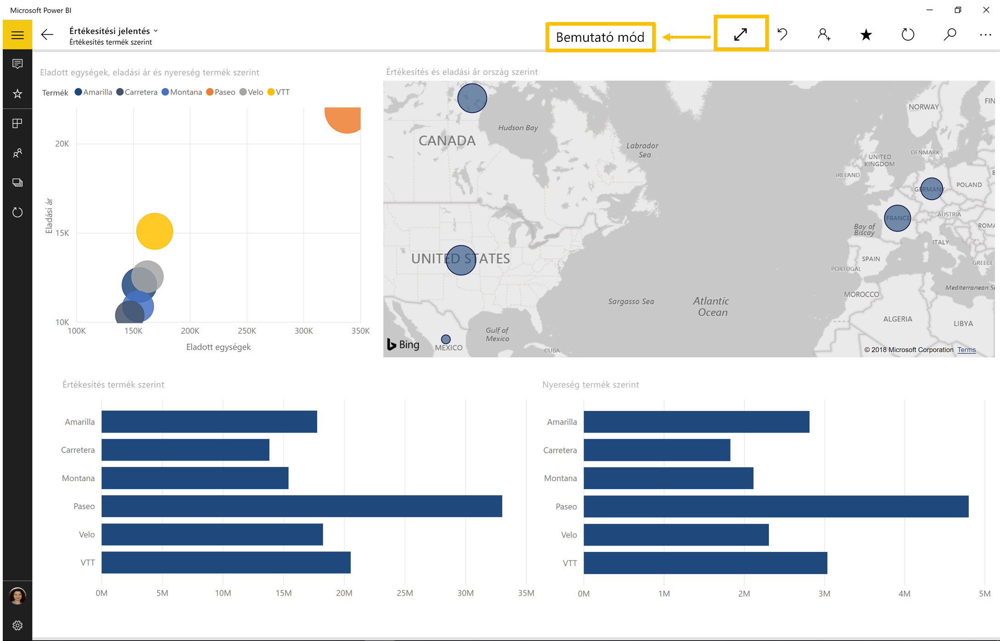

# Jelentések és irányítópultok megjelenítése bemutató módban a Surface Hubon és Windows 10-eszközökön
A bemutató mód használatával teljes képernyőn jeleníthet meg jelentéseket és irányítópultokat Windows 10-eszközökön és a Surface Hubon. 

A bemutató mód hasznos, ha a Power BI-t értekezleteken, konferenciákon vagy egy dedikált irodai kivetítőn kívánja megjeleníteni, vagy ha a lehető legnagyobb méretű képet szeretné megjeleníteni egy kisebb kijelzőn. 

Bemutató módban a Windows 10 rendszerre készült Power BI-mobilalkalmazásban minden olyan „dekoráció” el van távolítva, mint a navigációs és a menüsávok, hogy Ön és csapata minden tagja a jelentésben lévő adatokkal foglalkozhasson. Elérhető lesz egy műveleteket tartalmazó eszköztár, így az adatokat bemutató módban is kezelheti és használhatja.

[Irányítópultokat és jelentéseket is megjeleníthet teljes képernyős módban a Power BI szolgáltatásból](../end-user-focus.md) a weben.

> [!NOTE]
> A bemutató mód különbözik [a csempék fókusz módjától](mobile-tiles-in-the-mobile-apps.md).
> 
> 

## A bemutató mód használata
A Power BI-mobilalkalmazást a **Teljes képernyő** lehetőségre koppintva állíthatja teljes képernyősre.
 Az alkalmazás szegélyei eltűnnek, és megjelenik egy eszköztár a képernyő alján, vagy jobb és bal oldalán (a képernyőmérettől függően).

Az eszköztáron a következő műveleteket végezheti el:

1. **Lépjen vissza**  az előző oldalra. Ha hosszan koppint az ikonra, megjelennek a navigációs ablakok, amelyekkel megnyithatja a jelentést vagy irányítópultot tartalmazó mappát.
2. **Kiválaszthatja a szabadkézi elem színét** , ha a felületi tollal rajzol vagy készít megjegyzéseket a jelentés oldalán.
3. **Törölheti a szabadkézi jeleket** , amelyeket a felületi tollal készített a jelentés oldalán.  
4. **Átválthat**  a jelentés egy másik oldalára a prezentációban.
5. **A diavetítést lejátszhatja**   a műveleti sáv elrejtésével és a diavetítés elindításával; az alkalmazás automatikusan halad majd végig a jelentés oldalain. 
6. **Kereshet**  más munkadarabokat is a Power BI-ban.
7. **Frissítheti**  a jelentést.
8. **Kiléphet**  a bemutató módból.
8. **Megoszthatja**  a bemutató nézet képét a munkatársaival. A képen szerepelni fog minden megjegyzés, amelyet a felületi tollal készített a bemutató során.

Az rögzítésének feloldásával azt bárhová áthúzhatja a képernyőn. Ez nagy képernyőkön hasznos, ha a jelentés egy adott területével szeretne foglalkozni úgy, hogy az eszközök kéznél legyenek mellette. Ehhez elég az eszköztárra helyeznie az ujját, és áthúznia azt a jelentésvászonra.

## Következő lépések
* [Irányítópultok és jelentések megjelenítése teljes képernyős módban a Power BI szolgáltatásból](../end-user-focus.md)
* Kérdése van? [Kérdezze meg a Power BI közösségét](https://community.powerbi.com/)

