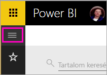
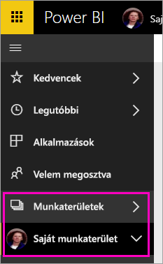
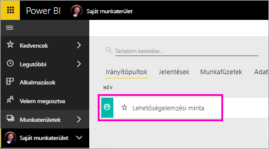
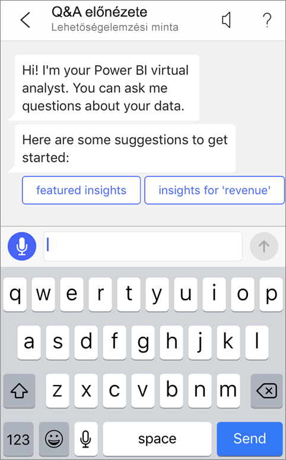
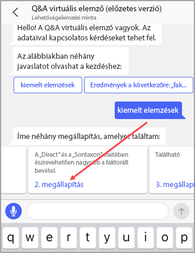
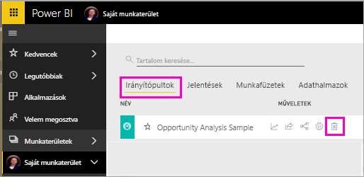

# Oktatóanyag: Adatokkal kapcsolatos kérdések feltevése a Q&A virtuális elemzőjével az iOS-es Power BI-alkalmazásokban

Az adatokról úgy tudhat meg a legtöbbet, ha saját szavaival megfogalmazott kérdéseket tesz fel velük kapcsolatban. Ebben az oktatóanyagban azt mutatjuk be, hogyan tehet fel kérdéseket és hogyan tekinthet meg kiemelt információkat a mintaadatokkal kapcsolatban a Q&A virtuális elemző használatával a Microsoft Power BI mobilalkalmazásban iPaden, iPhone-on és iPod Touch eszközön. 

A következőkre vonatkozik:

|  |  |
|:--- |:--- |
| iPhone-ok |iPadek |

A Q&A virtuális elemző egy csevegésen alapuló BI-megoldás, amely hozzáfér az alapul szolgáló Q&A-adatokhoz a Power BI szolgáltatásban [(https://powerbi.com)](https://powerbi.com). Adatokkal kapcsolatos információkat javasol, a felületén pedig beírhatja vagy szóban felteheti saját kérdéseit is.

Az oktatóanyagban a következőket végezheti el:

> [!div class="checklist"]
> * Az iOS-hez készült Power BI mobilalkalmazás telepítése
> * Minta Power BI-irányítópult és -jelentés letöltése
> * A mobilalkalmazás által javasol kiemelt elemzések megtekintése

Ha még nem regisztrált a Power BI-ra, a kezdés előtt [hozzon létre egy ingyenes próbaverziós fiókot](https://app.powerbi.com/signupredirect?pbi_source=web).

## Előfeltételek

### Az iOS-es Power BI alkalmazás telepítése
[iOS-alkalmazás letöltése](https://go.microsoft.com/fwlink/?LinkId=522062 "Az iPhone-alkalmazás letöltése") az Apple App Store-ból iPadre, iPhone-ra vagy iPod touchra.

Ezek a verziók támogatják az iOS-es Power BI alkalmazást:
- iPad iOS 10 vagy újabb verzióval.
- iPhone 5 vagy újabb iOS 10 vagy újabb rendszerrel. 
- iPod Touch iOS 10 vagy újabb rendszerrel.

### A Lehetőségelemzési minta letöltése
Az oktatóanyag első lépéseként töltse le a Lehetőségelemzési mintát a Power BI szolgáltatásba.

1. Nyissa meg a Power BI szolgáltatást a böngészőben (app.powerbi.com), és jelentkezzen be.

1. A navigációs ablaktábla megnyitásához válassza a globális navigációs ikont.

    

2. A navigációs ablaktáblán válassza a **Munkaterületek** > **Saját munkaterület** lehetőséget.

    

3. A bal alsó sarokban kattintson a **Lekérdezés** elemre.
   
    

3. A Lekérdezés lapon kattintson a **Minták** ikonra.
   
   

4. Kattintson a **Lehetőségelemzési minta** lehetőségre.
 
    
 
8. Kattintson a **Csatlakozás** gombra.  
  
   
   
5. A Power BI importálja a mintát, majd új irányítópultot, jelentést és adatkészletet ad hozzá a Saját munkaterülethez.
   
   

Most már megnézheti a mintát iOS-es eszközén.

## Próbálja ki a kiemelt elemzéseket
1. Nyissa meg a Power BI alkalmazást iPhone-ján vagy iPadjén, és jelentkezzen be a Power BI-fiók azon hitelesítő adataival, amelyeket a böngészőben is használt a Power BI szolgáltatáshoz.

1.  Koppintson a globális navigációs gomb  > **Munkaterület** > **Saját munkaterület** lehetőségre, majd nyissa meg a Lehetőségelemzési minta irányítópultot.

2. Koppintson a Q&A virtuális elemző ikonra  az oldal alján (iPaden az oldal tetején) megjelenő műveleti menüben.

     

     A Power BI Q&A virtuális elemző néhány javaslatot tesz a kezdéshez.

     
3. Koppintson a **Featured insights** (Kiemelt elemzések) gombra.

     A Q&A virtuális elemző figyelmébe ajánl néhány elemzést.
4. Görgessen jobbra, és koppintson az **Insight 2** (2-es elemzés) lehetőségre.

    

     A Q&A virtuális elemző megjeleníti a 2-es elemzést.

    
5. Koppintson a diagramra fókusz nézetben történő megnyitásához.

    
6. A Q&A virtuális elemzőbe történő visszalépéshez koppintson a nyílra a jobb felső sarokban.

## Erőforrások felszabadítása

Amikor végzett az oktatóanyaggal, nyugodtan törölheti a Lehetőségelemzési mintához tartozó irányítópultot, jelentést és adatkészletet.

1. Nyissa meg a Power BI szolgáltatást (app.powerbi.com), és jelentkezzen be.

2. A navigációs ablaktáblán válassza a **Munkaterületek** > **Saját munkaterület** lehetőséget.

3. Az **Irányítópult** lapon kattintson a **Törlés** (kuka) ikonra a Lehetőségelemzés irányítópultja mellett.

    

4. Válassza ki a **Jelentések** lapot, és ismételje meg a műveletet a Lehetőségelemzés jelentésével.

5. Válassza ki az **Adatkészletek** lapot, és ismételje meg a műveletet a Lehetőségelemzés adatkészletével.

## Következő lépések

Kipróbálta a Q&A virtuális asszisztenst az iOS-es Power BI-mobilalkalmazásban. Tájékozódjon tovább a Power BI szolgáltatás Q&A funkciójáról.
> [!div class="nextstepaction"]
> [Q&A a Power BI szolgáltatásban](../end-user-q-and-a.md)

