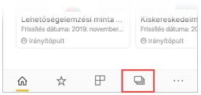
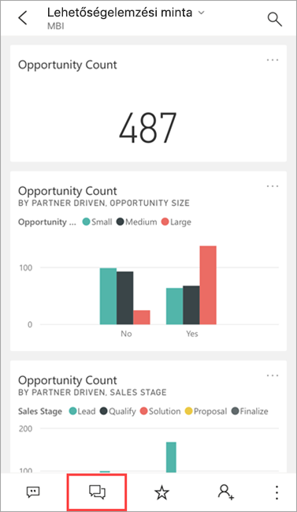
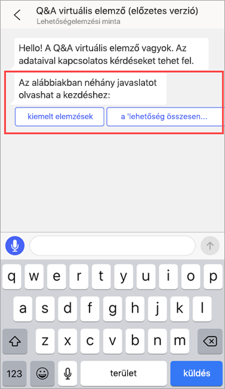
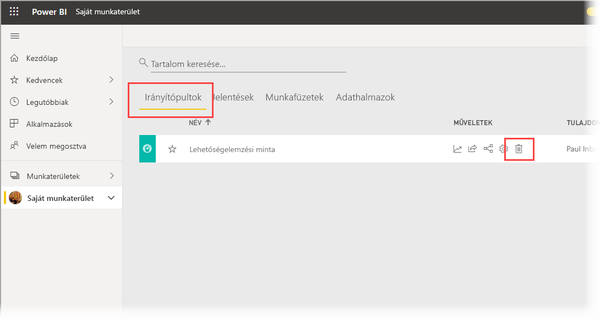
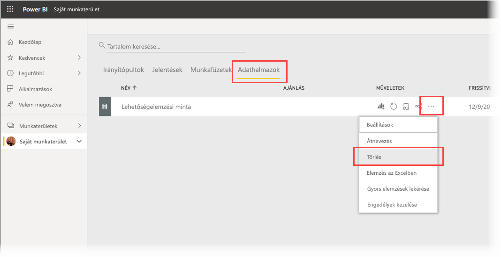

# Oktatóanyag: Adatokkal kapcsolatos kérdések feltevése a Q&A virtuális elemzőjével az iOS-es Power BI-alkalmazásokban

Az adatokról úgy tudhat meg a legtöbbet, ha saját szavaival megfogalmazott kérdéseket tesz fel velük kapcsolatban. Ebben az oktatóanyagban azt mutatjuk be, hogyan tehet fel kérdéseket és hogyan tekinthet meg kiemelt információkat a mintaadatokkal kapcsolatban a Q&A virtuális elemző használatával a Microsoft Power BI mobilalkalmazásban iPaden vagy iPhone-on. 

A következőkre vonatkozik:

|  |  |
|:--- |:--- |
| iPhone-ok |iPadek |

A Q&A virtuális elemző egy csevegésen alapuló BI-megoldás, amely hozzáfér az alapul szolgáló Q&A-adatokhoz a [Power BI szolgáltatásban](https://powerbi.com). Adatokkal kapcsolatos információkat javasol, a felületén pedig beírhatja vagy szóban felteheti saját kérdéseit is.

Az oktatóanyagban a következőket végezheti el:

> [!div class="checklist"]
> * Az iOS-hez készült Power BI mobilalkalmazás telepítése
> * Minta Power BI-irányítópult és -jelentés letöltése
> * A mobilalkalmazás által javasol kiemelt elemzések megtekintése

## Előfeltételek

* **Regisztráció a Power BI-ra**: Ha még nem regisztrált a Power BI-ra, a kezdés előtt [hozzon létre egy ingyenes próbaverziós fiókot](https://app.powerbi.com/signupredirect?pbi_source=web).
* **Az iOS-es Power BI alkalmazás telepítése**: [iOS-alkalmazás letöltése](https://apps.apple.com/app/microsoft-power-bi/id929738808) az Apple App Store-ból iPadre, iPhone-ra vagy iPod Touchra. Az iOS-es Power BI alkalmazást a következő verziók támogatják:
  * iPad iOS 11 vagy újabb rendszerrel.
  * iPhone 5 vagy újabb iOS 11 vagy újabb rendszerrel. 
  * iPod Touch iOS 11 vagy újabb rendszerrel.
* **Mintaadatok letöltése**: Első lépésként töltse le a **Lehetőségelemzési mintát** a Power BI szolgáltatásba. Az ennek végrehajtására vonatkozó utasításokat a [Minták letöltése a Saját munkaterületre a Power BI szolgáltatásban](./mobile-apps-download-samples.md) című cikkben találja meg.

Az előfeltételek teljesítése és a mintaadatok letöltése után már készen áll rá, hogy megtekintse a mintákat iOS-eszközén.

## Próbálja ki a kiemelt elemzéseket
1. Nyissa meg a Power BI alkalmazást iPhone-ján vagy iPadjén, és jelentkezzen be a Power BI-fiók azon hitelesítő adataival, amelyeket a böngészőben is használt a Power BI szolgáltatáshoz.

2. Koppintson a kezdőlap navigációs sávjának **Munkaterületek** ikonjára.

    

3. A Munkaterületek oldal megnyitása után koppintson a **Saját munkaterületek** lehetőségre, majd a **Lehetőségelemzési minta** irányítópultra annak megnyitásához.

3. A Lehetőségelemzési minta irányítópulton koppintson a Q&A virtuális elemző ikonjára a műveleti menüben.

    

    A Power BI Q&A virtuális elemző néhány javaslatot tesz a kezdéshez.

    

3. Koppintson a **Featured insights** (Kiemelt elemzések) gombra.

4. A Q&A virtuális elemző figyelmébe ajánl néhány elemzést. Görgessen jobbra, és koppintson az **Insight 2** (2-es elemzés) lehetőségre.

    

   A Q&A virtuális elemző megjeleníti a 2-es elemzést.

    

5. Koppintson a diagramra fókusz nézetben történő megnyitásához.

    

6. A Q&A virtuális elemzőbe történő visszalépéshez koppintson a nyílra a jobb felső sarokban.

## Erőforrások felszabadítása

Amikor végzett az oktatóanyaggal, nyugodtan törölheti a Lehetőségelemzési mintához tartozó irányítópultot, jelentést és adatkészletet.

1. Nyissa meg a Power BI szolgáltatást ([Power BI szolgáltatás](https://app.powerbi.com)), és jelentkezzen be.

2. A navigációs panelen válassza a **Saját munkaterület** lehetőséget.

3. Kattintson az Irányítópultok fülre, majd a Lehetőségelemzési minta sorban található kuka ikonra.

    

    Most ismételje meg ugyanezt a Jelentések lap kijelölésével.

4. Válassza ki az Adathalmazok lapfület, kattintson a **További lehetőségek** (...) elemre, majd válassza a **Törlés** lehetőséget.

    

## Következő lépések

Kipróbálta a Q&A virtuális asszisztenst az iOS-es Power BI-mobilalkalmazásban. Tájékozódjon tovább a Power BI szolgáltatás Q&A funkciójáról.
> [!div class="nextstepaction"]
> [Q&A a Power BI szolgáltatásban](../end-user-q-and-a.md)