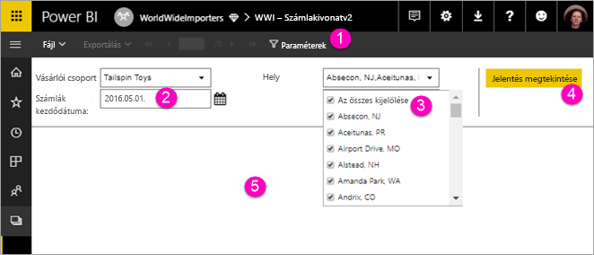

# Lapszámozott jelentések paramétereinek megtekintése a Power BI szolgáltatásban

Ebből a cikkből a lapszámozott jelentések paramétereinek kezelését sajátíthatja el a Power BI szolgáltatásban.  A jelentés paraméterei a jelentésadatok szűrésére kínálnak módot. A paraméterek az elérhető értékek listáját kínálják fel, amelyek közül Ön egyet vagy többet választhat. Bizonyos esetekben a paraméterek alapértelmezett értékkel rendelkeznek, más esetekben értéket kell választania, hogy megtekinthesse a jelentést.  

Paraméterekkel rendelkező jelentés megtekintésekor a jelentésmegjelenítő eszközsávján minden paraméter megjelenik, így értékük interaktív módon állítható be. Az alábbi ábrán egy jelentés paraméterterülete látható a **Buying Group** (vásárlói csoport), **Location** (hely), **From Date** (kezdődátum), és **To Date** (záródátum) paraméterekkel.  

## A Paraméterek panel a Power BI szolgáltatásban

  
1.  **Paraméterek panel** – A jelentésmegjelenítő eszköztárán minden paraméterhez megjelenhet például a „Kötelező” üzenet, vagy az alapértelmezett érték.    
  
2.  **Számlák -tól/-ig paraméterek** – A két dátumparaméter alapértelmezett értékkel rendelkezik. A dátum megváltoztatásához írja be az új értéket a szövegmezőbe, vagy válasszon egy napot a naptárból.  
  
3.  **Hely paraméter** – A Hely paraméter úgy van beállítva, hogy Ön kiválaszthasson egy vagy több értéket, vagy az összeset. 
  
4.  **Jelentés megtekintése** – Paraméterértékek bevitele vagy módosítása után kattintson a **Jelentés megtekintése** gombra a jelentés futtatásához. 

5. **Alapértelmezett értékek** – Ha minden paraméter rendelkezik alapértelmezett értékkel, a jelentés automatikusan lefut az első megtekintésekor. Ennek a jelentésnek egyes értékei nem rendelkeztek alapértelmezett értékkel, ezért a jelentés csak az értékek kiválasztása után tekinthető meg.  

## Következő lépések

[Lapszámozott jelentések a Power BI szolgáltatásban](end-user-paginated-report.md)
