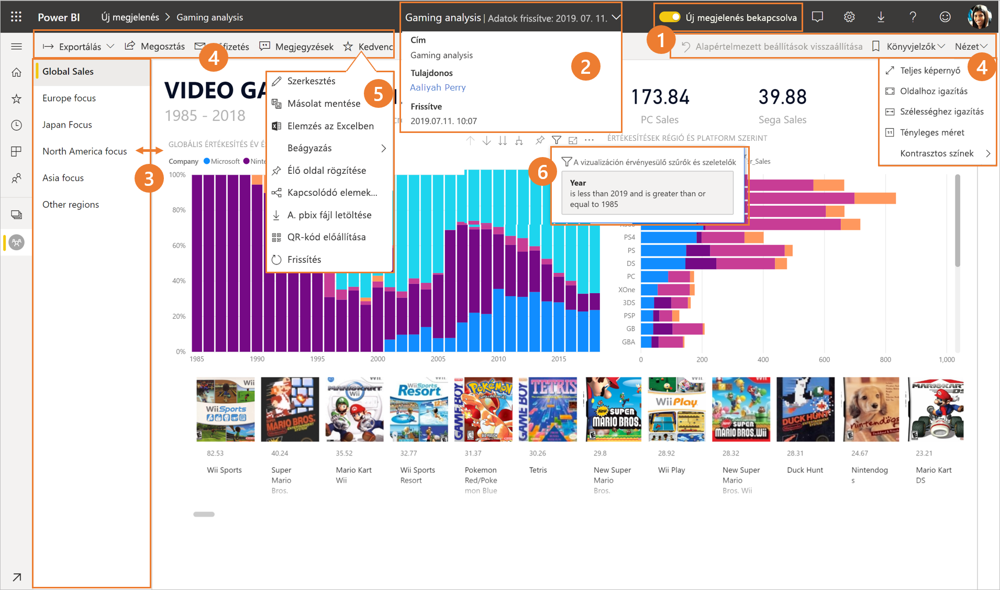
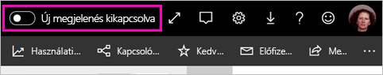
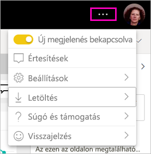
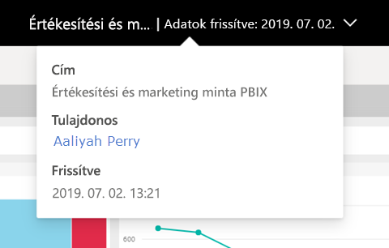
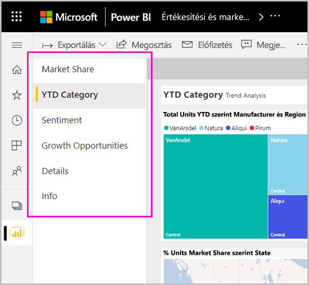
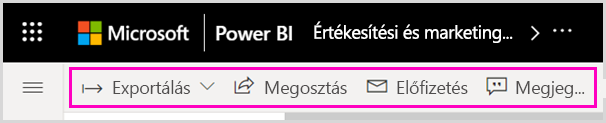
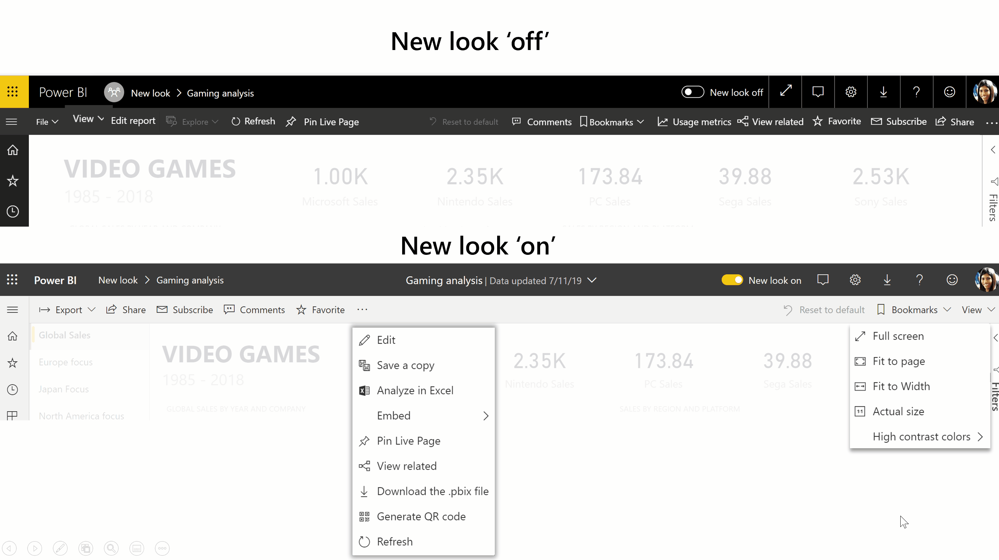
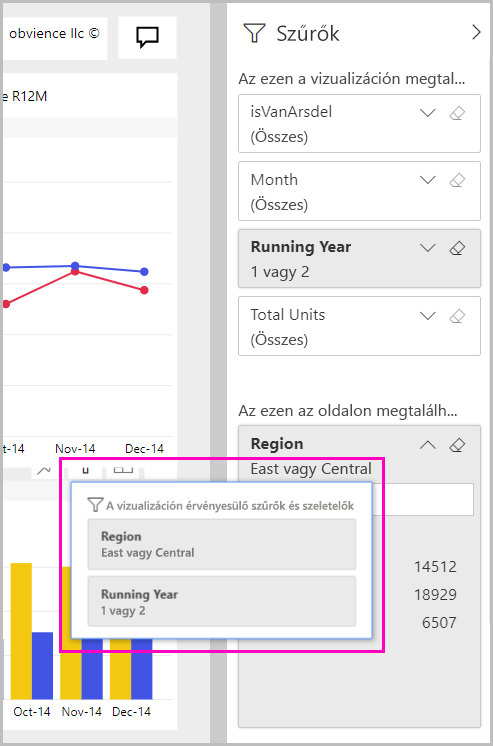

# A Power BI szolgáltatás új külseje

A Power BI szolgáltatás (app.powerbi.com) új arculattal rendelkezik, amely megkönnyíti a jelentések megtekintését és kezelését. Az új arculat egyszerűbb, és a többi Microsoft-termékhez hasonlít. A Power BI szolgáltatás minden területén a jelentések tartalmát helyeztük a középpontba. Ehhez egy világosabb színtémát választottunk, és frissítettük az ikonokat. 

További információt szeretne a **Power BI Desktop** új megjelenéséről? Tekintse meg a [Frissített menüszalag használata a Power BI Desktopban](../create-reports/desktop-ribbon.md) című cikket.

Íme az új külső áttekintése. Részletekért tekintse meg a számozott szakaszokat:

Konkrét műveletet keres? Itt megtalálhatja: [Az „új arculat”: Hol vannak a műveletek?](service-new-look-where-actions.md) lehetőséget.

## A módosítások gyors bemutatása

Ez az animáció bemutatja a jelentések kinézetének változásait.

## 1. Az új megjelenés kipróbálása

Az új megjelenést bármelyik Power BI-felhasználó kipróbálhatja. Ehhez váltson az **Új megjelenés kikapcsolva** értékről **Új megjelenés bekapcsolva** értékre.

Ha vissza szeretne térni a régi nézethez, váltson vissza **kikapcsolt** értékre . Ha nem látja ezt a beállítást, kattintson a jobb felső sarokban található három pontra.

## 2. Jelentésadatok megtekintése 

Olyan adatokat tekinthet meg gyorsan a felső szalagcímen, mint a legutóbbi frissítés dátuma, valamint a névjegyadatok.  A jelentés további adatainak megtekintéséhez nyissa meg a menüt. Akár e-mailt is küldhet a jelentés tulajdonosának.

## 3. Lapok függőleges listája 
A jelentésoldalak nevei mostantól egy listában, egy függőleges panelen jelennek meg. Könnyen észrevehetők, és hasonlítanak a Word és a PowerPoint navigációjához. A jelentés területének méretét a függőleges panel átméretezésével módosíthatja.

## 4. Leegyszerűsített műveletsáv 

A fent található frissített műveletsáv a legfontosabb parancsokat tartalmazza könnyen és jól elérhető helyen a jelentés felhasználói számára. Így könnyebb az exportálás, a feliratkozás, a másokkal való együttműködés, valamint a szűrők és könyvjelzők használata.

## 5. Hol találhatók a jelentések parancsai?

A régi kinézetben elérhető funkciókat nem távolítottuk el. A további parancsokat (szerkesztés, másolat mentése és hasonlók) a műveletsáv három pontjára (...) kattintva érheti el. Emellett a tartalomlistából a használati metrikákat is elérheti.

### Hol találhatók a Fájl menü műveletei?

A **Fájl** menü műveleteit keresi? A korábban a **Fájl** menüben található műveletek is a **További lehetőségek** (...) menübe kerültek. 

## 6. Új szűrőfunkciók

Az új megjelenéssel alapértelmezés szerint elérhetők az új frissítések is (például az alkalmazott szűrők megtekintése és az új Szűrők panel). Akkor is az új szűrési panel jelenik meg, ha a jelentés készítője nem frissítette a szűrési felületet.

## Az új megjelelés irányítópultjai 

A jelentésekhez és az alkalmazásokhoz hasonlóan az irányítópultok műveletsávja is leegyszerűsödött, így jobban hasonlítanak egymásra, a funkcionális különbségek azonban megmaradtak. Íme egy útmutató az irányítópultok műveleteiről.
 

## A szerkesztési mód nem változott 

A szerzői műveletek a Desktophoz hasonlók maradtak. Az új nézet módosításai csak az olvasó nézetre érvényesek.

## Következő lépések

- [A frissített menüszalag használata a Power BI Desktopban](../create-reports/desktop-ribbon.md)
- [A munkaterületek új megjelenésének kipróbálása](../collaborate-share/service-workspaces-new-look.md)
- [Power BI felhasználók számára](end-user-consumer.md)
